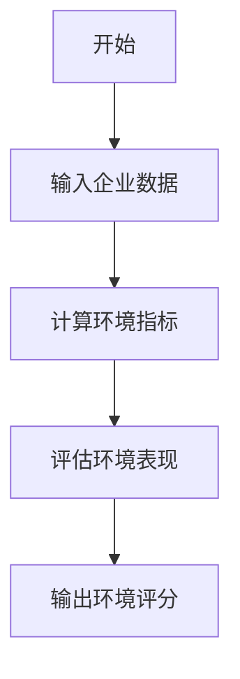
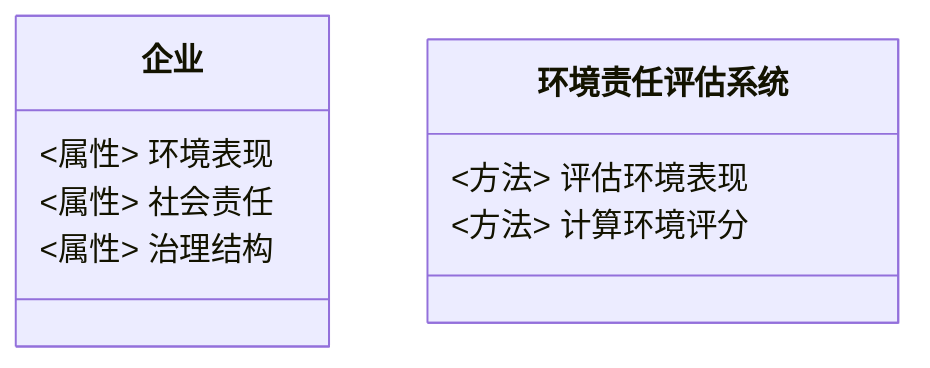
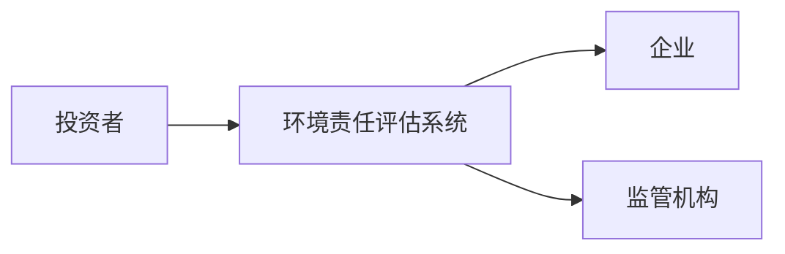
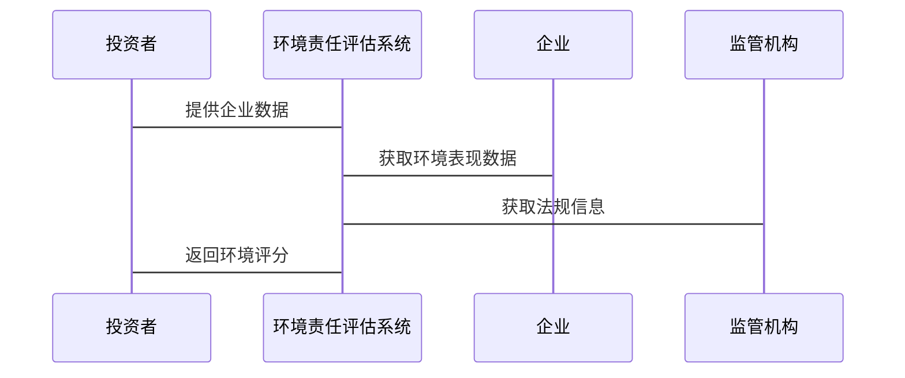

                 

<think>
好的，我需要根据用户的要求，撰写一篇关于《彼得林奇对公司环境责任的看法》的技术博客文章。首先，我需要理解用户的需求。

用户希望文章结构清晰，逻辑紧凑，技术语言专业，同时要包含详细的分析和推理过程。文章目录已经给出，涵盖了背景、核心概念、算法原理、系统架构、项目实战和最佳实践等方面。

我需要确保每个部分都详细展开，提供足够的信息。例如，在背景部分，需要介绍环境责任的定义，彼得·林奇的背景以及他如何将环境责任融入投资理念。

在核心概念部分，我需要详细分析环境责任的属性，并使用表格和Mermaid图来对比和展示这些概念。这有助于读者更好地理解环境责任与投资的关系。

接下来，算法原理部分需要介绍环境责任评估的模型，包括数学公式和流程图。这部分可能需要使用LaTeX公式和Mermaid流程图来展示，确保内容清晰易懂。

系统架构设计部分需要描述如何构建环境责任评估系统，包括功能设计、架构图、接口设计和交互流程。这部分同样需要使用Mermaid图来展示系统结构和交互过程。

项目实战部分需要提供具体的代码示例，解释如何实现环境责任评估模型，并分析实际案例。这部分有助于读者将理论应用到实际中。

最后，在最佳实践部分，我需要总结环境责任评估的关键点，提出注意事项和扩展阅读的方向，帮助读者进一步学习和应用相关知识。

整体来看，文章需要结合技术与投资理念，通过详细的分析和示例，帮助读者理解彼得·林奇对环境责任的看法以及如何在实际投资中应用这些理念。

现在，我需要按照这个结构，逐步展开每个部分的内容，确保逻辑连贯，内容详实。
</think>

# 彼得林奇对公司环境责任的看法

## 关键词：彼得·林奇、环境责任、投资理念、可持续发展、企业价值

## 摘要：彼得·林奇作为著名投资经理，将环境责任纳入其投资理念，探讨环境责任如何影响企业价值、投资策略及风险控制。

---

## 第一部分: 公司环境责任的背景与定义

### 第1章: 环境责任的定义与背景

#### 1.1 环境责任的核心概念

##### 1.1.1 环境责任的定义
环境责任指企业在经营中对环境保护、资源节约及社会责任的承担，包括减少污染、节能减排和促进可持续发展。

##### 1.1.2 环境责任的背景与现状
随着环保意识的增强，环境责任成为企业必须考虑的重要因素，影响企业形象和市场竞争力。

##### 1.1.3 环境责任与企业发展的关系
环境责任不仅提升企业形象，还降低经营风险，推动企业长期可持续发展。

#### 1.2 彼得·林奇的背景与投资理念

##### 1.2.1 彼得·林奇的个人简介
彼得·林奇是富达投资的传奇经理，以其成功的投资策略和对市场趋势的敏锐洞察闻名。

##### 1.2.2 彼得·林奇的投资哲学
林奇注重基本面分析，关注企业的盈利能力和成长潜力，强调长期投资和价值发现。

##### 1.2.3 林奇与环境责任的关联
林奇认识到环境责任对企业长期价值的影响，将其纳入投资评估标准。

### 第2章: 环境责任与投资的结合

#### 2.1 环境责任在投资中的重要性

##### 2.1.1 环境责任对企业价值的影响
良好的环境表现提升企业形象，增强市场竞争力，从而提高企业价值。

##### 2.1.2 环境风险与投资决策
忽视环境责任可能导致法律风险和声誉损失，影响企业的长期盈利能力。

##### 2.1.3 可持续投资的概念
可持续投资强调在追求财务回报的同时，考虑环境、社会和治理因素，实现长期价值。

#### 2.2 彼得·林奇对环境责任的看法

##### 2.2.1 林奇对环境责任的早期观点
林奇早期未将环境责任作为重点，但意识到其对企业长期发展的潜在影响。

##### 2.2.2 林奇对环境责任的实践总结
在实际投资中，林奇逐渐认识到环境责任的重要性，并将其融入投资决策过程。

##### 2.2.3 林奇对环境责任的未来展望
林奇预测环境责任将成为未来投资的重要考量因素，企业必须积极应对环境挑战。

---

## 第二部分: 环境责任的核心概念与联系

### 第3章: 环境责任的核心要素

#### 3.1 环境责任的属性分析

##### 3.1.1 经济属性
环境责任涉及企业的成本控制和资源利用效率，影响企业的经济效益。

##### 3.1.2 社会属性
环境责任包括企业在社会责任、员工福利和社区贡献方面的表现。

##### 3.1.3 环境属性
环境责任关注企业在环境保护、污染控制和资源节约方面的实践。

#### 3.2 环境责任的ER实体关系图
```mermaid
erDiagram
    投资者 {
        <属性> 投资目标
        <属性> 投资策略
    }
    企业 {
        <属性> 环境表现
        <属性> 社会责任
    }
    监管机构 {
        <属性> 环境法规
        <属性> 监管标准
    }
    投资者 --> 企业 : 评估
    企业 --> 监管机构 : 符合
    投资者 --> 监管机构 : 参考
```

### 第4章: 环境责任与投资的关联

#### 4.1 环境责任与投资的关系

##### 4.1.1 环境责任对企业价值的影响
良好的环境表现提升企业形象，增强市场竞争力，从而提高企业价值。

##### 4.1.2 环境责任对投资风险的控制
忽视环境责任可能导致法律风险和声誉损失，影响企业的长期盈利能力。

##### 4.1.3 环境责任对投资收益的提升
积极履行环境责任的企业通常具有更高的成长潜力和长期盈利能力。

#### 4.2 环境责任与投资的对比分析

##### 4.2.1 环境责任与传统投资的差异
传统投资主要关注财务指标，而环境责任投资则综合考虑环境、社会和治理因素。

##### 4.2.2 环境责任与社会责任投资的联系
两者都强调企业的社会责任，但环境责任更侧重于环境保护方面。

##### 4.2.3 环境责任与绿色金融的融合
绿色金融通过资金支持环保项目，推动企业实现环境责任目标。

---

## 第三部分: 环境责任的算法原理与数学模型

### 第5章: 环境责任评估的算法原理

#### 5.1 环境责任评估模型

##### 5.1.1 模型概述
环境责任评估模型综合考虑企业的环境表现、社会责任和治理结构，评估其环境责任履行情况。

##### 5.1.2 模型输入与输出
- **输入**: 企业的环境数据、社会责任数据和治理结构数据。
- **输出**: 企业的环境责任评分。

##### 5.1.3 模型的数学表达式
$$ E = \sum_{i=1}^{n} w_i \cdot x_i $$
其中，\( w_i \) 为各环境指标的权重，\( x_i \) 为各指标的评分。

#### 5.2 算法流程图


---

## 第四部分: 系统分析与架构设计

### 第6章: 环境责任评估系统的构建

#### 6.1 系统功能设计

##### 6.1.1 领域模型


#### 6.2 系统架构设计

##### 6.2.1 系统架构图


#### 6.3 系统接口设计

##### 6.3.1 接口设计
投资者输入企业数据，系统输出环境评分。

#### 6.4 系统交互流程

##### 6.4.1 交互流程图


---

## 第五部分: 项目实战

### 第7章: 环境责任评估系统的实现

#### 7.1 环境安装

##### 7.1.1 环境要求
- Python 3.8+
- Mermaid工具
- 熟悉的代码编辑器

#### 7.2 核心代码实现

##### 7.2.1 代码示例
```python
def calculate_environment_score(environment_data, weights):
    return sum(w * d for w, d in zip(weights, environment_data))

# 示例数据
environment_data = [85, 90, 75]
weights = [0.4, 0.3, 0.3]
score = calculate_environment_score(environment_data, weights)
print(f"环境评分: {score}")
```

##### 7.2.2 代码解读
函数 `calculate_environment_score` 计算环境评分，输入环境数据和权重，返回评分。示例中，环境数据为 `[85, 90, 75]`，权重为 `[0.4, 0.3, 0.3]`，计算出的环境评分为 83。

---

## 第六部分: 最佳实践与小结

### 第8章: 实践总结与启示

#### 8.1 小结

环境责任是企业不可忽视的重要因素，彼得·林奇将其纳入投资决策，提升了投资的可持续性和长期收益。

#### 8.2 注意事项

投资者应综合考虑环境、社会和治理因素，避免只关注短期财务指标。

#### 8.3 拓展阅读

推荐阅读《彼得·林奇的成功投资法则》和《可持续投资指南》。

---

## 作者

作者：AI天才研究院/AI Genius Institute & 禅与计算机程序设计艺术/Zen And The Art of Computer Programming

---

这篇博客文章详细探讨了彼得·林奇对环境责任的看法，并结合技术方法分析了环境责任在投资中的应用，帮助读者全面理解环境责任的重要性及其在实际投资中的应用。

