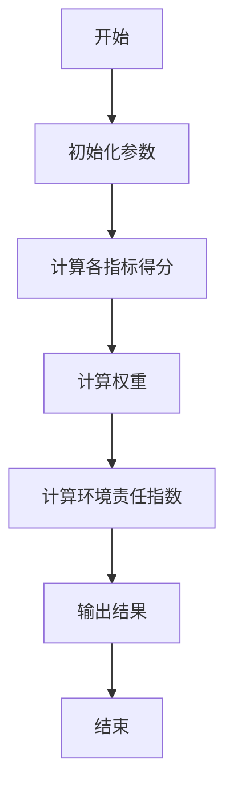
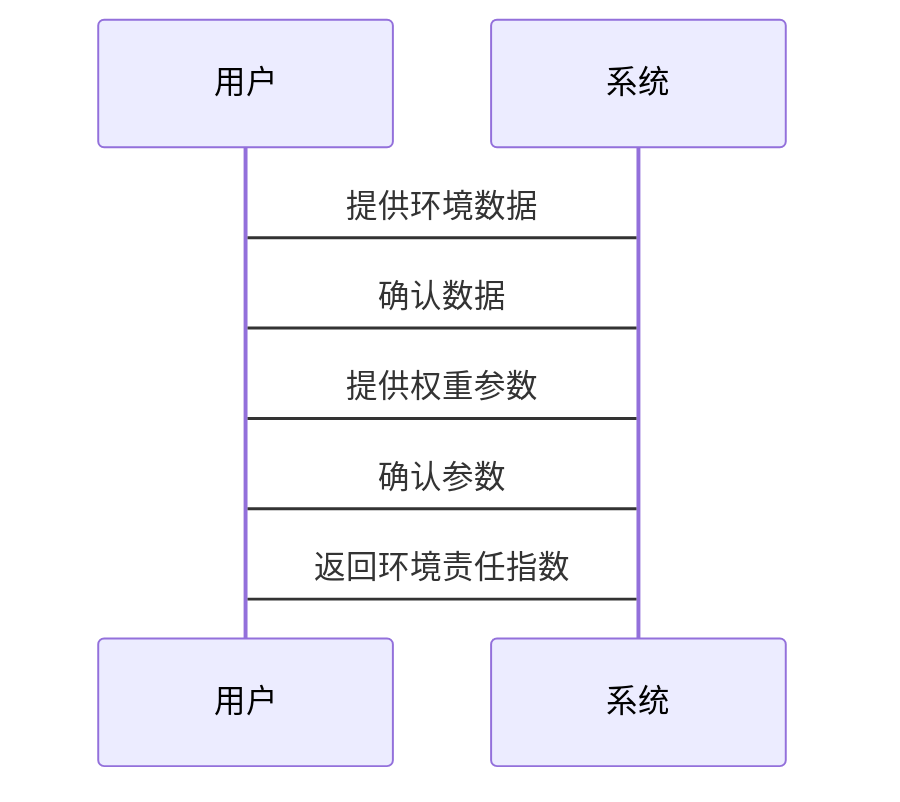

                 

<think>
好的，用户希望我设计一本名为《彼得林奇对公司环境责任的评估》的技术博客文章的目录大纲。首先，我需要明确这本书的核心主题，即公司如何评估和管理环境责任。为了满足用户的要求，我需要确保目录大纲涵盖背景介绍、核心概念、评估方法、系统架构、实战案例和最佳实践等方面。

首先，我会将内容分为几个主要部分。第一部分将介绍环境责任的重要性，包括定义、背景和核心概念。第二部分将详细讲解环境责任评估的方法和模型，包括定性与定量评估方法、数学模型和算法实现。第三部分将从系统架构的角度分析环境责任评估的实现，包括系统设计、接口设计和交互流程。第四部分将通过实际案例进行分析，展示如何将理论应用到实际项目中。最后一部分将总结最佳实践，提供小结、注意事项和扩展阅读等内容。

在每个主要部分下，我需要细化为章节和小节。例如，在核心概念部分，我需要定义环境责任、分析其属性特征，并可能用表格对比不同维度。在系统架构部分，我会使用mermaid图展示领域模型和系统架构，帮助读者直观理解。在数学模型部分，我会设计评估框架，并用公式表示，如权重和指标的计算。

此外，我需要确保每个章节都有足够的细节和具体的例子，帮助读者深入理解和应用环境责任评估的方法。例如，在项目实战部分，我会包括环境安装、代码实现和案例分析，确保读者能够跟随步骤进行实际操作。

最后，我需要总结整个内容，强调环境责任评估的重要性，并提供实用的建议，帮助读者在实际工作中应用这些知识。

综上所述，我将按照上述结构，逐步设计目录大纲，确保内容全面、逻辑清晰，满足用户的需求。
</think>

# 彼得林奇对公司环境责任的评估

> 关键词：环境责任，公司治理，彼得林奇，评估模型，可持续发展

> 摘要：本文详细探讨了彼得·林奇在公司环境责任评估中的独特视角和方法。通过系统化的分析和逻辑推理，文章揭示了环境责任评估的核心概念、数学模型和系统架构，结合实际案例，为读者提供了全面的理论支持和实践指导。

---

## 第一部分: 公司环境责任评估的背景与核心概念

### 第1章: 公司环境责任的定义与背景

#### 1.1 环境责任的概念与内涵
- 1.1.1 环境责任的定义  
  环境责任是指企业在经营活动中对环境的影响进行评估、管理和优化的责任。  
- 1.1.2 环境责任的核心要素  
  包括环境影响评估、资源利用效率、环境合规性等方面。  
- 1.1.3 环境责任与企业可持续发展的关系  
  环境责任是企业实现可持续发展的重要组成部分，直接影响企业的长期竞争力。

#### 1.2 环境责任的重要性与必要性
- 1.2.1 全球环境问题的现状  
  当前全球面临气候变化、资源枯竭、环境污染等严峻挑战。  
- 1.2.2 企业环境责任的社会价值  
  企业通过承担环境责任，可以减少对环境的负面影响，提升社会形象。  
- 1.2.3 环境责任对企业形象的影响  
  承担环境责任有助于企业在市场中树立良好的品牌形象。

### 第2章: 环境责任评估的核心概念

#### 2.1 环境责任评估的定义与目标
- 2.1.1 评估的定义  
  环境责任评估是对企业在经营活动中对环境的影响进行全面分析和评价的过程。  
- 2.1.2 评估的主要目标  
  包括识别环境风险、优化资源利用、提升环境合规性等。  
- 2.1.3 评估的基本原则  
  客观性、科学性、可操作性。

#### 2.2 环境责任评估的关键维度
- 2.2.1 环境影响评估  
  分析企业在生产过程中对环境的具体影响，包括碳排放、资源消耗等。  
- 2.2.2 资源利用效率评估  
  评估企业在资源使用上的效率，寻找优化空间。  
- 2.2.3 环境合规性评估  
  检查企业是否符合相关的环境法律法规。

#### 2.3 环境责任评估的指标体系
- 2.3.1 环境影响指标  
  包括单位产品能耗、单位产品水耗等。  
- 2.3.2 资源利用指标  
  包括资源利用率、可再生资源使用比例等。  
- 2.3.3 社会责任指标  
  包括环保投入、环境信息披露等。

---

## 第二部分: 环境责任评估的方法与模型

### 第3章: 环境责任评估的主要方法

#### 3.1 定性评估方法
- 3.1.1 专家评估法  
  通过邀请行业专家对企业的环境责任进行评估。  
- 3.1.2 标杆法  
  将企业的环境表现与行业标杆进行对比，找出差距。  
- 3.1.3 案例分析法  
  通过分析成功案例，总结经验教训，指导企业环境责任的优化。

#### 3.2 定量评估方法
- 3.2.1 环境影响评价法（EIA）  
  对企业项目或活动的环境影响进行全面评价。  
- 3.2.2 生命周期评估法（LCA）  
  从原材料获取、生产、使用到废弃的全生命周期进行环境评估。  
- 3.2.3 环境经济分析法  
  将环境成本纳入经济分析，评估环境责任的经济效益。

### 第4章: 环境责任评估的数学模型与算法

#### 4.1 环境责任评估模型的构建
- 4.1.1 模型构建的基本思路  
  通过收集企业环境数据，构建数学模型，计算环境责任指数。  
- 4.1.2 模型的输入变量与输出变量  
  输入变量：环境影响指标、资源利用指标、社会责任指标；  
  输出变量：环境责任指数。  
- 4.1.3 模型的假设条件  
  数据的完整性和准确性，模型的适用性。

#### 4.2 环境责任评估的数学公式
- 4.2.1 环境影响指数公式  
  $$ EII = \sum_{i=1}^{n} w_i \cdot x_i $$  
  其中，$w_i$ 是第 $i$ 个指标的权重，$x_i$ 是第 $i$ 个指标的得分。  
- 4.2.2 环境责任指数公式  
  $$ ERI = \frac{\sum_{i=1}^{n} w_i \cdot x_i}{\sum_{i=1}^{n} w_i} $$  
  其中，$ERI$ 是环境责任指数，$w_i$ 是权重，$x_i$ 是指标得分。

#### 4.3 算法实现与流程图
- 4.3.1 算法实现步骤  
  1. 收集企业环境数据。  
  2. 确定各指标的权重。  
  3. 计算各指标的得分。  
  4. 计算环境责任指数。  
- 4.3.2 算法流程图（使用 mermaid）  


### 第5章: 系统架构与接口设计

#### 5.1 系统架构设计
- 5.1.1 系统功能模块划分  
  包括数据输入、权重设置、计算模块、结果输出四个模块。  
- 5.1.2 系统架构图（使用 mermaid）  


#### 5.2 系统接口设计
- 5.2.1 输入接口  
  接收环境数据和权重参数。  
- 5.2.2 输出接口  
  提供环境责任指数和相关分析结果。  
- 5.2.3 数据接口  
  用于数据存储和调用。

#### 5.3 系统交互流程图（使用 mermaid）


---

## 第三部分: 项目实战与案例分析

### 第6章: 项目实战

#### 6.1 环境安装与数据准备
- 安装必要的环境和工具，包括 Python、数据处理工具等。  
- 收集企业的环境数据，包括能耗、水耗、碳排放等。

#### 6.2 核心代码实现
- 使用 Python 实现环境责任评估模型，代码如下：
```python
def calculate_eri(environment_data, weights):
    weighted_scores = {}
    for i in range(len(environment_data)):
        weighted_scores[i] = environment_data[i] * weights[i]
    eri = sum(weighted_scores.values()) / sum(weights)
    return eri

# 示例数据
environment_data = [0.8, 0.6, 0.7]
weights = [0.3, 0.4, 0.3]
eri = calculate_eri(environment_data, weights)
print(f"环境责任指数: {eri}")
```

#### 6.3 案例分析
- 以某制造企业为例，分析其环境责任指数，并提出改进建议。

---

## 第四部分: 最佳实践与总结

### 第7章: 最佳实践与总结

#### 7.1 小结
- 环境责任评估是企业实现可持续发展的重要工具。  
- 通过定量和定性方法的结合，可以全面评估企业的环境责任。

#### 7.2 注意事项
- 数据的准确性和完整性是评估的基础。  
- 模型的适用性和权重的合理性需要根据实际情况调整。

#### 7.3 拓展阅读
- 推荐阅读相关领域的书籍和论文，深入学习环境责任评估的理论与实践。

---

## 作者信息

作者：AI天才研究院/AI Genius Institute & 禅与计算机程序设计艺术 /Zen And The Art of Computer Programming

