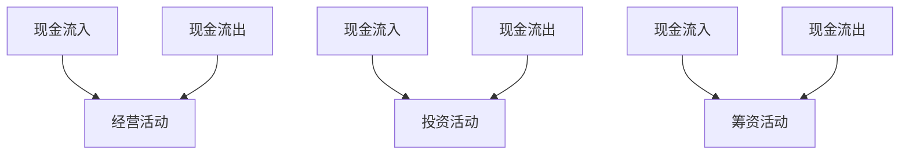
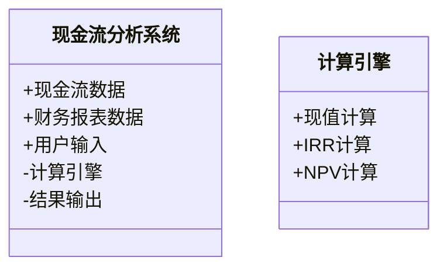

                 

<think>
好的，我现在需要帮用户撰写一篇关于彼得·林奇对公司现金流重要性分析的技术博客。用户已经提供了详细的结构，我需要按照这个结构逐步完成每一部分。

首先，我得理解整个文章的结构和内容要求。文章标题是《彼得林奇对公司现金流的重要性分析》，关键词包括现金流、彼得·林奇、投资分析、财务指标、企业估值。摘要部分需要简明扼�地概括文章的核心内容，也就是现金流的重要性以及彼得·林奇的分析方法。

接下来，文章分为几个部分：背景介绍、核心概念与联系、算法原理、系统分析、项目实战和最佳实践。每个部分都有具体的章节和小节，需要详细展开。

在背景介绍部分，我需要先定义现金流，解释其类型，并说明彼得·林奇为何重视现金流。这部分要让读者明白现金流的基本概念和其在投资中的重要性。

核心概念与联系部分需要深入分析现金流的类型及其属性，可能需要制作表格和Mermaid图来展示结构和实体关系。这部分要帮助读者理解现金流的不同来源和用途，以及它们如何相互关联。

算法原理部分涉及现金流的现值计算、内部收益率和净现值。我需要使用数学公式和Mermaid流程图来解释这些概念，并提供Python代码示例。这部分需要详细讲解，确保读者能够理解这些财务指标的计算方法及其应用。

系统分析与架构设计部分需要描述现金流分析的场景、系统功能模块以及架构设计。使用Mermaid图展示类图、架构图和交互图，帮助读者理解系统的组成部分和工作流程。

项目实战部分要求读者实际操作，包括环境安装、代码实现和案例分析。这部分需要提供具体的Python代码，并详细解读每一步的作用，让读者能够动手实践。

最后，最佳实践部分总结现金流分析的关键点，给出小结和注意事项，同时推荐进一步阅读的资料。这部分帮助读者巩固所学知识，并指导他们在实际投资中如何应用这些分析方法。

在整个写作过程中，我需要确保语言专业且易懂，逻辑清晰，结构紧凑。同时，要遵循用户的要求，使用适当的Markdown格式，正确嵌入数学公式和图表，确保文章内容丰富且符合字数要求。

现在，我开始撰写每一部分，确保每个章节和小节都涵盖必要的内容，同时保持整体的连贯性和深度。完成后，我会通读一遍，检查是否有遗漏或不清晰的部分，确保文章既专业又易于理解。
</think>

# 彼得林奇对公司现金流的重要性分析

## 关键词：现金流、彼得·林奇、投资分析、财务指标、企业估值

## 摘要：现金流是企业财务健康的核心指标，彼得·林奇强调现金流在公司估值和投资决策中的重要性。本文将从现金流的定义、类型、分析方法、系统架构到实战案例，全面解析现金流的重要性，并结合彼得·林奇的分析方法，提供深入的见解。

---

## 第一部分：背景介绍

### 第1章：现金流的基本概念与重要性

#### 1.1 现金流的定义与分类

##### 1.1.1 现金流的定义
现金流是指企业在一定时期内，通过经营活动、投资活动和筹资活动所获得或支出的现金和现金等价物的流入与流出。现金流是企业财务健康状况的直接反映，是衡量企业盈利能力、偿债能力和运营效率的重要指标。

##### 1.1.2 现金流的分类
现金流主要分为三类：
- **经营活动现金流**：企业日常经营活动中产生的现金流，包括销售收入、成本支付等。
- **投资活动现金流**：企业投资于长期资产或出售投资所产生的现金流。
- **筹资活动现金流**：企业通过借款、发行股票等方式筹集资金或偿还债务所产生的现金流。

##### 1.1.3 现金流在企业运营中的作用
现金流的健康与否直接关系到企业的生存和发展。充足的现金流可以确保企业偿还债务、购买原材料、支付员工工资等日常运营需求，而现金流不足可能导致企业运营中断甚至破产。

#### 1.2 彼得·林奇与现金流分析

##### 1.2.1 彼得·林奇的背景介绍
彼得·林奇是美国著名的投资经理人，以其在富达基金（Fidelity）的卓越投资业绩而闻名。他强调基本面分析，尤其是对企业现金流的关注，认为现金流是企业价值的核心驱动力。

##### 1.2.2 彼得·林奇对现金流的重视
林奇认为，企业的现金流是衡量其财务健康状况的重要指标。他特别关注企业的自由现金流（Free Cash Flow），即企业在支付了经营成本、税费和必要的资本支出后剩余的现金流。健康的自由现金流意味着企业能够持续发展和创造价值。

##### 1.2.3 现金流分析在投资中的应用
林奇通过现金流分析来评估企业的盈利能力和成长潜力。他认为，只有能够产生稳定且增长的现金流的企业，才能为股东创造长期价值。

---

### 第2章：现金流分析的核心要素

#### 2.1 现金流的来源与用途

##### 2.1.1 经营活动现金流
经营活动现金流是企业日常经营活动中产生的现金流，包括销售收入、成本支付、税费缴纳等。健康的经营活动现金流表明企业能够通过销售产品或服务获得足够的资金来维持运营。

##### 2.1.2 投资活动现金流
投资活动现金流涉及企业的长期资产投资，如购买或出售设备、投资于其他公司等。合理的投资活动现金流能够促进企业的长期发展，但过度的投资可能导致现金流短缺。

##### 2.1.3 筹资活动现金流
筹资活动现金流涉及企业通过借款、发行股票等方式筹集资金或偿还债务。健康的筹资活动现金流能够为企业提供必要的资金支持，但过度依赖债务融资可能导致企业面临较高的偿债压力。

#### 2.2 现金流的健康指标

##### 2.2.1 现金净流入与净流出
现金净流入是指企业在一定时期内，现金流入大于现金流出的情况；现金净流出则是相反的情况。持续的现金净流出可能导致企业面临流动性风险。

##### 2.2.2 现金储备与流动性
企业需要保持一定的现金储备以应对突发事件和支付日常运营所需。现金储备的多少取决于企业的行业特点、发展阶段和财务状况。

##### 2.2.3 现金流与企业偿债能力
现金流与企业的偿债能力密切相关。充足的现金流能够确保企业按时偿还债务，避免违约风险。

#### 2.3 现金流分析的边界与外延

##### 2.3.1 现金流分析的范围
现金流分析通常包括企业的经营、投资和筹资活动，但不包括非现金项目，如折旧和摊销。

##### 2.3.2 现金流与财务报表的关系
现金流与资产负债表、利润表密切相关。现金流能够反映企业的财务状况和经营成果，是分析企业财务健康状况的重要工具。

##### 2.3.3 现金流分析的局限性
现金流分析主要关注企业的财务状况，但无法反映企业的市场风险和信用风险。此外，现金流分析需要依赖于准确的财务数据，如果数据不准确，分析结果可能失真。

---

### 第3章：现金流分析的数学模型与公式

#### 3.1 现金流的现值计算

##### 3.1.1 现金流现值的定义
现值是指未来现金流在当前时点的等值价值，考虑了资金的时间价值。现值计算可以帮助投资者评估未来现金流的当前价值。

##### 3.1.2 现金流现值的计算公式
$$
PV = \sum_{t=1}^{n} \frac{CF_t}{(1 + r)^t}
$$
其中，$CF_t$ 是第 $t$ 期的现金流，$r$ 是折现率，$n$ 是现金流的期限。

##### 3.1.3 现金流现值的应用
现值计算广泛应用于企业价值评估和投资决策中。例如，通过计算企业未来自由现金流的现值，可以评估企业的内在价值。

#### 3.2 内部收益率(IRR)与现金流

##### 3.2.1 IRR的定义
内部收益率是指使投资项目未来现金流的现值等于零的折现率。IRR是评估投资项目收益能力的重要指标。

##### 3.2.2 IRR与现金流的关系
IRR的计算依赖于现金流的分布和规模。IRR越高，说明项目的盈利能力越强。

##### 3.2.3 IRR的计算公式
$$
IRR = r \text{ 使得 } \sum_{t=1}^{n} \frac{CF_t}{(1 + r)^t} = 0
$$

#### 3.3 净现值(NPV)与现金流

##### 3.3.1 NPV的定义
净现值是指投资项目未来现金流的现值与初始投资成本的差额。NPV为正的项目具有投资价值。

##### 3.3.2 NPV与现金流的关系
NPV的计算同样依赖于未来现金流的分布和规模。NPV为正的项目表明其未来现金流的现值大于初始投资。

##### 3.3.3 NPV的计算公式
$$
NPV = \sum_{t=1}^{n} \frac{CF_t}{(1 + r)^t} - \text{初始投资}
$$

---

## 第二部分：核心概念与联系

### 第4章：现金流的类型与属性对比

#### 4.1 现金流的类型

##### 4.1.1 经营活动现金流
经营活动现金流是企业日常经营活动中产生的现金流，主要包括销售收入、成本支付、税费缴纳等。

##### 4.1.2 投资活动现金流
投资活动现金流涉及企业的长期资产投资，如购买设备、投资于其他公司等。

##### 4.1.3 筹资活动现金流
筹资活动现金流涉及企业通过借款、发行股票等方式筹集资金或偿还债务。

#### 4.2 现金流的属性特征

##### 4.2.1 现金流的时间价值
资金的时间价值是指资金随着时间的推移而产生的价值变化。现值计算考虑了资金的时间价值。

##### 4.2.2 现金流的风险价值
现金流的风险价值是指现金流的不确定性。高风险的现金流可能带来较高的回报，但也可能带来较大的损失。

##### 4.2.3 现金流的波动性
现金流的波动性反映了现金流的变化程度。波动性大的现金流可能表明企业经营不稳定。

#### 4.3 现金流的实体关系图

##### 4.3.1 实体关系图
以下是一个简单的现金流实体关系图：



---

## 第三部分：算法原理

### 第5章：现金流分析的数学模型与公式

#### 5.1 现金流的现值计算

##### 5.1.1 现值计算的步骤
1. 确定未来现金流的规模和时间。
2. 选择适当的折现率。
3. 计算未来现金流的现值。

##### 5.1.2 现值计算的Python代码示例
```python
def calculate_present_value(cash_flows, discount_rate):
    present_value = 0
    for t, cf in enumerate(cash_flows):
        present_value += cf / (1 + discount_rate) ** t
    return present_value

# 示例
cash_flows = [100, 200, 300]
discount_rate = 0.1
pv = calculate_present_value(cash_flows, discount_rate)
print(f"现值为：{pv}")
```

#### 5.2 内部收益率(IRR)的计算

##### 5.2.1 IRR计算的步骤
1. 确定现金流的规模和时间。
2. 使用试算法或数值方法计算IRR。

##### 5.2.2 IRR计算的Python代码示例
```python
import numpy as np

def calculate_irr(cash_flows):
    try:
        irr = np.irr(cash_flows)
        return irr
    except:
        return None

# 示例
cash_flows = [-100, 200, 300]
irr = calculate_irr(cash_flows)
print(f"内部收益率为：{irr}")
```

#### 5.3 净现值(NPV)的计算

##### 5.3.1 NPV计算的步骤
1. 确定未来现金流的规模和时间。
2. 计算未来现金流的现值。
3. 减去初始投资成本。

##### 5.3.2 NPV计算的Python代码示例
```python
def calculate_net_present_value(cash_flows, discount_rate):
    npv = calculate_present_value(cash_flows, discount_rate) - cash_flows[0]
    return npv

# 示例
cash_flows = [-100, 200, 300]
discount_rate = 0.1
npv = calculate_net_present_value(cash_flows, discount_rate)
print(f"净现值为：{npv}")
```

---

## 第四部分：系统分析与架构设计

### 第6章：现金流分析的系统架构

#### 6.1 系统功能设计

##### 6.1.1 领域模型
以下是一个现金流分析的领域模型：



#### 6.2 系统架构设计

##### 6.2.1 架构图
以下是一个现金流分析系统的架构图：


#### 6.3 系统接口设计

##### 6.3.1 接口描述
- 输入接口：接收现金流数据和参数设置。
- 处理接口：执行现值、IRR和NPV计算。
- 输出接口：显示计算结果。

#### 6.4 系统交互设计

##### 6.4.1 交互流程
1. 用户输入现金流数据和参数。
2. 系统调用计算引擎进行现值、IRR和NPV计算。
3. 系统输出计算结果。

---

## 第五部分：项目实战

### 第7章：现金流分析的实战案例

#### 7.1 环境安装

##### 7.1.1 Python环境安装
安装Python和必要的库（如NumPy、Matplotlib）。

##### 7.1.2 数据准备
准备现金流数据和财务报表数据。

#### 7.2 核心代码实现

##### 7.2.1 现金流分析代码
```python
import numpy as np

def calculate_cash_flow_metrics(cash_flows):
    try:
        pv = np.npv(0.1, cash_flows)  # 假设折现率为10%
        irr = np.irr(cash_flows)
        return pv, irr
    except:
        return None, None

# 示例数据
cash_flows = [-100, 200, 300]
pv, irr = calculate_cash_flow_metrics(cash_flows)
print(f"现值：{pv}\n内部收益率：{irr}")
```

#### 7.3 案例分析与解读

##### 7.3.1 案例分析
以某公司为例，分析其经营活动、投资活动和筹资活动的现金流情况。

##### 7.3.2 代码应用
使用上述代码计算该公司的现金流现值和内部收益率。

#### 7.4 项目小结

##### 7.4.1 小结
通过现金流分析，可以全面评估企业的财务健康状况和投资价值。

##### 7.4.2 注意事项
在实际应用中，需要确保数据的准确性和模型的合理性。

---

## 第六部分：最佳实践

### 第8章：现金流分析的深度总结

#### 8.1 核心观点总结

##### 8.1.1 现金流的重要性
现金流是企业财务健康的核心指标，是投资决策的重要依据。

##### 8.1.2 彼得·林奇的贡献
彼得·林奇通过现金流分析，为企业估值和投资决策提供了独特的视角。

#### 8.2 投资策略建议

##### 8.2.1 现金流分析的步骤
1. 收集企业的财务报表数据。
2. 分析经营活动、投资活动和筹资活动的现金流。
3. 计算现值、IRR和NPV等指标。
4. 结合企业的行业特点和财务状况，评估其投资价值。

##### 8.2.2 风险管理策略
投资者需要关注现金流的波动性和企业的偿债能力，分散投资风险。

#### 8.3 学习与成长

##### 8.3.1 持续学习
现金流分析是一个动态过程，需要不断学习和更新知识。

##### 8.3.2 实践应用
通过实际案例分析，提升现金流分析的能力和技巧。

#### 8.4 拓展阅读

##### 8.4.1 推荐书籍
- 《彼得·林奇的投资艺术》
- 《价值评估：现金流的评估和实用案例》

##### 8.4.2 在线资源
- 彼得·林奇的投资演讲和访谈
- 专业财经网站和论坛

---

## 作者：AI天才研究院 & 禅与计算机程序设计艺术

---

本文通过系统地分析现金流的重要性，结合彼得·林奇的投资理念，提供了现金流分析的理论基础、数学模型、系统架构和实战案例。希望读者能够通过本文深入理解现金流在企业估值和投资决策中的核心作用，并能够在实际操作中灵活运用这些方法。

