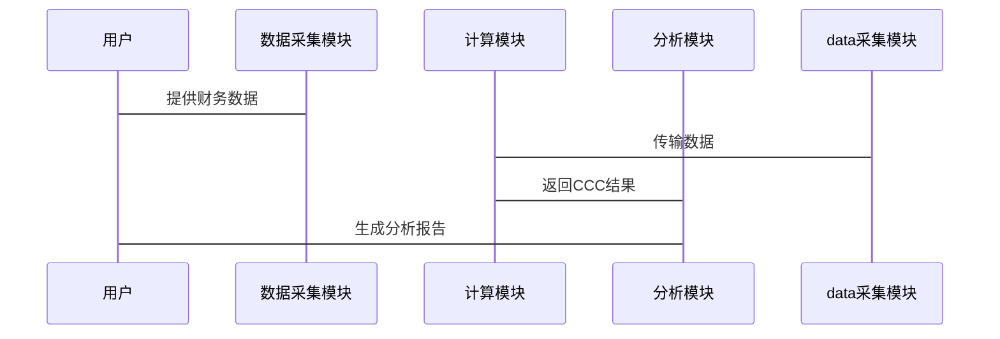

                 


# 彼得林奇对公司现金转换周期的分析

## 关键词：彼得林奇，现金转换周期，企业估值，投资分析，财务指标，运营效率

## 摘要：本文深入分析了彼得·林奇如何通过现金转换周期（Cash Conversion Cycle, CCC）这一关键财务指标来评估公司的运营效率和投资价值。文章首先介绍了CCC的基本概念和计算方法，然后探讨了其在企业估值中的应用，并通过实际案例展示了如何利用CCC进行投资决策。通过本文，读者将掌握CCC的核心原理、计算方法及其在投资分析中的重要性。

---

## 第一部分：现金转换周期的基本概念

### 第1章：现金转换周期的定义与背景

#### 1.1 现金转换周期的定义
现金转换周期（Cash Conversion Cycle, CCC）是衡量公司运营效率的重要指标，反映了从购买原材料到最终收到现金的时间跨度。CCC越短，说明公司在运营过程中占用的资金越少，运营效率越高。彼得·林奇认为，CCC是评估公司管理水平和盈利能力的关键指标。

#### 1.2 现金转换周期的背景与重要性
在企业运营中，资金周转效率直接影响企业的盈利能力和财务健康状况。CCC的优化可以帮助企业减少资金占用，提高流动性，从而增强市场竞争力。彼得·林奇在其投资分析中，特别关注CCC的长短，以判断企业的运营效率和管理能力。

#### 1.3 彼得·林奇与现金转换周期
彼得·林奇是美国著名投资经理人，以其对成长型股票的精准判断而闻名。他认为，CCC是评估公司运营效率的重要指标，可以通过分析CCC来发现那些具有竞争优势和高效运营能力的公司。

---

## 第二部分：现金转换周期的核心概念分析

### 第2章：现金转换周期的计算公式与影响因素

#### 2.1 现金转换周期的计算公式
现金转换周期的计算公式为：
$$CCC = \text{存货周转天数} + \text{应收账款周转天数} - \text{应付账款周转天数}$$

其中：
- 存货周转天数 = (平均存货 / 日均成本) × 365
- 应收账款周转天数 = (平均应收账款 / 日均收入) × 365
- 应付账款周转天数 = (平均应付账款 / 日均支出) × 365

#### 2.2 影响现金转换周期的主要因素
- **存货管理**：存货周转率越快，存货周转天数越短，CCC越小。
- **应收账款回收**：应收账款周转率越高，应收账款周转天数越短，CCC越小。
- **应付账款支付**：应付账款周转率越高，应付账款周转天数越长，CCC越小。

---

## 第三部分：现金转换周期的算法原理

### 第3章：现金转换周期的算法实现

#### 3.1 算法原理
CCC的计算基于公司财务报表中的相关数据，具体步骤如下：
1. 计算存货周转天数。
2. 计算应收账款周转天数。
3. 计算应付账款周转天数。
4. 将上述三个数值代入CCC公式，计算最终结果。

#### 3.2 Python代码实现

```python
def calculate_ccc(inventory_turnover_days, receivables_turnover_days, payables_turnover_days):
    ccc = inventory_turnover_days + receivables_turnover_days - payables_turnover_days
    return ccc

# 示例数据
inventory_turnover_days = 60
receivables_turnover_days = 45
payables_turnover_days = 30

ccc = calculate_ccc(inventory_turnover_days, receivables_turnover_days, payables_turnover_days)
print(f"现金转换周期（CCC）为：{ccc}天")
```

#### 3.3 算法优化
通过优化存货管理、应收账款回收和应付账款支付策略，可以有效缩短CCC。例如，采用JIT（准时制）生产模式可以降低存货周转天数，而加强应收账款管理可以缩短应收账款周转天数。

---

## 第四部分：现金转换周期的系统分析与架构设计

### 第4章：现金转换周期的系统分析

#### 4.1 系统功能设计
- 数据采集模块：收集公司财务数据。
- 计算模块：计算存货周转天数、应收账款周转天数和应付账款周转天数。
- 分析模块：计算CCC并生成分析报告。

#### 4.2 系统架构设计


#### 4.3 系统交互设计


---

## 第五部分：现金转换周期的项目实战

### 第5章：项目实战

#### 5.1 项目背景
选择一家制造企业，分析其CCC，评估其运营效率。

#### 5.2 数据收集与计算
收集公司最近一个财年的财务数据，计算存货周转天数、应收账款周转天数和应付账款周转天数。

#### 5.3 分析与解读
通过计算CCC，判断公司的运营效率，并与行业平均水平进行对比，找出存在的问题和优化方向。

---

## 第六部分：最佳实践与小结

### 第6章：最佳实践与小结

#### 6.1 最佳实践
- 定期计算CCC，监控运营效率。
- 结合行业特点，制定优化策略。
- 综合考虑其他财务指标，全面评估公司价值。

#### 6.2 投资策略建议
- 选择CCC较低的公司，降低投资风险。
- 关注CCC持续优化的公司，长期投资价值更高。

#### 6.3 注意事项
- CCC的计算需结合行业特点，不同行业的标准不同。
- CCC的优化需综合考虑成本和效率。

#### 6.4 未来研究方向
- 研究CCC在不同行业中的应用效果。
- 探讨CCC与其他财务指标的联动关系。

---

## 作者：AI天才研究院 & 禅与计算机程序设计艺术

