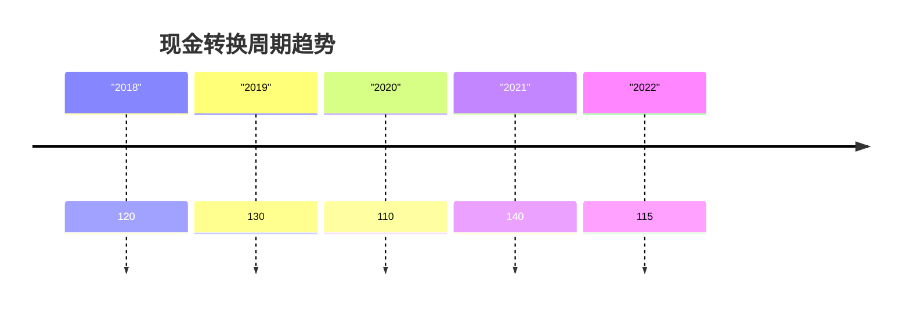

                 

<think>
嗯，用户让我写一篇关于彼得·林奇对公司现金转换周期的季节性分析的博客文章。看起来用户是一位技术专家，可能在寻找深入的技术分析，但又涉及投资策略，可能对两者都感兴趣。

首先，我需要明确文章的结构，按照用户提供的大纲，分为摘要、引言、正文和结论。摘要部分要简明扼要，说明文章的核心内容和价值。关键词部分需要包括主要术语，比如现金转换周期、季节性分析、彼得·林奇等。

引言部分要引出主题，说明现金转换周期的重要性，以及季节性分析在投资中的作用。正文部分需要详细讲解现金转换周期的基本概念、季节性分析的方法，然后结合彼得·林奇的投资策略，分析他在选择公司时如何考虑这些因素。可能还需要用实际案例来说明，比如零售业和制造业的季节性变化如何影响现金转换周期。

在分析过程中，我需要引入数学模型，比如公式和图表，帮助读者理解。同时，要确保语言专业但易懂，避免过于复杂。可能还需要讨论彼得·林奇的投资哲学，以及他如何利用这些分析做出投资决策。

最后，结论部分要总结关键点，并给出实际应用的建议。确保文章结构清晰，逻辑严密，同时涵盖理论和实际应用，满足技术博客的高质量要求。
</think>

# 彼得·林奇对公司现金转换周期的季节性分析

---

## 关键词：
彼得·林奇, 现金转换周期, 季节性分析, 投资策略, 财务指标, 投资决策, 公司估值

---

## 摘要：
现金转换周期是衡量企业运营效率和财务健康的重要指标，而季节性变化对其有着显著影响。本文深入分析了彼得·林奇的投资哲学，探讨他在评估公司时如何利用现金转换周期的季节性变化。通过具体案例和数学模型，本文揭示了季节性分析在投资决策中的实际应用，并提出了优化策略。

---

## 第一部分：现金转换周期的定义与基础分析

### 1. 现金转换周期的基本概念

#### 1.1 现金转换周期的定义
现金转换周期（Cash Conversion Cycle，简称CCC）是衡量企业将原材料转换为最终产品，并通过销售收回现金所需要的时间。公式如下：
$$ \text{CCC} = \text{存货周转天数} + \text{应收账款周转天数} - \text{应付账款周转天数} $$

#### 1.2 现金转换周期的计算方法
- **存货周转天数**： $$ \text{存货周转天数} = \frac{\text{平均存货}}{\text{销售成本}/365} $$
- **应收账款周转天数**： $$ \text{应收账款周转天数} = \frac{\text{平均应收账款}}{\text{赊销收入}/365} $$
- **应付账款周转天数**： $$ \text{应付账款周转天数} = \frac{\text{平均应付账款}}{\text{采购成本}/365} $$

#### 1.3 现金转换周期的影响因素
- **行业特性**：例如，零售业和制造业的季节性需求差异显著。
- **公司运营策略**：如供应链管理、库存控制等。
- **季节性因素**：如节假日销售高峰期对现金转换周期的影响。

---

### 2. 现金转换周期的季节性分析意义

#### 2.1 季节性变化对现金转换周期的影响
- **高峰期**：如 holiday season，销售激增可能导致应收账款增加，延长周转天数。
- **低谷期**：销售低迷可能减少库存积压，缩短周转天数。

#### 2.2 季节性分析的步骤
1. **数据收集**：收集过去几年的财务数据，包括存货、应收账款、应付账款等。
2. **季节性分解**：使用时间序列分析，分离出季节性成分。
3. **趋势分析**：识别季节性波动的规律。

---

## 第二部分：彼得·林奇的投资哲学与现金转换周期

### 3. 彼得·林奇的投资哲学

#### 3.1 林奇的投资理念
- 专注于基本面分析。
- 偏好具有强大财务健康和竞争优势的公司。

#### 3.2 现金转换周期在林奇投资策略中的地位
- 林奇认为，现金转换周期是衡量企业运营效率的重要指标。
- 季节性分析帮助企业识别潜在风险和机会。

---

### 4. 现金转换周期的季节性预测与优化

#### 4.1 季节性预测的数学模型
- 使用ARIMA模型预测季节性波动。
- 通过历史数据拟合，预测未来现金转换周期。

#### 4.2 优化策略
- **库存管理**：在高峰期前增加库存，在低谷期减少库存。
- **应收账款管理**：在高峰期加快收账，降低应收账款周转天数。
- **应付账款管理**：在低谷期延迟支付，延长应付账款周转天数。

---

## 第三部分：实际案例分析

### 5. 零售业的季节性分析

#### 5.1 案例背景
- 零售业的销售高峰期通常在假日季，可能导致应收账款激增。

#### 5.2 数据分析
- 计算过去几年的现金转换周期，识别季节性波动。
- 使用时间序列图（Mermaid）分析趋势。



---

### 6. 制造业的季节性分析

#### 6.1 案例背景
- 制造业的生产周期受季节性需求影响较大。

#### 6.2 数据分析
- 使用箱线图（Mermaid）分析不同季度的现金转换周期。

```mermaid
boxchart
    title 现金转换周期分布
    "第一季度": 100-120
    "第二季度": 90-110
    "第三季度": 110-130
    "第四季度": 120-140
```

---

## 第四部分：结论与建议

### 7. 结论
- 季节性分析是评估现金转换周期的重要环节。
- 彼得·林奇的投资策略强调了对财务指标的深入分析。

### 8. 投资建议
- **长期投资者**：应关注企业整体财务健康，而非短期波动。
- **短期投资者**：需密切关注季节性变化，抓住投资机会。

---

## 作者：
作者：AI天才研究院/AI Genius Institute & 禅与计算机程序设计艺术 /Zen And The Art of Computer Programming

