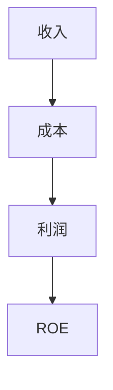
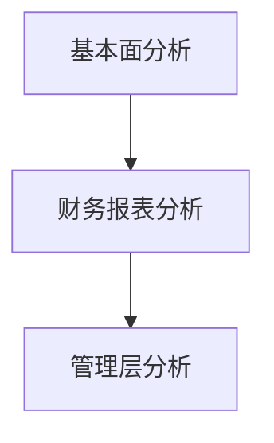

                 


# 彼得林奇对公司盈利模式创新的判断

## 关键词：
- 彼得林奇
- 盈利模式
- 创新
- 投资分析
- 公司价值

## 摘要：
本文探讨了彼得·林奇如何通过分析公司的盈利模式创新来判断其投资价值。文章从盈利模式的定义、核心要素、创新策略等方面展开，结合实际案例分析了不同行业公司的盈利模式创新，最后总结了创新对企业价值的影响及投资者如何判断和选择具有创新潜力的公司。

---

## 第1章: 盈利模式的定义与创新的重要性

### 1.1 盈利模式的定义
盈利模式是企业通过提供产品或服务，从客户那里获得收入的方式。一个创新的盈利模式能够有效提升企业的盈利能力，增强市场竞争力。

#### 关键点：
- 盈利模式的核心在于如何创造价值并获取收益。
- 创新是企业持续增长的关键。

### 1.2 创新在盈利模式中的作用
创新能够帮助企业突破传统盈利方式的限制，寻找新的增长点。

#### 关键点：
- 产品创新：通过新产品满足市场需求。
- 服务创新：通过优质服务提升客户满意度。
- 价值链重构：通过优化供应链降低成本。

### 1.3 创新对企业价值的影响
创新的盈利模式能够提升企业的市场地位和盈利能力，从而增加企业价值。

#### 关键点：
- 财务表现：收入增长、成本降低。
- 市场适应性：快速应对市场变化。

---

## 第2章: 盈利模式的核心要素与创新策略

### 2.1 盈利模式的核心要素
企业盈利模式由以下要素构成：
- **产品与服务**：提供独特的产品或服务。
- **市场与客户**：了解目标市场和客户需求。
- **资源与能力**：企业拥有的资源和能力。
- **价值链与生态系统**：企业上下游的合作关系。

#### 表格对比：
| 要素             | 传统模式                | 创新模式                |
|------------------|-------------------------|-------------------------|
| 产品与服务       | 标准化产品              | 定制化、智能化产品      |
| 市场与客户       | 线下销售                | 线上销售、O2O模式        |
| 资源与能力       | 依赖传统资源            | 利用数字技术优化资源    |
| 价值链与生态     | 单一供应商              | 多方协作、生态共赢      |

### 2.2 盈利模式的创新策略
- **产品创新**：通过技术创新推出新产品。
- **服务创新**：提供增值服务提升客户粘性。
- **数字化转型**：利用大数据和AI优化运营。
- **生态合作**：构建开放的商业生态。

#### 图表：创新策略的ER图
```mermaid
erDiagram
+---+     +---+     +---+
|C  |<----|S  |<----|P  |
+---+     +---+     +---+
```

---

## 第3章: 盈利模式创新的判断标准与评估方法

### 3.1 判断标准
- **可持续性**：模式是否能长期持续。
- **竞争优势**：是否具备独特的竞争优势。
- **财务表现**：收入和利润是否显著提升。
- **市场适应性**：是否能适应市场变化。

### 3.2 评估方法
- **财务指标分析**：ROE、净利润率等。
- **市场地位分析**：市场份额和品牌影响力。
- **价值链分析**：从上游到下游的效率和成本。
- **创新能力评估**：研发投入和专利数量。

#### 图表：财务指标分析流程图


---

## 第4章: 彼得林奇视角下的公司盈利模式分析

### 4.1 彼得林奇的分析框架
彼得林奇通过基本面分析、财务报表分析和管理层分析来判断公司的盈利模式。

#### 图表：彼得林奇分析框架


### 4.2 创新对估值的影响
- 创新能力强的公司估值更高。
- 估值方法需要根据创新模式调整。

---

## 第5章: 盈利模式创新的实战技巧与案例剖析

### 5.1 实战技巧
- **识别机会**：关注行业趋势和客户需求。
- **设计方案**：结合企业资源和市场定位。
- **实施创新**：分阶段推进，及时调整。

### 5.2 案例剖析
#### 互联网行业
- **案例**：某互联网公司通过数据驱动的广告模式实现收入增长。
- **分析**：利用大数据技术精准定位客户，提升广告转化率。

#### 制造业
- **案例**：某制造企业通过智能化生产降低成本。
- **分析**：引入工业4.0技术，优化生产流程。

---

## 第6章: 总结与展望

### 6.1 总结
- 创新是企业持续发展的核心。
- 投资者需关注公司的盈利模式创新。

### 6.2 展望
- 数字技术将继续推动盈利模式创新。
- 未来的创新将更加依赖于技术驱动。

---

## 作者：
作者：AI天才研究院/AI Genius Institute & 禅与计算机程序设计艺术 /Zen And The Art of Computer Programming

