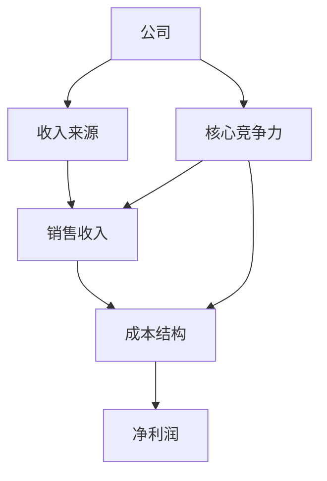
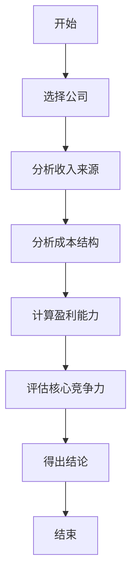
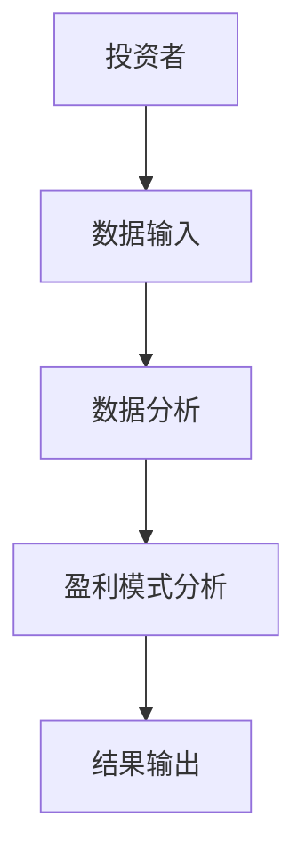

                 


# 彼得林奇对公司盈利模式的分析

---

## 关键词：
- 彼得·林奇
- 盈利模式
- 投资分析
- 企业价值
- 财务分析

---

## 摘要：
本文以彼得·林奇的投资哲学为基础，深入探讨公司盈利模式的分析方法。通过定义盈利模式的核心要素，分析其构成与联系，并结合数学模型和实际案例，展示如何通过盈利模式分析来评估企业价值。文章结构清晰，内容详实，适合对投资分析感兴趣的专业人士阅读。

---

## 第一部分: 彼得·林奇投资哲学与方法论

### 第1章: 彼得·林奇的投资哲学

#### 1.1 彼得·林奇的背景与投资理念
彼得·林奇是美国著名的基金经理和投资专家，以其对市场趋势的敏锐洞察和对公司的深入分析而闻名。他强调基本面分析，认为公司的内在价值是决定其股价的关键因素。

- **彼得·林奇的投资理念**：
  - 价值投资：寻找那些被市场低估的公司。
  - 长期投资：关注公司的长期盈利能力，而非短期波动。
  - 深入分析：通过对公司盈利模式的分析，评估其未来的增长潜力。

- **林奇的核心思想**：
  - 公司的盈利模式是其价值的基石。
  - 通过分析盈利模式，可以预测公司的未来表现。
  - 选择具有强大护城河的公司，确保其盈利的可持续性。

#### 1.2 林奇的投资方法论
林奇的投资方法论以基本面分析为核心，强调对公司的财务状况、行业地位和管理层能力的全面评估。

- **投资策略**：
  - **行业分析**：选择具有增长潜力的行业，避开夕阳行业。
  - **管理层评估**：信任且有能力的管理层是公司长期成功的关键。
  - **财务分析**：通过分析财务报表，评估公司的盈利能力和财务健康状况。

- **盈利模式分析的方法论**：
  - 从收入来源和成本结构入手，分析公司的盈利基础。
  - 通过比较不同公司的盈利模式，寻找具有竞争优势的企业。

---

### 第2章: 盈利模式分析的背景与重要性

#### 2.1 盈利模式的定义与分类
- **定义**：
  盈利模式是指公司通过提供产品或服务，从客户那里获得收入，并通过控制成本和提高效率来实现利润的机制。

- **分类**：
  - **产品型盈利模式**：通过销售商品获得收入。
  - **服务型盈利模式**：通过提供服务获得收入。
  - **混合型盈利模式**：结合产品和服务的销售。

#### 2.2 盈利模式分析的必要性
- **对投资者的意义**：
  - 帮助投资者识别具有可持续盈利能力的公司。
  - 通过分析盈利模式，评估公司的竞争优势和潜在风险。

- **对企业的意义**：
  - 优化收入来源，降低运营成本。
  - 通过盈利模式创新，提升企业的市场竞争力。

#### 2.3 盈利模式分析的核心要素
- **收入来源**：
  - 主要收入来源：销售产品或服务。
  - 其他收入来源：利息、投资收益等。

- **成本结构**：
  - 直接成本：生产产品的原材料、人工成本。
  - 间接成本：研发、管理、销售费用。

- **核心竞争力**：
  - 技术优势：拥有独特的技术或专利。
  - 市场地位：在行业内具有领先地位。
  - 管理能力：高效的管理团队。

---

## 第二部分: 盈利模式分析的核心概念与联系

### 第3章: 盈利模式的核心概念原理

#### 3.1 盈利模式的构成要素
- **收入来源**：
  - 产品销售收入：如制造业企业的产品销售。
  - 服务收入：如咨询公司或律师事务所的服务收费。

- **成本结构**：
  - 固定成本：如厂房、设备的折旧。
  - 变动成本：如原材料采购、人工成本。

- **核心竞争力**：
  - 技术创新：如科技公司的研发投入。
  - 品牌影响力：如快消品企业的品牌价值。

#### 3.2 盈利模式的属性特征对比
以下是几种常见盈利模式的对比：

| 盈利模式       | 收入来源                     | 成本结构                     | 可持续性 |
|----------------|------------------------------|-------------------------------|----------|
| 产品销售       | 销售商品                     | 生产成本、物流费用           | 中等     |
| 服务订阅       | 提供持续服务                 | 人工成本、技术支持费用       | 较高     |
| 平台模式       | 平台佣金、广告收入           | 平台开发、维护费用           | 高       |
| 会员制         | 会员费                      | 会员管理、服务成本           | 较高     |

#### 3.3 盈利模式的ER实体关系图
以下是盈利模式的ER实体关系图：

```mermaid
erDiagram
    company {
        key id : Integer
        string name
        float revenue : Revenue
        float cost : Cost
        float profit : Profit
    }
    product {
        key id : Integer
        string name
        float price : Price
        integer quantity : Quantity
    }
    service {
        key id : Integer
        string name
        float price : Price
        integer hours : Hours
    }
    company --| product : sells
    company --| service : provides
```

---

### 第4章: 盈利模式的流程图

#### 4.1 盈利模式的流程图
以下是盈利模式的流程图：



---

## 第三部分: 盈利模式分析的算法原理

### 第5章: 盈利模式分析的数学模型

#### 5.1 盈利能力分析的数学公式
- **净利润率**：
  $$ \text{净利润率} = \frac{\text{净利润}}{\text{营业收入}} \times 100\% $$

- **毛利率**：
  $$ \text{毛利率} = \frac{\text{营业收入} - \text{营业成本}}{\text{营业收入}} \times 100\% $$

#### 5.2 盈利模式分析的算法步骤
以下是盈利模式分析的算法流程图：



---

### 第6章: 系统分析与架构设计方案

#### 6.1 问题场景介绍
我们希望通过系统分析，构建一个盈利模式分析框架，帮助投资者快速评估公司的盈利能力。

#### 6.2 系统功能设计
以下是系统功能设计的类图：

```mermaid
classDiagram
    class Company {
        + id : Integer
        + name : String
        + revenue : Float
        + cost : Float
        + profit : Float
        + products : List
        + services : List
    }
    class Product {
        + id : Integer
        + name : String
        + price : Float
        + quantity : Integer
    }
    class Service {
        + id : Integer
        + name : String
        + price : Float
        + hours : Integer
    }
    Company o Product
    Company o Service
```

#### 6.3 系统架构设计
以下是系统架构设计的流程图：



---

### 第7章: 项目实战

#### 7.1 环境安装
- 需要安装Mermaid和Python环境。

#### 7.2 核心实现源代码
以下是Python实现的盈利模式分析代码：

```python
def calculate_profit_margin(revenue, cost):
    return (revenue - cost) / revenue * 100

def calculate_net_profit_margin(net_profit, revenue):
    return net_profit / revenue * 100

# 示例数据
revenue = 1000000
cost = 800000
net_profit = 200000

# 计算毛利率
profit_margin = calculate_profit_margin(revenue, cost)
print(f"毛利率: {profit_margin}%")

# 计算净利润率
net_profit_margin = calculate_net_profit_margin(net_profit, revenue)
print(f"净利润率: {net_profit_margin}%")
```

#### 7.3 案例分析
以微软为例，分析其盈利模式：

- **收入来源**：软件销售、云服务、广告。
- **成本结构**：研发、销售、管理。
- **核心竞争力**：强大的技术实力和品牌影响力。

---

## 第四部分: 总结与最佳实践

### 第8章: 总结与最佳实践

#### 8.1 投资建议
- **长期投资**：选择具有强大盈利模式的公司，长期持有。
- **深入分析**：通过分析财务报表和行业趋势，评估公司的盈利能力。
- **关注管理层**：优秀的管理层能够提升公司的盈利能力和市场竞争力。

#### 8.2 注意事项
- **风险控制**：避免过度集中投资，分散风险。
- **持续学习**：市场变化迅速，需不断更新知识和分析方法。

---

## 作者：AI天才研究院 & 禅与计算机程序设计艺术

---

**本文作者：AI天才研究院 & 禅与计算机程序设计艺术**  
**联系方式：[email protected]**  
**转载请注明出处**

