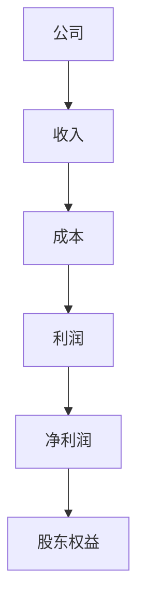
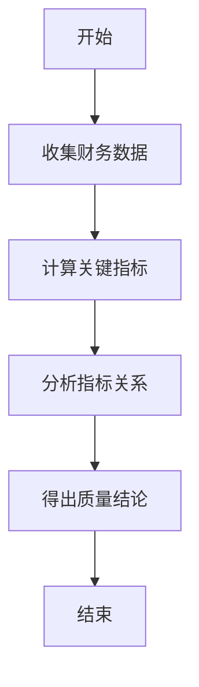
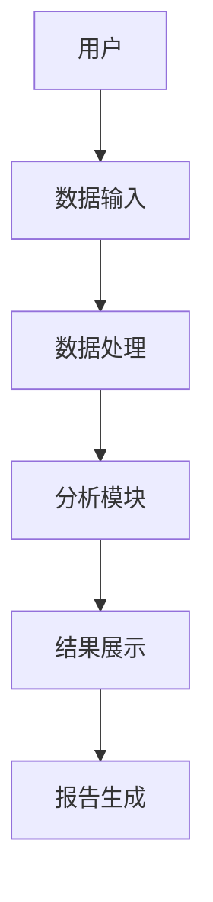

                 


# 彼得林奇对公司盈利质量的分析

> 关键词：彼得林奇、盈利质量分析、投资策略、财务分析、现金流、企业价值

> 摘要：本文将详细分析彼得·林奇对公司盈利质量的分析方法，通过现金流、利润率、股东权益等核心指标，揭示企业盈利能力的本质，帮助企业投资者制定有效的投资策略。文章结合理论与实际案例，深入探讨盈利质量分析的数学模型、系统架构及项目实战，为读者提供全面的指导。

---

## 第一章：盈利质量分析的背景与核心概念

### 1.1 盈利质量分析的背景与重要性

#### 1.1.1 财务分析的核心目标
财务分析的核心目标在于评估企业的盈利能力和财务健康状况，为投资决策提供数据支持。传统财务分析通常关注净利润、营业收入等指标，但这些指标无法完全反映企业的盈利质量。

#### 1.1.2 盈利质量分析的定义
盈利质量分析是指通过对企业的财务报表数据进行深入分析，评估企业盈利的真实性和可持续性。与传统盈利分析不同，盈利质量分析更关注利润的来源、质量和结构。

#### 1.1.3 盈利质量与企业价值的关系
企业的价值不仅取决于其当前的盈利能力，还取决于未来的盈利潜力。高质量的盈利意味着企业具有较强的市场竞争力和持续盈利能力，从而能够为投资者创造长期价值。

---

### 1.2 彼得·林奇的投资理念

#### 1.2.1 彼得·林奇的投资者背景
彼得·林奇是美国著名投资家，曾管理富达麦哲伦基金，创造了卓越的投资业绩。他的投资理念以基本面分析为核心，强调对企业盈利能力和财务健康状况的深入研究。

#### 1.2.2 林奇的投资哲学
林奇认为，投资成功的关键在于选择具有强大竞争优势、良好管理和持续盈利能力的企业。他特别注重企业的现金流和利润质量，认为这是评估企业价值的重要指标。

#### 1.2.3 林奇对盈利质量的重视
林奇指出，企业的净利润虽然重要，但其质量更重要。高质量的盈利来源于强劲的现金流和持续的收入增长，而不仅仅是会计利润的增加。

---

### 1.3 盈利质量分析的必要性

#### 1.3.1 传统盈利分析的局限性
传统盈利分析主要关注净利润、毛利率等指标，但忽视了利润的来源和质量。例如，某些企业可能通过财务 manipulation 提升净利润，但其实质盈利能力并不强。

#### 1.3.2 盈利质量分析的优势
盈利质量分析能够揭示企业盈利的真实性和可持续性。通过分析现金流、应收账款、存货等指标，可以更全面地评估企业的财务健康状况。

#### 1.3.3 林奇方法对企业投资的指导意义
林奇的盈利质量分析方法为投资者提供了评估企业价值的重要工具。通过关注企业的现金流和利润质量，投资者可以更准确地判断企业的长期发展潜力。

---

## 第二章：盈利质量分析的核心概念与联系

### 2.1 盈利质量的核心要素

#### 2.1.1 净利润的构成与影响因素
净利润是企业营业收入减去各项成本和费用后的结果。其构成包括营业收入、营业成本、销售费用、管理费用、研发费用等。

#### 2.1.2 每股收益（EPS）的计算与意义
每股收益是净利润除以普通股股数，反映了每股普通股的盈利能力。EPS 是衡量企业盈利能力的重要指标，但需结合企业股本规模和其他财务指标综合分析。

#### 2.1.3 营业利润率与净利润率的对比
营业利润率 = 营业利润 / 营业收入  
净利润率 = 净利润 / 营业收入  
两者均反映企业的盈利效率，但营业利润率更能体现企业经营效率，而净利润率更能反映企业整体盈利能力。

---

### 2.2 盈利质量的关键指标

#### 2.2.1 净资产收益率（ROE）的计算公式与意义
ROE = 净利润 / 净资产  
ROE 衡量了企业使用股东资金的效率，是评估企业盈利能力的重要指标。一般来说，ROE 越高，企业的盈利能力越强。

#### 2.2.2 资产回报率（ROA）的计算公式与意义
ROA = 净利润 / 总资产  
ROA 衡量了企业使用资产的效率，能够反映企业的整体运营效率。

#### 2.2.3 营业利润率与净利润率的对比分析
通过对比营业利润率和净利润率，可以评估企业的成本控制能力。如果营业利润率较高，但净利润率较低，可能表明企业存在较高的非经营性费用或税收负担。

---

### 2.3 盈利质量分析的ER实体关系图



---

### 2.4 盈利质量分析的算法流程



---

## 第三章：盈利质量分析的数学模型与公式

### 3.1 盈利质量的核心公式

#### 3.1.1 净利润计算公式
$$净利润 = 营业收入 - 营业成本 - 费用$$

#### 3.1.2 每股收益计算公式
$$EPS = \frac{净利润}{流通股数量}$$

#### 3.1.3 净资产收益率计算公式
$$ROE = \frac{净利润}{净资产}$$

---

### 3.2 盈利质量分析的对比模型

#### 3.2.1 不同行业间的盈利能力对比
通过对比不同行业的ROE和营业利润率，可以评估行业间的盈利能力差异。

#### 3.2.2 同行业内的公司对比
在同一行业内，通过对比公司的ROA、营业利润率等指标，可以评估公司的相对盈利能力。

#### 3.2.3 时间序列分析
通过分析公司历史财务数据，评估其盈利能力的变化趋势。

---

## 第四章：盈利质量分析的系统架构与设计方案

### 4.1 系统分析与架构设计

#### 4.1.1 系统目标
构建一个能够对企业财务数据进行深度分析的系统，评估企业的盈利质量和投资价值。

#### 4.1.2 系统功能模块
- 数据输入与处理模块
- 盈利质量分析模块
- 数据可视化模块
- 报告生成模块

#### 4.1.3 系统架构图



---

## 第五章：项目实战

### 5.1 环境安装与数据准备

#### 5.1.1 环境安装
安装Python、Pandas、Matplotlib等工具，准备企业财务数据。

#### 5.1.2 数据准备
收集目标企业的财务报表数据，包括营业收入、成本、费用、净利润等。

---

### 5.2 核心实现与代码解读

#### 5.2.1 数据处理代码
```python
import pandas as pd

# 读取财务数据
df = pd.read_csv('financial_data.csv')

# 计算关键指标
df['ROE'] = df['净利润'] / df['净资产']
df['ROA'] = df['净利润'] / df['总资产']
df['营业利润率'] = df['营业利润'] / df['营业收入']
```

#### 5.2.2 可视化代码
```python
import matplotlib.pyplot as plt

# 绘制ROE趋势图
plt.plot(df['ROE'], label='ROE')
plt.xlabel('年份')
plt.ylabel('ROE')
plt.title('ROE趋势图')
plt.legend()
plt.show()
```

---

### 5.3 实际案例分析

#### 5.3.1 某公司的现金流分析
通过分析企业的现金流，评估其盈利质量。例如，经营活动现金流净额是否为正，投资活动现金流是否健康。

#### 5.3.2 某行业的营业利润率对比
在同一行业内，对比不同公司的营业利润率，找出具有较高盈利能力的企业。

---

## 第六章：总结与展望

### 6.1 总结
本文详细介绍了彼得·林奇对公司盈利质量的分析方法，结合数学模型和实际案例，为投资者提供了全面的指导。

### 6.2 投资策略建议
- 优先选择ROE和营业利润率较高的企业
- 关注企业的现金流状况，确保盈利质量
- 结合行业特点，选择具有竞争优势的企业

### 6.3 展望
未来，随着人工智能和大数据技术的发展，盈利质量分析将更加精准和高效。投资者可以通过智能化工具，进一步提升分析效率和准确性。

---

## 作者：AI天才研究院 & 禅与计算机程序设计艺术

---

这篇文章通过系统的理论分析和实际案例，全面解读了彼得·林奇的盈利质量分析方法，帮助投资者制定科学的投资策略。希望对您有所帮助！

