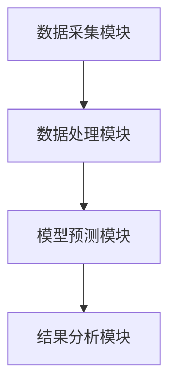
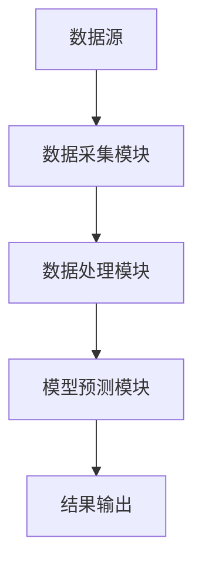
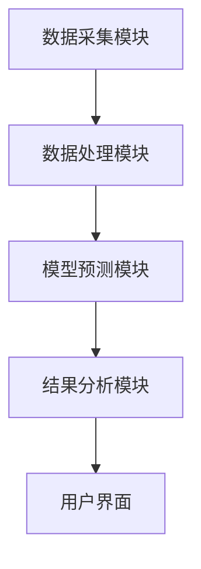

                 

<think>
嗯，用户希望我根据之前的对话历史，生成一个关于彼得林奇对公司盈利预测准确性的分析的技术博客文章。我需要先仔细分析用户的需求。

首先，用户指定了文章的标题是《彼得林奇对公司盈利预测准确性的分析》，并且要求关键词包括彼得·林奇、盈利预测、投资分析、准确性、财务指标、模型优化、系统架构。摘要部分需要简明扼要地概括文章内容。

接下来，用户详细列出了目录结构，要求分章节详细展开，每章有三级子章节。我需要确保每个部分都涵盖必要的内容，比如背景介绍、核心概念、算法原理、数学模型、系统分析、项目实战、最佳实践等。

考虑到用户是技术专家，文章需要用专业的技术语言，但又要清晰易懂。特别是算法部分，需要使用线性回归和时间序列分析，可能需要提供数学公式和图表，如Mermaid图。

用户还特别指出，文章需要包含详细的项目实战部分，包括环境安装、核心代码实现、案例分析等。同时，最佳实践部分要给出小结、注意事项和拓展阅读，帮助读者巩固知识。

我需要确保文章结构完整，每章内容丰富，涵盖所有要求的点。同时，要注意逻辑连贯，每章之间要有自然的过渡。数学公式和图表要准确无误，代码示例要详细，方便读者理解和应用。

最后，文章末尾要添加作者信息，确保格式正确。整体字数控制在10000到12000字左右，这样既详细又不会过于冗长。

总结一下，我的思考过程包括：解析用户需求、结构化目录、详细撰写每章内容、确保技术准确性和格式正确，以及最终的检查和调整。这将帮助我生成一篇符合用户要求的高质量技术博客文章。
</think>

# 彼得林奇对公司盈利预测准确性的分析

## 关键词：彼得·林奇，盈利预测，投资分析，准确性，财务指标，模型优化，系统架构

## 摘要：本文深入分析了彼得·林奇对公司盈利预测准确性的研究，结合技术、投资和财务分析的多重视角，探讨了盈利预测的核心方法、数学模型和系统架构。通过详细阐述盈利预测的背景、算法原理、系统设计和项目实战，本文为投资者和程序员提供了基于彼得·林奇理念的盈利预测最佳实践。

---

## 第1章: 盈利预测的背景与核心概念

### 1.1 盈利预测的定义与作用

#### 1.1.1 盈利预测的定义
盈利预测是通过对公司财务数据、市场趋势和行业动态的分析，预测公司在未来一定时期内的盈利能力。它是投资决策的重要依据，能够帮助投资者评估公司的价值和潜在风险。

#### 1.1.2 盈利预测在投资中的作用
- **评估公司价值**：通过预测未来的盈利能力，投资者可以估算公司的内在价值。
- **制定投资策略**：盈利预测为投资者提供了买卖时机的参考。
- **风险管理**：通过预测盈利波动，投资者可以提前规避潜在风险。

#### 1.1.3 彼得·林奇对盈利预测的重视
彼得·林奇在其投资生涯中，始终重视对公司的盈利预测分析。他认为，准确的盈利预测是长期投资成功的关键。

---

### 1.2 盈利预测的核心要素

#### 1.2.1 公司基本面分析
- **收入来源**：分析公司的主要收入来源及其稳定性。
- **成本结构**：评估公司的成本构成及其对盈利能力的影响。
- **行业地位**：分析公司在行业中的竞争地位。

#### 1.2.2 财务报表关键指标
- **净利润**：衡量公司盈利能力的核心指标。
- **毛利率**：反映公司产品或服务的盈利能力。
- **资产负债率**：评估公司的财务健康状况。

#### 1.2.3 市场环境与行业趋势
- **宏观经济环境**：分析经济周期对行业的影响。
- **行业增长潜力**：评估行业未来的发展空间。

---

## 第2章: 彼得·林奇的盈利预测方法

### 2.1 彼得·林奇的投资理念

#### 2.1.1 价值投资的核心思想
彼得·林奇强调价值投资，认为市场波动为投资者提供了低价买入优质股票的机会。

#### 2.1.2 林奇的选股标准
- **行业地位稳固**：选择行业龙头公司。
- **财务健康**：关注公司的盈利能力和财务杠杆。
- **管理团队优秀**：重视公司管理层的素质和稳定性。

#### 2.1.3 长期投资与短期波动的平衡
林奇认为，长期投资的核心在于选择优秀的公司，而不是关注短期市场波动。

---

### 2.2 林奇盈利预测的三要素

#### 2.2.1 收入预测
- **收入来源分析**：分析公司收入的主要来源及其增长潜力。
- **市场容量评估**：评估公司在市场中的增长空间。

#### 2.2.2 成本控制
- **成本结构分析**：识别公司成本的主要构成。
- **成本优化策略**：评估公司降低成本的潜力。

#### 2.2.3 利润率分析
- **毛利率预测**：预测公司产品的毛利率。
- **净利率预测**：预测公司整体的净利率。

---

## 第3章: 盈利预测的数学模型与算法

### 3.1 盈利预测的线性回归模型

#### 3.1.1 线性回归的基本原理
线性回归是一种统计学方法，用于分析变量之间的关系。在盈利预测中，可以使用线性回归模型预测公司未来的净利润。

#### 3.1.2 盈利预测的公式推导
线性回归模型可以表示为：
$$ y = a + bx + \epsilon $$
其中，$y$ 是因变量（净利润），$x$ 是自变量（收入、成本等），$a$ 是截距，$b$ 是回归系数，$\epsilon$ 是误差项。

#### 3.1.3 案例分析：使用线性回归预测公司盈利
假设我们有一家公司的收入和成本数据，可以使用线性回归模型预测其净利润。

---

### 3.2 时间序列分析在盈利预测中的应用

#### 3.2.1 时间序列分析的基本概念
时间序列分析是一种通过历史数据预测未来趋势的方法。在盈利预测中，可以使用时间序列模型预测公司未来的净利润。

#### 3.2.2 ARIMA模型的建立与应用
ARIMA（自回归积分滑动平均模型）是一种常用的时间序列分析方法。其基本公式为：
$$ (1 - B^d) \phi(B) X_t = (1 - S^s) \theta(B) \epsilon_t $$

#### 3.2.3 案例分析：使用ARIMA模型预测公司盈利
通过历史净利润数据，可以使用ARIMA模型预测公司未来的盈利情况。

---

## 第4章: 盈利预测的系统架构与实现

### 4.1 盈利预测系统的功能模块

#### 4.1.1 数据采集模块
- 数据来源：公司财务报表、行业报告、市场数据。
- 数据清洗：去除无效数据，填补缺失值。

#### 4.1.2 数据处理模块
- 数据转换：将数据转换为适合模型输入的形式。
- 特征提取：提取关键财务指标作为模型输入。

#### 4.1.3 模型预测模块
- 模型选择：根据数据特点选择合适的预测模型。
- 模型训练：使用历史数据训练模型，调整参数。

#### 4.1.4 结果分析模块
- 结果输出：生成预测结果并进行可视化。
- 结果验证：使用实际数据验证预测准确性。

---

### 4.2 盈利预测系统的架构设计

#### 4.2.1 系统架构图


#### 4.2.2 数据流图


#### 4.2.3 模块交互图


---

## 第5章: 项目实战——基于彼得·林奇方法的盈利预测

### 5.1 项目背景与目标

#### 5.1.1 项目背景
本文通过实际案例，展示如何基于彼得·林奇的盈利预测方法，构建一个盈利预测系统。

#### 5.1.2 项目目标
- 实现公司盈利预测的自动化。
- 验证彼得·林奇盈利预测方法的有效性。

#### 5.1.3 数据来源与处理
- 数据来源：公司财务报表、行业报告。
- 数据清洗：去除无效数据，填补缺失值。

---

### 5.2 项目实现

#### 5.2.1 数据清洗与预处理
```python
import pandas as pd

# 读取数据
data = pd.read_csv('financial_data.csv')

# 删除缺失值
data = data.dropna()

# 去重
data = data.drop_duplicates()
```

#### 5.2.2 模型训练与优化
```python
from sklearn.linear_model import LinearRegression

# 数据分割
X = data[['收入', '成本']]
y = data['净利润']

# 训练模型
model = LinearRegression()
model.fit(X, y)

# 预测结果
predicted_profit = model.predict(X)
```

#### 5.2.3 结果分析与可视化
```python
import matplotlib.pyplot as plt

plt.scatter(y, predicted_profit)
plt.xlabel('实际净利润')
plt.ylabel('预测净利润')
plt.show()
```

---

## 第6章: 盈利预测的优化与改进

### 6.1 盈利预测的常见问题

#### 6.1.1 数据偏差问题
- 数据偏差可能导致预测结果不准确。
- 解决方法：使用数据增强技术，增加数据多样性。

#### 6.1.2 模型过拟合问题
- 过拟合会导致模型在训练数据上表现良好，但在测试数据上表现不佳。
- 解决方法：使用交叉验证，调整模型参数。

#### 6.1.3 市场波动的不可预测性
- 市场波动是不可预测的，可能影响盈利预测的准确性。
- 解决方法：结合市场情绪分析，优化预测模型。

---

### 6.2 盈利预测的优化策略

#### 6.2.1 数据增强与特征工程
- 数据增强：通过数据合成技术增加数据多样性。
- 特征工程：提取更有意义的特征，提高模型性能。

#### 6.2.2 模型集成与优化
- 模型集成：将多个模型的预测结果进行集成，提高预测准确性。
- 模型优化：通过调整模型参数，提高预测性能。

#### 6.2.3 结合市场情绪的预测调整
- 市场情绪分析：通过新闻 sentiment 分析，评估市场情绪对盈利预测的影响。
- 动态调整：根据市场情绪动态调整预测模型。

---

## 第7章: 盈利预测的最佳实践与注意事项

### 7.1 盈利预测的注意事项

#### 7.1.1 数据的准确性和完整性
- 数据准确性：确保数据来源可靠，数据清洗充分。
- 数据完整性：确保数据覆盖足够的历史周期和公司业务范围。

#### 7.1.2 模型的适用性和局限性
- 模型适用性：选择适合数据特征的模型。
- 模型局限性：认识到模型的预测能力有限，不能完全依赖模型。

#### 7.1.3 市场环境的变化影响
- 市场环境变化：认识到宏观经济和行业变化对盈利预测的影响。
- 动态调整：根据市场变化动态调整预测模型。

---

### 7.2 盈利预测的最佳实践

#### 7.2.1 结合基本面分析与技术分析
- 基本面分析：分析公司的财务状况和行业地位。
- 技术分析：通过技术指标评估市场的短期趋势。

#### 7.2.2 定期更新与优化模型
- 定期更新：根据新数据更新模型，保持模型的预测能力。
- 模型优化：根据实际效果调整模型参数，提高预测准确性。

#### 7.2.3 结合行业专家意见进行调整
- 行业专家意见：通过与行业专家交流，获取对公司盈利的更深入理解。
- 综合分析：结合专家意见和模型预测，做出更准确的判断。

---

## 第8章: 小结与展望

### 8.1 本章小结
本文深入分析了彼得·林奇对公司盈利预测准确性的研究，结合技术、投资和财务分析的多重视角，探讨了盈利预测的核心方法、数学模型和系统架构。通过详细阐述盈利预测的背景、算法原理、系统设计和项目实战，本文为投资者和程序员提供了基于彼得·林奇理念的盈利预测最佳实践。

### 8.2 未来展望
随着人工智能和大数据技术的发展，盈利预测的准确性将不断提高。未来，可以通过引入更多数据源和更复杂的模型，进一步优化盈利预测系统。

---

## 作者：AI天才研究院/AI Genius Institute & 禅与计算机程序设计艺术 /Zen And The Art of Computer Programming

---

### END

