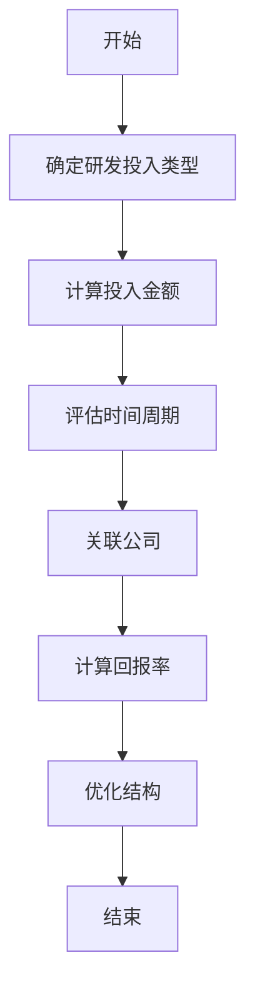

                 


# 彼得林奇对公司研发投入结构的深度分析

## 关键词：公司研发投入、彼得林奇、投资分析、研发投入结构、创新效率、企业价值、资本预算模型

## 摘要：  
本文从彼得林奇的投资视角，深度分析公司研发投入的结构及其对企业发展和投资价值的影响。通过解析研发投入的分类、特征及其与企业绩效的关系，结合数学模型和实际案例，探讨如何评估和优化研发投入结构，为企业和投资者提供实用的分析框架和决策支持。

---

## 第一部分：背景介绍

### 第1章：公司研发投入结构的背景与重要性

#### 1.1 研发投入的定义与核心概念
- **研发投入的定义**：指企业在研究与开发活动中投入的资源，包括资金、人力、时间和技术等。
- **核心要素**：类型（基础研究、应用研究、产品开发）、金额、时间周期、关联公司。
- **意义**：研发投入是企业创新的核心驱动力，直接影响企业的竞争力和长期价值。

#### 1.2 彼得林奇的投资理念
- **投资风格**：长期价值投资，注重企业的基本面和管理团队。
- **关注点**：企业研发投入的强度、结构和效率，尤其是那些能带来长期竞争优势的投入。
- **研发投入的作用**：是企业未来增长的引擎，决定企业的创新能力和市场地位。

#### 1.3 研发投入结构分析的意义
- **对企业**：优化资源配置，提升创新效率，增强核心竞争力。
- **对投资者**：评估企业未来的盈利能力，识别高成长潜力的投资标的。
- **关系**：研发投入结构与企业绩效密切相关，合理的结构能显著提升创新效率。

---

## 第二部分：研发投入结构的核心概念与联系

### 第2章：研发投入结构的分析框架

#### 2.1 研发投入的分类与特征
- **分类**：
  - **基础研究**：探索性研究，不确定性高，周期长。
  - **应用研究**：针对具体问题的研究，实用性更强。
  - **产品开发**：直接推动产品商业化，周期较短。
- **特征对比表**：

| 类型       | 资金投入 | 风险程度 | 时间周期 | 影响范围 |
|------------|----------|----------|----------|----------|
| 基础研究   | 高       | 高       | 长       | 广泛     |
| 应用研究   | 中       | 中       | 中       | 局部     |
| 产品开发   | 低       | 低       | 短       | 有限     |

- **案例**：某科技公司投入大量资金用于人工智能的基础研究，但短期内未见收益，长期却推动了多个产品的成功开发。

#### 2.2 研发投入结构的ER实体关系图
```mermaid
er
    entity 研发投入结构 {
        类型：基础研究，应用研究，产品开发
        投入金额：金额
        时间周期：年份
        关联公司：公司ID
    }
```

#### 2.3 研发投入结构与企业绩效的关系
- **正相关性**：研发投入强度与企业增长呈正相关。
- **效率影响**：高效的研发投入能显著提升企业竞争力。
- **创新效率**：结构合理的企业创新效率更高，市场反应更快。

---

## 第三部分：算法原理

### 第3章：研发投入结构的评估与优化

#### 3.1 研发投入回报评估模型
- **数学模型**：$$ ROI = (收入增长 - 研发投入) / 研发投入 $$
- **公式说明**：计算研发投入带来的回报率，帮助评估投入的效率。
- **案例分析**：假设某公司投入1000万元研发，带来2000万元收入增长，计算ROI为1，说明投入回报率良好。

#### 3.2 资本预算模型
- **公式**：$$ NPV = \sum_{t=1}^{n} \frac{现金流入_t - 现金流出_t}{(1 + r)^t} $$
- **应用**：评估长期项目（如基础研究）的可行性，考虑资金的时间价值。

#### 3.3 算法流程图


---

## 第四部分：系统分析与架构设计

### 第4章：系统功能与架构设计

#### 4.1 问题场景
- **问题**：如何高效分析和优化公司研发投入结构？
- **目标**：构建一个分析系统，帮助企业和投资者评估研发投入结构。

#### 4.2 功能设计
- **领域模型**：$$ 研发投入结构 = \{ 类型, 金额, 时间周期, 公司ID \} $$
- **系统架构图**：
  ```mermaid
  architecture
      研发投入分析系统
          - 数据采集模块
          - 分析模块（分类、评估、优化）
          - 报告生成模块
  ```

#### 4.3 接口设计
- **输入接口**：接收研发数据和公司信息。
- **输出接口**：生成评估报告和优化建议。

#### 4.4 交互图
```mermaid
sequence
    用户 -> 数据采集模块: 提供研发数据
    数据采集模块 -> 分析模块: 分析研发投入结构
    分析模块 -> 报告生成模块: 生成报告
    报告生成模块 -> 用户: 提供优化建议
```

---

## 第五部分：项目实战

### 第5章：案例分析与代码实现

#### 5.1 案例分析
- **公司背景**：某科技公司，研发投入结构不合理，基础研究投入过多，产品开发不足。
- **分析结果**：调整结构，增加产品开发投入，提升短期收益。

#### 5.2 代码实现
- **环境安装**：Python 3.8+，安装numpy、pandas。
- **代码示例**：
  ```python
  import numpy as np
  import pandas as pd

  # 数据准备
  data = {
      '类型': ['基础研究', '应用研究', '产品开发'],
      '投入金额': [1000, 500, 300],
      '时间周期': [5, 3, 2],
      '关联公司': ['A', 'A', 'A']
  }
  df = pd.DataFrame(data)

  # 计算ROI
  df['收入增长'] = df['投入金额'] * 2  # 假设收入增长是投入的两倍
  df['ROI'] = (df['收入增长'] - df['投入金额']) / df['投入金额']
  print(df)
  ```

#### 5.3 案例分析与解读
- **结果**：ROI分别为1, 0.666, 0.666，说明基础研究ROI最高，优化研发投入结构以提升整体回报。

---

## 第六部分：总结与展望

### 第6章：总结与投资启示

#### 6.1 小结
- **核心观点**：合理优化研发投入结构是提升企业价值的关键。
- **关键点**：不同类型研发投入的特征和回报率差异显著，需根据企业战略调整。

#### 6.2 投资启示
- **长期视角**：关注企业的研发投入结构，尤其是那些能带来长期竞争优势的投入。
- **价值判断**：结合财务指标和市场反馈，评估研发投入的效率和回报。

#### 6.3 未来研究方向
- **动态优化模型**：建立动态调整的研发投入结构模型。
- **行业对比分析**：不同行业研发投入结构的差异及优化策略。

#### 6.4 注意事项
- **数据质量**：确保研发投入数据的准确性和完整性。
- **模型适用性**：不同企业规模和行业可能需要不同的分析模型。

#### 6.5 拓展阅读
- 推荐书籍：《彼得·林奇的投资哲学》、《研发管理》。
- 在线资源：相关学术论文、行业报告。

---

## 作者：AI天才研究院 & 禅与计算机程序设计艺术

---

通过以上分析，本文从彼得林奇的投资视角，详细探讨了公司研发投入结构的分析方法及其对企业发展和投资决策的影响。结合理论与实践，为读者提供了实用的分析工具和决策支持。

