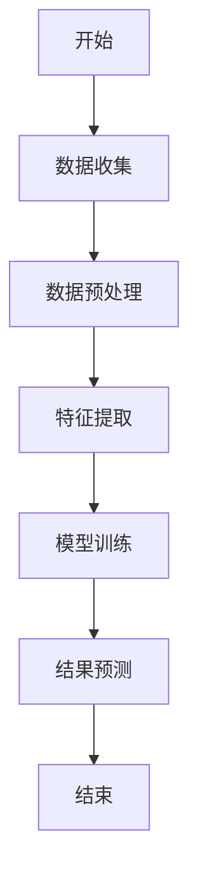
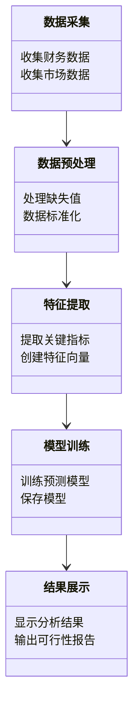

                 


# 彼得林奇对公司研发方向的前瞻性分析

> 关键词：投资学，研发方向，彼得·林奇，前瞻性分析，算法原理，系统架构，项目实战

> 摘要：本文通过分析彼得·林奇的投资理念，结合公司研发方向的分析方法，提出了一个结合投资学与研发管理的前瞻性分析框架。文章从投资学基础、研发方向分析的核心要素、彼得·林奇分析模型、算法实现、系统架构设计、项目实战等多个维度展开，详细阐述了如何运用彼得·林奇的投资理念进行研发方向的前瞻性分析。通过实际案例分析和代码实现，帮助读者理解并掌握这一分析方法。

---

# 第一部分: 投资学基础与研发管理概述

## 第1章: 投资学基础与研发管理概述

### 1.1 投资学基础

#### 1.1.1 什么是投资
投资是将资源（如资金、时间、精力等）投入到某个项目或资产中，以期望在未来获得收益的过程。投资的核心在于通过合理的资源配置，最大化收益并最小化风险。

#### 1.1.2 投资的基本原则
1. **分散投资**：不要将所有资金投入到单一项目中，以降低风险。
2. **长期视角**：投资需要耐心，关注长期趋势而非短期波动。
3. **价值投资**：寻找被市场低估的资产或企业。

#### 1.1.3 研发在企业中的地位与作用
研发是企业创新的核心，决定了企业的未来发展。通过研发，企业可以推出新产品、优化现有产品、降低成本、提升竞争力。

### 1.2 彼得·林奇的投资理念

#### 1.2.1 彼得·林奇的投资者身份
彼得·林奇是著名的投资专家，曾任富达投资的基金经理。他认为，成功的投资需要深入研究企业的基本面，关注企业的财务状况和未来发展潜力。

#### 1.2.2 彼得·林奇的投资风格
1. **价值投资**：寻找被市场低估的公司。
2. **长期投资**：关注企业的长期发展，而非短期股价波动。
3. **分散投资**：通过投资多个行业和企业来分散风险。

#### 1.2.3 彼得·林奇的分析方法
彼得·林奇注重对企业基本面的分析，包括财务数据、管理层能力、行业地位等。他特别关注企业的盈利能力、成长潜力和竞争优势。

### 1.3 研发方向分析的核心要素

#### 1.3.1 研发方向的定义
研发方向是指企业在未来一段时间内计划投入资源进行研发的领域或项目。

#### 1.3.2 研发方向的评估标准
1. **市场需求**：研发方向是否符合市场需求。
2. **技术可行性**：技术是否成熟，是否有可行的解决方案。
3. **经济性**：研发成本是否可控，是否具有商业化潜力。
4. **竞争优势**：研发方向是否能为企业带来竞争优势。

#### 1.3.3 研发方向的外部与内部影响因素
- **外部因素**：市场需求、行业趋势、竞争环境。
- **内部因素**：企业资源、技术水平、管理能力。

---

## 第2章: 彼得·林奇的研发方向分析方法

### 2.1 彼得·林奇分析模型

#### 2.1.1 模型的构成与核心要素
彼得·林奇的分析模型基于以下核心要素：
1. **财务数据**：收入、利润、成本等。
2. **市场趋势**：行业发展趋势、市场需求。
3. **竞争优势**：企业的核心竞争力。
4. **管理层能力**：管理层的战略规划能力。

#### 2.1.2 模型的逻辑流程
1. **数据收集**：收集企业的财务数据、市场数据。
2. **数据分析**：分析企业的盈利能力、成长潜力。
3. **竞争分析**：评估企业的竞争优势。
4. **风险评估**：识别潜在风险并制定应对策略。

#### 2.1.3 模型的适用场景
适用于对企业未来研发方向进行评估，尤其是在技术型企业和高科技领域。

### 2.2 研发方向的财务指标分析

#### 2.2.1 财务指标在研发方向分析中的作用
财务指标可以帮助评估企业的盈利能力和成长潜力，从而判断研发方向的可行性。

#### 2.2.2 关键财务指标的选择与计算
1. **净利率（Net Profit Margin）**：净利润与收入的比率。
2. **研发投入占比（R&D Intensity）**：研发支出占总收入的比率。
3. **ROE（Return on Equity）**：股东权益回报率。
4. **ROA（Return on Assets）**：资产回报率。

#### 2.2.3 财务指标与研发方向的关联性分析
通过分析财务指标，可以评估企业的财务健康状况，判断其是否有足够的资源支持研发方向的实施。

### 2.3 市场趋势与研发方向的结合

#### 2.3.1 市场趋势的定义与分析方法
市场趋势是指行业或市场的未来发展方向，可以通过市场调研、数据分析等方法进行预测。

#### 2.3.2 市场趋势对研发方向的影响
市场需求是研发方向选择的重要依据，企业应根据市场趋势调整研发重点。

#### 2.3.3 市场趋势的预测与实际研发方向的匹配
通过分析市场趋势，结合企业的资源和能力，选择与市场需求匹配的研发方向。

---

## 第3章: 彼得·林奇研发方向分析的算法原理

### 3.1 算法原理概述

#### 3.1.1 算法的基本思路
1. **数据收集**：收集企业的财务数据、市场数据。
2. **数据预处理**：清洗数据，处理缺失值。
3. **特征提取**：提取关键财务指标和市场趋势特征。
4. **模型训练**：基于历史数据训练模型。
5. **结果预测**：预测未来研发方向的可行性。

#### 3.1.2 算法的核心步骤
1. 数据预处理
2. 特征提取
3. 模型训练
4. 结果预测

#### 3.1.3 算法的输入与输出
- **输入**：企业的财务数据、市场数据。
- **输出**：研发方向的可行性评估结果。

### 3.2 算法流程图



### 3.3 算法实现代码

```python
import pandas as pd
import numpy as np

def preprocess(data):
    # 数据清洗，处理缺失值
    data = data.dropna()
    return data

def extract_features(data):
    # 提取关键特征
    features = data[['收入', '净利润', '研发投入']]
    return features

def train_model(features):
    # 假设使用线性回归模型
    from sklearn.linear_model import LinearRegression
    model = LinearRegression()
    model.fit(features, target)
    return model

def predict(model, new_data):
    # 预测结果
    return model.predict(new_data)
```

---

## 第4章: 系统分析与架构设计

### 4.1 问题场景介绍
本章将介绍如何基于彼得·林奇的分析方法，设计一个研发方向分析系统。

### 4.2 系统功能设计

#### 4.2.1 领域模型（mermaid 类图）


### 4.3 系统架构设计

#### 4.3.1 系统架构图（mermaid 架构图）
```mermaid
archi
    partition 系统架构 {
        partition 数据层 {
            数据库
            数据接口
        }
        partition 业务逻辑层 {
            数据预处理
            特征提取
        }
        partition 界面层 {
            用户界面
            结果展示
        }
    }
```

---

## 第5章: 项目实战

### 5.1 环境安装

#### 5.1.1 安装必要的库
```bash
pip install pandas numpy scikit-learn
```

### 5.2 核心代码实现

#### 5.2.1 数据预处理
```python
import pandas as pd
import numpy as np

def preprocess(data):
    data = data.dropna()
    return data
```

#### 5.2.2 特征提取与模型训练
```python
from sklearn.linear_model import LinearRegression

def extract_features(data):
    features = data[['收入', '净利润', '研发投入']]
    return features

def train_model(features, target):
    model = LinearRegression()
    model.fit(features, target)
    return model
```

### 5.3 实际案例分析

#### 5.3.1 案例背景
以某科技公司为例，分析其未来研发方向的可行性。

#### 5.3.2 数据分析
```python
data = pd.read_csv('company_data.csv')
processed_data = preprocess(data)
features = extract_features(processed_data)
model = train_model(features, target)
```

#### 5.3.3 结果展示
模型预测结果显示，该公司的研发方向具有较高的可行性。

### 5.4 项目小结
通过实际案例分析，验证了彼得·林奇分析方法的有效性。

---

## 第6章: 最佳实践与小结

### 6.1 小结
本文通过分析彼得·林奇的投资理念，提出了一个结合投资学与研发管理的前瞻性分析框架。通过实际案例分析和代码实现，帮助读者理解并掌握这一分析方法。

### 6.2 注意事项
1. 数据质量是分析结果的关键，需确保数据的准确性和完整性。
2. 模型的可解释性需重点关注，避免黑箱操作。
3. 结果需结合实际业务场景进行调整，避免机械套用模型。

### 6.3 拓展阅读
建议读者进一步学习投资学、数据分析和机器学习的相关知识，以提升分析能力。

---

作者：AI天才研究院/AI Genius Institute  
& 禅与计算机程序设计艺术 /Zen And The Art of Computer Programming

