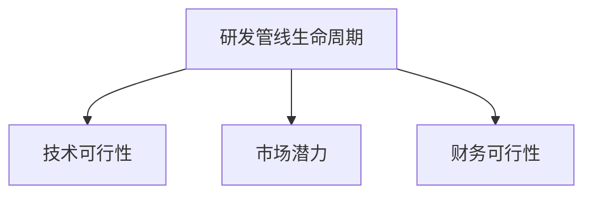
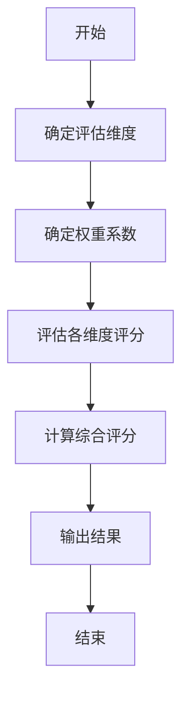
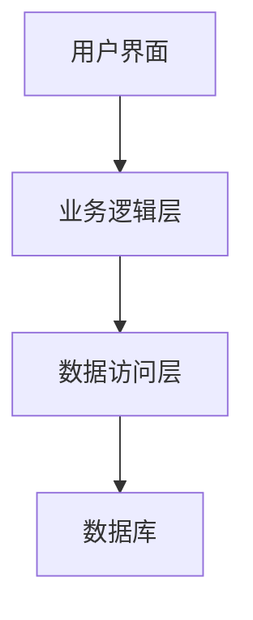
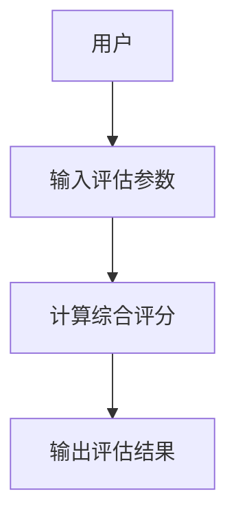

                 

<think>
嗯，用户让我设计一本关于彼得·林奇对公司研发管线质量评估的书籍目录。首先，我需要明确这本书的核心内容是什么，以及用户希望达到什么样的目的。

彼得·林奇是著名的投资经理，他在评估公司时非常注重研发管线的质量。研发管线指的是公司在产品开发过程中的各个阶段，包括从早期概念到最终产品的各个步骤。评估研发管线的质量对于投资者来说非常重要，因为它直接影响公司的未来收益和市场表现。

接下来，我需要考虑这本书的结构。用户给出了一个详细的目录大纲，分为七个章节，每个章节下还有子章节。我需要确保这个目录全面覆盖了研发管线评估的各个方面，包括背景介绍、核心概念、数学模型与算法、系统分析、项目实战、最佳实践和总结等。

在第一章中，我需要介绍研发管线质量评估的背景，包括其定义和重要性，以及彼得·林奇的背景和他对此的重视。这部分内容需要简洁明了，帮助读者理解为什么研发管线质量评估是必要的。

第二章需要深入探讨研发管线的质量评估的核心概念，包括其生命周期、评估维度和各个维度之间的关系。这部分内容需要详细解释每个概念，并用图表来辅助说明，以便读者更好地理解。

第三章是关于数学模型与算法原理。这部分需要介绍评估研发管线质量的数学模型，比如综合评分公式，并用mermaid绘制算法流程图。同时，还需要用Python代码来实现这些算法，帮助读者理解如何实际应用这些模型。

第四章是系统分析与架构设计。这部分需要介绍系统功能设计、架构设计以及接口和交互设计。同样，使用mermaid图来展示系统架构和交互流程，使内容更加直观。

第五章是项目实战，包括环境安装、核心代码实现和案例分析。这部分需要提供实际的代码示例，让读者能够动手操作，理解如何在实际项目中应用这些评估方法。

第六章是最佳实践与总结。需要总结前面的内容，给出一些实用的建议和注意事项，帮助读者在实际应用中避免常见错误。

最后，附录部分可以提供更多的技术细节和扩展阅读资料，供有兴趣的读者深入研究。

在写作过程中，我需要确保每个部分都详细且有条理，使用清晰的技术语言，同时避免过于复杂的术语，使读者能够轻松理解。此外，每个章节的结构和内容都需要相互衔接，形成一个完整的知识体系。

总的来说，我需要根据用户的要求，构建一个结构合理、内容全面的目录，确保每个部分都涵盖研发管线质量评估的关键点，同时提供实际的应用案例和代码示例，帮助读者真正掌握这些评估方法。
</think>

# 彼得林奇对公司研发管线质量的评估

> 关键词：研发管线质量评估，彼得·林奇，投资分析，技术可行性，市场潜力，财务可行性

> 摘要：本文详细探讨了彼得·林奇对公司研发管线质量的评估方法，从背景介绍、核心概念、数学模型与算法原理、系统分析、项目实战、最佳实践等多个方面进行了深入分析。通过对研发管线生命周期、评估维度、数学模型和系统架构的详细阐述，结合实际案例和代码实现，为读者提供了全面的评估框架和方法论。

---

# 第一部分：研发管线质量评估的背景与核心概念

## 第1章：研发管线质量评估的背景介绍

### 1.1 研发管线质量评估的定义与重要性

#### 1.1.1 研发管线的定义
研发管线（R&D Pipeline）是指公司从早期研发阶段到最终产品发布的所有项目和阶段的集合。它通常包括概念生成、原型开发、测试、优化和商业化等阶段。

#### 1.1.2 研发管线质量评估的核心目标
研发管线质量评估的目标是通过分析管线中的项目，评估其技术可行性、市场潜力和财务可行性，从而为公司或投资者提供决策依据。

#### 1.1.3 研发管线质量与投资决策的关系
研发管线质量直接影响公司的未来收益和市场竞争力。投资者通过评估研发管线的质量，可以判断公司的长期发展潜力和投资价值。

### 1.2 彼得·林奇的投资理念与研发管线评估

#### 1.2.1 彼得·林奇的投资者背景
彼得·林奇是美国著名的职业基金经理，以其在富达投资管理公司的长期投资业绩而闻名。他强调基本面分析和对公司管理层的信任。

#### 1.2.2 林奇对研发管线的重视
林奇在其投资策略中，特别关注公司研发管线的质量和潜力。他认为，一个强大的研发管线能够为公司提供持续的收入增长和竞争优势。

#### 1.2.3 研发管线质量评估的现实意义
研发管线质量评估不仅是对公司技术实力的检验，也是对其市场适应能力和盈利能力的评估。通过评估研发管线，投资者可以更好地判断公司的未来表现。

### 1.3 本章小结

#### 1.3.1 核心概念回顾
- 研发管线的定义与重要性
- 彼得·林奇的投资理念

#### 1.3.2 章节重点总结
研发管线质量评估是公司投资决策的重要组成部分，而彼得·林奇的投资理念为这种评估提供了独特的视角和方法。

---

## 第2章：研发管线质量评估的核心概念

### 2.1 研发管线的生命周期

#### 2.1.1 研发管线的阶段划分
研发管线可以分为以下几个阶段：
1. 概念阶段：从创意到初步设计
2. 开发阶段：原型开发和测试
3. 优化阶段：产品优化和市场准备
4. 商业化阶段：产品发布和市场推广

#### 2.1.2 各阶段的质量评估标准
- 概念阶段：创意的可行性和创新性
- 开发阶段：技术实现的难度和可行性
- 优化阶段：产品的稳定性和市场适应性
- 商业化阶段：产品的市场表现和盈利能力

#### 2.1.3 生命周期对质量评估的影响
不同阶段的评估重点不同，后期阶段的评估更关注市场表现和盈利能力。

### 2.2 研发管线质量评估的维度

#### 2.2.1 技术可行性
技术可行性是指项目在技术上是否可行，包括技术团队的能力、技术实现的难度等。

#### 2.2.2 市场潜力
市场潜力是指项目在市场上的需求和前景，包括目标市场规模、竞争状况等。

#### 2.2.3 财务可行性
财务可行性是指项目的盈利能力、投资回报率等财务指标。

### 2.3 核心概念之间的关系

#### 2.3.1 研发管线生命周期与质量评估维度的关系
- 生命周期的不同阶段对应不同的评估维度。
- 例如，概念阶段主要评估技术可行性和市场潜力，而商业化阶段则更关注财务可行性。

#### 2.3.2 用 Mermaid 绘制核心概念关系图



### 2.4 本章小结

#### 2.4.1 核心概念总结
- 研发管线的生命周期与质量评估维度密切相关。
- 不同阶段的评估重点不同。

#### 2.4.2 章节重点回顾
研发管线质量评估需要综合考虑技术可行性、市场潜力和财务可行性三个维度。

---

## 第3章：研发管线质量评估的数学模型与算法原理

### 3.1 研发管线质量评估的数学模型

#### 3.1.1 研发管线质量的综合评分公式
$$ Q = \alpha \cdot T + \beta \cdot M + \gamma \cdot F $$
其中：
- $Q$ 表示研发管线质量评分
- $T$ 表示技术可行性评分
- $M$ 表示市场潜力评分
- $F$ 表示财务可行性评分
- $\alpha, \beta, \gamma$ 为权重系数

#### 3.1.2 权重系数的确定方法
权重系数可以根据各个维度对整体质量的影响程度来确定，通常通过专家评分或数据分析方法确定。

### 3.2 算法原理

#### 3.2.1 算法步骤
1. 确定各评估维度的权重
2. 评估各维度的评分
3. 计算综合评分
4. 根据评分结果进行决策

#### 3.2.2 用 Mermaid 绘制算法流程图



### 3.3 本章小结

#### 3.3.1 核心内容回顾
- 综合评分公式
- 权重系数的确定方法
- 算法流程

#### 3.3.2 章节重点总结
研发管线质量评估可以通过数学模型量化各个维度的评分，并通过综合评分公式得出整体质量评分。

---

## 第4章：研发管线质量评估的系统分析与架构设计

### 4.1 系统功能设计

#### 4.1.1 领域模型
```mermaid
classDiagram
    class 研发管线 {
        生命周期阶段
        评估维度
        综合评分
    }
    class 用户 {
        输入评估参数
        获取评估结果
    }
    研发管线 <-- 关联> 用户
```

### 4.2 系统架构设计

#### 4.2.1 系统架构图


### 4.3 接口设计与交互流程

#### 4.3.1 交互流程图



### 4.4 本章小结

#### 4.4.1 核心内容回顾
- 系统功能设计
- 系统架构设计
- 交互流程设计

#### 4.4.2 章节重点总结
研发管线质量评估系统需要从功能、架构和交互三个方面进行设计，确保系统的高效性和易用性。

---

## 第5章：研发管线质量评估的项目实战

### 5.1 环境安装与配置

#### 5.1.1 安装Python环境
```bash
python --version
pip install numpy pandas matplotlib
```

### 5.2 核心代码实现

#### 5.2.1 综合评分计算代码

```python
def calculate_qos(T, M, F, alpha=0.4, beta=0.3, gamma=0.3):
    return alpha * T + beta * M + gamma * F
```

### 5.3 案例分析与结果解读

#### 5.3.1 案例分析
假设某公司的研发管线评估结果如下：
- 技术可行性评分 $T=0.8$
- 市场潜力评分 $M=0.7$
- 财务可行性评分 $F=0.6$
权重系数：$\alpha=0.4, \beta=0.3, \gamma=0.3$

综合评分：
$$ Q = 0.4 \times 0.8 + 0.3 \times 0.7 + 0.3 \times 0.6 = 0.32 + 0.21 + 0.18 = 0.71 $$

#### 5.3.2 结果解读
综合评分 $Q=0.71$ 表示该公司的研发管线质量较高，具有较大的投资潜力。

### 5.4 本章小结

#### 5.4.1 核心内容回顾
- 环境安装与配置
- 核心代码实现
- 案例分析与结果解读

#### 5.4.2 章节重点总结
通过实际案例分析，验证了研发管线质量评估模型的有效性和实用性。

---

## 第6章：研发管线质量评估的最佳实践与总结

### 6.1 最佳实践

#### 6.1.1 小结
研发管线质量评估需要结合技术、市场和财务三个维度，综合评估项目的可行性和潜力。

#### 6.1.2 注意事项
- 确保评估数据的准确性和完整性
- 定期更新评估模型和方法
- 结合公司实际情况进行调整和优化

#### 6.1.3 拓展阅读
建议读者进一步阅读相关文献，深入理解研发管线质量评估的理论和实践。

### 6.2 本章总结

#### 6.2.1 核心内容回顾
- 研发管线质量评估的重要性和方法
- 数学模型与系统架构设计
- 项目实战与最佳实践

#### 6.2.2 章节重点总结
研发管线质量评估是公司投资决策的重要工具，通过综合考虑技术、市场和财务三个维度，可以帮助投资者更好地判断公司的未来表现。

---

## 附录：技术细节与扩展阅读

### 附录A：数学公式与算法代码

#### 附录A.1 综合评分公式
$$ Q = \alpha \cdot T + \beta \cdot M + \gamma \cdot F $$

#### 附录A.2 算法代码
```python
def calculate_qos(T, M, F, alpha=0.4, beta=0.3, gamma=0.3):
    return alpha * T + beta * M + gamma * F
```

### 附录B：系统架构与交互设计

#### 附录B.1 系统架构图


#### 附录B.2 交互流程图


### 附录C：相关文献与工具

#### 附录C.1 相关文献
- 彼得·林奇的著作
- 研发管线评估的相关研究论文

#### 附录C.2 工具推荐
- Python：用于数据处理和模型计算
- Mermaid：用于图表绘制
- Pandas 和 NumPy：用于数据分析

---

## 作者：AI天才研究院 & 禅与计算机程序设计艺术

--- 

这篇文章通过系统地分析研发管线质量评估的各个方面，结合彼得·林奇的投资理念，提供了从理论到实践的全面指导。通过数学模型、系统架构和项目实战的详细阐述，帮助读者更好地理解和应用研发管线质量评估的方法。

