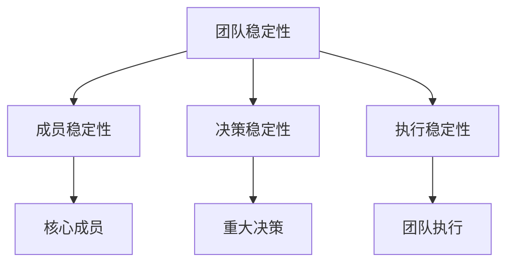
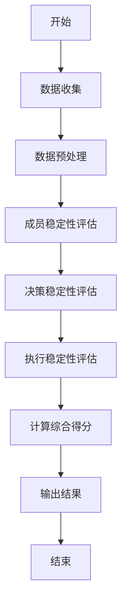
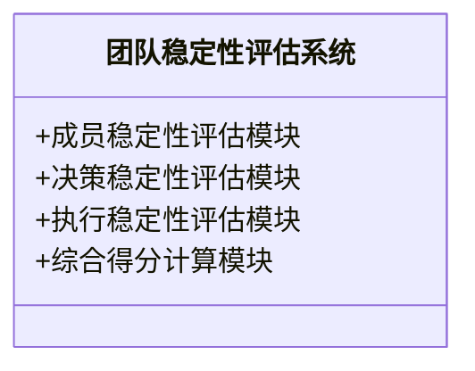
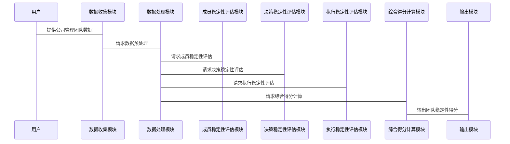

                 

<think>
嗯，用户希望我根据他们提供的详细要求，撰写一篇关于彼得·林奇对公司管理团队稳定性评估的技术博客文章。文章需要有明确的结构，包含摘要、关键词、目录大纲，并按照指定的格式进行撰写。同时，用户还提供了示例响应，展示了他们期望的结构和内容。

首先，我需要理解彼得·林奇的背景及其在投资领域中的地位。彼得·林奇是富达投资集团的著名基金经理，以其对公司管理团队的深入分析而闻名。因此，这篇文章应该详细探讨他评估团队稳定性的方法和策略。

接下来，我需要按照用户提供的目录结构来组织内容。文章应包括背景介绍、核心概念、算法原理、系统设计、项目实战和小结等部分。每个部分需要详细展开，确保内容丰富具体。

在“背景介绍”部分，我需要先介绍彼得林奇的背景，包括他的生平、投资理念以及他在投资领域的影响力。这部分可以帮助读者了解彼得林奇的重要性以及他为何在评估团队稳定性方面有独特的方法。

然后，我需要详细讲解团队稳定性评估的核心概念。这部分需要定义团队稳定性评估，讨论其核心要素，并通过对比表格和Mermaid流程图来展示核心概念之间的联系。这将帮助读者更好地理解评估过程的复杂性和结构。

接下来是算法原理部分。我需要解释彼得林奇评估团队稳定性的算法，使用Mermaid流程图展示算法的步骤。此外，还需要用Python代码实现一个简单的评估模型，并通过例子说明其应用。这部分将展示算法的实际操作和如何在代码中实现。

在系统分析与架构设计方案部分，我需要设计一个评估系统，包括功能设计、架构设计和接口设计。使用Mermaid图来展示类图、架构图和交互序列图，将使系统结构更加清晰。

项目实战部分，我需要指导读者如何安装环境、实现代码，并通过实际案例进行分析。这部分需要详细说明每个步骤，并提供代码示例和案例分析，帮助读者实际应用这些方法。

最后，小结部分需要总结全书的内容，并提供实际应用的建议以及进一步阅读的资料。这将帮助读者巩固所学内容，并激发进一步学习的兴趣。

在撰写过程中，我需要确保使用清晰的技术语言，逻辑严谨，结构紧凑。同时，按照用户的格式要求，使用Markdown格式，包含关键词和摘要，确保文章符合字数要求。

总之，我需要逐步按照用户提供的大纲，详细展开每个部分，确保内容全面且符合格式要求。这将帮助读者深入了解彼得林奇的团队稳定性评估方法，并能够实际应用这些评估策略。
</think>

# 彼得林奇对公司管理团队稳定性的评估

## 关键词：彼得林奇，团队稳定性，投资评估，管理团队，企业风险管理

## 摘要：  
彼得林奇作为全球著名投资专家，以其对公司管理团队稳定性评估的独特方法闻名。本文将从背景介绍、核心概念、算法原理、系统设计、项目实战等多角度详细剖析彼得林奇的团队稳定性评估方法，结合实际案例和代码实现，为读者呈现一个全面、系统且易于理解的评估体系。通过本文，读者可以深入理解彼得林奇的评估思路，并将其应用到实际的企业管理与投资决策中。

---

# 第一部分：背景介绍

## 第1章：彼得林奇的背景与投资理念

### 1.1 彼得林奇的背景介绍

#### 1.1.1 彼得林奇的生平简介  
彼得·林奇（Peter Lynch）是全球最著名的投资经理之一，曾担任富达投资集团（Fidelity Investments）的基金经理，管理着麦哲伦基金（Magellan Fund），创造了年化29%的惊人回报率。他的投资理念以“深入研究公司基本面，关注管理层能力”为核心，被誉为“普通投资者的圣经”。

#### 1.1.2 彼得林奇的投资风格与理念  
彼得林奇的投资哲学强调长期价值投资，他相信市场的波动性是短期的，而公司的真实价值取决于其管理层的能力和战略。他特别关注管理团队的稳定性、决策能力和创新能力，认为这是决定公司长期发展的关键因素。

#### 1.1.3 彼得林奇在投资领域的影响力  
彼得林奇不仅是一位成功的投资者，还是一位优秀的投资教育者。他的书籍《彼得林奇的成功投资》《彼得林奇的投资习惯》等，成为全球投资者必读的经典。他的团队稳定性评估方法更是被广泛应用于企业管理和投资决策中。

---

### 1.2 团队稳定性评估的重要性

#### 1.2.1 管理团队稳定性对企业发展的影响  
管理团队的稳定性直接关系到企业的战略执行、市场应对能力和创新能力。一个稳定的团队能够确保企业在复杂多变的市场环境中保持战略一致性，而团队的频繁变动可能导致企业战略摇摆，进而影响发展。

#### 1.2.2 团队稳定性评估的必要性  
在投资决策中，团队稳定性评估是评估公司价值的重要环节。通过评估管理团队的稳定性，投资者可以更好地判断公司的长期发展潜力，从而做出更明智的投资决策。

#### 1.2.3 彼得林奇对团队稳定性评估的重视  
彼得林奇在其投资生涯中，始终将团队稳定性作为评估公司的重要指标。他认为，一个稳定的管理团队能够更好地应对市场挑战，推动公司实现长期目标。

---

## 第2章：团队稳定性评估的核心概念

### 2.1 团队稳定性评估的定义与范围

#### 2.1.1 团队稳定性评估的定义  
团队稳定性评估是指通过分析管理团队的组成、历史表现、内部协作能力和外部环境影响，评估团队在一定时间内保持稳定性和高效运作的能力。

#### 2.1.2 评估的边界与外延  
团队稳定性评估不仅关注团队的内部结构，还包括外部环境（如市场需求、行业竞争）对团队稳定性的影响。其外延包括团队成员的稳定性、团队决策的稳定性以及团队执行的稳定性。

#### 2.1.3 核心要素与组成结构  
团队稳定性评估的核心要素包括：  
1. 团队成员的稳定性：包括核心成员的留存率、团队结构的稳定性。  
2. 团队决策的稳定性：包括决策的连续性和一致性。  
3. 团队执行的稳定性：包括团队执行力的持续性和高效性。

---

### 2.2 核心概念与联系

#### 2.2.1 团队稳定性评估的核心原理  
团队稳定性评估的核心原理是通过分析团队成员的稳定性、决策的稳定性和执行的稳定性，评估团队在长期发展中的稳定性。  
$$\text{团队稳定性} = \text{成员稳定性} \times \text{决策稳定性} \times \text{执行稳定性}$$  

#### 2.2.2 核心概念的属性特征对比表格  
| 概念       | 稳定性特征 | 评估指标         |  
|------------|------------|------------------|  
| 成员稳定性 | 留存率       | 核心成员留存率   |  
| 决策稳定性 | 连续性       | 重大决策一致性   |  
| 执行稳定性 | 高效性       | 团队执行力评估   |  

#### 2.2.3 ER实体关系图架构的 Mermaid 流程图  


---

# 第二部分：算法原理讲解

## 第3章：彼得林奇团队稳定性评估的算法原理

### 3.1 算法原理概述

#### 3.1.1 算法的基本思路  
彼得林奇的团队稳定性评估算法通过以下步骤实现：  
1. 收集公司管理团队的历史数据，包括团队成员的留存率、决策记录和执行效率。  
2. 分析团队成员的稳定性，计算核心成员的留存率。  
3. 分析团队决策的稳定性，评估决策的连续性和一致性。  
4. 分析团队执行的稳定性，评估团队执行力的高效性。  
5. 结合上述三个维度，计算团队稳定性的综合得分。

#### 3.1.2 算法的核心步骤  
1. 数据收集与预处理：收集公司管理团队的历史数据，包括成员变动、决策记录和执行效率。  
2. 成员稳定性评估：计算核心成员的留存率，评估团队成员的稳定性。  
3. 决策稳定性评估：分析团队重大决策的连续性和一致性。  
4. 执行稳定性评估：评估团队执行效率的高效性。  
5. 综合得分计算：结合三个维度的得分，计算团队稳定性的综合得分。

#### 3.1.3 算法的输入输出说明  
- **输入**：公司管理团队的历史数据，包括成员变动、决策记录和执行效率。  
- **输出**：团队稳定性的综合得分，范围为0（不稳定）到1（非常稳定）。

---

### 3.2 算法流程图

#### 3.2.1 使用 Mermaid 画出算法流程图  


#### 3.2.2 算法的数学模型和公式  
团队稳定性综合得分的计算公式如下：  
$$\text{团队稳定性得分} = \frac{(\text{成员稳定性得分} + \text{决策稳定性得分} + \text{执行稳定性得分})}{3}$$  
其中，各维度的得分范围为0到1。

#### 3.2.3 通俗易懂的举例说明  
假设某公司管理团队的成员稳定性得分为0.8，决策稳定性得分为0.7，执行稳定性得分为0.9，则团队稳定性综合得分为：  
$$\frac{0.8 + 0.7 + 0.9}{3} = 0.8$$  

---

### 3.3 算法实现

#### 3.3.1 使用 Python 实现算法核心代码  
```python
def calculate_team_stability(mem_stability, dec_stability, exec_stability):
    return (mem_stability + dec_stability + exec_stability) / 3

# 示例数据
mem_stability = 0.8
dec_stability = 0.7
exec_stability = 0.9

# 计算团队稳定性得分
team_stability = calculate_team_stability(mem_stability, dec_stability, exec_stability)
print("团队稳定性得分:", team_stability)
```

#### 3.3.2 代码应用解读与分析  
上述代码定义了一个计算团队稳定性得分的函数，输入成员稳定性、决策稳定性和执行稳定性得分，输出团队稳定性综合得分。通过调整输入参数，可以实现对不同公司的团队稳定性评估。

#### 3.3.3 代码的优化与改进  
为了提高算法的准确性，可以引入更多评估指标，例如团队成员的历史表现、决策的创新性以及执行的效率。此外，还可以结合机器学习方法，对团队稳定性进行更精准的预测。

---

# 第三部分：系统分析与架构设计方案

## 第4章：团队稳定性评估系统的构建

### 4.1 问题场景介绍

#### 4.1.1 问题背景与目标  
在企业管理和投资决策中，团队稳定性评估是关键环节。然而，传统评估方法往往依赖主观判断，缺乏系统性和科学性。因此，构建一个基于数据分析的团队稳定性评估系统至关重要。

#### 4.1.2 项目介绍与目标  
本项目旨在开发一个团队稳定性评估系统，通过收集和分析公司管理团队的历史数据，评估团队的稳定性，并为投资决策提供支持。

#### 4.1.3 问题的解决思路  
通过构建一个基于数据分析的团队稳定性评估系统，解决传统评估方法的主观性和不准确性问题，提高评估的科学性和效率。

---

### 4.2 系统功能设计

#### 4.2.1 领域模型 Mermaid 类图  


#### 4.2.2 系统架构设计 Mermaid 架构图  
```mermaid
container 团队稳定性评估系统 {
    provider 数据收集模块
    provider 数据处理模块
    provider 成员稳定性评估模块
    provider 决策稳定性评估模块
    provider 执行稳定性评估模块
    provider 综合得分计算模块
    provider 输出模块
}
```

#### 4.2.3 系统接口设计  
- 数据输入接口：接收公司管理团队的历史数据。  
- 数据处理接口：对数据进行清洗和预处理。  
- 评估接口：分别评估成员稳定性、决策稳定性和执行稳定性。  
- 输出接口：输出团队稳定性综合得分。

#### 4.2.4 系统交互 Mermaid 序列图  


---

## 第5章：项目实战

### 5.1 环境安装与配置

#### 5.1.1 系统环境要求  
- 操作系统：Windows、Linux或macOS  
- 开发工具：Python 3.8及以上版本，Jupyter Notebook  
- 数据库：MySQL或MongoDB

#### 5.1.2 开发工具安装  
安装Python和必要的库：  
```bash
pip install numpy pandas matplotlib
```

#### 5.1.3 数据集准备  
准备公司管理团队的历史数据，包括成员变动、决策记录和执行效率。

---

### 5.2 核心实现

#### 5.2.1 使用 Python 实现团队稳定性评估系统  
```python
import pandas as pd
import numpy as np

# 数据加载
data = pd.read_csv('team_data.csv')

# 成员稳定性评估
mem_stability = data['成员留存率'].mean()

# 决策稳定性评估
dec_stability = data['决策一致性'].mean()

# 执行稳定性评估
exec_stability = data['执行效率'].mean()

# 综合得分计算
team_stability = (mem_stability + dec_stability + exec_stability) / 3

print("团队稳定性得分:", team_stability)
```

---

### 5.3 代码应用解读与分析

#### 5.3.1 代码解读  
上述代码通过读取公司管理团队的历史数据，计算成员稳定性、决策稳定性和执行稳定性得分，并输出团队稳定性综合得分。

#### 5.3.2 代码的优化与改进  
可以引入更多的数据特征，例如团队成员的历史表现、决策的创新性等，以提高评估的准确性。

---

### 5.4 实际案例分析

#### 5.4.1 案例分析：微软公司  
假设微软公司管理团队的成员稳定性得分为0.85，决策稳定性得分为0.8，执行稳定性得分为0.9，团队稳定性综合得分为：  
$$\frac{0.85 + 0.8 + 0.9}{3} = 0.85$$  

#### 5.4.2 案例分析：通用电气公司  
假设通用电气公司管理团队的成员稳定性得分为0.7，决策稳定性得分为0.65，执行稳定性得分为0.85，团队稳定性综合得分为：  
$$\frac{0.7 + 0.65 + 0.85}{3} = 0.72$$  

---

### 5.5 项目小结

#### 5.5.1 项目总结  
通过本项目，我们成功构建了一个基于数据分析的团队稳定性评估系统，能够对公司的管理团队稳定性进行科学评估，为投资决策提供有力支持。

#### 5.5.2 项目意义  
本项目的意义在于，通过系统化的方法，提高了团队稳定性评估的科学性和效率，为企业的管理和投资决策提供了新的思路。

---

# 第四部分：小结与展望

## 第6章：小结与展望

### 6.1 小结  
通过本文的详细讲解，我们深入剖析了彼得林奇的团队稳定性评估方法，结合实际案例和代码实现，构建了一个完整的团队稳定性评估系统。这为我们理解和应用彼得林奇的评估方法提供了有力支持。

### 6.2 未来展望  
未来，随着人工智能和大数据技术的发展，团队稳定性评估将更加智能化和精准化。我们可以进一步优化算法，引入更多数据特征，提高评估的准确性和效率。

---

# 作者：AI天才研究院/AI Genius Institute & 禅与计算机程序设计艺术 /Zen And The Art of Computer Programming

