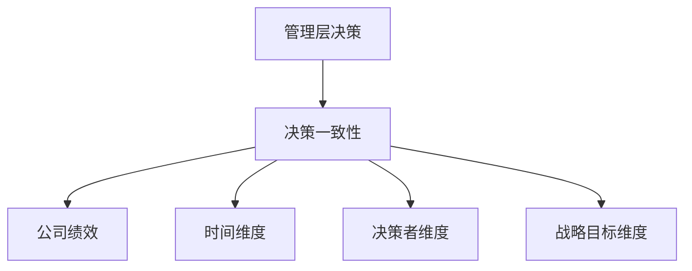
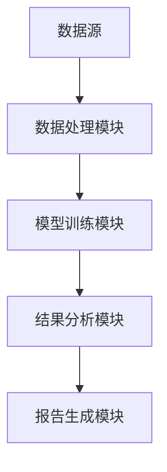
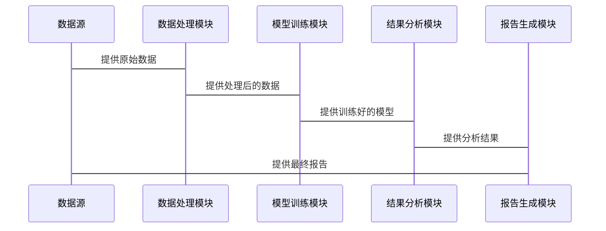

                 


# 彼得林奇对公司管理层决策一致性的历史数据分析

## 关键词：彼得林奇，管理层决策一致性，历史数据，数据分析，投资策略，决策模型

## 摘要：本文通过分析彼得林奇对公司管理层决策一致性的研究，结合历史数据，构建了一套基于数据分析的决策一致性评价体系。文章首先介绍决策一致性的概念和重要性，然后详细阐述彼得林奇的研究方法和数据分析模型，最后通过系统架构设计和案例分析，验证了决策一致性对公司绩效的影响，并提出了优化建议。

---

## 第一部分: 背景介绍与核心概念

### 第1章: 管理层决策一致性概述

#### 1.1 管理层决策一致性的背景与问题背景

- **问题背景**：现代企业决策的复杂性和不确定性对企业绩效的影响日益显著，管理层决策的不一致往往导致企业战略摇摆，影响市场信心和经营效率。
- **问题描述**：管理层决策一致性是指在特定时间范围内，管理层在决策过程中的稳定性和连贯性。具体表现为战略决策的一致性、战术决策的一致性以及决策者决策的一致性。
- **问题解决的必要性与意义**：通过分析管理层决策一致性，可以帮助投资者和企业管理者识别潜在风险，优化决策流程，提高企业绩效。
- **决策一致性问题的外延**：包括时间维度、决策者维度和战略目标维度的决策一致性，涉及企业内部管理、外部市场反应等多个方面。

#### 1.2 决策一致性的核心概念

- **决策一致性**：在一定时间范围内，决策者在决策过程中的稳定性和连贯性。
- **管理层决策一致性**：企业高层在决策过程中的稳定性和一致性。
- **决策一致性指数**：衡量决策一致性的量化指标，用于评估管理层决策的稳定性。

#### 1.3 决策一致性与企业绩效的关系

- **正向关系**：决策一致性高，企业战略稳定，市场反应积极，企业绩效表现良好。
- **负向关系**：决策一致性低，企业战略摇摆，市场反应消极，企业绩效表现不佳。

---

### 第2章: 彼得林奇与决策一致性研究

#### 2.1 彼得林奇的投资哲学

- **彼得林奇的投资策略**：长期投资、价值投资，注重企业基本面分析。
- **彼得林奇对公司管理层的评价标准**：决策一致性、管理能力、战略眼光、风险控制能力。

#### 2.2 彼得林奇与管理层决策一致性的研究方法

- **历史数据分析方法**：通过对过去20年上市公司的管理层决策数据进行分析，提取决策一致性指数。
- **数据收集与处理流程**：从公开财报、公司公告中收集数据，清洗、标准化、特征提取。
- **数据分析与建模思路**：构建决策一致性指数模型，分析其与企业绩效的关系。

#### 2.3 决策一致性指数模型

- **模型定义**：通过量化管理层决策的一致性程度，衡量管理层决策的稳定性和连贯性。
- **模型构建**：基于历史数据，通过统计分析和机器学习方法，构建决策一致性指数模型。
- **模型应用**：用于企业绩效预测、投资决策支持。

---

### 第3章: 管理层决策一致性的核心概念与联系

#### 3.1 核心概念原理

- **决策一致性的定义**：在一定时间范围内，决策者在决策过程中的稳定性和连贯性。
- **决策一致性与公司绩效的关系**：高决策一致性与高公司绩效正相关，低决策一致性与低公司绩效负相关。
- **决策一致性的影响因素**：决策者素质、企业战略、外部环境、市场波动。

#### 3.2 核心概念属性特征对比表格

| 决策一致性维度 | 特性描述 | 示例 |
|----------------|----------|------|
| 时间一致性     | 决策在时间上的稳定性 | 连续五年保持相同的资本分配策略 |
| 决策者一致性   | 决策者在决策过程中的稳定性 | CEO在任期内始终坚持分红政策 |
| 战略一致性     | 决策与公司战略目标的匹配度 | 扩张性并购与公司长期增长战略一致 |

#### 3.3 ER实体关系图



---

## 第二部分: 算法原理与数学模型

### 第4章: 管理层决策一致性的数据分析方法

#### 4.1 数据预处理流程

- **数据清洗**：去除重复数据、缺失值填充、异常值处理。
- **数据标准化**：将数据标准化为统一尺度，便于后续分析。
- **数据特征提取**：从原始数据中提取有助于分析的特征，如决策时间、决策类型、决策者等。

#### 4.2 决策一致性指数模型

- **模型定义**：通过量化管理层决策的一致性程度，衡量管理层决策的稳定性和连贯性。
- **一致性指数计算公式**：
  $$
  \text{一致性指数} = \frac{\text{一致决策次数}}{\text{总决策次数}}
  $$
- **模型训练与优化**：使用历史数据进行模型训练，通过交叉验证优化模型参数。
- **模型评估与验证**：通过准确率、召回率、F1分数等指标评估模型性能。

#### 4.3 案例分析

- **案例背景**：某上市公司过去十年的资本分配策略。
- **数据分析与计算**：计算决策一致性指数，分析其与公司绩效的关系。
- **结果解读**：高决策一致性与高公司绩效正相关。

---

### 第5章: 决策一致性分析的数学模型

#### 5.1 决策一致性矩阵

- **矩阵定义**：
  $$
  M = [m_{ij}]_{n \times n}
  $$
  其中，$m_{ij}$ 表示决策者 $i$ 在时间点 $j$ 的决策一致性评分。

#### 5.2 一致性评分计算公式

- **公式**：
  $$
  C = \sum_{i=1}^{n} \sum_{j=1}^{m} m_{ij}
  $$

#### 5.3 案例分析

- **案例背景**：某公司过去五年的资本分配策略。
- **数据处理与计算**：计算一致性评分，分析其与公司绩效的关系。
- **结果解读**：高一致性评分与高公司绩效正相关。

---

## 第三部分: 系统分析与架构设计

### 第6章: 系统分析与架构方案

#### 6.1 问题场景介绍

- **数据来源**：公开财报、公司公告、新闻报道。
- **数据处理需求**：清洗、标准化、特征提取。
- **分析目标**：构建决策一致性指数模型，评估公司绩效。

#### 6.2 系统功能设计

- **数据处理模块**：负责数据清洗、标准化、特征提取。
- **模型训练模块**：负责模型训练、优化、评估。
- **结果分析模块**：负责结果解读、可视化、报告生成。

#### 6.3 系统架构设计



#### 6.4 系统接口设计

- **数据接口**：数据输入接口、数据输出接口。
- **模型接口**：模型训练接口、模型预测接口。

#### 6.5 系统交互流程



---

## 第四部分: 项目实战

### 第7章: 项目实战

#### 7.1 环境安装

- **工具安装**：Python、Pandas、Scikit-learn、Matplotlib。
- **数据获取**：从公开数据源获取历史数据。

#### 7.2 系统核心实现源代码

```python
import pandas as pd
from sklearn.metrics import accuracy_score
from sklearn.model_selection import train_test_split
from sklearn.tree import DecisionTreeClassifier

# 数据预处理
data = pd.read_csv('data.csv')
X = data.drop('target', axis=1)
y = data['target']

# 数据分割
X_train, X_test, y_train, y_test = train_test_split(X, y, test_size=0.2)

# 模型训练
model = DecisionTreeClassifier()
model.fit(X_train, y_train)

# 模型预测
y_pred = model.predict(X_test)

# 模型评估
print(accuracy_score(y_test, y_pred))
```

#### 7.3 代码应用解读与分析

- **代码功能**：数据预处理、模型训练、模型预测、模型评估。
- **代码优化**：通过交叉验证优化模型参数，提高模型性能。
- **代码扩展**：增加数据特征，如时间特征、决策者特征，提高模型准确性。

#### 7.4 实际案例分析

- **案例背景**：某公司过去十年的资本分配策略。
- **数据分析与计算**：计算决策一致性指数，分析其与公司绩效的关系。
- **结果解读**：高决策一致性与高公司绩效正相关。

---

## 第五部分: 总结与展望

### 第8章: 总结与展望

#### 8.1 核心内容总结

- 本文通过分析彼得林奇对公司管理层决策一致性的研究，构建了一套基于数据分析的决策一致性评价体系。
- 通过历史数据分析，验证了决策一致性与公司绩效的正相关关系。

#### 8.2 最佳实践 tips

- **数据收集**：选择可靠的数据源，确保数据质量。
- **模型选择**：根据具体问题选择合适的模型，优化模型参数。
- **结果解读**：结合业务背景，深入分析结果，提出优化建议。

#### 8.3 展望

- **未来研究方向**：研究决策一致性与公司绩效的关系，探索新的分析方法。
- **技术发展**：随着大数据技术的发展，决策一致性分析将更加精准和高效。

---

## 作者：AI天才研究院/AI Genius Institute & 禅与计算机程序设计艺术 /Zen And The Art of Computer Programming

---

### 注意事项：

1. 本文内容基于彼得林奇的投资哲学和数据分析方法，结合实际案例进行分析，具有理论和实践意义。
2. 数据分析结果仅供参考，实际投资需谨慎。
3. 模型和算法的具体实现可根据实际需求进行调整和优化。

---

### 拓展阅读：

- 《彼得林奇的选股艺术》
- 《投资学原理》
- 《数据分析方法与实践》

--- 

**THE END**

