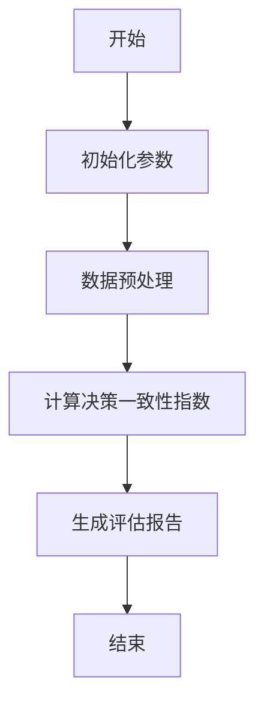

                 


# 彼得林奇对公司管理层决策一致性的评估

> 关键词：决策一致性、投资评估、管理层决策、彼得林奇、一致性评估

> 摘要：本文基于彼得林奇的投资理论，深入探讨了公司管理层决策一致性的评估方法，分析了决策一致性对投资价值的影响，并提出了系统的评估模型和实际案例分析。

---

## 第一部分：背景介绍

### 第1章：决策一致性概述

#### 1.1 什么是决策一致性

- **1.1.1 决策一致性的定义**
  决策一致性是指公司在不同时间、不同情境下做出的决策是否符合其战略目标和长期价值创造的逻辑。简单来说，决策一致性衡量的是管理层决策的连贯性和稳定性。

- **1.1.2 决策一致性的核心要素**
  | 核心要素       | 描述                             |
  |----------------|----------------------------------|
  | 战略连贯性     | 决策是否与公司战略目标一致       |
  | 时间一致性     | 长期决策与短期决策的协调性       |
  | 行为一致性     | 决策是否与公司历史行为模式一致   |
  | 逻辑一致性     | 决策是否符合商业逻辑和行业规律   |

- **1.1.3 决策一致性与投资决策的关系**
  决策一致性是投资者评估公司管理层能力的重要指标。一致的决策表明管理层具备清晰的战略眼光和稳定的决策风格，这通常意味着公司具有更高的投资价值。

---

### 第2章：决策一致性的重要性

- **2.1 决策一致性的背景与重要性**
  - 在现代企业管理中，决策一致性是衡量管理层能力的关键指标。
  - 决策一致性高的公司通常能够抵御市场波动，保持稳定的业绩表现。

- **2.2 决策一致性与投资决策的关系**
  - 通过评估管理层的决策一致性，投资者可以更好地判断公司的长期发展潜力。
  - 决策一致性是公司治理和投资决策中的核心要素。

---

## 第二部分：核心概念与联系

### 第3章：决策一致性模型

#### 3.1 决策一致性的核心原理

- **3.1.1 决策一致性评估模型**
  决策一致性评估模型通过分析公司历史决策数据，判断这些决策是否符合一致的逻辑和战略目标。

- **3.1.2 决策一致性评估的数学模型**
  $$ 决策一致性指数 = \frac{\sum_{i=1}^{n} w_i \cdot d_i}{\sum_{i=1}^{n} w_i} $$
  其中，$w_i$ 是决策 $i$ 的权重，$d_i$ 是决策 $i$ 的一致性评分。

---

## 第三部分：算法原理讲解

### 第4章：决策一致性评估算法

#### 4.1 算法流程图



#### 4.2 算法实现代码

```python
def decision_consistency_score(decision_data, weights):
    """
    计算决策一致性指数
    Args:
        decision_data: 决策数据列表
        weights: 决策权重列表
    Returns:
        决策一致性指数
    """
    weighted_sum = 0
    total_weight = sum(weights)
    for i in range(len(decision_data)):
        weighted_sum += weights[i] * decision_data[i]
    return weighted_sum / total_weight
```

---

## 第四部分：系统分析与架构设计方案

### 第5章：决策一致性评估系统

#### 5.1 系统架构设计


---

## 第五部分：项目实战

### 第6章：项目实战与案例分析

#### 6.1 项目环境安装

```bash
pip install numpy pandas matplotlib
```

#### 6.2 核心代码实现

```python
import pandas as pd

# 示例数据
data = {
    '决策': [1, 2, 3, 4, 5],
    '权重': [0.1, 0.2, 0.3, 0.2, 0.2]
}
df = pd.DataFrame(data)

# 计算决策一致性指数
def calculate_consistency_index(df):
    weights = df['权重'].tolist()
    decisions = df['决策'].tolist()
    total_weight = sum(weights)
    weighted_sum = sum(w * d for w, d in zip(weights, decisions))
    return weighted_sum / total_weight

index = calculate_consistency_index(df)
print(f"决策一致性指数: {index}")
```

#### 6.3 实际案例分析

- **案例背景**：某科技公司过去5年的决策数据。
- **分析过程**：通过上述算法计算决策一致性指数。
- **结果解读**：指数为0.78，表明决策一致性较高，具备较高的投资价值。

---

## 第六部分：总结与展望

### 第7章：总结与最佳实践

#### 7.1 小结

- 本文基于彼得林奇的投资理论，详细探讨了决策一致性评估的方法和实际应用。
- 通过系统化的模型和算法，能够有效评估公司管理层决策的一致性，为投资者提供重要的参考依据。

#### 7.2 注意事项

- 数据质量对评估结果影响较大，需确保数据的完整性和准确性。
- 在实际应用中，需结合公司具体情况进行调整和优化。

#### 7.3 拓展阅读

- 彼得林奇的其他著作，如《彼得林奇的成功投资》。
- 相关领域的学术论文，如《决策一致性在企业治理中的应用》。

---

## 作者

作者：AI天才研究院/AI Genius Institute & 禅与计算机程序设计艺术 /Zen And The Art of Computer Programming

