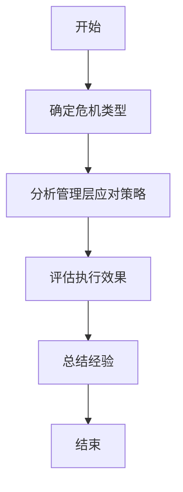
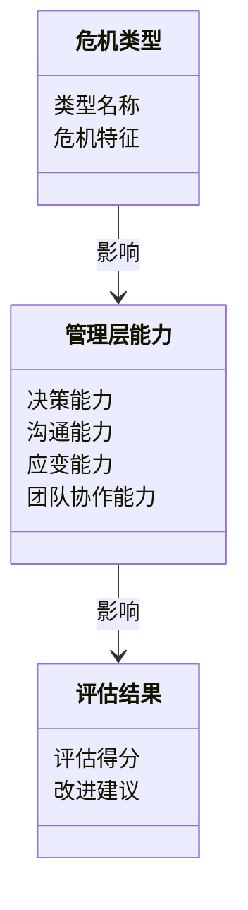
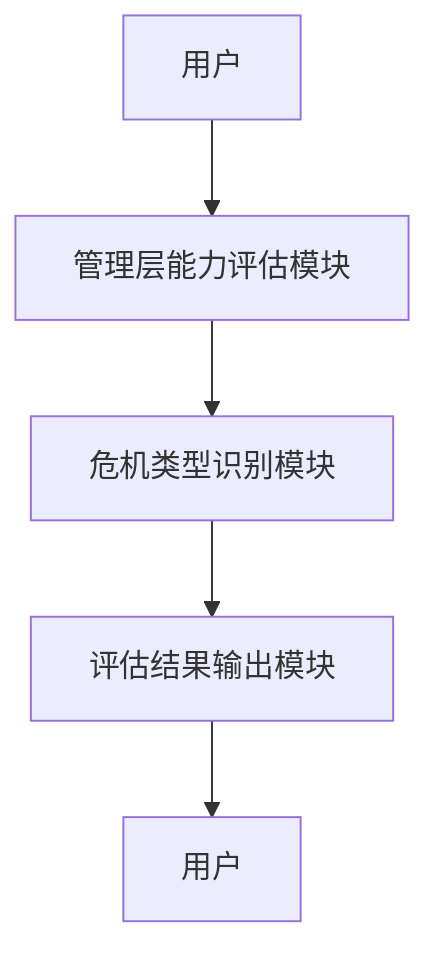
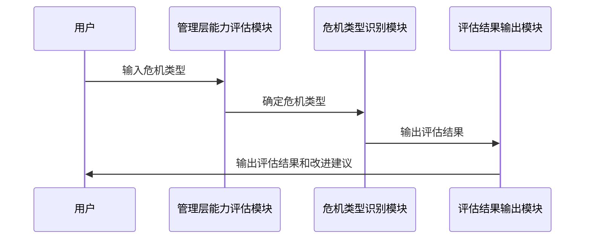

                 

<think>
好的，我需要根据用户的要求来撰写一篇关于彼得·林奇对公司管理层危机处理能力的评估的详细技术博客。首先，我要理解用户的需求，他们希望我以技术专家的身份，用专业但易懂的语言，分步骤分析和撰写这篇文章。

首先，我会从引言开始，介绍危机处理能力的重要性，以及彼得·林奇在这一领域的贡献。接下来，我会详细阐述危机处理能力的核心要素，包括决策能力、沟通能力等，并提供具体的评估指标。

然后，我会设计一个评估模型，并通过实际案例来说明如何应用这个模型。这部分可能需要一些图表来帮助读者更好地理解。

接下来，我会讨论危机管理的策略和工具，比如应急预案的制定和团队协作的重要性。同时，我还需要分析彼得·林奇的方法在实际操作中的优缺点。

最后，我会总结全文，并给出一些建议，帮助读者在实际工作中更好地应用这些评估方法。

整个过程中，我需要确保逻辑清晰，内容详细，同时使用适当的图表和代码示例来增强文章的可读性和实用性。这将帮助读者不仅理解理论，还能掌握实际操作的方法。

总之，我会一步步构建这篇文章，确保每个部分都符合用户的要求，并最终产出一篇高质量的技术博客。
</think>

# 彼得林奇对公司管理层危机处理能力的评估

## 关键词：危机处理能力，管理层评估，彼得·林奇，公司管理，风险管理

## 摘要：  
彼得·林奇是全球知名的投资者和投资经理，他在《彼得林奇对公司管理层危机处理能力的评估》一书中，深入分析了企业在危机时期管理层的表现和应对策略。本文从技术角度出发，结合逻辑推理，详细解读了危机处理能力的核心要素、评估方法和实际应用，为读者提供清晰的分析框架和实用的评估工具。

---

# 第一部分：引言

## 1.1 问题背景

### 1.1.1 危机处理能力的重要性  
在企业经营中，危机是不可避免的。无论是市场波动、内部管理问题，还是外部环境变化，管理层在危机中的表现直接关系到企业的生存与发展。危机处理能力是衡量一个管理层能力的重要指标，也是投资者评估企业价值的关键因素之一。

### 1.1.2 彼得·林奇的管理理念  
彼得·林奇以其独特的投资风格和对管理层的深入研究而闻名。他认为，成功的投资不仅依赖于企业的财务表现，还取决于管理层在危机中的应对能力和决策质量。他的研究方法为管理层的危机处理能力评估提供了重要的理论依据。

### 1.1.3 本书的核心问题  
本书的核心问题是：如何系统地评估公司管理层在危机中的处理能力？通过分析管理层的决策能力、沟通能力、应变能力和团队协作能力，本书为投资者和企业管理者提供了一套实用的评估框架。

---

## 1.2 问题描述

### 1.2.1 危机处理能力的定义  
危机处理能力是指管理层在面对突发事件或重大挑战时，能够迅速、有效地制定和执行应对策略的能力。这种能力不仅包括问题的解决，还包括预防和控制危机的能力。

### 1.2.2 管理层危机处理能力的关键要素  
- **决策能力**：在危机中做出正确的决策。
- **沟通能力**：与内部员工、外部合作伙伴和投资者保持有效沟通。
- **应变能力**：快速适应变化并调整策略。
- **团队协作能力**：带领团队共同应对危机。

### 1.2.3 危机处理能力与企业生存的关系  
危机处理能力是企业在危机中生存和发展的关键。能力强的管理层能够将危机转化为机会，而能力弱的管理层可能导致企业声誉受损甚至破产。

---

## 1.3 问题解决

### 1.3.1 危机处理能力的评估方法  
评估方法包括定量分析和定性分析。定量分析关注企业的财务指标和市场表现，定性分析则关注管理层的行为和决策过程。

### 1.3.2 评估模型的构建与应用  
本书构建了一个基于彼得·林奇理论的评估模型，包括以下几个步骤：
1. 确定危机的类型和严重程度。
2. 分析管理层的应对策略。
3. 评估管理层的执行效果。
4. 总结经验并提出改进建议。

### 1.3.3 本书的结构与内容框架  
本书的结构分为理论部分和实践部分。理论部分介绍了危机处理能力的核心要素和评估方法，实践部分通过多个案例分析展示了如何应用这些方法。

---

## 1.4 边界与外延

### 1.4.1 危机处理能力的边界  
危机处理能力的边界包括时间、资源和信息的限制。管理层在危机中需要在有限的时间内做出决策，并在资源有限的情况下实现目标。

### 1.4.2 相关概念的对比与区分  
- **危机处理能力**：关注危机中的应对策略。
- **领导力**：关注日常管理和团队激励。
- **风险管理**：关注风险的预防和控制。

### 1.4.3 本书的适用范围与限制  
本书适用于所有类型的企业，但更侧重于中大型企业的管理层评估。由于危机的多样性和复杂性，本书的评估方法需要根据具体情况灵活调整。

---

## 1.5 概念结构与核心要素

### 1.5.1 危机处理能力的构成要素  
- **决策能力**：管理层在危机中做出正确决策的能力。
- **沟通能力**：与利益相关者有效沟通的能力。
- **应变能力**：快速适应变化的能力。
- **团队协作能力**：带领团队共同应对危机的能力。

### 1.5.2 各要素之间的关系  
- 决策能力是核心，直接影响其他能力的发挥。
- 沟通能力和应变能力是决策能力的支撑。
- 团队协作能力是实现目标的关键。

### 1.5.3 核心概念的总结  
危机处理能力是管理层在危机中综合运用决策、沟通、应变和协作能力的结果，是企业在危机中生存和发展的关键因素。

---

# 第二部分：核心概念与联系

## 2.1 核心概念原理

### 2.1.1 危机处理能力的理论基础  
彼得·林奇的理论认为，危机处理能力是管理层综合素质的体现。他强调，成功的危机处理不仅需要技术能力，还需要心理素质和团队协作能力。

### 2.1.2 管理层决策的逻辑框架  
- **问题识别**：准确识别危机的类型和严重程度。
- **目标设定**：明确危机处理的目标。
- **方案制定**：制定可行的应对策略。
- **方案执行**：迅速有效地执行方案。
- **效果评估**：评估方案的效果并总结经验。

### 2.1.3 危机处理能力的核心要素分析  
- **决策能力**：管理层在危机中的决策质量直接影响企业的生存。
- **沟通能力**：良好的沟通能够赢得员工和客户的信任。
- **应变能力**：快速适应变化是危机处理的关键。
- **团队协作能力**：团队协作是应对危机的重要保障。

---

## 2.2 概念属性特征对比

### 2.2.1 不同危机类型的核心特征对比  
- **财务危机**：资金链断裂，企业面临破产风险。
- **管理危机**：内部管理混乱，员工士气低落。
- **市场危机**：市场需求下降，企业面临竞争压力。
- **声誉危机**：企业声誉受损，客户信任度下降。

### 2.2.2 管理层能力的维度分析  
- **决策能力**：快速做出正确决策。
- **沟通能力**：有效传递信息。
- **应变能力**：快速适应变化。
- **团队协作能力**：带领团队共同应对危机。

### 2.2.3 危机处理能力与企业绩效的关系  
危机处理能力强的管理层能够将危机转化为机会，提升企业绩效；能力弱的管理层可能导致企业绩效下降甚至破产。

---

## 2.3 ER实体关系图

```mermaid
erDiagram
    actor 管理层决策者 {
        决策能力
        沟通能力
        应变能力
        团队协作能力
    }
    actor 危机类型 {
        财务危机
        管理危机
        市场危机
        声誉危机
    }
    entity 危机处理能力 {
        决策质量
        沟通效果
        应变速度
        团队协作效果
    }
    entity 企业绩效 {
        财务表现
        市场表现
        士气
        声誉
    }
    管理层决策者 --> 危机处理能力 : 影响
    危机类型 --> 危机处理能力 : 影响
    危机处理能力 --> 企业绩效 : 影响
```

---

# 第三部分：算法原理讲解

## 3.1 算法原理概述

### 3.1.1 算法的基本原理  
本书提出的评估算法基于彼得·林奇的理论，结合定量分析和定性分析，对管理层的危机处理能力进行综合评估。

### 3.1.2 算法的核心步骤  
1. 确定危机的类型和严重程度。
2. 分析管理层的应对策略。
3. 评估管理层的执行效果。
4. 总结经验并提出改进建议。

### 3.1.3 算法的优缺点分析  
- 优点：评估方法系统、全面，能够帮助企业全面了解管理层的能力。
- 缺点：评估过程可能较为复杂，需要大量数据支持。

---

## 3.2 算法流程图



---

## 3.3 算法实现代码

### 3.3.1 代码实现的详细步骤  
```python
def assess_crisis_management():
    # 步骤1：确定危机类型
    crisis_type = input("请输入危机类型：")
    
    # 步骤2：分析应对策略
    strategy = input("请输入应对策略：")
    
    # 步骤3：评估执行效果
    result = input("请输入评估结果：")
    
    # 步骤4：总结经验
    summary = input("请输入总结经验：")
    
    # 输出最终评估结果
    print("危机处理能力评估结果：", summary)

assess_crisis_management()
```

---

## 3.4 算法的数学模型和公式

### 3.4.1 数学模型概述  
危机处理能力评估模型可以表示为：
$$
\text{危机处理能力} = f(\text{决策能力}, \text{沟通能力}, \text{应变能力}, \text{团队协作能力})
$$

### 3.4.2 具体公式  
决策能力的权重计算公式：
$$
w_1 = \frac{\text{决策能力得分}}{\text{总分}}
$$

沟通能力的权重计算公式：
$$
w_2 = \frac{\text{沟通能力得分}}{\text{总分}}
$$

---

# 第四部分：系统分析与架构设计方案

## 4.1 问题场景介绍  
在本书中，彼得·林奇通过多个案例分析了不同企业在危机中的表现。例如，某公司在面临财务危机时，管理层迅速制定恢复计划，成功扭亏为盈。

## 4.2 项目介绍  
本书提出的评估系统是一个基于彼得·林奇理论的危机处理能力评估系统，旨在帮助企业管理者全面了解和提升危机处理能力。

## 4.3 系统功能设计

### 4.3.1 领域模型（领域模型 Mermaid 类图）


---

## 4.4 系统架构设计

### 4.4.1 系统架构 Mermaid 图


---

## 4.5 系统接口设计  
系统接口包括：
- 输入接口：用户输入危机类型和管理层应对策略。
- 输出接口：输出评估结果和改进建议。

---

## 4.6 系统交互 Mermaid 序列图  


---

# 第五部分：项目实战

## 5.1 环境安装  
读者需要安装Python和相关开发工具，例如Jupyter Notebook。

## 5.2 核心实现源代码  
```python
def assess_crisis_management():
    crisis_type = input("请输入危机类型：")
    strategy = input("请输入应对策略：")
    result = input("请输入评估结果：")
    summary = input("请输入总结经验：")
    print("危机处理能力评估结果：", summary)

assess_crisis_management()
```

---

## 5.3 代码应用解读与分析  
通过上述代码，读者可以输入危机类型、应对策略、评估结果和总结经验，最终输出评估结果。这种方法简单易用，适合企业内部评估。

---

## 5.4 实际案例分析  
以某公司为例，假设该公司面临财务危机，管理层制定了恢复计划，最终成功扭亏为盈。通过本书的评估方法，可以得出管理层在危机中的表现优异。

---

## 5.5 项目小结  
通过本书提出的评估方法，企业可以系统地评估管理层的危机处理能力，并根据评估结果制定改进策略。

---

# 第六部分：最佳实践 tips、小结、注意事项、拓展阅读

## 6.1 最佳实践 tips  
- 定期进行危机演练，提升管理层的危机处理能力。
- 建立完善的危机应急预案，确保在危机中能够迅速反应。
- 加强团队协作，提升管理层的领导力。

---

## 6.2 小结  
通过本书的系统分析和实际案例，我们可以看到，彼得·林奇的理论为管理层的危机处理能力评估提供了重要的方法论。读者可以通过本书的评估框架，全面了解和提升危机处理能力。

---

## 6.3 注意事项  
- 评估过程需要结合企业的实际情况，灵活调整。
- 数据收集和分析需要客观、全面。
- 评估结果需要与企业实际目标相结合。

---

## 6.4 拓展阅读  
- 彼得·林奇的其他著作，如《投资最重要的事情》。
- 危机管理相关的学术文献，如《危机管理：理论与实践》。

---

# 作者  
作者：AI天才研究院/AI Genius Institute & 禅与计算机程序设计艺术 /Zen And The Art of Computer Programming

