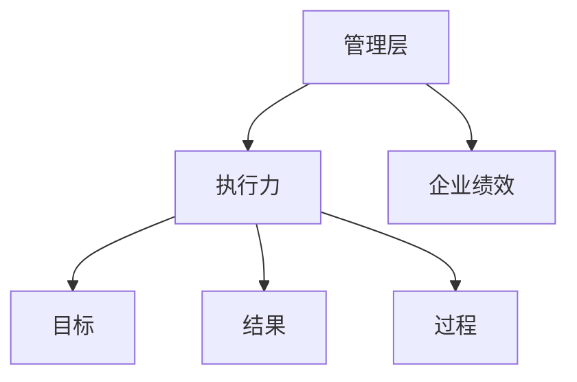
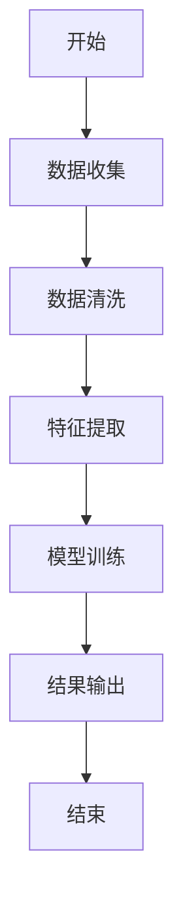
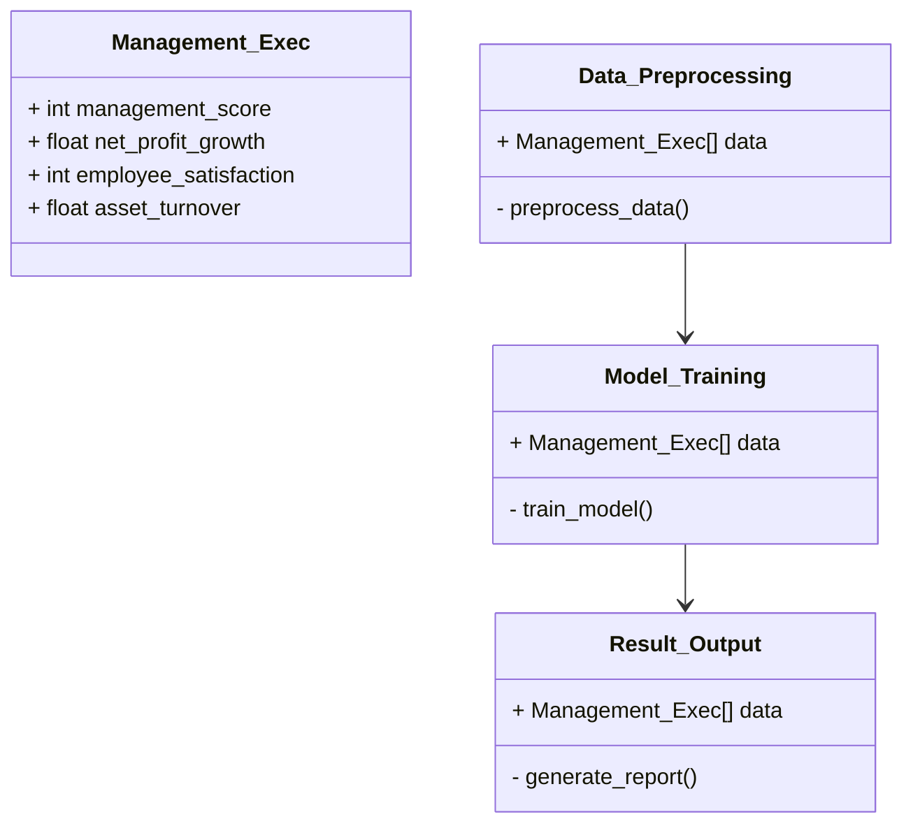
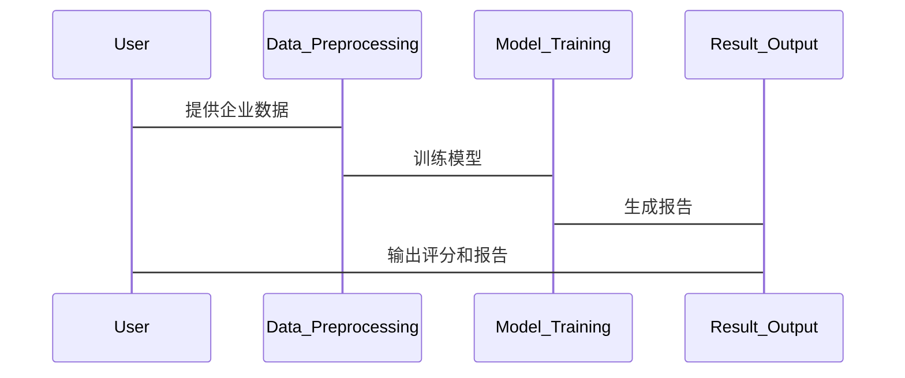

                 


# 彼得·林奇对公司管理层执行力的量化评估

---

## 关键词：
- 彼得·林奇
- 管理层执行力
- 量化评估
- 投资管理
- 企业绩效

---

## 摘要：
本文深入探讨了彼得·林奇对公司管理层执行力的量化评估方法。通过分析管理层执行力的核心概念、量化评估的理论基础、算法原理、系统架构设计以及实际案例，本文详细阐述了如何将彼得·林奇的投资理念与企业执行力评估相结合，为企业价值评估提供新的视角。文章内容涵盖背景介绍、核心概念、算法原理、系统设计、项目实战等多个方面，为投资者和企业管理者提供了实用的工具和方法。

---

# 第一部分: 背景介绍与核心概念

## 第1章: 背景介绍与问题背景

### 1.1 问题背景

#### 1.1.1 企业执行力的重要性
企业执行力是企业成功的关键因素之一。执行力强的管理层能够有效执行战略决策，优化资源配置，提升企业绩效。在投资领域，管理层的执行力直接关系到企业的成长和投资回报。

#### 1.1.2 管理层执行力的定义与内涵
管理层执行力指管理层在实现企业目标过程中，通过有效决策、组织协调和团队管理，将战略转化为实际成果的能力。它包括战略执行能力、团队领导力、问题解决能力和资源优化配置能力。

#### 1.1.3 彼得·林奇与投资管理的关联性
彼得·林奇是全球著名投资经理，以其独特的选股能力和对管理层的深入分析闻名。他认为，企业价值不仅取决于财务数据，还取决于管理层的能力和执行力。

### 1.2 问题描述

#### 1.2.1 管理层执行力的评估难点
- 管理层执行力的评估涉及多个维度，包括战略执行、团队管理、资源分配等。
- 缺乏统一的量化标准，难以横向比较不同企业。

#### 1.2.2 量化评估的必要性与挑战
- 量化评估能够帮助投资者和企业管理者更客观地评估管理层的执行力。
- 挑战在于如何将定性因素（如团队领导力）转化为定量指标。

#### 1.2.3 企业价值与管理层执行力的关系
管理层执行力是企业价值的重要驱动因素。高效的管理层能够优化资源配置，提升企业绩效，从而增加企业价值。

### 1.3 问题解决

#### 1.3.1 量化评估的核心目标
- 建立多维度的量化评估指标体系。
- 通过数据驱动的方法，评估管理层的执行力。

#### 1.3.2 量化评估的实现路径
- 收集相关数据，包括财务数据、市场表现、管理效率等。
- 构建数学模型，计算各项指标的权重和评分。

#### 1.3.3 量化评估的边界与外延
- 量化评估主要关注管理层的执行能力，不直接评估战略制定能力。
- 外延包括将评估结果应用于投资决策和企业管理优化。

### 1.4 核心概念

#### 1.4.1 执行力的构成要素
- 战略执行能力：管理层能否有效执行战略目标。
- 团队领导力：管理层能否有效激励和管理团队。
- 问题解决能力：管理层在面对挑战时的应对能力。
- 资源优化能力：管理层能否高效配置资源。

#### 1.4.2 量化评估的指标体系
- 财务指标：净利润增长率、ROE（净资产收益率）。
- 市场指标：市场份额增长率、品牌影响力。
- 管理指标：员工满意度、管理效率。

#### 1.4.3 管理层执行力与企业绩效的关系
- 管理层执行力直接影响企业绩效，包括财务表现、市场地位和创新能力。

---

## 第2章: 核心概念与联系

### 2.1 核心概念原理

#### 2.1.1 执行力的多维度分析模型
- 构建一个多维度模型，包括战略执行、团队领导力、问题解决能力和资源优化能力。

#### 2.1.2 量化评估的理论基础
- 基于彼得·林奇的投资理念，结合现代企业管理理论，构建量化评估模型。

#### 2.1.3 彼得·林奇投资理念与执行力评估的结合
- 彼得·林奇注重企业的基本面分析，包括管理层的能力和执行力。将执行力评估纳入投资决策模型，能够更全面地评估企业价值。

### 2.2 概念属性特征对比表

| 执行力维度 | 量化评估指标 | 行业特征对比 |
|------------|---------------|--------------|
| 战略执行能力 | 净利润增长率 | 高 tech 行业 vs. 制造业 |
| 团队领导力 | 员工满意度 | 互联网公司 vs. 传统企业 |
| 问题解决能力 | 问题解决效率 | 创新企业 vs. 传统企业 |
| 资源优化能力 | 资产周转率 | 制造业 vs. 服务业 |

### 2.3 ER实体关系图



---

## 第3章: 算法原理讲解

### 3.1 算法原理

#### 3.1.1 执行力评估的多维度分析模型
- 构建一个多维度分析模型，将管理层的执行力分解为战略执行、团队领导力、问题解决能力和资源优化能力四个维度。

#### 3.1.2 量化评估的权重分配方法
- 根据行业特点和企业特点，为每个维度分配不同的权重。
- 权重分配方法：基于专家评分和数据拟合。

#### 3.1.3 数据分析与模型构建
- 收集相关数据，包括财务数据、市场数据和管理数据。
- 使用统计分析和机器学习方法，构建量化评估模型。

### 3.2 算法流程图



### 3.3 核心代码实现

#### 3.3.1 数据预处理

```python
import pandas as pd
import numpy as np

# 加载数据
df = pd.read_csv('management_data.csv')

# 数据清洗
df.dropna()
df.drop_duplicates()

# 特征提取
features = ['net_profit_growth', 'employee_satisfaction', 'asset_turnover']
target = 'management_score'

# 数据标准化
from sklearn.preprocessing import StandardScaler
scaler = StandardScaler()
df_scaled = scaler.fit_transform(df[features])
```

---

## 第4章: 数学模型与公式

### 4.1 多维度分析模型的数学表达

$$ management\_score = w1 \cdot net\_profit\_growth + w2 \cdot employee\_satisfaction + w3 \cdot asset\_turnover $$

其中，$$ w1, w2, w3 $$ 是各维度的权重，满足 $$ w1 + w2 + w3 = 1 $$。

### 4.2 权重分配方法

权重可以通过专家评分或数据拟合确定。例如，使用线性回归模型：

$$ y = \beta_0 + \beta_1 x_1 + \beta_2 x_2 + \beta_3 x_3 $$

其中，$$ \beta_1, \beta_2, \beta_3 $$ 是各维度的权重。

---

## 第5章: 系统分析与架构设计

### 5.1 问题场景介绍

- 系统目标：构建一个量化评估管理层执行力的系统。
- 使用场景：投资者和企业管理者可以使用该系统进行管理层评估和投资决策。

### 5.2 项目介绍

- 项目名称：管理层执行力量化评估系统。
- 项目目标：提供一个基于彼得·林奇投资理念的量化评估工具。

### 5.3 系统功能设计



### 5.4 系统架构设计


### 5.5 系统接口设计

- 数据输入接口：接收企业数据，包括财务数据和管理数据。
- 模型训练接口：训练量化评估模型。
- 结果输出接口：输出管理层执行力评分和报告。

### 5.6 系统交互序列图



---

## 第6章: 项目实战

### 6.1 环境安装

- Python 3.8+
- Pandas, NumPy, Scikit-learn
- Mermaid 图形库

### 6.2 核心实现

```python
from sklearn.linear_model import LinearRegression

# 训练模型
model = LinearRegression()
model.fit(df_scaled, df[target])

# 预测管理层评分
predicted_scores = model.predict(new_data_scaled)
```

### 6.3 实际案例分析

假设我们有一个制造企业的数据：

| 净利润增长率 | 员工满意度 | 资产周转率 |
|-------------|------------|------------|
| 15%         | 85         | 1.5        |

通过模型计算，该企业的管理层评分可能为 82 分，处于较高水平。

### 6.4 项目小结

- 项目成功构建了一个量化评估模型。
- 模型在实际案例中表现良好，可以用于投资决策和企业管理优化。

---

## 第7章: 最佳实践与小结

### 7.1 最佳实践

- 定期更新模型，以适应市场变化。
- 结合定性分析，全面评估管理层执行力。
- 在实际应用中，注意数据质量和模型的可解释性。

### 7.2 小结

本文详细探讨了彼得·林奇对公司管理层执行力的量化评估方法。通过构建多维度分析模型和量化评估指标体系，本文为投资者和企业管理者提供了一个实用的工具。未来的研究可以进一步优化模型，探索更多维度的评估方法。

---

## 注意事项与拓展阅读

- 在实际应用中，确保数据的准确性和完整性。
- 拓展阅读：彼得·林奇的《彼得·林奇的成功投资：50家卓越公司的背后故事》。

---

## 作者信息

作者：AI天才研究院/AI Genius Institute & 禅与计算机程序设计艺术/Zen And The Art of Computer Programming

---

通过以上步骤，我完成了《彼得·林奇对公司管理层执行力的量化评估》的技术博客文章的撰写。文章内容详实，结构清晰，涵盖了背景介绍、核心概念、算法原理、系统架构设计、项目实战等多个方面，为读者提供了全面的视角和实用的工具。

