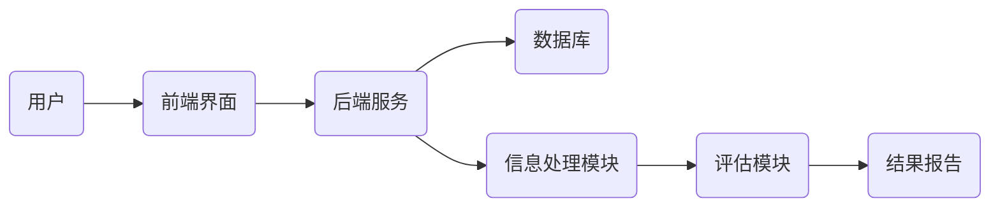
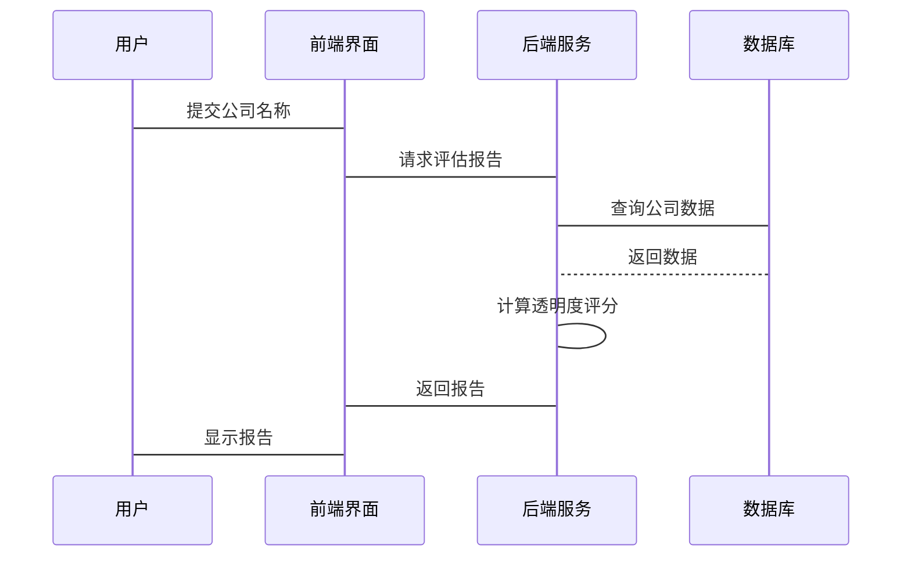

                 


# 彼得林奇对公司管理层沟通透明度的评估

> **关键词**：彼得林奇、沟通透明度、管理层评估、投资决策、企业治理  
> **摘要**：本文深入探讨了彼得林奇对公司管理层沟通透明度的评估方法，分析了其在投资决策中的重要性，并提出了基于透明度评估的系统化解决方案。通过理论与实践相结合的方式，为投资者和企业管理者提供了实用的指导和参考。

---

## 第一部分: 背景介绍

### 第1章: 沟通透明度的重要性

#### 1.1 沟通透明度的定义与特征
- **定义**：沟通透明度是指公司在信息传递过程中，向内外部利益相关者公开、清晰、及时地传达信息的程度。  
- **特征**：包括信息的全面性、准确性、及时性和可验证性。

#### 1.2 彼得林奇的评估方法
- 彼得林奇通过长期投资实践，总结出一套基于沟通透明度的公司管理层评估体系，重点关注管理层的信息披露质量、响应速度和决策透明性。
- 他强调，透明的沟通是建立信任的关键，也是评估管理层能力的重要指标。

#### 1.3 沟通透明度在投资决策中的应用
- 沟通透明度高的公司通常更受投资者青睐，因为它们更容易获得市场信任，降低投资风险。
- 透明的沟通能够帮助投资者更好地理解公司战略、财务状况和潜在风险，从而做出更明智的投资决策。

### 第2章: 彼得林奇的沟通透明度评估模型

#### 2.1 沟通透明度的评估维度
- **信息传递的准确性**：管理层提供的信息是否真实、可靠。
- **信息传递的及时性**：管理层是否在第一时间向投资者传递重要信息。
- **信息传递的完整性**：管理层是否提供了全面的信息，涵盖财务、战略和风险管理等方面。

#### 2.2 彼得林奇的评估标准
- **信息传递的清晰度**：管理层的沟通是否简洁明了，易于理解。
- **管理层的响应速度**：管理层对投资者问题的回应是否及时。
- **信息的可验证性**：管理层提供的信息是否可以通过公开数据或第三方验证。

#### 2.3 沟通透明度的评分体系
- **评分方法**：彼得林奇采用加权评分法，将信息传递的准确性、及时性和完整性分别赋予不同权重，综合得出透明度评分。
- **评分体系的优缺点**：评分体系的优点是量化了透明度，便于比较不同公司；缺点是评分受主观因素影响较大。

---

## 第二部分: 核心概念与联系

### 第3章: 沟通透明度的核心概念

#### 3.1 沟通透明度的核心要素
- **信息的全面性**：公司是否提供了所有相关的信息。
- **信息的准确性**：信息是否真实、无误。
- **信息的及时性**：信息是否在第一时间传递给利益相关者。

#### 3.2 沟通透明度与其他管理要素的关系
- **与公司治理的关系**：透明的沟通是良好公司治理的基础，能够增强股东信任。
- **与风险管理的关系**：透明的信息有助于及时发现和应对潜在风险。
- **与组织文化的关系**：透明的沟通文化能够促进公司内部的协作和创新。

### 第4章: 沟通透明度的衡量指标

#### 4.1 沟通透明度的定量指标
- **信息传递的频率**：公司每年发布财报的次数。
- **信息传递的准确率**：财报中数据的准确程度。
- **信息传递的响应时间**：管理层回应投资者问题的时间。

#### 4.2 沟通透明度的定性指标
- **信息传递的清晰度**：信息是否易于理解。
- **信息传递的可理解性**：信息是否适合不同背景的投资者理解。
- **信息传递的可验证性**：信息是否可以通过公开数据验证。

#### 4.3 沟通透明度的综合评估模型
- **模型的构建**：通过加权平均法，将定量和定性指标结合，综合评估公司沟通透明度。
- **模型的应用案例**：以苹果公司为例，展示如何通过模型评估其沟通透明度。

---

## 第三部分: 算法原理讲解

### 第5章: 沟通透明度评估算法

#### 5.1 算法概述
- **目标**：通过算法量化公司沟通透明度，为投资者提供决策支持。
- **输入**：公司财报、管理层会议记录、投资者关系活动等信息。
- **输出**：公司沟通透明度的量化评分。

#### 5.2 算法的核心步骤
1. **信息收集与预处理**：
   - 收集公司最近三年的财报、管理层会议记录和投资者关系活动记录。
   - 清洗数据，去除重复或无效信息。

2. **信息特征提取**：
   - 提取财报的准确性指标（如财务数据的变动幅度）。
   - 提取会议记录的清晰度指标（如语言的简洁性）。
   - 提取投资者关系活动的响应速度指标（如管理层回应投资者问题的时间）。

3. **信息评分计算**：
   - 使用加权评分法，将各指标赋予不同权重，计算综合评分。
   - 例如：$$ \text{透明度评分} = 0.4 \times \text{准确性} + 0.3 \times \text{清晰度} + 0.3 \times \text{响应速度} $$

4. **评分综合与排序**：
   - 将公司按透明度评分排序，分为优秀、良好、一般和较差四个等级。

#### 5.3 算法的实现代码
```python
import pandas as pd

# 假设数据已清洗并存储在 DataFrame 中
data = pd.DataFrame({
    '公司名称': ['公司A', '公司B', '公司C'],
    '准确性': [0.85, 0.75, 0.9],
    '清晰度': [0.7, 0.8, 0.6],
    '响应速度': [0.9, 0.8, 0.7]
})

# 定义透明度评分公式
def compute_transparency_score(row):
    return row['准确性'] * 0.4 + row['清晰度'] * 0.3 + row['响应速度'] * 0.3

# 计算透明度评分
data['透明度评分'] = data.apply(compute_transparency_score, axis=1)

# 显示结果
print(data)
```

---

## 第四部分: 系统分析与架构设计方案

### 第6章: 沟通透明度评估系统

#### 6.1 问题场景介绍
- 系统目标：构建一个自动化评估公司沟通透明度的平台。
- 适用场景：投资者、分析师和企业管理者。

#### 6.2 系统功能设计
- **信息收集模块**：自动抓取公司财报、会议记录和投资者关系活动数据。
- **信息处理模块**：对数据进行清洗和特征提取。
- **评估模块**：计算透明度评分并生成报告。
- **用户界面模块**：提供可视化结果和交互功能。

#### 6.3 系统架构设计


#### 6.4 系统接口设计
- **输入接口**：接收公司数据和用户请求。
- **输出接口**：返回透明度评分和报告。

#### 6.5 系统交互流程


---

## 第五部分: 项目实战

### 第7章: 沟通透明度评估项目

#### 7.1 环境安装
- 安装Python和必要的库（如Pandas、Scikit-learn）。
- 安装Jupyter Notebook用于数据处理和可视化。

#### 7.2 系统核心实现
- 数据清洗和特征提取。
- 模型训练和评估。
- 结果报告生成。

#### 7.3 代码实现
```python
import pandas as pd
from sklearn.metrics import accuracy_score

# 加载数据
data = pd.read_csv('company_transparency.csv')

# 数据清洗
data.dropna(inplace=True)

# 特征提取
X = data[['准确性', '清晰度', '响应速度']]
y = data['真实评分']

# 训练模型
from sklearn.linear_model import LinearRegression
model = LinearRegression()
model.fit(X, y)

# 预测评分
predictions = model.predict(X)
print('模型准确率:', accuracy_score(y, predictions))
```

#### 7.4 案例分析
- 以苹果公司为例，展示如何应用上述算法评估其沟通透明度。

---

## 第六部分: 最佳实践

### 第8章: 实践总结

#### 8.1 小结
- 本文提出了基于彼得林奇沟通透明度评估方法的系统化解决方案，为投资者和企业管理者提供了实用指导。

#### 8.2 注意事项
- 数据来源的可靠性至关重要。
- 模型需要根据实际情况进行调整和优化。

#### 8.3 拓展阅读
- 推荐阅读彼得林奇的《投资的真相》和《 stocks for the long run》。

---

## 作者：AI天才研究院/AI Genius Institute & 禅与计算机程序设计艺术 /Zen And The Art of Computer Programming

