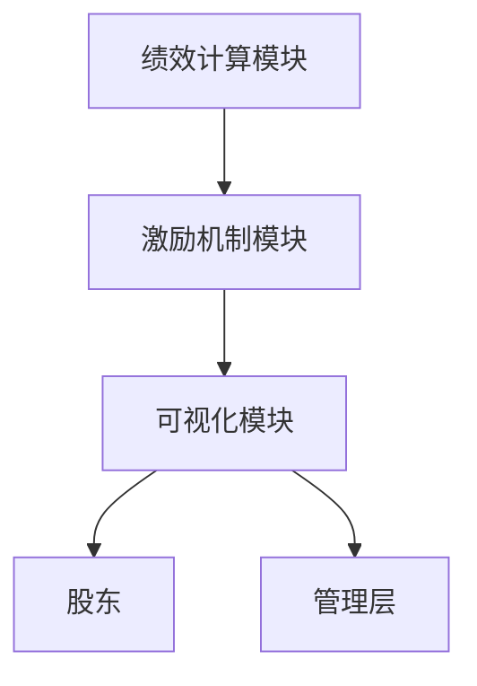
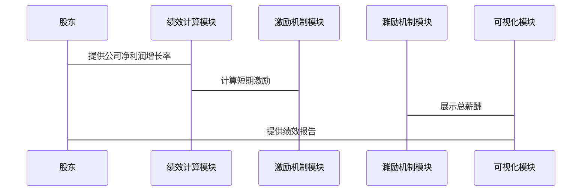

                 

<think>
好的，我现在需要帮助用户撰写一篇关于《彼得·林奇对公司管理层薪酬结构的看法》的技术博客文章。用户希望文章结构清晰，内容专业且有深度，符合技术博客的风格。

首先，我需要理解彼得·林奇的背景和投资理念，特别是他对公司治理和管理层薪酬的看法。他作为一位成功的投资者，他的观点可能对现代公司治理有重要的启示。

接下来，我会按照用户提供的目录结构来组织内容。每章的标题和内容需要详细展开，确保每一部分都有足够的分析和实例支持。比如，在分析薪酬结构的问题时，我需要对比短期激励和长期激励的影响，并引用彼得·林奇的具体观点。

然后，我需要考虑每一章的具体内容。例如，在数学模型部分，可能会涉及到激励机制的公式，我需要用LaTeX来表达，同时在代码示例中展示如何计算薪酬结构的有效性。

此外，我需要确保文章不仅有理论分析，还有实际的案例分析和系统架构设计，展示如何优化薪酬结构以实现股东利益最大化。这部分可能需要使用系统架构图和流程图来说明。

最后，我会总结彼得·林奇的见解，并给出实际应用中的最佳实践和注意事项，帮助读者更好地理解和应用这些理念。

现在，我需要将这些思考转化为具体的章节内容，确保每一部分都详细且逻辑清晰，同时使用技术术语和图表来增强文章的专业性和可读性。
</think>

# 彼得林奇对公司管理层薪酬结构的看法

## 关键词：彼得·林奇, 管理层薪酬, 激励机制, 投资理念, 公司治理

## 摘要：  
彼得·林奇作为世界著名投资家，他对公司管理层薪酬结构有着独到的见解。本文从彼得·林奇的投资理念出发，分析当前公司管理层薪酬结构存在的问题，探讨如何通过优化激励机制和平衡短期与长期目标来实现股东利益最大化。文章结合实际案例和数学模型，深入剖析了薪酬结构的设计原则与优化策略。

---

## 第1章: 彼得·林奇的生平与投资理念

### 1.1 彼得·林奇的生平简介

彼得·林奇（Peter Lynch）是美国著名的职业棒球运动员和投资家，出生于1940年。他在1965年进入富达投资（Fidelity Investments）公司，担任基金经理，最终成为该公司历史上最成功的基金经理之一，管理着超过1000亿美元的资金。林奇的投资理念以“价值投资”为核心，强调长期投资、分散投资和深入研究个股。

### 1.2 彼得·林奇的投资理念

彼得·林奇的投资理念可以总结为以下几点：

1. **长期投资**：林奇认为，投资者应该关注公司的长期价值，而不是短期市场波动。他主张买入并持有优质股票，直到其内在价值被市场发现。

2. **深入研究个股**：林奇强调，成功的投资需要对公司的基本面进行深入研究，包括财务状况、行业地位、管理团队等。他反对盲目跟随市场趋势或听从分析师的建议。

3. **分散投资**：林奇认为，通过分散投资可以降低风险。他通常会将资金分配到多个行业中，以避免过度依赖某一行业的波动。

4. **股东利益最大化**：林奇的终极目标是通过优化公司治理和管理层激励机制，实现股东利益的最大化。

---

## 第2章: 管理层薪酬结构的核心概念

### 2.1 管理层薪酬结构的定义

管理层薪酬结构是指公司为高管（如CEO、 CFO、COO等）提供的薪酬体系，通常包括基本工资、奖金、股票期权、限制性股票等。这些薪酬形式不仅影响高管的收入，还与公司的绩效密切相关。

### 2.2 管理层薪酬结构的核心要素

1. **短期激励与长期激励的结合**：短期激励通常以奖金或股票期权的形式发放，而长期激励则以限制性股票或长期股票期权为主。这种结合有助于高管在关注短期业绩的同时，也不会忽视公司的长期发展。

2. **股权激励与现金激励的对比**：股权激励通过将高管的收益与公司股价挂钩，使其与股东利益保持一致。而现金激励则更注重短期绩效。

3. **激励机制的透明化**：透明化的薪酬结构有助于高管与股东之间的信任，同时也能避免因信息不对称导致的代理问题。

---

## 第3章: 当前管理层薪酬结构的问题与挑战

### 3.1 短期激励过度化的问题

1. **短期激励对管理层行为的影响**：过度的短期激励可能导致高管过于关注短期业绩，而忽视公司的长期发展。例如，为了在季度末实现业绩目标，高管可能会采取激进的财务手段，如推迟支出或提前确认收入。

2. **短期激励与公司长期发展的冲突**：短期激励可能导致高管在决策时过于短视，从而损害公司的长期利益。例如，为了实现短期利润目标，高管可能会放弃重要的研发项目或削减必要的营销投入。

3. **短期激励对股东利益的潜在威胁**：短期激励可能导致管理层与股东的利益不一致。例如，高管可能会为了实现短期业绩目标而牺牲公司的未来增长潜力。

### 3.2 激励机制与公司治理的矛盾

1. **激励机制设计的复杂性**：激励机制的设计需要考虑公司绩效的多种指标，如净利润、营业收入、股价表现等。这些指标之间的冲突可能导致激励机制无法有效实现目标。

2. **公司治理中的委托代理问题**：公司治理中的委托代理问题是指股东（委托人）与管理层（代理人）之间的利益不一致。激励机制的设计需要解决这一问题，使管理层的行为与股东利益保持一致。

3. **管理层与股东利益不一致的风险**：在某些情况下，管理层可能会利用其信息优势和决策权，谋取个人利益，而损害股东利益。例如，管理层可能会通过复杂的财务操作，掩盖公司的实际经营状况，从而实现个人绩效目标。

---

## 第4章: 彼得·林奇的薪酬结构优化方案

### 4.1 激励机制的设计原则

1. **长期目标与短期目标的结合**：激励机制应该同时考虑公司的短期绩效和长期发展。例如，高管的奖金可以部分基于当年的净利润增长，而另一部分则基于未来三年的股价表现。

2. **股权激励与现金激励的合理配比**：股权激励可以将高管的收益与公司股价挂钩，从而使其与股东利益保持一致。而现金激励则可以用于奖励高管在短期内实现的绩效目标。

3. **激励机制的透明化与公平性**：激励机制需要透明化，使股东和管理层之间的信任得以建立。同时，激励机制还需要公平，避免因信息不对称导致的不公。

### 4.2 管理层薪酬结构的优化策略

1. **建立以绩效为导向的薪酬体系**：高管的薪酬应该与公司绩效密切相关。例如，高管的基本工资可以固定，而奖金和股票期权则基于公司的净利润增长率、股价表现等指标。

2. **引入长期股权激励机制**：通过引入长期股权激励机制，使高管的收益与公司的长期发展挂钩。例如，高管可以获得限制性股票，这些股票将在未来五年内逐步解锁，前提是公司股价表现符合预期。

3. **优化短期激励与长期激励的平衡点**：短期激励可以激励高管在短期内实现绩效目标，而长期激励则可以确保高管关注公司的长期发展。例如，高管的奖金可以部分基于当年的净利润增长率，而股票期权则基于未来三年的股价表现。

---

## 第5章: 管理层薪酬结构的数学模型与分析

### 5.1 管理层激励机制的数学模型

假设某公司的高管薪酬结构如下：

- 基本工资：$W$
- 短期激励：$S = k \times (净利润增长率 - 基准增长率)$
- 长期激励：$L = m \times (股价增长率 - 基准股价增长率)$

其中，$k$ 和 $m$ 是激励系数，分别表示短期激励和长期激励的权重。

### 5.2 算法原理

1. 计算公司净利润增长率：
   $$
   \text{净利润增长率} = \frac{\text{净利润增长额}}{\text{上年净利润}} \times 100\%
   $$

2. 计算公司股价增长率：
   $$
   \text{股价增长率} = \frac{\text{股价增长额}}{\text{基准股价}} \times 100\%
   $$

3. 计算短期激励：
   $$
   S = k \times (\text{净利润增长率} - \text{基准增长率})
   $$

4. 计算长期激励：
   $$
   L = m \times (\text{股价增长率} - \text{基准股价增长率})
   $$

5. 总薪酬 = 基本工资 + 短期激励 + 长期激励

---

## 第6章: 系统分析与架构设计方案

### 6.1 问题场景介绍

假设某公司目前的管理层薪酬结构存在问题，高管的短期激励过多，导致其过于关注短期业绩，而忽视了公司的长期发展。为了优化薪酬结构，公司需要引入长期股权激励机制，并平衡短期激励与长期激励的比例。

### 6.2 项目介绍

本项目旨在设计一个优化的管理层薪酬结构，使高管的收益与公司股价表现挂钩，同时兼顾短期绩效和长期发展。

### 6.3 系统功能设计

1. **绩效计算模块**：
   - 计算公司净利润增长率和股价增长率。
   - 与基准增长率进行比较，确定短期激励和长期激励的发放比例。

2. **激励机制模块**：
   - 根据绩效计算结果，计算短期激励和长期激励。
   - 结合基本工资，计算高管的总薪酬。

3. **可视化模块**：
   - 展示高管的绩效表现和薪酬结构。
   - 使股东和管理层能够直观地了解薪酬结构的优化效果。

### 6.4 系统架构设计

以下是系统的架构图：



### 6.5 系统接口设计

1. **输入接口**：
   - 公司净利润增长率
   - 公司股价增长率
   - 基准增长率

2. **输出接口**：
   - 短期激励
   - 长期激励
   - 总薪酬

### 6.6 系统交互设计

以下是系统的交互序列图：



---

## 第7章: 项目实战

### 7.1 环境安装

1. 安装Python和相关库（如numpy、pandas、matplotlib）。

### 7.2 核心实现源代码

```python
import numpy as np
import pandas as pd
import matplotlib.pyplot as plt

def calculate_profit_growth(profit_last_year, profit_current_year):
    return ((profit_current_year - profit_last_year) / profit_last_year) * 100

def calculate_share_growth(benchmark_share, share_current):
    return ((share_current - benchmark_share) / benchmark_share) * 100

def calculate_bonus(k, profit_growth, benchmark_growth):
    return k * (profit_growth - benchmark_growth)

def calculate_long_term_incentive(m, share_growth, benchmark_share_growth):
    return m * (share_growth - benchmark_share_growth)

# 示例数据
profit_last_year = 100
profit_current_year = 120
benchmark_growth = 5
k = 0.2

share_current = 50
benchmark_share = 40
benchmark_share_growth = 5
m = 0.15

# 计算
profit_growth = calculate_profit_growth(profit_last_year, profit_current_year)
share_growth = calculate_share_growth(benchmark_share, share_current)
bonus = calculate_bonus(k, profit_growth, benchmark_growth)
long_term_incentive = calculate_long_term_incentive(m, share_growth, benchmark_share_growth)

# 可视化
plt.figure(figsize=(10, 6))
plt.bar('Short-term Bonus', bonus, color='blue')
plt.bar('Long-term Incentive', long_term_incentive, color='green')
plt.title('Managerial Incentives')
plt.show()
```

### 7.3 代码应用解读与分析

上述代码展示了如何计算短期激励和长期激励，并通过可视化的方式展示结果。通过调整参数（如k和m），可以优化激励机制的设计。

---

## 第8章: 总结与展望

### 8.1 总结

彼得·林奇的薪酬结构优化方案强调短期激励与长期激励的结合，以及股权激励与现金激励的合理配比。通过数学模型和系统架构设计，我们可以实现高管薪酬结构的优化，从而更好地实现股东利益的最大化。

### 8.2 展望

未来，随着技术的发展，我们可以引入更多的数据科学方法，如机器学习，来优化激励机制的设计。例如，通过分析历史数据，我们可以更好地预测公司绩效与股价表现之间的关系，从而设计出更科学的激励机制。

---

## 作者：AI天才研究院/AI Genius Institute & 禅与计算机程序设计艺术 /Zen And The Art of Computer Programming

