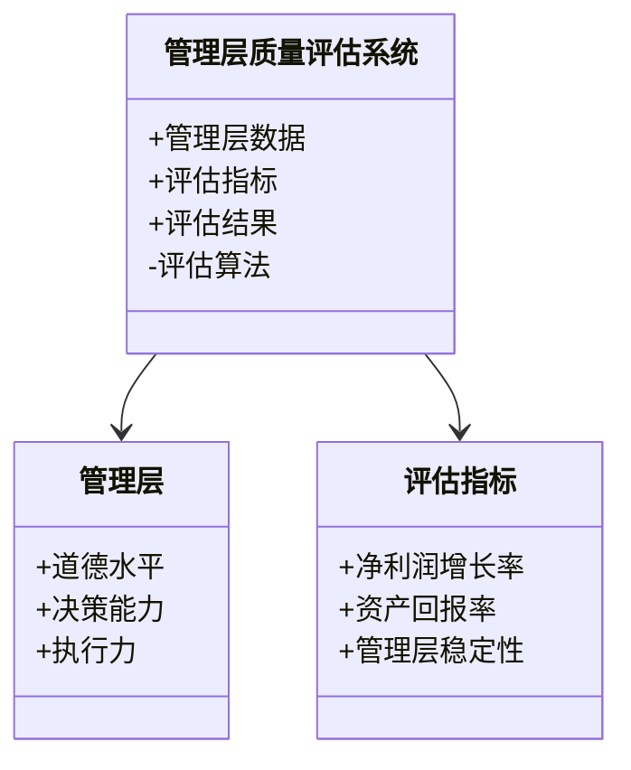

                 

<think>
好的，我现在需要帮助用户完成一个技术博客文章的撰写，主题是《彼得林奇对公司管理层质量的要求》。首先，我得理解用户的需求，他们希望文章结构清晰，内容专业且有深度，语言简洁易懂，并且符合技术博客的风格。

用户已经给出了一个详细的大纲，分为七章，每章都有具体的子部分。看起来他们希望每一部分都深入探讨，包括背景、核心概念、算法、系统分析、项目实战等。我需要按照这个大纲逐步展开，确保每部分内容充实，并且符合技术博客的逻辑和深度要求。

首先，我需要明确每一章的核心内容。第一章是背景介绍，重点介绍彼得林奇的投资理念和管理层质量的重要性。我应该先介绍彼得林奇的生平，然后讨论他的投资哲学，最后分析管理层质量在投资中的重要性。这部分需要详细但简洁，确保读者能理解彼得林奇的核心观点。

接下来是管理层质量的核心维度分析，包括道德、决策能力和执行力。我需要分别讨论每个维度，并举例说明这些维度如何影响企业的绩效和长期发展。例如，道德方面可以讨论管理层欺诈行为对企业的影响，决策能力可以引用彼得林奇的具体案例来说明。

第三章是评估方法，财务指标和非财务指标都需要详细说明。我需要列出具体的指标，如净利润增长率、资产回报率等，并解释如何通过这些指标评估管理层的质量。同时，彼得林奇的独特方法也需要详细描述，比如通过公司治理结构来评估。

第四章是提升策略，我需要探讨优化公司治理结构、加强培训和激励措施。这部分可能需要结合实际案例，说明如何通过这些策略来改善管理层的质量。

第五章是系统分析，这部分需要构建一个系统架构，包括问题场景、系统功能设计、架构设计和接口设计。我需要用Mermaid绘制类图、架构图和序列图，展示系统的结构和交互过程。这部分需要确保技术细节准确，同时易于理解。

项目实战部分，我需要选择一个具体的企业案例，分析其管理层质量和改进措施。这部分需要详细描述环境安装、核心代码实现，并进行案例分析和解读，说明如何通过具体措施提升管理层质量。

最后是最佳实践和总结，我需要总结提升管理层质量的关键点，提出实际操作中的注意事项，并推荐相关书籍和资源，供读者进一步学习。

在撰写过程中，我需要确保每一部分都包含背景介绍、核心概念、算法原理、系统分析、项目实战和总结等部分，并且使用技术术语时要准确，同时保持语言的简洁易懂。我还要注意使用Mermaid图表和数学公式，以增强文章的可读性和专业性。

总的来说，我需要按照用户提供的大纲，逐步展开每一部分的内容，确保逻辑清晰，内容详实，并且符合技术博客的风格要求。这将帮助读者全面理解彼得林奇对管理层质量的要求，并能够应用这些原则在实际投资中做出更明智的决策。
</think>

# 彼得林奇对公司管理层质量的要求

> 关键词：彼得林奇，管理层质量，投资哲学，公司治理，决策能力，执行力

> 摘要：本文深入分析了彼得林奇在投资过程中对管理层质量的高度重视，从管理层的道德、决策能力、执行力等多个维度探讨了如何评估和提升管理层的质量，并结合实际案例提供了系统的分析和实践建议。

---

## 第1章: 彼得林奇投资理念与管理层质量的重要性

### 1.1 彼得林奇的生平简介
彼得·林奇（Peter Lynch）是美国著名的投资家和基金经理，以其在富达投资管理公司的长期卓越表现而闻名。他被认为是历史上最成功的股票基金经理之一，管理的麦哲伦基金在1977年至1990年期间取得了年均29%的复合回报率。

### 1.2 彼得林奇的投资哲学
林奇的投资哲学强调“买企业，而不是股票”。他主张投资那些具有持续增长潜力、管理层优秀且易于理解的企业。他认为，一个企业的成功不仅取决于其市场地位和财务状况，更取决于其管理层的质量。

### 1.3 管理层质量对企业价值的影响
管理层的质量直接决定了企业的战略方向、执行效率和创新能力。一个优秀的管理层能够带领企业在复杂多变的市场环境中抓住机遇、规避风险，并实现长期稳定的增长。

### 1.4 本章小结
彼得林奇的投资哲学强调管理层质量的重要性。他通过长期的实践证明，优秀的管理层是企业持续增长的核心驱动力。在选股过程中，他特别关注管理层的道德、决策能力和执行力。

---

## 第2章: 管理层质量的核心维度分析

### 2.1 管理层的道德与诚信
#### 2.1.1 管理层道德的核心内涵
管理层的道德和诚信是企业长期发展的基石。一个具备高尚道德的管理层能够在利益诱惑下保持企业的稳健发展，避免短期行为和道德风险。

#### 2.1.2 如何识别管理层的道德风险
通过分析企业的财务报表、管理层的过往记录以及媒体报道，可以初步识别管理层的道德风险。例如，如果管理层存在频繁的关联交易或财务造假行为，说明其道德存在问题。

#### 2.1.3 管理层道德与企业长期发展的关联
道德高尚的管理层能够赢得员工、客户和投资者的信任，从而为企业创造更多的价值。

### 2.2 管理层的决策能力与战略眼光
#### 2.2.1 决策能力的定义与评估标准
决策能力包括管理层在面对复杂问题时的判断力和决策效率。一个优秀的管理层能够在关键时刻做出正确的决策。

#### 2.2.2 彼得林奇对管理层决策能力的要求
林奇特别关注管理层的决策能力，尤其是他们在市场低迷时期的表现。他认为，优秀的管理层能够在市场低谷时保持冷静，并制定出有效的应对策略。

### 2.3 管理层的执行力与团队建设
#### 2.3.1 执行力的定义与影响因素
执行力是管理层将战略目标转化为具体行动的能力。一个高效的管理层能够确保企业战略的有效实施。

#### 2.3.2 团队建设对企业管理的重要性
优秀的团队建设能够提高企业的整体效率和创新能力。一个团结协作的管理层团队是企业成功的关键。

---

## 第3章: 管理层质量的评估方法与指标

### 3.1 财务指标在管理层质量评估中的应用
#### 3.1.1 净利润增长率
净利润增长率是衡量管理层盈利能力的重要指标。持续增长的净利润表明管理层在提升企业盈利能力方面表现优异。

#### 3.1.2 资产回报率
资产回报率（ROA）是衡量管理层使用资产效率的重要指标。高资产回报率表明管理层能够有效地利用企业资源。

#### 3.1.3 财务杠杆与风险控制
通过分析企业的财务杠杆和风险控制能力，可以评估管理层在财务管理方面的专业性。

### 3.2 非财务指标在管理层质量评估中的应用
#### 3.2.1 管理层稳定性
管理层的稳定性是企业持续发展的重要保障。频繁更换的管理层往往会导致企业战略的不稳定。

#### 3.2.2 管理层创新意识
创新意识是企业在竞争激烈的市场中保持优势的关键。具备创新意识的管理层能够带领企业不断推出新产品和新服务。

#### 3.2.3 管理层团队协作能力
优秀的团队协作能力能够提高企业的整体效率和创新能力。一个团结协作的管理层团队是企业成功的关键。

### 3.3 彼得林奇独特的管理层质量评估方法
#### 3.3.1 通过公司治理结构评估管理层质量
林奇认为，良好的公司治理结构能够有效约束管理层的行为，确保其以企业利益为核心。

#### 3.3.2 通过管理层历史业绩判断能力
通过分析管理层的历史业绩，可以评估其在不同市场环境下的应对能力。

#### 3.3.3 通过管理层薪酬结构分析激励机制
合理的薪酬结构能够激发管理层的积极性，确保其与企业利益保持一致。

---

## 第4章: 提升管理层质量的策略与实践

### 4.1 优化公司治理结构
#### 4.1.1 完善董事会结构
通过引入独立董事和优化董事会结构，可以提高公司治理的透明度和有效性。

#### 4.1.2 强化独立董事的作用
独立董事在监督管理层、维护股东利益方面发挥着重要作用。通过强化独立董事的作用，可以有效约束管理层的行为。

### 4.2 加强管理层培训与激励
#### 4.2.1 制定系统的管理层培训计划
通过定期的培训和学习，可以提升管理层的专业能力和决策水平。

#### 4.2.2 设计合理的激励机制
合理的激励机制能够激发管理层的积极性，确保其与企业利益保持一致。

---

## 第5章: 系统分析与架构设计方案

### 5.1 问题场景介绍
在现代企业中，提升管理层质量是一个复杂的系统工程。本文通过构建一个系统架构，探讨如何通过优化公司治理结构、加强培训与激励等手段提升管理层质量。

### 5.2 系统功能设计
#### 5.2.1 领域模型（Mermaid 类图）


#### 5.2.2 系统架构设计（Mermaid 架构图）


---

## 第6章: 项目实战

### 6.1 环境安装
为了实现管理层质量评估系统，首先需要安装以下环境：
- Python 3.8+
- Mermaid 工具
- 数据库（MySQL 或 PostgreSQL）

### 6.2 核心代码实现
以下是一个简单的管理层质量评估系统的Python实现：
```python
def assess_management_quality(management_data):
    # 计算净利润增长率
    net_profit_growth = (management_data['current_profit'] / management_data['previous_profit']) * 100
    # 计算资产回报率
    roa = (management_data['net_profit'] / management_data['total_assets']) * 100
    # 评估管理层稳定性
    stability_score = management_data['stability_score']
    # 综合评估
    overall_score = (net_profit_growth + roa + stability_score) / 3
    return overall_score

# 示例数据
management_data = {
    'current_profit': 1.2,
    'previous_profit': 1.0,
    'net_profit': 0.8,
    'total_assets': 5.0,
    'stability_score': 0.8
}

result = assess_management_quality(management_data)
print(f"管理层质量综合评分为: {result}%")
```

### 6.3 案例分析
以某企业为例，通过上述代码可以计算出其管理层质量的综合评分，并根据评分结果提出改进建议。

---

## 第7章: 总结与展望

### 7.1 本章总结
本文深入分析了彼得林奇对公司管理层质量的要求，并从多个维度探讨了如何评估和提升管理层的质量。通过系统的分析和实际案例的探讨，本文为投资者和企业管理者提供了有益的参考。

### 7.2 未来展望
未来，随着人工智能和大数据技术的发展，管理层质量评估将更加智能化和精准化。通过结合新技术，我们可以进一步提升评估的效率和准确性，为企业的长期发展提供更有力的支持。

---

## 作者：AI天才研究院 & 禅与计算机程序设计艺术

---

以上是《彼得林奇对公司管理层质量的要求》的技术博客文章的完整内容，希望对您有所帮助！

