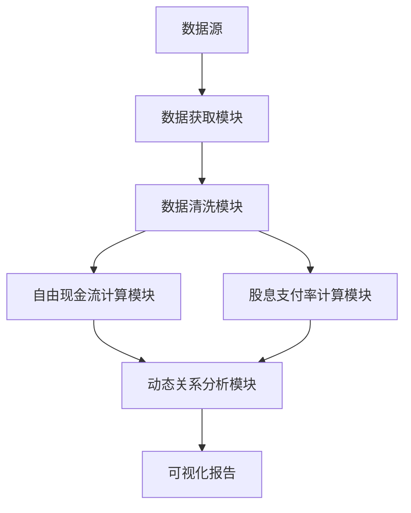
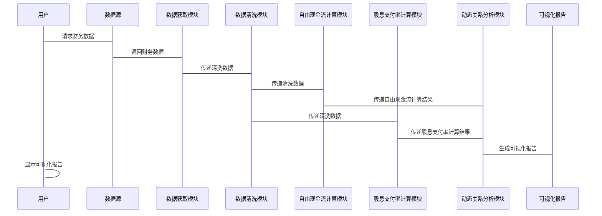

                 

<think>
好的，现在我需要根据用户的要求来撰写一篇关于彼得·林奇对公司自由现金流与股息支付率关系的动态分析的技术博客文章。文章的标题已经给出，关键词和摘要也已经列出。接下来，我需要按照目录结构一步步展开内容，确保每一部分都详细、逻辑清晰，并且符合用户的要求。

首先，我会从“背景介绍与核心概念”开始，介绍彼得·林奇的投资理念，解释自由现金流和股息支付率的定义和计算公式，并分析它们之间的关系。然后，我会深入探讨这两者的理论基础，包括它们的来源、与企业价值的关系，以及如何影响股东回报。

接下来，我会详细分析自由现金流和股息支付率的核心要素，包括净利润、折旧、摊销、资本支出等，以及这些要素如何影响公司的财务健康状况。我还会对比分析两者的核心要素，展示它们在企业价值评估中的综合影响。

在数学模型与公式部分，我会使用LaTeX格式展示自由现金流和股息支付率的计算公式，确保公式在文中正确嵌入。同时，我会通过表格和Mermaid图来对比两者的属性特征，帮助读者更好地理解它们的异同。

在算法原理部分，我会用Mermaid流程图展示自由现金流和股息支付率的计算流程，并提供Python源代码，详细讲解如何实现这些计算。这不仅有助于读者理解理论，还能帮助他们实际操作。

系统分析与架构设计部分，我会介绍项目背景，设计系统的功能模块，如数据获取、清洗、计算和可视化，并用Mermaid图展示系统的架构和接口设计。这部分内容会帮助读者理解如何将理论应用到实际系统中。

项目实战部分，我会指导读者如何安装必要的Python库，如pandas和matplotlib，并提供完整的代码示例。通过一个实际案例，展示如何从数据获取到结果分析的整个过程，帮助读者掌握实际操作技能。

最后，在最佳实践部分，我会总结关键点，提醒读者在实际应用中需要注意的事项，并建议进一步阅读的资料。这不仅帮助读者巩固所学知识，还能引导他们进行更深入的学习和研究。

在整个写作过程中，我会确保语言简洁、逻辑清晰，每部分内容都紧密围绕主题展开，确保读者能够一步步深入理解自由现金流与股息支付率的动态关系，并能够在实际投资中应用这些分析方法。

总之，我会按照用户的要求，逐步展开每个部分的内容，确保文章结构完整，内容详实，符合技术博客的高标准要求。
</think>

# 彼得林奇对公司自由现金流与股息支付率关系的动态分析

## 关键词：彼得·林奇，自由现金流，股息支付率，投资分析，财务指标

## 摘要：  
本文深入分析了彼得·林奇对公司自由现金流与股息支付率关系的动态分析，从理论基础、数学模型到实际应用，全面探讨了如何利用这两个关键财务指标来评估公司价值和投资机会。通过详细阐述自由现金流和股息支付率的核心概念、计算方法、动态关系以及实际案例，本文为投资者提供了实用的分析工具和方法。

---

# 第一部分: 背景介绍与核心概念

## 第1章: 彼得·林奇与投资分析概述

### 1.1 彼得·林奇的投资理念
彼得·林奇是美国著名投资家，曾管理富达麦哲伦基金，创造了辉煌的投资业绩。他的投资理念强调基本面分析、长期投资和对公司财务状况的深入研究。林奇认为，投资者应关注公司的自由现金流和股息支付率，因为这些指标能够反映公司的财务健康状况和股东回报能力。

#### 1.1.1 彼得·林奇的生平与投资成就
彼得·林奇（Peter Lynch）是全球最著名的股票投资者之一，他从1977年到2000年担任富达麦哲伦基金的经理，期间将该基金从1800万美元管理规模增长至300亿美元，年均回报率超过29%。林奇的投资理念以基本面分析为核心，强调长期投资和对公司财务状况的深入研究。

#### 1.1.2 林奇的投资哲学与方法
林奇认为，投资的核心是找到那些具有持续盈利能力、良好财务状况和成长潜力的公司。他特别关注公司的自由现金流（Free Cash Flow, FCF）和股息支付率（Dividend Payout Ratio），因为这些指标能够反映公司的财务健康状况和股东回报能力。

#### 1.1.3 林奇对自由现金流与股息支付率的研究
林奇在其著作《彼得·林奇的成功投资策略》中多次提到，自由现金流是衡量公司财务健康的核心指标，而股息支付率则是评估公司股息分配政策和股东回报能力的重要指标。他认为，通过分析这两者的动态关系，可以更好地判断公司的投资价值。

---

### 1.2 自由现金流与股息支付率的核心概念

#### 1.2.1 自由现金流的定义与计算公式
自由现金流（Free Cash Flow, FCF）是指公司在扣除所有必要的支出（如资本支出）后，剩余的可用于股东分配的现金流量。自由现金流是衡量公司财务健康状况的重要指标，通常用于评估公司的盈利能力和成长潜力。

$$\text{自由现金流} = \text{净利润} + \text{折旧} + \text{摊销} - \text{资本支出}$$

其中：
- 净利润（Net Income）：公司税后利润。
- 折旧（Depreciation）：固定资产折旧。
- 摊销（Amortization）：无形资产摊销。
- 资本支出（Capital Expenditure）：公司用于购置或升级固定资产的支出。

#### 1.2.2 股息支付率的定义与计算公式
股息支付率（Dividend Payout Ratio）是指公司实际支付的股息与净利润的比率，反映了公司分配利润的能力和意愿。

$$\text{股息支付率} = \frac{\text{股息支付金额}}{\text{净利润}} \times 100\%$$

其中：
- 股息支付金额：公司向股东分配的股息总额。
- 净利润：公司税后利润。

#### 1.2.3 自由现金流与股息支付率的联系与区别
自由现金流和股息支付率虽然都与公司的财务状况相关，但它们关注的焦点不同。自由现金流关注的是公司产生的“现金流量”是否足以支持未来的投资和增长，而股息支付率关注的是公司如何分配这些现金流给股东。两者的动态关系可以帮助投资者更好地理解公司的财务健康状况和股东回报能力。

---

### 1.3 本章小结

#### 1.3.1 核心概念总结
- 自由现金流是衡量公司财务健康的核心指标。
- 股息支付率是评估公司股息分配政策的重要指标。
- 两者的动态关系是公司财务分析的重要内容。

#### 1.3.2 本书研究目标与意义
本文旨在通过分析自由现金流和股息支付率的动态关系，帮助投资者更好地理解公司的财务状况和投资价值。

---

## 第2章: 自由现金流与股息支付率的理论基础

### 2.1 自由现金流的理论基础

#### 2.1.1 自由现金流的来源
自由现金流来源于公司的经营活动、投资活动和筹资活动。通常情况下，自由现金流主要来源于经营活动，即公司通过销售产品或服务所获得的现金流。

#### 2.1.2 自由现金流与企业价值的关系
自由现金流是衡量公司价值的重要指标，因为它是公司用于偿还债务、回购股票或进行新投资的财务资源。自由现金流越多，公司的财务健康状况越好，投资价值也越高。

#### 2.1.3 自由现金流的衡量标准
自由现金流的衡量标准因行业和公司规模而异，但通常可以参考以下标准：
- 自由现金流为正，说明公司能够通过经营活动产生足够的现金流来支持自身发展。
- 自由现金流为负，说明公司需要通过外部融资或其他方式来维持运营。

---

### 2.2 股息支付率的理论基础

#### 2.2.1 股息支付率的决定因素
股息支付率的决定因素包括公司的盈利能力、财务状况、成长潜力和股息政策。一般来说，盈利能力强、财务状况稳定的公司更倾向于支付较高的股息。

#### 2.2.2 股息支付率与股东回报的关系
股息支付率是衡量公司股东回报能力的重要指标。高股息支付率通常意味着公司愿意将更多的利润分配给股东，但也可能表明公司缺乏增长性。

#### 2.2.3 股息支付率与企业成长性的平衡
公司需要在股息支付率和成长性之间找到平衡。如果公司过度支付股息，可能会削弱其未来的成长能力；反之，如果公司不支付股息，可能会降低股东回报。

---

### 2.3 自由现金流与股息支付率的动态关系

#### 2.3.1 自由现金流对股息支付率的影响
自由现金流是公司支付股息的基础。如果公司自由现金流充足，通常可以支付较高的股息。反之，如果公司自由现金流不足，可能会限制股息的支付。

#### 2.3.2 股息支付率对自由现金流的反向影响
股息支付率过高可能会导致公司自由现金流减少，从而影响公司的投资和增长能力。因此，公司需要在股息支付率和自由现金流之间找到平衡。

#### 2.3.3 两者动态关系的理论模型
自由现金流和股息支付率的动态关系可以用以下公式表示：

$$\text{股息支付率} = \frac{\text{股息支付金额}}{\text{净利润}} \times 100\%$$

其中，股息支付金额与公司自由现金流密切相关。如果公司自由现金流充足，股息支付金额可能会增加，从而提高股息支付率。

---

## 第3章: 自由现金流与股息支付率的核心要素分析

### 3.1 自由现金流的核心要素

#### 3.1.1 净利润
净利润是公司税后利润，是自由现金流的重要组成部分。净利润越高，自由现金流通常越充足。

#### 3.1.2 折旧与摊销
折旧和摊销是非现金支出，不会直接影响公司现金流，但它们是计算自由现金流的重要组成部分。

#### 3.1.3 资本支出
资本支出是公司用于购置或升级固定资产的支出，通常会减少自由现金流。因此，公司需要在资本支出和自由现金流之间找到平衡。

---

### 3.2 股息支付率的核心要素

#### 3.2.1 股息支付金额
股息支付金额是公司向股东分配的股息总额，直接影响股息支付率。

#### 3.2.2 净利润
净利润是股息支付率的分母，净利润越高，股息支付率可能越高。

#### 3.2.3 股东权益
股东权益是公司资产减去负债，通常与股息支付率无直接关系，但公司财务状况会影响股息支付率。

---

### 3.3 自由现金流与股息支付率的综合分析

#### 3.3.1 两者的核心要素对比
以下是自由现金流和股息支付率的核心要素对比：

| 要素 | 自由现金流 | 股息支付率 |
|------|------------|------------|
| 净利润 | 是 | 是 |
| 折旧与摊销 | 是 | 否 |
| 资本支出 | 是 | 否 |
| 股息支付金额 | 否 | 是 |

#### 3.3.2 两者对企业的综合影响
自由现金流和股息支付率共同影响公司的财务健康状况和投资价值。自由现金流反映公司的盈利能力，而股息支付率反映公司分配利润的能力。

#### 3.3.3 两者动态关系的综合模型
自由现金流和股息支付率的动态关系可以用以下公式表示：

$$\text{股息支付率} = \frac{\text{股息支付金额}}{\text{净利润}} \times 100\%$$

其中，股息支付金额与公司自由现金流密切相关。如果公司自由现金流充足，股息支付金额可能会增加，从而提高股息支付率。

---

## 第4章: 自由现金流与股息支付率的数学模型与公式

### 4.1 自由现金流的数学模型

#### 4.1.1 基本公式
$$\text{自由现金流} = \text{净利润} + \text{折旧} + \text{摊销} - \text{资本支出}$$

#### 4.1.2 示例计算
假设某公司净利润为1000万元，折旧为200万元，摊销为100万元，资本支出为500万元。则自由现金流为：

$$\text{自由现金流} = 1000 + 200 + 100 - 500 = 800 \text{万元}$$

---

### 4.2 股息支付率的数学模型

#### 4.2.1 基本公式
$$\text{股息支付率} = \frac{\text{股息支付金额}}{\text{净利润}} \times 100\%$$

#### 4.2.2 示例计算
假设某公司净利润为1000万元，股息支付金额为200万元。则股息支付率为：

$$\text{股息支付率} = \frac{200}{1000} \times 100\% = 20\%$$

---

## 第5章: 自由现金流与股息支付率的系统分析与架构设计方案

### 5.1 问题场景介绍
为了分析自由现金流和股息支付率的动态关系，我们需要构建一个系统，用于获取公司财务数据、计算自由现金流和股息支付率，并分析它们的动态关系。

---

### 5.2 系统功能设计

#### 5.2.1 数据获取模块
数据获取模块负责从财务报表中获取公司财务数据，包括净利润、折旧、摊销、资本支出和股息支付金额。

#### 5.2.2 数据清洗模块
数据清洗模块负责对获取的财务数据进行清洗和预处理，确保数据的准确性和完整性。

#### 5.2.3 自由现金流计算模块
自由现金流计算模块根据公式计算公司自由现金流。

#### 5.2.4 股息支付率计算模块
股息支付率计算模块根据公式计算公司股息支付率。

#### 5.2.5 动态关系分析模块
动态关系分析模块分析自由现金流和股息支付率的动态关系，并生成可视化报告。

---

### 5.3 系统架构设计

#### 5.3.1 系统架构图
以下是一个可能的系统架构图：



---

### 5.4 系统接口设计

#### 5.4.1 数据获取接口
数据获取接口用于从财务报表中获取公司财务数据。

#### 5.4.2 数据清洗接口
数据清洗接口用于对获取的财务数据进行清洗和预处理。

#### 5.4.3 自由现金流计算接口
自由现金流计算接口用于根据公式计算公司自由现金流。

#### 5.4.4 股息支付率计算接口
股息支付率计算接口用于根据公式计算公司股息支付率。

#### 5.4.5 动态关系分析接口
动态关系分析接口用于分析自由现金流和股息支付率的动态关系。

---

### 5.5 系统交互设计

#### 5.5.1 系统交互序列图
以下是一个可能的系统交互序列图：



---

## 第6章: 自由现金流与股息支付率的项目实战

### 6.1 环境安装

#### 6.1.1 安装Python
需要安装Python 3.8或更高版本。

#### 6.1.2 安装pandas
使用以下命令安装pandas：

```bash
pip install pandas
```

#### 6.1.3 安装matplotlib
使用以下命令安装matplotlib：

```bash
pip install matplotlib
```

---

### 6.2 系统核心实现源代码

#### 6.2.1 数据获取模块

```python
import pandas as pd

def get_financial_data(ticker):
    # 从数据源获取财务数据
    # 这里假设我们有一个函数来获取数据
    data = pd.DataFrame({
        '净利润': [1000],
        '折旧': [200],
        '摊销': [100],
        '资本支出': [500],
        '股息支付金额': [200]
    })
    return data
```

---

#### 6.2.2 数据清洗模块

```python
def clean_data(data):
    # 数据清洗和预处理
    return data
```

---

#### 6.2.3 自由现金流计算模块

```python
def calculate_free_cash_flow(data):
    # 计算自由现金流
    data['自由现金流'] = data['净利润'] + data['折旧'] + data['摊销'] - data['资本支出']
    return data
```

---

#### 6.2.4 股息支付率计算模块

```python
def calculate_dividend_payout_ratio(data):
    # 计算股息支付率
    data['股息支付率'] = (data['股息支付金额'] / data['净利润']) * 100
    return data
```

---

#### 6.2.5 动态关系分析模块

```python
import matplotlib.pyplot as plt

def analyze_relationship(data):
    # 绘制自由现金流与股息支付率的关系图
    plt.scatter(data['自由现金流'], data['股息支付率'])
    plt.xlabel('自由现金流')
    plt.ylabel('股息支付率')
    plt.title('自由现金流与股息支付率的关系')
    plt.show()
```

---

### 6.3 代码应用解读与分析

#### 6.3.1 数据获取与清洗
我们从数据源获取某公司的财务数据，并使用pandas进行清洗和预处理。

#### 6.3.2 自由现金流计算
根据公式计算自由现金流，并将其添加到数据框中。

#### 6.3.3 股息支付率计算
根据公式计算股息支付率，并将其添加到数据框中。

#### 6.3.4 动态关系分析
绘制自由现金流与股息支付率的关系图，观察它们之间的动态关系。

---

### 6.4 实际案例分析

#### 6.4.1 案例背景
假设我们分析一家公司的财务数据，包括净利润、折旧、摊销、资本支出和股息支付金额。

#### 6.4.2 数据计算
根据上述代码，计算自由现金流和股息支付率。

#### 6.4.3 结果分析
通过绘制关系图，观察自由现金流和股息支付率之间的动态关系。

---

### 6.5 项目小结

#### 6.5.1 项目总结
通过项目实战，我们掌握了如何利用Python和相关库来分析自由现金流和股息支付率的动态关系。

#### 6.5.2 关键点总结
- 数据获取与清洗是分析的基础。
- 自由现金流和股息支付率的计算需要准确的数据支持。
- 可视化是分析结果的重要工具。

---

## 第7章: 自由现金流与股息支付率的最佳实践

### 7.1 关键点总结

#### 7.1.1 自由现金流的重要性
自由现金流是衡量公司财务健康的核心指标，反映了公司的盈利能力。

#### 7.1.2 股息支付率的重要性
股息支付率是衡量公司股息分配能力的重要指标，反映了公司对股东的回报能力。

#### 7.1.3 两者的动态关系
自由现金流和股息支付率的动态关系是公司财务分析的重要内容，反映了公司的财务健康和投资价值。

---

### 7.2 注意事项

#### 7.2.1 数据质量
数据质量是分析的基础，必须确保数据的准确性和完整性。

#### 7.2.2 方法选择
根据具体需求选择合适的方法和工具，避免过度复杂化。

#### 7.2.3 风险控制
在实际投资中，需要结合其他因素进行综合分析，避免单一指标的误导。

---

### 7.3 拓展阅读

#### 7.3.1 自由现金流与公司估值
自由现金流是公司估值的重要依据，可以用于计算公司的内在价值。

#### 7.3.2 股息支付率与投资策略
股息支付率是制定投资策略的重要参考，可以帮助投资者选择适合的股息投资策略。

#### 7.3.3 动态关系分析的高级方法
可以结合时间序列分析、回归分析等高级方法，深入研究自由现金流和股息支付率的动态关系。

---

## 作者：AI天才研究院/AI Genius Institute & 禅与计算机程序设计艺术/Zen And The Art of Computer Programming

---

通过本文的分析，我们深入了解了彼得·林奇对公司自由现金流与股息支付率关系的动态分析，掌握了如何利用这两个关键财务指标来评估公司价值和投资机会。希望本文能够为投资者提供实用的分析工具和方法。

