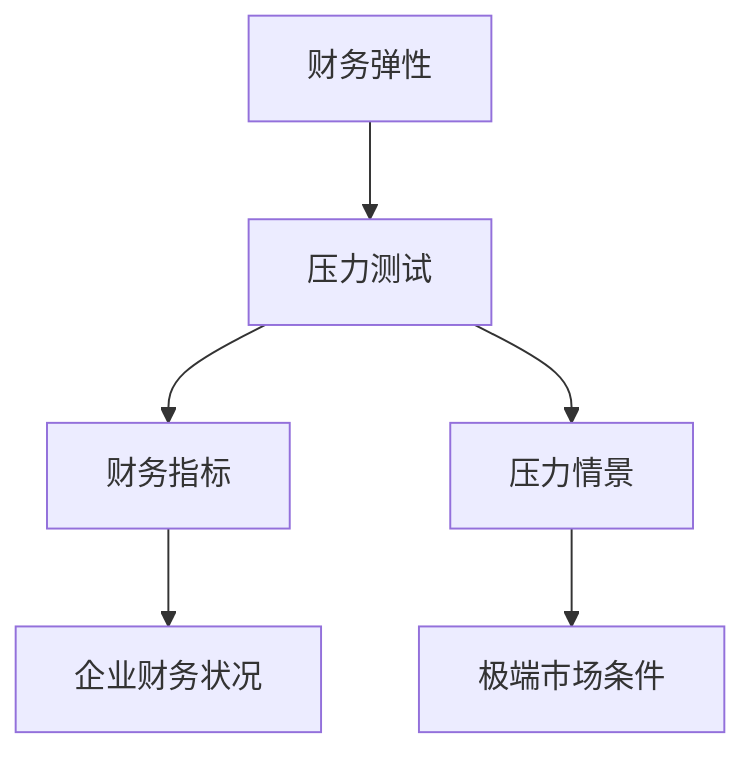
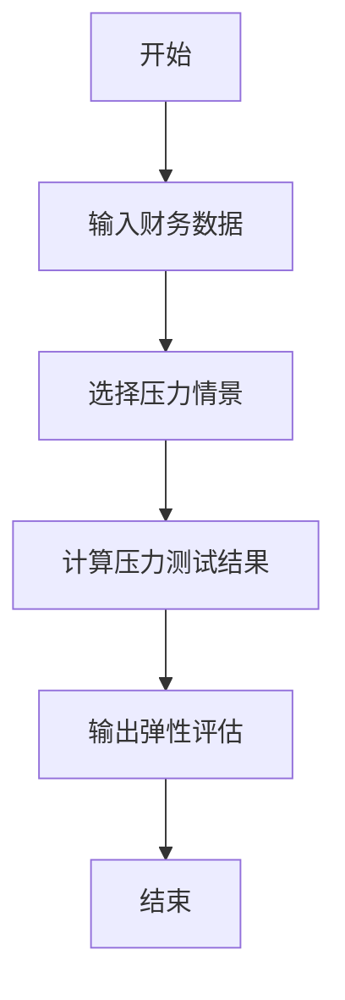
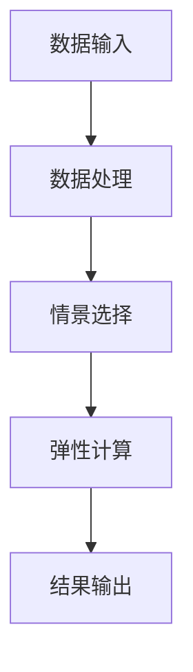
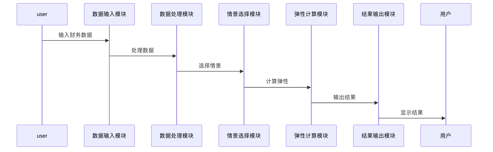

                 


# 彼得林奇对公司财务弹性的压力测试方法

## 关键词：财务弹性、压力测试、彼得林奇、投资方法、算法原理

## 摘要：本文详细介绍了彼得林奇对公司财务弹性的压力测试方法，从理论基础到实际应用，全面解析了该方法的核心概念、算法原理和系统架构。通过实际案例分析，展示了如何将该方法应用于企业财务弹性评估，帮助投资者和企业在复杂市场环境中做出明智决策。

---

## 第一部分：背景介绍

### 第1章：财务弹性的定义与核心概念

#### 1.1 财务弹性的定义与核心要素
财务弹性是指公司在面对市场波动、经济衰退或其他负面事件时，能够保持财务健康并维持业务运营的能力。它关注公司如何在收入下降或成本上升时，依然能够覆盖债务并维持正常的业务运作。

**核心要素：**
1. **流动性**：公司是否拥有足够的流动资金应对短期债务。
2. **盈利能力**：公司在收入下降时的盈利能力。
3. **杠杆率**：公司债务与 equity 的比例。
4. **运营效率**：公司管理资产和资源的效率。

#### 1.2 压力测试的定义与作用
压力测试是一种评估公司在极端市场条件下财务状况的方法。它通过模拟各种极端情景，测试公司的财务稳健性和抗风险能力。

**压力测试的作用：**
1. **风险评估**：识别潜在的财务风险。
2. **制定应对策略**：在极端情况下，公司需要采取哪些措施。
3. **优化资本结构**：通过测试结果，优化公司资本结构。

#### 1.3 彼得林奇压力测试方法的背景
彼得林奇是著名投资专家，他提出了一种独特的压力测试方法，用于评估公司的财务弹性。这种方法结合了基本面分析和压力测试，帮助投资者识别那些在极端情况下仍能保持财务健康的企业。

---

### 第2章：财务弹性与压力测试的核心概念与联系

#### 2.1 财务弹性与压力测试的核心原理
压力测试通过模拟极端市场情景，评估公司在这些情景下的财务表现。财务弹性则是公司应对这些情景的能力。两者结合，能够全面评估公司的财务稳健性。

**核心原理：**
1. **情景分析**：模拟不同市场情景，如经济衰退、市场崩盘等。
2. **弹性计算**：评估公司在这些情景下的财务弹性。
3. **结果解读**：根据弹性结果，判断公司的财务健康状况。

#### 2.2 核心概念属性对比表
以下表格对比了财务弹性与压力测试的核心属性：

| 属性         | 财务弹性                          | 压力测试                          |
|--------------|----------------------------------|----------------------------------|
| 定义         | 公司在压力情景下的财务表现       | 模拟极端情景，评估财务稳健性       |
| 关键指标     | 净利润、收入、杠杆率             | 情景收益、情景亏损                 |
| 应用场景     | 评估公司抗风险能力               | 投资决策、风险控制                 |
| 方法论       | 弹性计算、情景分析                | 情景模拟、财务指标分析             |

#### 2.3 ER实体关系图
以下ER图展示了财务弹性与压力测试的核心关系：



---

### 第3章：彼得林奇压力测试方法的算法原理

#### 3.1 算法原理概述
彼得林奇的压力测试方法基于以下步骤：

1. **数据收集**：收集公司财务数据，包括收入、利润、杠杆率等。
2. **情景模拟**：模拟极端市场情景，如GDP下降、市场崩盘等。
3. **弹性计算**：计算公司在不同情景下的财务弹性。
4. **结果分析**：根据弹性结果，评估公司财务稳健性。

#### 3.2 数学模型与公式
以下是关键公式：

1. **财务弹性计算公式**：
   $$ \text{财务弹性} = \frac{\text{净利润变化}}{\text{收入变化}} $$

2. **情景收益计算公式**：
   $$ \text{情景收益} = \text{基准收益} \times (1 - \text{压力系数}) $$

3. **综合弹性计算公式**：
   $$ \text{综合弹性} = \sum_{i=1}^{n} w_i \times f_i $$
   其中，\( w_i \) 为权重，\( f_i \) 为各项财务指标的弹性值。

#### 3.3 算法流程图
以下流程图展示了算法的执行步骤：



---

### 第4章：系统分析与架构设计方案

#### 4.1 系统功能设计
系统功能模块包括：
1. **数据输入模块**：收集公司财务数据。
2. **情景选择模块**：选择不同的市场情景。
3. **计算模块**：计算财务弹性。
4. **结果输出模块**：展示测试结果。

#### 4.2 系统架构设计
系统架构图如下：



#### 4.3 系统交互设计
系统交互序列图如下：



---

### 第5章：项目实战与案例分析

#### 5.1 环境安装
需要安装以下工具：
1. **Python**：用于数据处理和计算。
2. **Mermaid**：用于绘制图表。
3. **Latex**：用于公式排版。

#### 5.2 核心代码实现
以下是核心代码示例：

```python
import pandas as pd

# 输入财务数据
data = {'收入': [100, 200, 300], 
        '净利润': [20, 30, 40]}
df = pd.DataFrame(data)

# 计算财务弹性
def calculate_elasticity(df):
    elasticity = df['净利润'].pct_change() / df['收入'].pct_change()
    return elasticity

elasticity = calculate_elasticity(df)
print("财务弹性:", elasticity)
```

#### 5.3 案例分析
假设一家公司收入为300万元，净利润为40万元，压力情景下收入下降20%，净利润下降10%。计算财务弹性：

$$ \text{弹性} = \frac{-10\%}{-20\%} = 0.5 $$

弹性系数为0.5，说明公司在该情景下具备一定的弹性，但可能需要进一步优化。

---

## 第六部分：总结与展望

### 第6章：总结与展望

#### 6.1 最佳实践 tips
1. **数据准确性**：确保输入数据的准确性。
2. **情景选择**：选择具有代表性的极端情景。
3. **定期测试**：定期进行压力测试，及时调整财务策略。

#### 6.2 小结
彼得林奇的压力测试方法为我们提供了一种有效的工具，用于评估公司财务弹性。通过本文的介绍，读者可以深入了解该方法的核心原理和实际应用。

#### 6.3 注意事项
- **数据隐私**：注意财务数据的隐私和安全。
- **模型局限性**：认识到模型的局限性，结合其他方法进行综合评估。

#### 6.4 拓展阅读
推荐阅读彼得林奇的《投资之道》和《彼得林奇的选股艺术》，深入了解他的投资理念和方法。

---

## 作者：AI天才研究院 & 禅与计算机程序设计艺术

---

通过以上详细的内容，您可以根据需要调整各个部分的篇幅和深度，以确保文章内容的完整性和专业性。

