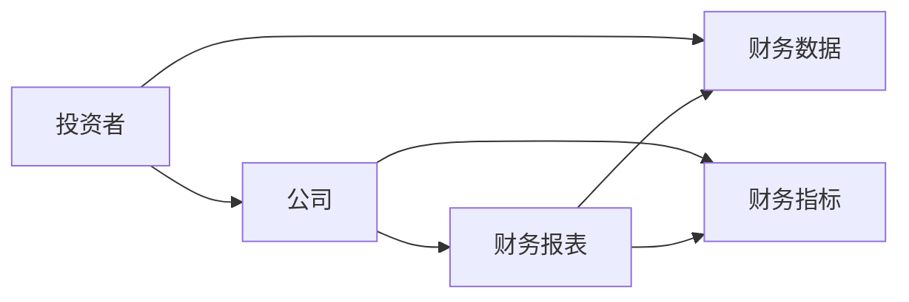
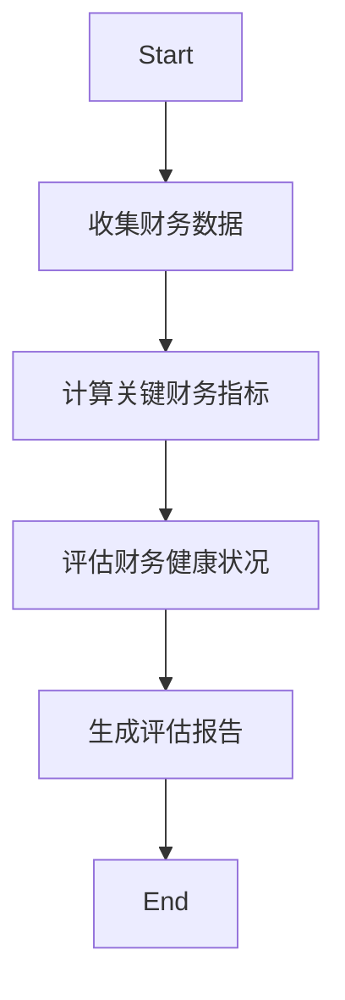
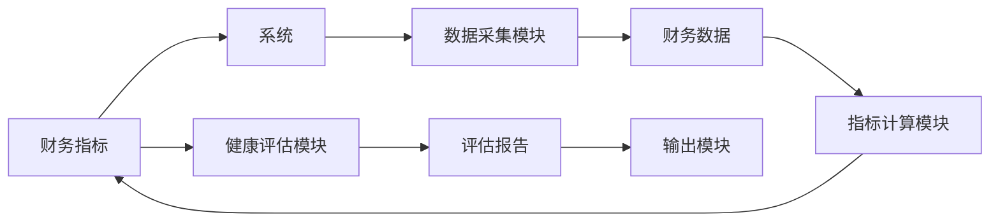
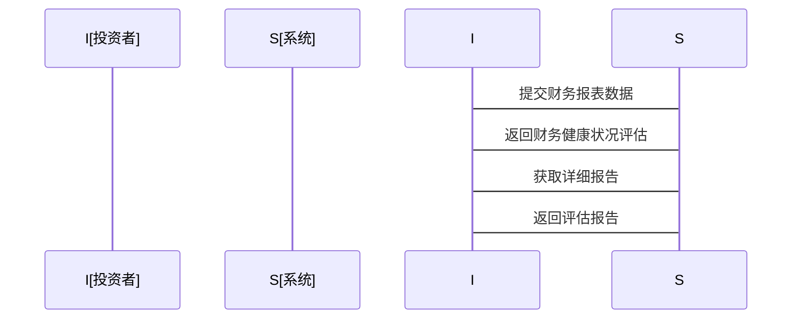

                 


# 彼得林奇对公司财务报表质量的评估

**关键词**: 财务报表质量, 彼得林奇, 投资分析, 财务指标, 企业估值, 财务健康状况, 投资决策

**摘要**: 本文深入探讨了彼得·林奇在公司财务报表质量评估方面的独特见解和方法。通过分析财务报表的核心要素、评估指标和数学模型，结合实际案例，详细阐述了如何运用这些方法进行投资决策。文章还提供了系统架构设计和项目实战指南，帮助读者掌握财务报表质量评估的实用技巧。

---

## 第一部分: 财务报表质量评估的背景与基础

### 第1章: 财务报表质量评估的背景与重要性

#### 1.1 财务报表质量评估的背景

##### 1.1.1 财务报表的基本概念
- 财务报表是企业财务状况和经营成果的官方记录。
- 主要包括资产负债表、利润表和现金流量表。
- 财务报表反映了企业的资产、负债、收入和利润等关键信息。

##### 1.1.2 彼得·林奇与财务报表分析
- 彼得·林奇是美国著名的投资经理人，以价值投资和深入的财务分析著称。
- 他强调通过财务报表识别企业的财务健康状况和投资价值。
- 林奇的方法结合了定量分析和定性分析，注重企业的基本面和管理层能力。

##### 1.1.3 财务报表质量评估的定义与目标
- 财务报表质量评估是通过对财务数据的分析，判断企业财务健康状况的过程。
- 目标是帮助投资者和企业管理者做出更明智的决策。

#### 1.2 财务报表质量评估的重要性

##### 1.2.1 对投资者的意义
- 投资者通过财务报表评估企业的盈利能力和成长潜力。
- 优质财务报表通常意味着较高的投资价值。

##### 1.2.2 对企业管理者的意义
- 企业管理者可以通过财务报表分析识别经营中的问题，优化管理策略。
- 财务报表质量是企业信用评级和融资能力的重要依据。

##### 1.2.3 对企业整体的意义
- 财务报表质量反映了企业的财务健康状况，影响企业的市场形象和投资者信心。

#### 1.3 本书的核心目标与框架

##### 1.3.1 核心目标
- 介绍彼得·林奇的财务报表分析方法。
- 提供一套系统化的财务报表质量评估框架。
- 结合实际案例，展示如何将理论应用于实践。

##### 1.3.2 框架概述
- 第一部分：财务报表质量评估的背景与基础。
- 第二部分：财务报表质量评估的核心概念与联系。
- 第三部分：财务报表质量评估的算法原理。
- 第四部分：财务报表质量评估的系统分析与架构设计。
- 第五部分：财务报表质量评估的项目实战。
- 第六部分：财务报表质量评估的最佳实践与小结。

---

### 第2章: 财务报表质量评估的核心概念与联系

#### 2.1 财务报表质量评估的核心概念

##### 2.1.1 财务报表的基本构成要素
- 资产：企业拥有的资源，包括现金、应收账款、存货等。
- 负债：企业的债务，包括应付账款、短期借款等。
- 所有者权益：企业净资产，等于资产减去负债。
- 收入：企业在一定时期内通过销售商品或提供服务所获得的收入。
- 利润：收入减去成本和费用后的净收益。

##### 2.1.2 财务报表质量评估的属性特征
- **定性特征**：包括管理层的诚信、会计政策的合理性、财务透明度等。
- **定量特征**：包括盈利能力、偿债能力、运营效率和成长能力等。

##### 2.1.3 财务报表质量评估的核心指标
- 净利润增长率：$$\text{净利润增长率} = \frac{\text{本期净利润} - \text{上期净利润}}{\text{上期净利润}} \times 100\%$$
- 资产负债率：$$\text{资产负债率} = \frac{\text{总负债}}{\text{总资产}} \times 100\%$$
- 净资产收益率（ROE）：$$\text{ROE} = \frac{\text{净利润}}{\text{所有者权益}} \times 100\%$$
- 营业利润率：$$\text{营业利润率} = \frac{\text{营业利润}}{\text{营业收入}} \times 100\%$$

#### 2.2 财务报表质量评估的ER实体关系图



---

### 第3章: 财务报表质量评估的算法原理

#### 3.1 财务报表质量评估的算法流程



#### 3.2 财务报表质量评估的数学模型

##### 3.2.1 净利润增长率公式

$$\text{净利润增长率} = \frac{\text{本期净利润} - \text{上期净利润}}{\text{上期净利润}} \times 100\%$$

##### 3.2.2 资产负债率公式

$$\text{资产负债率} = \frac{\text{总负债}}{\text{总资产}} \times 100\%$$

##### 3.2.3 净资产收益率（ROE）公式

$$\text{ROE} = \frac{\text{净利润}}{\text{所有者权益}} \times 100\%$$

##### 3.2.4 营业利润率公式

$$\text{营业利润率} = \frac{\text{营业利润}}{\text{营业收入}} \times 100\%$$

---

### 第4章: 财务报表质量评估的系统分析与架构设计

#### 4.1 系统分析

##### 4.1.1 问题场景介绍
- 投资者需要快速、准确地评估多个公司的财务报表质量。
- 企业需要定期监控自身的财务健康状况。

##### 4.1.2 系统功能设计
- 数据采集模块：从财务报表中提取关键数据。
- 指标计算模块：计算各项财务指标。
- 质量评估模块：基于指标评估财务健康状况。
- 报告生成模块：生成评估报告。

##### 4.1.3 领域模型设计


#### 4.2 系统架构设计

##### 4.2.1 系统架构图



##### 4.2.2 接口设计
- 数据输入接口：支持多种格式的财务报表数据导入。
- 指标计算接口：提供API用于调用财务指标计算功能。
- 报告生成接口：生成HTML或PDF格式的评估报告。

##### 4.2.3 交互设计



---

### 第5章: 财务报表质量评估的项目实战

#### 5.1 环境安装与配置

##### 5.1.1 环境要求
- Python 3.8+
- Jupyter Notebook 或 IDE（如PyCharm）
- 数据库（可选）

##### 5.1.2 安装依赖
```bash
pip install pandas numpy matplotlib seaborn
```

#### 5.2 核心代码实现

##### 5.2.1 数据读取与清洗

```python
import pandas as pd

# 读取财务报表数据
df = pd.read_csv('financial_data.csv')

# 删除缺失值
df.dropna(inplace=True)

# 处理异常值
df = df[df['收入'] > 0]
```

##### 5.2.2 指标计算

```python
# 计算净利润增长率
df['净利润增长率'] = (df['净利润'] - df['上期净利润']) / df['上期净利润'] * 100

# 计算资产负债率
df['资产负债率'] = df['总负债'] / df['总资产'] * 100

# 计算ROE
df['ROE'] = df['净利润'] / df['所有者权益'] * 100

# 计算营业利润率
df['营业利润率'] = df['营业利润'] / df['营业收入'] * 100
```

##### 5.2.3 评估与报告生成

```python
# 评估财务健康状况
def assess_health(roa, roe, profit_margin):
    if roa > 10 and roe > 20 and profit_margin > 20:
        return '健康'
    elif roa > 5 and roe > 10 and profit_margin > 10:
        return '一般'
    else:
        return '较差'

# 生成评估报告
for company in df['公司名称']:
    roa = df[df['公司名称'] == company]['ROE'].values[0]
    roe = df[df['公司名称'] == company]['ROE'].values[0]
    profit_margin = df[df['公司名称'] == company]['营业利润率'].values[0]
    print(f"{company}的财务健康状况：{assess_health(roa, roe, profit_margin)}")
```

---

### 第6章: 财务报表质量评估的最佳实践与小结

#### 6.1 最佳实践

##### 6.1.1 数据来源与处理
- 确保数据来源的可靠性和完整性。
- 处理异常值和缺失值时要谨慎。

##### 6.1.2 指标选择与权重
- 根据行业特点选择合适的财务指标。
- 合理分配各指标的权重。

##### 6.1.3 持续监控与调整
- 定期更新财务数据，及时发现潜在问题。
- 根据市场变化调整评估模型。

#### 6.2 小结

彼得·林奇的财务报表质量评估方法为我们提供了一套系统化的工具和思路。通过定量分析和定性分析的结合，可以帮助投资者和企业管理者更准确地判断企业的财务健康状况，做出更明智的投资决策。

---

**作者：AI天才研究院/AI Genius Institute & 禅与计算机程序设计艺术/Zen And The Art of Computer Programming**

---

以上是完整的文章大纲，接下来可以按照这个结构逐步撰写文章的具体内容。

