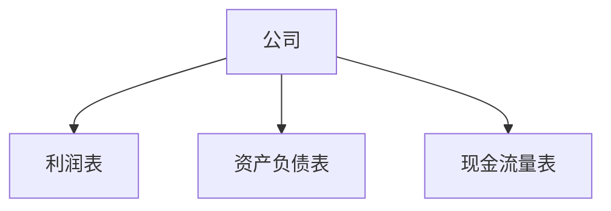

                 

<think>
好的，我现在需要帮用户撰写一篇技术博客文章，标题是《彼得林奇对公司财务报表趋势的解读》。用户要求文章结构清晰，内容详细，并且使用特定的格式，包括关键词、摘要和正文部分。

首先，我需要确定文章的关键词。财务报表分析、趋势分析、彼得林奇、投资分析、财务指标、投资决策。这些关键词涵盖了文章的主要内容。

接下来，摘要部分需要简洁明了地概括文章的核心内容。我会说明彼得林奇如何通过财务报表趋势分析来评估公司投资价值，强调趋势分析的重要性，以及文章将如何一步步讲解方法。

正文部分需要按照用户提供的目录大纲结构来组织。首先，介绍财务报表的基础知识，包括利润表、资产负债表和现金流量表。然后，讲述彼得林奇的投资理念和财务分析方法。

接下来，详细讲解财务报表趋势分析的核心概念，包括关键指标如收入、利润、资产和负债的趋势，以及如何通过特征对比和实体关系图来分析。这部分需要使用表格和Mermaid图来展示。

然后，介绍算法原理，包括财务比率分析和杜邦分析法，使用Python代码示例和公式来说明。数学模型部分用Latex公式展示，确保清晰易懂。

系统分析部分，我会设计一个完整的财务分析系统，包括功能设计、架构图和接口设计，用Mermaid图详细描述。

项目实战部分，展示如何使用Python和Pandas库进行实际分析，包括代码示例和案例分析，最后得出投资结论。

最后，总结最佳实践，包括小结、注意事项和拓展阅读，帮助读者巩固知识，并指导进一步学习。

在写作过程中，我需要确保每个部分都详细具体，使用专业但易懂的语言，并遵循用户的格式要求。同时，注意文章的逻辑性和连贯性，确保读者能够一步步深入理解彼得林奇的财务报表分析方法。

总结来说，我会按照用户的要求，分步骤、详细地构建这篇文章，确保内容全面且符合格式规范。
</think>

# 彼得林奇对公司财务报表趋势的解读

**关键词**：财务报表分析，趋势分析，彼得林奇，投资分析，财务指标，投资决策

**摘要**：本文深入解读了彼得·林奇如何通过分析公司财务报表的趋势来评估投资价值。文章从财务报表的基础知识入手，详细分析了趋势分析的核心概念、算法原理、系统架构，并通过实际案例展示了如何应用这些方法进行投资决策。

---

## 第一部分: 财务报表趋势分析的背景与基础

### 第1章: 财务报表的基础知识

#### 1.1 利润表的核心要素
利润表反映了公司在一定时期内的收入、费用和利润情况。主要指标包括：
- 营业收入：公司销售商品或服务所得的收入。
- 营业成本：生产商品或提供服务所发生的直接成本。
- 毛利润：营业收入减去营业成本。
- 营业费用：销售和管理费用。
- 净利润：公司最终的净利润，是衡量公司盈利能力的重要指标。

#### 1.2 资产负债表的核心要素
资产负债表反映了公司在某一特定时点的资产、负债和所有者权益情况。主要指标包括：
- 资产：公司拥有的资源，包括流动资产（如现金、应收账款）和非流动资产（如固定资产）。
- 负债：公司欠款，包括流动负债（如应付账款）和非流动负债（如长期借款）。
- 所有者权益：公司净资产，等于资产减去负债。

#### 1.3 现金流量表的核心要素
现金流量表反映了公司在一定时期内的现金流入和流出情况。主要指标包括：
- 经营活动现金流：公司日常经营活动产生的现金流。
- 投资活动现金流：公司投资活动（如购买或出售资产）产生的现金流。
- 筹资活动现金流：公司通过筹资活动（如发行债券或贷款）产生的现金流。

### 第2章: 财务报表趋势分析的背景

#### 2.1 彼得·林奇的投资理念
彼得·林奇是美国著名的投资经理人，以其独特的财务报表分析方法闻名。他认为，投资成功的关键在于对企业财务状况的深入分析，尤其是通过财务报表的趋势分析来判断企业的成长性和投资价值。

#### 2.2 财务报表趋势分析的重要性
财务报表趋势分析是指通过对公司过去几年的财务数据进行比较，分析公司的财务状况变化趋势。这种方法可以帮助投资者发现公司的成长性、盈利能力、偿债能力等关键指标的变化，从而做出更明智的投资决策。

---

## 第二部分: 财务报表趋势分析的核心概念与联系

### 第3章: 财务报表趋势分析的核心概念

#### 3.1 关键财务指标的趋势分析
趋势分析通常涉及以下几个关键指标：
- **收入与利润趋势**：分析公司收入和利润的增长情况，判断公司的盈利能力是否稳定或改善。
- **资产与负债趋势**：分析公司资产和负债的增长情况，判断公司的财务健康状况。
- **现金流量趋势**：分析公司现金流的变化，判断公司的流动性是否充足。

#### 3.2 财务指标特征对比表格
以下是一个对比表格，展示了不同财务指标的特征：

| 财务指标       | 特征描述                                                                 |
|----------------|--------------------------------------------------------------------------|
| 收入           | 衡量公司销售能力，收入增长表明市场需求增加或公司销售策略有效。              |
| 利润           | 衡量公司盈利能力，净利润增长表明公司管理效率提高或成本控制得当。              |
| 资产           | 衡量公司规模，资产增长表明公司投资或扩张。                                  |
| 负债           | 衡量公司债务负担，负债增长可能表明公司依赖外部融资或财务风险增加。           |
| 现金流量       | 衡量公司流动性，正向现金流表明公司有足够的资金支持运营和扩张。                |

#### 3.3 实体关系图
以下是一个简单的实体关系图，展示了财务报表的主要组成部分：



### 第4章: 财务报表趋势分析的数学模型

#### 4.1 财务比率分析
财务比率分析是趋势分析的重要工具之一。常见的财务比率包括：
- **毛利率**：$$\text{毛利率} = \frac{\text{毛利润}}{\text{营业收入}}$$
- **净利率**：$$\text{净利率} = \frac{\text{净利润}}{\text{营业收入}}$$
- **资产负债率**：$$\text{资产负债率} = \frac{\text{总负债}}{\text{总资产}}$$

#### 4.2 杜邦分析法
杜邦分析法是一种常用的财务分析方法，用于分解净资产收益率（ROE）：

$$
ROE = \text{净利润率} \times \text{总资产周转率} \times \text{杠杆比率}
$$

---

## 第三部分: 财务报表趋势分析的系统架构

### 第5章: 系统分析与架构设计

#### 5.1 系统功能设计
以下是系统功能设计的类图：


#### 5.2 系统架构设计
以下是系统架构设计的架构图：


---

## 第四部分: 项目实战

### 第6章: 项目实战与案例分析

#### 6.1 环境安装
在进行财务报表分析之前，需要安装以下工具：
- Python编程语言
- Pandas库（用于数据处理）
- Matplotlib库（用于绘制图表）

安装命令：
```bash
pip install pandas matplotlib
```

#### 6.2 核心代码实现
以下是一个简单的Python代码示例，用于分析公司的收入趋势：

```python
import pandas as pd
import matplotlib.pyplot as plt

# 假设我们有一个包含收入数据的DataFrame
data = {
    '年份': [2018, 2019, 2020, 2021],
    '收入': [100, 120, 150, 180]
}
df = pd.DataFrame(data)

# 绘制收入趋势图
plt.figure(figsize=(10, 6))
plt.plot(df['年份'], df['收入'], marker='o', linestyle='-', color='blue')
plt.title('收入趋势图')
plt.xlabel('年份')
plt.ylabel('收入（万元）')
plt.grid(True)
plt.show()
```

#### 6.3 案例分析
假设我们有一个公司的财务数据，以下是具体的分析步骤：
1. 收集过去五年的财务报表数据。
2. 使用Pandas库进行数据清洗和整理。
3. 计算关键财务比率，如毛利率、净利率等。
4. 使用Matplotlib库绘制趋势图表，分析收入、利润、资产和负债的变化趋势。
5. 基于趋势分析结果，评估公司的投资价值。

---

## 第五部分: 最佳实践与小结

### 第7章: 最佳实践与小结

#### 7.1 小结
彼得·林奇的财务报表趋势分析方法为我们提供了一个有效的工具，帮助我们评估公司的投资价值。通过分析财务报表的趋势，我们可以更好地理解公司的财务状况和未来发展前景。

#### 7.2 注意事项
- 在进行趋势分析时，需要确保数据的准确性和完整性。
- 需要结合行业背景和市场环境，综合分析公司的财务状况。
- 财务分析只是投资决策的一部分，还需要结合其他因素，如行业竞争、管理团队等。

#### 7.3 拓展阅读
- 《彼得·林奇的选股方法》
- 《财务报表分析实战指南》
- 《投资学基础》

---

**作者：AI天才研究院/AI Genius Institute & 禅与计算机程序设计艺术 /Zen And The Art of Computer Programming**

