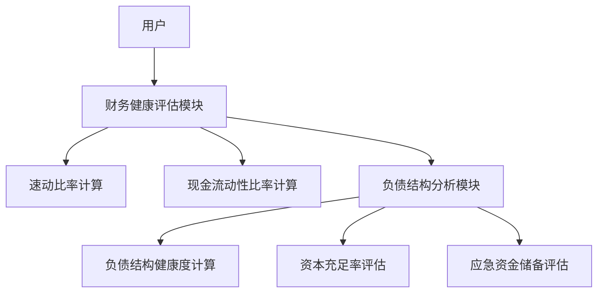
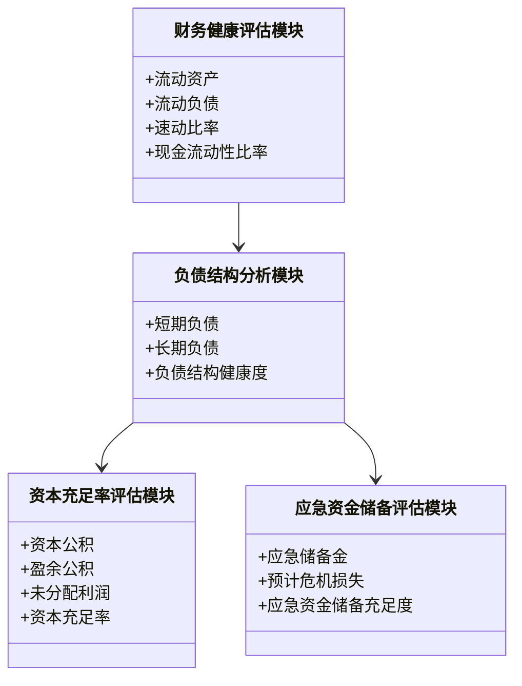

                 


# 彼得林奇对公司财务灵活性与危机应对能力的案例研究

## 关键词
- 彼得·林奇
- 财务灵活性
- 危机应对能力
- 财务健康评估
- 投资策略

## 摘要
本文通过分析彼得·林奇的投资理念，探讨公司财务灵活性与危机应对能力之间的关系。结合实际案例，详细讲解财务灵活性的关键指标和危机应对能力的评估方法，并提出优化建议。文章结构清晰，内容详实，适合投资 professionals 和企业管理者阅读。

---

# 第一部分: 财务灵活性与危机应对能力的背景介绍

## 第1章: 财务灵活性与危机应对能力的背景介绍

### 1.1 什么是财务灵活性
#### 1.1.1 财务灵活性的定义
财务灵活性是指企业在面对市场变化和突发事件时，能够迅速调整财务策略，确保资金链稳定的能力。它包括资产流动性、负债结构优化和资金调配能力。

#### 1.1.2 财务灵活性的核心要素
- 流动资产充足性
- 负债结构合理性
- 应急资金储备

#### 1.1.3 财务灵活性与企业生存能力的关系
财务灵活性是企业应对市场波动、抵御经济危机的关键。企业在财务灵活性上的表现直接影响其在危机中的生存能力。

### 1.2 危机应对能力的定义与特征
#### 1.2.1 危机应对能力的定义
危机应对能力是指企业在面对突发事件或严重财务困难时，能够采取有效措施，化解危机，维持正常运营的能力。

#### 1.2.2 危机应对能力的核心特征
- 应急资金储备
- 负债管理能力
- 风险预警机制

#### 1.2.3 危机应对能力与企业风险管理的关系
危机应对能力是企业风险管理的重要组成部分，良好的危机应对能力能够有效降低企业面临的风险。

### 1.3 彼得·林奇投资理念的核心要点
#### 1.3.1 彼得·林奇的投资者画像
彼得·林奇是美国著名投资经理人，以其在富达投资公司的成功投资业绩闻名。他注重基本面分析，关注企业的财务健康状况和管理团队。

#### 1.3.2 林奇对财务健康状况的判断标准
林奇认为，企业的财务健康状况是投资决策的关键因素，他特别关注流动资产比率、速动比率和资本充足率等指标。

#### 1.3.3 林奇的投资策略与财务灵活性的关系
林奇的投资策略强调财务灵活性的重要性，他认为企业在财务上具备灵活性，才能在市场波动中保持竞争优势。

---

## 第2章: 财务灵活性与危机应对能力的核心概念

### 2.1 财务灵活性的关键指标
#### 2.1.1 流动资产比率
流动资产比率 = 流动资产 / 流动负债  
该比率反映了企业短期偿债能力，比率越高，财务灵活性越强。

#### 2.1.2 速动比率
速动比率 = (流动资产 - 存货) / 流动负债  
速动比率衡量企业快速变现能力，通常速动比率应保持在1以上。

#### 2.1.3 现金流动性比率
现金流动性比率 = 现金及现金等价物 / 流动负债  
该比率反映了企业短期支付能力，比率越高，企业应对突发资金需求的能力越强。

### 2.2 危机应对能力的评估维度
#### 2.2.1 负债结构分析
负债结构健康度 = 短期负债 / 总负债 × 100%  
合理的负债结构能够降低企业财务风险，提高危机应对能力。

#### 2.2.2 资本充足性评估
资本充足率 = (资本公积 + 盈余公积 + 未分配利润) / 总负债 × 100%  
资本充足率高，说明企业资本结构合理，具备较强的危机应对能力。

#### 2.2.3 应急资金储备
应急资金储备充足度 = 应急储备金 / 预计危机损失 × 100%  
充足的应急资金储备是企业在危机中维持运营的关键。

### 2.3 财务灵活性与危机应对能力的关联性分析
#### 2.3.1 财务灵活性对危机应对能力的影响
财务灵活性强的企业能够更快调整财务结构，应对突发事件。

#### 2.3.2 危机应对能力对财务健康的影响
良好的危机应对能力能够降低财务风险，保持企业财务健康。

#### 2.3.3 两者之间的协同效应
财务灵活性和危机应对能力相互促进，共同提升企业财务健康状况。

---

## 第3章: 财务灵活性与危机应对能力的数学模型

### 3.1 财务灵活性的数学模型
#### 3.1.1 流动资产与流动负债的比率分析
$$
流动资产比率 = \frac{流动资产}{流动负债}
$$
$$
速动比率 = \frac{流动资产 - 存货}{流动负债}
$$
$$
现金流动性比率 = \frac{现金及现金等价物}{流动负债}
$$

#### 3.1.2 速动比率的计算公式
$$
速动比率 = \frac{流动资产 - 存货}{流动负债}
$$

#### 3.1.3 现金流动性比率的计算公式
$$
现金流动性比率 = \frac{现金及现金等价物}{流动负债}
$$

### 3.2 危机应对能力的数学模型
#### 3.2.1 负债结构分析的数学模型
$$
负债结构健康度 = \frac{短期负债}{总负债} \times 100\%
$$

#### 3.2.2 资本充足性评估的数学模型
$$
资本充足率 = \frac{资本公积 + 盈余公积 + 未分配利润}{总负债} \times 100\%
$$

#### 3.2.3 应急资金储备的数学模型
$$
应急资金储备充足度 = \frac{应急储备金}{预计危机损失} \times 100\%
$$

---

## 第4章: 财务灵活性与危机应对能力的系统分析

### 4.1 问题场景介绍
#### 4.1.1 危机时期企业的财务压力
企业在危机时期可能面临资金链断裂、负债过高、流动性不足等问题。

#### 4.1.2 财务灵活性不足对企业的影响
财务灵活性不足可能导致企业在危机中无法及时调整财务结构，影响生存能力。

#### 4.1.3 危机应对能力不足的风险
危机应对能力不足可能导致企业陷入财务困境，甚至破产。

### 4.2 项目介绍
#### 4.2.1 项目目标
提高企业财务灵活性，增强危机应对能力。

#### 4.2.2 项目范围
分析企业财务状况，优化财务结构，制定危机应对策略。

#### 4.2.3 项目关键成功因素
- 准确的财务分析
- 合理的负债结构
- 充足的应急资金储备

### 4.3 系统功能设计
#### 4.3.1 财务健康评估模块
- 流动资产比率计算
- 速动比率计算
- 现金流动性比率计算

#### 4.3.2 危机应对能力分析模块
- 负债结构分析
- 资本充足率评估
- 应急资金储备评估

#### 4.3.3 财务灵活性优化建议模块
- 流动资产优化建议
- 负债结构优化建议
- 应急资金储备优化建议

### 4.4 系统架构设计
#### 4.4.1 系统架构图


#### 4.4.2 领域模型


---

## 第5章: 项目实战

### 5.1 环境安装
- 需要安装Python和相关库（如pandas、numpy、scipy）。

### 5.2 系统核心实现源代码
```python
import pandas as pd
import numpy as np

# 计算流动资产比率
def calculate_current_assets_ratio(current_assets, current_liabilities):
    return current_assets / current_liabilities

# 计算速动比率
def calculate_quick_ratio(current_assets, inventory, current_liabilities):
    return (current_assets - inventory) / current_liabilities

# 计算现金流动性比率
def calculate_cash_flow_ratio(cash_and_cash_equivalents, current_liabilities):
    return cash_and_cash_equivalents / current_liabilities

# 计算负债结构健康度
def calculate_liability_health(short_term_liabilities, total_liabilities):
    return (short_term_liabilities / total_liabilities) * 100

# 计算资本充足率
def calculate_capital Adequacy(Ratio, capital_reserve, surplus_reserve, undistributed_profits, total_liabilities):
    return (capital_reserve + surplus_reserve + undistributed_profits) / total_liabilities * 100

# 计算应急资金储备充足度
def calculate_emergency_reserve Adequacy(emergency_reserve, expected_crisis_loss):
    return emergency_reserve / expected_crisis_loss * 100

# 示例数据
data = {
    '流动资产': [1000000],
    '存货': [500000],
    '流动负债': [800000],
    '短期负债': [400000],
    '长期负债': [600000],
    '资本公积': [200000],
    '盈余公积': [300000],
    '未分配利润': [500000],
    '应急储备金': [100000],
    '预计危机损失': [50000]
}

df = pd.DataFrame(data)

# 计算指标
current_assets_ratio = calculate_current_assets_ratio(1000000, 800000)
quick_ratio = calculate_quick_ratio(1000000, 500000, 800000)
cash_flow_ratio = calculate_cash_flow_ratio(100000, 800000)
liability_health = calculate_liability_health(400000, 1000000)
capital Adequacy_ratio = calculate_capital Adequacy(200000, 300000, 500000, 1000000)
emergency_reserve_Adequacy = calculate_emergency_reserve_Adequacy(100000, 50000)

# 输出结果
print(f"流动资产比率: {current_assets_ratio}")
print(f"速动比率: {quick_ratio}")
print(f"现金流动性比率: {cash_flow_ratio}")
print(f"负债结构健康度: {liability_health}%")
print(f"资本充足率: {capital Adequacy_ratio}%")
print(f"应急资金储备充足度: {emergency_reserve_Adequacy}%")
```

### 5.3 代码应用解读与分析
通过上述代码，我们可以计算出企业的财务灵活性和危机应对能力的关键指标，帮助企业识别财务风险，制定优化策略。

### 5.4 案例分析
以某制造企业为例，计算其财务灵活性和危机应对能力的关键指标，分析其财务状况，并提出优化建议。

---

## 第6章: 最佳实践、小结、注意事项、拓展阅读

### 6.1 最佳实践
- 定期评估企业的财务灵活性和危机应对能力。
- 合理调整负债结构，保持足够的流动资产。
- 建立应急资金储备，增强危机应对能力。

### 6.2 小结
本文通过分析彼得·林奇的投资理念，探讨了财务灵活性与危机应对能力的关系，并提出了优化建议。企业应重视财务灵活性和危机应对能力的建设，以应对市场波动和突发事件。

### 6.3 注意事项
- 财务指标分析应结合企业实际情况。
- 优化财务结构时，需考虑企业的行业特点和经营状况。
- 应急资金储备应根据企业规模和风险敞口合理设定。

### 6.4 拓展阅读
- 彼得·林奇的《投资最重要的事情》
- 《财务报表分析与企业价值评估》
- 《危机管理与企业风险管理》

---

## 作者信息
作者：AI天才研究院 & 禅与计算机程序设计艺术

