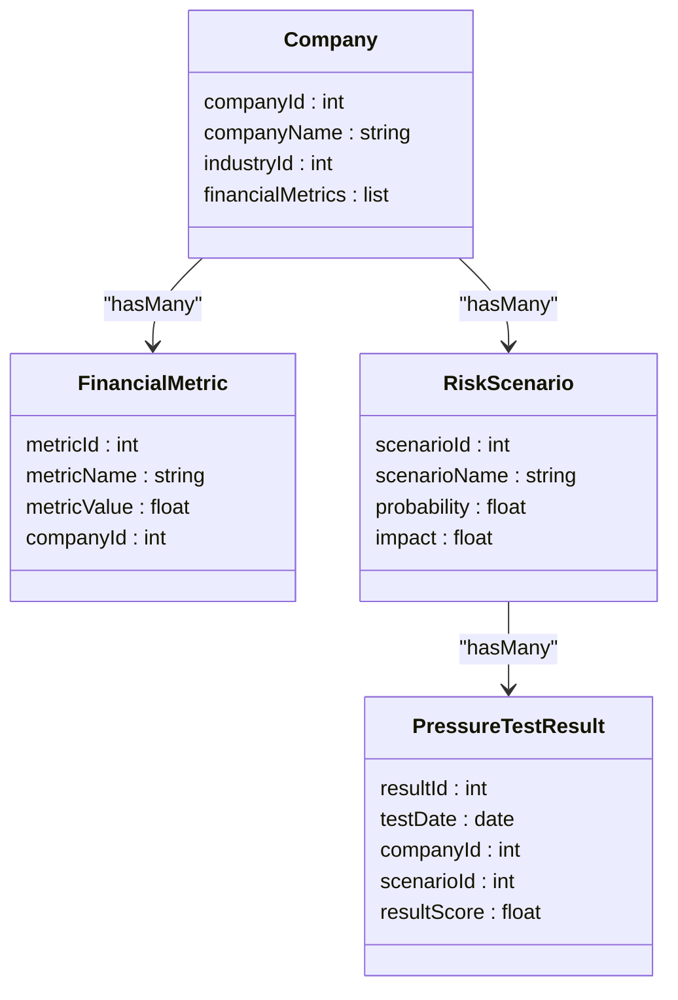

                 


# 彼得林奇对公司财务灵活性的压力测试

> 关键词：财务灵活性，压力测试，彼得·林奇，风险管理，企业价值

> 摘要：本文深入探讨了彼得·林奇对公司财务灵活性的压力测试方法，分析了财务灵活性的核心概念及其在压力测试中的应用，结合数学模型和算法，详细阐述了压力测试的实施步骤与系统架构设计，并通过实际案例展示了压力测试在企业风险管理中的重要作用。

---

## 第一部分：财务灵活性与压力测试基础

### 第1章：财务灵活性的定义与重要性

#### 1.1 财务灵活性的定义

##### 1.1.1 财务灵活性的核心概念
财务灵活性是指公司在面对外部环境变化时，能够调整其财务结构、优化资源配置、应对潜在风险的能力。它衡量了公司在不同市场条件下的财务适应性和抗风险能力。

##### 1.1.2 财务灵活性与企业生存能力的关系
财务灵活性是企业生存和发展的关键因素。在经济波动或市场危机中，拥有较高财务灵活性的企业能够更好地应对资金短缺、资产贬值等问题，确保业务的连续性和稳定性。

##### 1.1.3 财务灵活性的边界与外延
财务灵活性不仅关注短期偿债能力，还包括长期资本结构的优化和资产流动性管理。其外延涵盖了资本预算、资本结构、现金流管理等多个方面。

#### 1.2 财务灵活性的重要性

##### 1.2.1 财务灵活性对企业风险管理的作用
财务灵活性是企业风险管理的核心工具。通过压力测试，企业可以识别潜在的财务风险，并采取措施降低风险敞口。

##### 1.2.2 财务灵活性与企业价值创造的关系
财务灵活性直接影响企业价值。通过优化资本结构和提升资金使用效率，企业可以实现价值最大化。

##### 1.2.3 财务灵活性在不同经济周期中的表现
在经济繁荣时期，财务灵活性有助于企业扩张和投资；在经济衰退时期，它能够帮助企业渡过难关，保持运营能力。

#### 1.3 彼得·林奇与财务灵活性研究

##### 1.3.1 彼得·林奇的背景与投资理念
彼得·林奇是美国著名的职业基金经理，以其在富达投资集团的卓越表现而闻名。他的投资理念强调基本面分析和长期价值投资。

##### 1.3.2 彼得·林奇对财务灵活性的关注
林奇在其投资实践中，高度重视公司的财务健康状况，尤其是财务灵活性。他认为，财务灵活性是公司应对市场波动和经济危机的关键能力。

##### 1.3.3 彼得·林奇压力测试方法的提出
林奇提出了一种基于财务灵活性的压力测试方法，用于评估公司在极端市场条件下的财务表现。这种方法结合了定量分析和定性判断，成为现代风险管理的重要工具。

### 第2章：压力测试的基本原理

#### 2.1 压力测试的定义与分类

##### 2.1.1 压力测试的核心概念
压力测试是一种模拟极端市场条件下的财务状况分析方法，旨在评估公司在不利环境中的抗风险能力。

##### 2.1.2 压力测试的分类与应用场景
压力测试可以分为敏感性测试、情景测试和极端压力测试。它们在金融监管、企业风险管理等领域有广泛应用。

##### 2.1.3 压力测试与财务灵活性的关系
压力测试是评估财务灵活性的重要手段。通过压力测试，可以识别财务结构中的潜在问题，并制定相应的应对策略。

#### 2.2 压力测试的实施步骤

##### 2.2.1 确定压力测试的目标
明确测试目的，例如评估公司在市场崩盘情况下的偿债能力。

##### 2.2.2 选择压力测试的情景
根据公司所处的行业和市场环境，选择合适的测试情景，如经济衰退、油价飙升等。

##### 2.2.3 设计压力测试的指标
选择关键的财务指标，如流动比率、速动比率、债务覆盖率等。

##### 2.2.4 分析与解读测试结果
根据测试结果，评估公司的财务健康状况，并提出改进建议。

### 第3章：财务灵活性压力测试的核心概念

#### 3.1 财务灵活性压力测试的原理

##### 3.1.1 财务灵活性压力测试的逻辑框架
通过模拟极端市场条件，评估公司在财务上的适应能力和恢复能力。

##### 3.1.2 压力测试与财务报表分析的关系
压力测试基于财务报表数据，通过调整关键假设，评估财务状况的变化。

##### 3.1.3 财务灵活性压力测试的数学模型
数学模型是压力测试的核心工具，用于量化公司在不同情景下的财务表现。

#### 3.2 核心概念与联系

##### 3.2.1 财务灵活性与压力测试的属性对比表
| 属性         | 财务灵活性       | 压力测试       |
|--------------|----------------|---------------|
| 定义         | 公司的财务调整能力 | 模拟极端情景的测试 |
| 目标         | 提升抗风险能力   | 评估风险敞口   |
| 方法         | 财务报表分析     | 情景模拟       |

##### 3.2.2 ER实体关系图架构（使用 Mermaid 流程图）

```mermaid
erd
    company(com companyId, companyName, industryId, financialFlexibilityScore) 
    industry(industryId, industryName, riskLevel)
    financialMetric(financialMetricId, metricName, metricValue, companyId)
    riskScenario(scenarioId, scenarioName, probability, impact)
    pressureTestResult(resultId, testDate, companyId, scenarioId, resultScore)
```

---

## 第二部分：压力测试的数学模型与算法

### 第4章：财务灵活性压力测试的数学模型

#### 4.1 财务灵活性压力测试

##### 4.1.1 算法流程
压力测试的数学模型通常包括以下几个步骤：
1. 数据预处理：收集和整理公司财务数据。
2. 情景生成：基于历史数据和假设，生成多种极端市场情景。
3. 模型构建：建立财务指标与市场情景的关系模型。
4. 结果评估：分析公司在不同情景下的财务表现。

##### 4.1.2 数据预处理
数据预处理是压力测试的基础。需要对财务数据进行清洗、标准化和归一化处理。

##### 4.1.3 情景生成
情景生成是压力测试的关键步骤。通常采用蒙特卡洛模拟或历史情景法。

##### 4.1.4 模型构建
模型构建需要选择合适的统计方法，如多元回归分析或时间序列分析。

##### 4.1.5 结果评估
通过分析压力测试结果，评估公司的财务灵活性，并提出改进建议。

#### 4.2 算法实现

##### 4.2.1 蒙特卡洛模拟
蒙特卡洛模拟是一种常用的压力测试方法。以下是其实现步骤：

1. 设定模拟参数：如模拟次数、情景数量等。
2. 生成随机变量：模拟不同市场情景。
3. 计算财务指标：评估公司在不同情景下的财务表现。
4. 分析结果：统计财务指标的分布情况，识别潜在风险。

##### 4.2.2 线性回归分析
线性回归分析可以用于评估财务指标与市场情景之间的关系。以下是其实现步骤：

1. 收集数据：整理公司财务数据和市场数据。
2. 建立回归模型：选择自变量和因变量。
3. 计算回归系数：评估各变量对财务指标的影响。
4. 预测结果：模拟极端情景下的财务表现。

#### 4.3 算法代码实现

##### 4.3.1 蒙特卡洛模拟的Python代码

```python
import numpy as np

def monte_carlo_simulation(n_simulations, initial_values):
    results = []
    for _ in range(n_simulations):
        # 生成随机变量
        market_scenario = np.random.normal(0, 1)
        # 计算财务指标
        financial_metric = initial_values + market_scenario * np.random.uniform(-1, 1)
        results.append(financial_metric)
    return results

# 示例：模拟1000次
initial_values = [100, 200, 300]
results = monte_carlo_simulation(1000, initial_values)
```

##### 4.3.2 线性回归分析的Python代码

```python
import statsmodels.api as sm

def linear_regression(x, y):
    model = sm.OLS(y, sm.add_constant(x))
    results = model.fit()
    return results

# 示例：回归分析
x = np.array([1, 2, 3, 4, 5])
y = np.array([2, 3, 5, 6, 8])
results = linear_regression(x, y)
print(results.summary())
```

---

## 第三部分：系统架构设计与实现

### 第5章：系统功能设计

#### 5.1 系统功能模块

##### 5.1.1 数据采集模块
负责收集公司财务数据和市场数据。

##### 5.1.2 情景生成模块
基于历史数据和假设，生成多种极端市场情景。

##### 5.1.3 模型计算模块
使用数学模型计算公司在不同情景下的财务表现。

##### 5.1.4 结果展示模块
将压力测试结果以可视化形式呈现，便于用户理解和分析。

#### 5.2 领域模型设计

##### 5.2.1 领域模型类图（使用 Mermaid 流程图）



### 第6章：系统架构设计

#### 6.1 系统架构设计

##### 6.1.1 分层架构
系统采用分层架构，包括数据层、业务逻辑层和表示层。

##### 6.1.2 微服务架构
将系统功能模块化，采用微服务架构，提高系统的可扩展性和可维护性。

#### 6.2 系统交互流程

##### 6.2.1 用户与系统交互
用户通过前端界面提交压力测试请求，系统接收请求并执行测试。

##### 6.2.2 后端处理流程
后端接收请求，调用数据采集、情景生成、模型计算等模块，生成测试结果。

##### 6.2.3 结果展示
测试结果以可视化图表形式展示，用户可以下载或打印报告。

#### 6.3 系统接口设计

##### 6.3.1 数据接口
与第三方数据源（如金融数据库）对接，获取实时市场数据。

##### 6.3.2 用户接口
提供友好的用户界面，方便用户输入参数和查看结果。

##### 6.3.3 API接口
提供RESTful API，方便其他系统调用压力测试功能。

---

## 第四部分：压力测试的项目实战

### 第7章：压力测试的实战应用

#### 7.1 环境安装与配置

##### 7.1.1 系统环境要求
需要安装Python、Jupyter Notebook、Pandas、NumPy等工具。

##### 7.1.2 数据准备
收集目标公司的财务数据和市场数据，确保数据的完整性和准确性。

#### 7.2 核心实现与代码解读

##### 7.2.1 数据预处理代码

```python
import pandas as pd

# 读取数据
df = pd.read_csv('financial_data.csv')

# 数据清洗
df.dropna(inplace=True)
df = df[ df['revenue'] > 0 ]

# 数据标准化
from sklearn.preprocessing import StandardScaler
scaler = StandardScaler()
df[['revenue', 'net_profit']] = scaler.fit_transform(df[['revenue', 'net_profit']])
```

##### 7.2.2 情景生成代码

```python
import numpy as np

# 生成极端市场情景
def generate_scenario(n):
    scenarios = []
    for _ in range(n):
        market_condition = np.random.choice(['recession', 'boom', 'stable'])
        scenarios.append(market_condition)
    return scenarios

# 示例：生成1000个情景
scenarios = generate_scenario(1000)
```

##### 7.2.3 压力测试执行代码

```python
from sklearn.linear_model import LinearRegression

# 建立回归模型
model = LinearRegression()
model.fit(X, y)

# 预测极端情景下的财务表现
predicted_values = model.predict(extreme_scenarios)
```

#### 7.3 实际案例分析

##### 7.3.1 案例背景
某制造公司在经济衰退期面临销售额下降和成本上升的压力。

##### 7.3.2 数据分析
通过压力测试，发现公司在极端情景下的流动比率和速动比率均低于行业平均水平。

##### 7.3.3 结果解读
公司需要优化资本结构，增加短期负债比例，以提高财务灵活性。

#### 7.4 项目小结

##### 7.4.1 项目总结
压力测试帮助公司识别潜在风险，制定应对策略。

##### 7.4.2 成功经验
建立完善的财务模型和选择合适的测试情景是压力测试成功的关键。

##### 7.4.3 改进方向
未来可以引入更多市场数据和情景假设，提高测试的准确性和全面性。

---

## 第五部分：总结与展望

### 第8章：总结与展望

#### 8.1 压力测试的意义

##### 8.1.1 财务风险管理的重要性
压力测试是现代风险管理的重要工具，能够帮助企业在复杂多变的市场环境中保持稳健运营。

##### 8.1.2 企业价值创造的核心作用
通过压力测试，企业可以优化资本结构，提升资金使用效率，实现价值最大化。

#### 8.2 未来展望

##### 8.2.1 研究方向
未来可以研究更多复杂市场情景下的压力测试方法，如多因素模型和非线性回归分析。

##### 8.2.2 技术进步
随着人工智能和大数据技术的发展，压力测试将更加智能化和自动化。

#### 8.3 最佳实践 Tips

##### 8.3.1 实施压力测试的关键点
1. 确保数据的准确性和完整性。
2. 选择合适的测试情景和指标。
3. 定期更新模型和测试结果。

##### 8.3.2 小结
压力测试是企业风险管理的重要工具，通过科学的方法和先进的技术，可以有效提升公司的财务灵活性和抗风险能力。

##### 8.3.3 注意事项
1. 压力测试结果仅供参考，需结合实际情况进行调整。
2. 定期进行压力测试，确保模型的有效性。

##### 8.3.4 拓展阅读
推荐阅读《压力测试方法论》和《风险管理与内部控制》等书籍，深入理解压力测试的理论与实践。

---

## 作者：AI天才研究院/AI Genius Institute & 禅与计算机程序设计艺术/Zen And The Art of Computer Programming

---

以上是《彼得林奇对公司财务灵活性的压力测试》的技术博客文章的完整目录大纲和部分章节内容。

