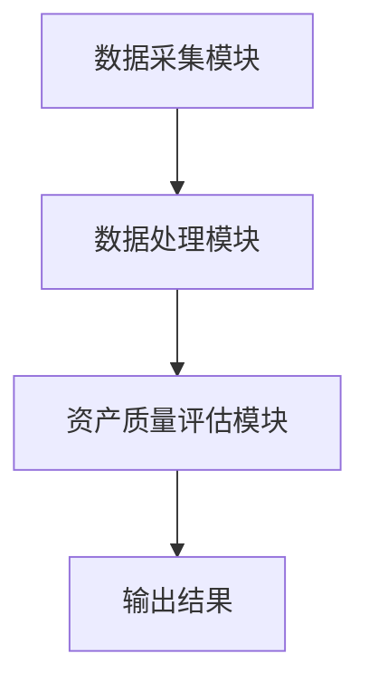

                 


# 彼得林奇对公司资产质量的深度分析

## 关键词：
资产质量，彼得·林奇，投资分析，财务健康度，风险管理

## 摘要：
本文深入探讨了彼得·林奇在公司资产质量分析方面的独特见解和方法。通过分析资产质量的核心概念、数学模型、系统架构和实际案例，本文为投资者提供了全面的分析框架和实用工具，帮助他们做出更明智的投资决策。

---

# 第一部分：资产质量分析的背景与核心概念

## 第1章：资产质量分析的背景与重要性

### 1.1 资产质量的基本概念

#### 1.1.1 资产的定义与分类
资产是企业拥有或控制的资源，能够为企业带来未来经济利益。根据流动性，资产可分为流动资产和非流动资产。流动资产包括现金、应收账款、存货等，而非流动资产包括固定资产、无形资产等。

#### 1.1.2 资产质量的核心内涵
资产质量不仅关注资产的总量，更关注资产的构成和使用效率。高质量的资产意味着资产能够高效地转化为收益，且风险较低。

#### 1.1.3 资产质量与企业价值的关系
资产质量直接影响企业的盈利能力、偿债能力和成长潜力。高资产质量的企业通常具有更高的市场价值和投资吸引力。

### 1.2 彼得·林奇的分析方法

#### 1.2.1 彼得·林奇的投资理念
彼得·林奇是著名基金经理，主张通过深入分析企业的基本面，尤其是资产质量，来寻找具有长期增长潜力的企业。

#### 1.2.2 资产质量分析在投资中的作用
资产质量分析是评估企业财务健康度的重要指标，帮助投资者识别高风险企业，避免潜在损失。

#### 1.2.3 彼得·林奇的分析框架
林奇提出了“八问法”，包括对企业业务、财务状况、管理团队等方面进行深入分析，以评估资产质量。

### 1.3 资产质量分析的重要性

#### 1.3.1 企业财务健康度的评估
资产质量分析帮助企业识别潜在的财务风险，评估企业的偿债能力和运营效率。

#### 1.3.2 投资决策中的资产质量考量
投资者通过分析资产质量，可以识别具有成长潜力的企业，避免投资低效或高风险资产。

#### 1.3.3 资产质量与企业风险管理
高质量的资产能够提高企业的抗风险能力，降低财务危机的可能性。

## 第2章：资产质量的核心概念与联系

### 2.1 资产质量的核心要素

#### 2.1.1 资产的流动性
流动性高的资产能够快速变现，降低企业的资金风险。例如，现金和应收账款的流动性较高。

#### 2.1.2 资产的收益性
收益性高的资产能够为企业创造更多的利润。例如，高效运作的生产设备能够提高生产效率，增加收益。

#### 2.1.3 资产的安全性
安全性高的资产不容易受到市场波动或经济危机的影响。例如，稳健的长期股权投资具有较高的安全性。

### 2.2 资产质量的评估指标

#### 2.2.1 资产负债率
资产负债率=（负债总额/资产总额）×100%。低负债率表明企业财务风险较低，资产质量较高。

#### 2.2.2 资产周转率
资产周转率=（营业收入/平均资产总额）×100%。高周转率表明企业资产使用效率高，资产质量良好。

#### 2.2.3 资产回报率
资产回报率=（净利润/平均资产总额）×100%。高回报率表明企业资产盈利能力强，资产质量高。

### 2.3 资产质量与企业财务健康度的关系

#### 2.3.1 资产质量对财务健康度的影响
资产质量高的企业通常具有较强的盈利能力、较低的财务风险和较高的市场信誉，财务健康度较高。

#### 2.3.2 财务健康度对资产质量的反馈作用
良好的财务健康度能够提升企业的资产质量，例如通过优化资产结构和提高资产使用效率。

---

## 第3章：资产质量分析的数学模型与算法原理

### 3.1 资产质量评估的数学模型

#### 3.1.1 资产质量评分模型
资产质量评分模型通过加权计算各项资产质量指标，对企业资产质量进行综合评分。

公式：
$$ 资产质量评分 = \sum (指标权重 \times 指标得分) $$

例如，假设资产负债率、资产周转率、资产回报率的权重分别为30%、40%、30%，计算公式如下：

$$ 资产质量评分 = 0.3 \times 负债资产率 + 0.4 \times 资产周转率 + 0.3 \times 资产回报率 $$

#### 3.1.2 资产质量预测模型
资产质量预测模型通过历史数据和机器学习算法，预测未来资产质量的变化趋势。

公式：
$$ 资产质量预测 = \alpha \times 资产质量历史值 + \beta \times 财务指标变化 + \epsilon $$

其中，$\alpha$、$\beta$为回归系数，$\epsilon$为误差项。

#### 3.1.3 资产质量指数模型
资产质量指数模型将各项资产质量指标综合成一个指数，反映整体资产质量的变化。

公式：
$$ 资产质量指数 = \sum (指标权重 \times 指标表现) $$

---

### 3.2 资产质量分析的算法原理

#### 3.2.1 数据预处理与特征提取
数据预处理包括数据清洗、缺失值处理、异常值处理等。特征提取则是从原始数据中提取有用的特征，例如资产负债率、资产周转率等。

#### 3.2.2 资产质量评分算法
资产质量评分算法通过加权计算各项指标，对资产质量进行评分。具体步骤如下：
1. 收集企业的财务数据，包括资产负债表和利润表。
2. 计算各项资产质量指标，如资产负债率、资产周转率、资产回报率。
3. 根据指标权重，计算资产质量评分。
4. 根据评分结果，对企业资产质量进行分类。

#### 3.2.3 资产质量预测算法
资产质量预测算法通过机器学习模型，如线性回归或随机森林，预测未来资产质量的变化趋势。具体步骤如下：
1. 收集历史资产质量数据和相关财务指标。
2. 数据预处理，包括标准化和归一化。
3. 选择合适的机器学习算法，进行模型训练。
4. 使用训练好的模型，预测未来资产质量。

---

### 3.3 算法实现的Python代码

#### 3.3.1 数据预处理代码
```python
import pandas as pd
import numpy as np

# 加载数据
data = pd.read_csv('assets.csv')

# 处理缺失值
data = data.dropna()

# 处理异常值
data = data[(data['资产'] > 0) & (data['负债'] > 0)]
```

#### 3.3.2 资产质量评分代码
```python
def calculate_asset_quality_score(data, weights):
    # 计算各项指标
    liability_ratio = data['负债'] / data['资产']
    turnover_rate = data['收入'] / (data['资产'].mean())
    return_on_assets = data['净利润'] / (data['资产'].mean())
    
    # 计算评分
    score = weights[0] * liability_ratio + weights[1] * turnover_rate + weights[2] * return_on_assets
    return score

# 示例权重
weights = [0.3, 0.4, 0.3]

# 计算评分
data['资产质量评分'] = calculate_asset_quality_score(data, weights)
```

#### 3.3.3 资产质量预测代码
```python
from sklearn.linear_model import LinearRegression
from sklearn.model_selection import train_test_split

# 数据预处理
X = data[['资产', '负债', '收入']]
y = data['资产质量评分']

# 划分训练集和测试集
X_train, X_test, y_train, y_test = train_test_split(X, y, test_size=0.2, random_state=42)

# 训练模型
model = LinearRegression()
model.fit(X_train, y_train)

# 预测
y_pred = model.predict(X_test)
```

---

## 第4章：资产质量分析的系统架构与设计

### 4.1 系统功能设计

#### 4.1.1 数据采集模块
数据采集模块负责收集企业的财务数据，包括资产负债表和利润表。

#### 4.1.2 数据处理模块
数据处理模块对数据进行清洗、转换和预处理，确保数据的准确性和一致性。

#### 4.1.3 资产质量评估模块
资产质量评估模块根据预处理后的数据，计算各项资产质量指标，生成资产质量评分和预测结果。

---

### 4.2 系统架构设计

#### 4.2.1 系统功能模块设计
- 数据采集模块：负责数据的输入和存储。
- 数据处理模块：负责数据的清洗和转换。
- 资产质量评估模块：负责资产质量的计算和分析。

#### 4.2.2 系统架构图


---

### 4.3 系统接口设计

#### 4.3.1 数据接口
- 数据输入接口：接收企业的财务数据。
- 数据输出接口：输出资产质量评分和预测结果。

#### 4.3.2 用户接口
- 用户输入接口：接收用户的输入指令。
- 用户输出接口：显示资产质量分析结果。

---

## 第5章：项目实战

### 5.1 环境安装

#### 5.1.1 安装Python环境
安装Python 3.x及以上版本，并安装必要的库，如Pandas、NumPy、Scikit-learn。

```bash
pip install pandas numpy scikit-learn
```

#### 5.1.2 安装Jupyter Notebook
安装Jupyter Notebook用于数据处理和分析。

```bash
pip install jupyter
```

---

### 5.2 核心实现代码

#### 5.2.1 数据预处理
```python
import pandas as pd
import numpy as np

# 加载数据
data = pd.read_csv('assets.csv')

# 处理缺失值
data = data.dropna()

# 处理异常值
data = data[(data['资产'] > 0) & (data['负债'] > 0)]
```

#### 5.2.2 资产质量评分
```python
def calculate_asset_quality_score(data, weights):
    liability_ratio = data['负债'] / data['资产']
    turnover_rate = data['收入'] / (data['资产'].mean())
    return_on_assets = data['净利润'] / (data['资产'].mean())
    
    score = weights[0] * liability_ratio + weights[1] * turnover_rate + weights[2] * return_on_assets
    return score

# 示例权重
weights = [0.3, 0.4, 0.3]

# 计算评分
data['资产质量评分'] = calculate_asset_quality_score(data, weights)
```

---

### 5.3 案例分析

#### 5.3.1 选择一家公司进行分析
以某制造企业为例，分析其资产质量。

#### 5.3.2 数据准备
加载该企业的财务数据，进行数据预处理。

#### 5.3.3 资产质量评分
计算各项资产质量指标，生成资产质量评分。

#### 5.3.4 资产质量预测
使用机器学习模型，预测未来资产质量的变化趋势。

---

## 第6章：最佳实践与小结

### 6.1 最佳实践
1. 定期更新数据，保持模型的准确性。
2. 结合行业特点，调整资产质量评估模型。
3. 多维度分析，避免单一指标的误导。

### 6.2 小结
本文详细探讨了彼得·林奇对公司资产质量的深度分析，从核心概念、数学模型到系统设计和项目实战，为投资者提供了全面的分析框架和实用工具。

### 6.3 注意事项
- 数据来源要可靠，确保分析结果的准确性。
- 模型选择要合理，根据不同企业特点调整参数。
- 定期更新模型，适应市场变化。

### 6.4 拓展阅读
- 彼得·林奇的《投资漫步华尔街》
- 资产评估的相关书籍和文献
- 机器学习在金融领域的应用

---

## 作者：AI天才研究院 & 禅与计算机程序设计艺术

