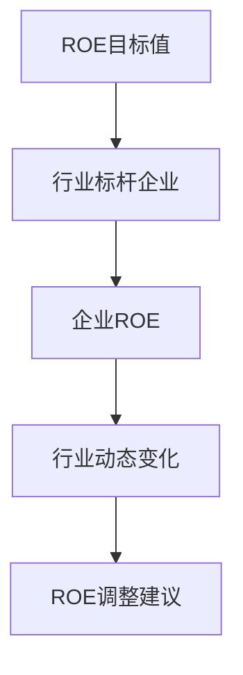
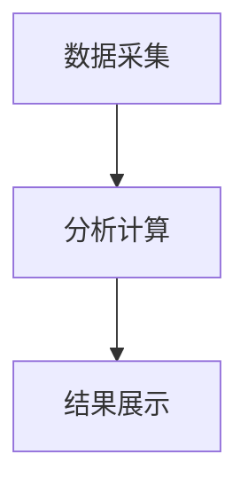
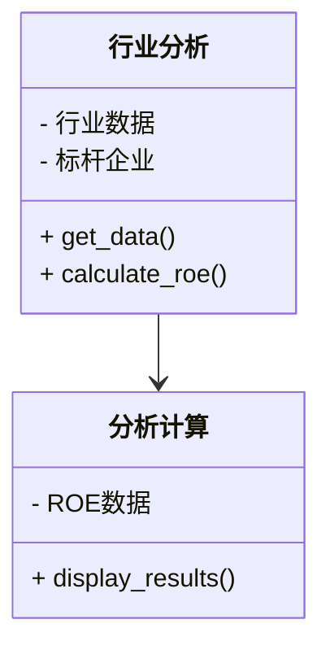
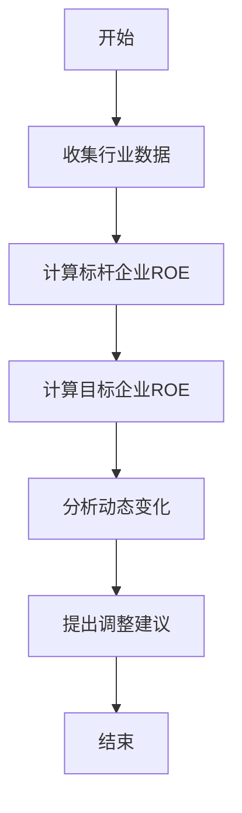
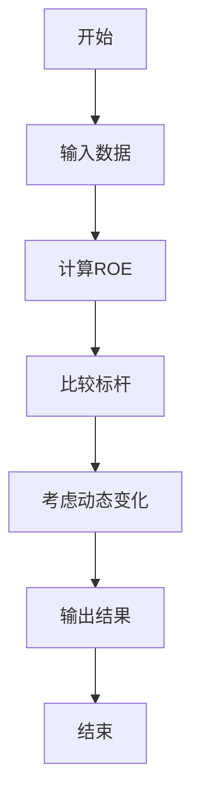

                 


# 彼得林奇对公司资本回报率的行业对标动态分析

---

## 关键词：
- 资本回报率 (ROE)
- 彼得·林奇
- 行业对标
- 动态分析
- 投资分析

---

## 摘要：
本文系统地探讨了彼得·林奇的资本回报率（ROE）分析方法，特别是其行业对标动态分析的策略。通过构建动态模型，分析行业动态变化，结合实际案例，提供从理论到实践的详细指导。文章还介绍了系统架构设计和Python实现，帮助读者掌握投资分析的核心方法，并在实战中应用。

---

## 第一部分: 资本回报率的基本概念与行业分析基础

---

## 第二部分: 资本回报率的行业对标动态分析模型

---

## 第三部分: 基于动态模型的行业分析实战

---

## 第四部分: 系统化投资分析的系统架构与Python实现

---

## 第五部分: 投资实战中的动态调整与优化

---

## 第六部分: 总结与展望

---

## 第七部分: 附录

---

## 文章正文：

---

## 1. 资本回报率的基本概念与行业分析基础

### 1.1 资本回报率的核心概念

资本回报率（Return on Equity，ROE）是衡量企业盈利能力的重要指标，计算公式为：

$$ROE = \frac{\text{净利润}}{\text{股东权益}}$$

ROE越高，表明企业利用股东资产创造利润的能力越强。行业差异显著，例如科技行业通常ROE较高，而制造业可能较低。

### 1.2 彼得·林奇的资本回报率分析方法

彼得·林奇强调通过行业对标分析企业ROE的合理性。他选择行业内的标杆企业，比较目标企业的ROE是否具备竞争力。

---

## 2. 资本回报率的行业对标动态分析模型

### 2.1 动态分析模型的构建

动态模型考虑行业动态变化，如市场需求波动和政策变化。模型架构图如图1所示：



### 2.2 案例分析：科技行业动态分析

以科技行业为例，分析某企业的ROE是否具备竞争力。首先，计算ROE，然后与行业标杆对比，最后根据行业动态调整分析结果。

---

## 3. 系统化投资分析的系统架构与Python实现

### 3.1 系统架构设计

系统分为数据采集、分析计算和结果展示三个模块：



### 3.2 核心功能实现

#### 数据采集模块

```python
import requests
import pandas as pd

def get_data():
    url = "https://example.com/api/stock_data"
    response = requests.get(url)
    data = response.json()
    df = pd.DataFrame(data)
    return df
```

#### 分析计算模块

```python
def calculate_roe(df):
    df['ROE'] = df['净利润'] / df['股东权益']
    return df
```

#### 结果展示模块

```python
def display_results(df):
    print("行业ROE分析结果：")
    print(df[['公司名称', 'ROE']].head())
```

### 3.3 项目实战：科技行业动态分析

#### 数据采集

```python
data = get_data()
print(data.head())
```

#### 计算ROE

```python
ro_data = calculate_roe(data)
print(ro_data[['公司名称', 'ROE']].head())
```

#### 结果展示

```python
display_results(ro_data)
```

---

## 4. 投资实战中的动态调整与优化

动态分析模型需要根据市场变化持续优化。每次市场波动后，重新计算ROE，更新分析结果。

---

## 5. 总结与展望

彼得·林奇的资本回报率分析方法结合行业对标和动态调整，是投资分析的重要工具。未来研究可结合机器学习，进一步提升分析的准确性和效率。

---

## 6. 附录

### 6.1 行业分析的类图



### 6.2 动态模型的流程图



### 6.3 算法流程图



---

## 作者：
AI天才研究院/AI Genius Institute & 禅与计算机程序设计艺术 /Zen And The Art of Computer Programming

