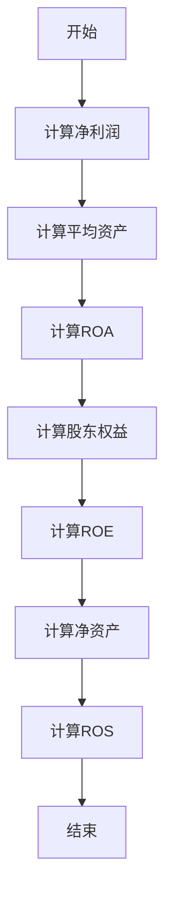
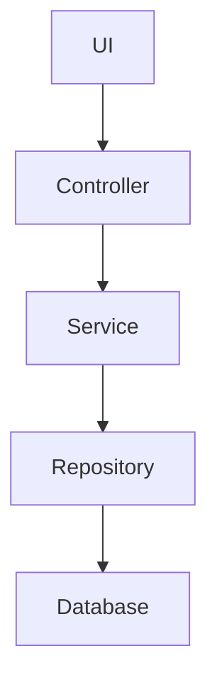
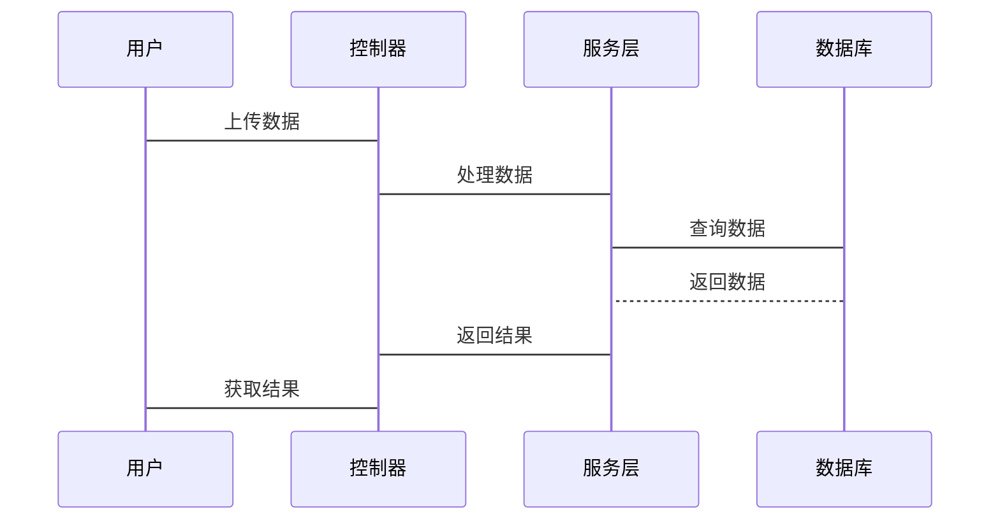

                 


# 彼得林奇对公司资本配置效率的分析

> 关键词：资本配置效率，彼得·林奇，资产回报率，股东权益回报率，净资产收益率

> 摘要：本文深入分析了彼得·林奇对公司资本配置效率的分析方法，探讨了资本配置效率的核心概念、数学模型、系统架构设计及实际应用案例。通过详细讲解资本配置效率的定义、计算方法及彼得·林奇的独特分析框架，本文为读者提供了从理论到实践的全面指导。

---

## 第一部分: 资本配置效率的背景与重要性

### 第1章: 资本配置效率的核心概念

#### 1.1 资本配置效率的定义
资本配置效率是指公司在分配和利用资本过程中，实现价值最大化的效率。它衡量了公司如何通过有效配置资本来实现股东价值的最大化。资本配置效率高的公司能够更好地利用其资产、负债和所有者权益，从而实现更高的回报率。

#### 1.2 资本配置效率的重要性
资本配置效率是公司财务健康的重要指标，直接影响公司的价值和股东的收益。有效的资本配置可以帮助公司优化资产结构、降低财务风险，并提升整体盈利能力。对于投资者而言，资本配置效率是评估公司管理能力的重要依据。

#### 1.3 资本配置效率的边界与外延
资本配置效率的边界包括公司内部资本分配和外部资本市场的互动。外延则涉及公司战略、风险管理、投资决策等多个方面。资本配置效率不仅关乎财务指标，还与公司整体经营战略密切相关。

#### 1.4 彼得·林奇的背景与投资理念
彼得·林奇是美国著名投资经理人，以其在富达投资管理公司的长期任职中展现出卓越的投资能力而闻名。他强调基本面分析和对公司管理层的信任，认为资本配置效率是评估公司价值的关键因素。

---

### 第2章: 资本配置效率的核心要素与分析框架

#### 2.1 资本配置效率的核心要素
资本配置效率的核心要素包括资产回报率（ROA）、股东权益回报率（ROE）和净资产收益率（ROS）。这些指标分别从不同角度反映了公司资本配置的效率。

#### 2.2 彼得·林奇的资本配置分析框架
彼得·林奇提出了资本配置效率的三要素模型，强调对公司管理层的信任和对公司基本面的深入分析。他认为，资本配置效率不仅依赖于财务指标，还与公司战略和管理层决策密切相关。

#### 2.3 核心概念对比分析
通过对比资产回报率、股东权益回报率和净资产收益率，可以更好地理解资本配置效率的多维度特性。例如，ROA衡量资产的利用效率，ROE衡量股东权益的回报能力，而ROS则综合反映了资本配置的整体效率。

---

### 第3章: 资本配置效率的数学模型与算法原理

#### 3.1 资本配置效率的数学模型
资本配置效率的计算公式如下：
- 资产回报率（ROA）：$$ \text{ROA} = \frac{\text{净利润}}{\text{平均资产}} $$
- 股东权益回报率（ROE）：$$ \text{ROE} = \frac{\text{净利润}}{\text{股东权益}} $$
- 净资产收益率（ROS）：$$ \text{ROS} = \frac{\text{净利润}}{\text{净资产}} $$

#### 3.2 算法原理讲解
通过Python代码实现资本配置效率的计算：
```python
def calculate_roa(net_profit, average_assets):
    return net_profit / average_assets

def calculate_roe(net_profit, shareholders_equity):
    return net_profit / shareholders_equity

def calculate_ros(net_profit, net_assets):
    return net_profit / net_assets
```

#### 3.3 算法流程图


---

### 第4章: 系统分析与架构设计方案

#### 4.1 系统功能设计
系统功能包括数据收集、分析计算、结果可视化。系统架构采用模块化设计，分为数据层、业务逻辑层和表现层。

#### 4.2 系统架构设计


#### 4.3 系统接口设计
系统提供RESTful API接口，支持数据的上传、计算和结果查询。

#### 4.4 系统交互流程


---

### 第5章: 项目实战

#### 5.1 环境安装
需要安装Python和相关库，如Pandas和Matplotlib。

#### 5.2 核心代码实现
```python
import pandas as pd
import matplotlib.pyplot as plt

def calculate_efficiency(ratios):
    plt.figure(figsize=(10, 6))
    plt.plot(ratios.index, ratios.values, 'b-')
    plt.title('资本配置效率分析')
    plt.xlabel('年份')
    plt.ylabel('比率值')
    plt.grid(True)
    plt.show()

# 示例数据
data = {'ROA': [0.15, 0.2, 0.18], 
        'ROE': [0.2, 0.18, 0.22],
        'ROS': [0.1, 0.12, 0.15]}
ratios = pd.DataFrame(data, index=[2019, 2020, 2021])

calculate_efficiency(ratios['ROA'])
calculate_efficiency(ratios['ROE'])
calculate_efficiency(ratios['ROS'])
```

#### 5.3 案例分析
以某公司为例，分析其资本配置效率的变化趋势，解读结果并提出改进建议。

#### 5.4 项目小结
总结项目实现过程，强调资本配置效率分析的实际应用价值。

---

### 第6章: 总结与最佳实践

#### 6.1 小结
资本配置效率是公司价值的重要指标，彼得·林奇的分析框架提供了独特的视角。

#### 6.2 注意事项
在实际应用中，需结合公司具体情况，关注管理层决策和外部环境因素。

#### 6.3 未来研究方向
进一步研究资本配置效率与公司战略的关系，探索更高效的分析方法。

---

作者：AI天才研究院/AI Genius Institute & 禅与计算机程序设计艺术 /Zen And The Art of Computer Programming

