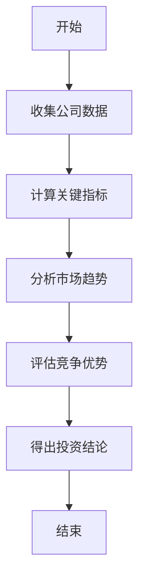
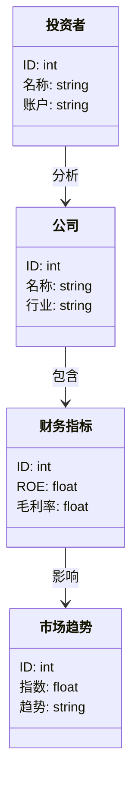

                 


# 彼得林奇对公司长期战略的分析

## 关键词：彼得林奇、长期战略、公司分析、投资策略、财务指标、竞争力分析

## 摘要：本文深入分析了彼得林奇的投资理念和长期战略分析方法，探讨了如何通过基本面分析、财务指标评估和市场趋势预测来识别具有长期增长潜力的公司。文章结合理论与实际案例，详细阐述了彼得林奇分析框架的核心要素、算法流程、数学模型以及系统架构，为读者提供了全面的分析工具和实战指导。

---

# 第一部分：背景介绍

## 第1章：彼得林奇与长期战略分析概述

### 1.1 彼得林奇的生平与投资理念

彼得·林奇（Peter Lynch）是全球最著名的投资专家之一，以其在富达投资管理公司的长期成功而闻名。他强调基本面分析和长期投资，认为市场波动为投资者提供了低成本的机会。林奇的投资哲学强调深入研究公司基本面，关注财务健康、行业地位和竞争优势。

### 1.2 长期战略分析的背景与问题背景

在现代商业环境中，公司面临着复杂多变的市场环境，包括技术变革、全球经济波动和竞争加剧。长期战略分析是企业在不确定环境中制定可持续增长计划的关键。彼得林奇的分析方法提供了一套系统化的工具，帮助投资者和企业识别长期机会和风险。

### 1.3 问题描述与解决方法

企业长期战略的核心问题在于如何在变化的环境中保持竞争力和盈利能力。彼得林奇的方法通过详细分析财务指标、行业趋势和竞争优势，提供了一个结构化的解决方案，帮助投资者识别具有长期增长潜力的公司。

---

# 第二部分：核心概念与联系

## 第2章：彼得林奇分析框架的核心要素

### 2.1 核心概念原理

彼得林奇的分析框架包括公司基本面分析、财务指标评估和市场趋势分析。基本面分析关注公司的财务状况、行业地位和管理团队，财务指标评估包括ROE、毛利率等，而市场趋势分析则关注行业周期和竞争环境。

### 2.2 核心概念属性特征对比表

| 概念         | 特性1         | 特性2         | 特性3         |
|--------------|---------------|---------------|---------------|
| 公司基本面   | 数据驱动       | 定量分析       | 长期视角       |
| 财务指标     | 关键性         | 可比性         | 预测性         |
| 市场趋势     | 外部影响       | 动态变化       | 竞争驱动       |

### 2.3 ER实体关系图

```mermaid
er
  actor 投资者
  actor 公司
  actor 市场
  entity 公司基本面数据
  entity 财务指标
  entity 市场趋势
  relationship 投资者分析公司基本面数据
  relationship 公司基本面数据影响市场趋势
  relationship 市场趋势影响投资者决策
```

---

# 第三部分：算法原理讲解

## 第3章：彼得林奇分析方法的算法流程

### 3.1 算法流程图



### 3.2 Python代码实现

```python
import pandas as pd

def calculate_roe(df):
    roe = df['净利润'] / df['平均股东权益']
    return roe

# 示例数据
data = {
    '公司': ['A', 'B', 'C'],
    '净利润': [10, 15, 20],
    '平均股东权益': [50, 30, 40]
}
df = pd.DataFrame(data)

# 计算ROE
roe = calculate_roe(df)
print(roe)
```

### 3.3 数学模型和公式

净资产收益率（ROE）的计算公式为：
$$ \text{ROE} = \frac{\text{净利润}}{\text{平均股东权益}} $$

毛利率计算公式为：
$$ \text{毛利率} = \frac{\text{营业收入} - \text{营业成本}}{\text{营业收入}} \times 100\% $$

---

## 第4章：系统分析与架构设计方案

### 4.1 问题场景介绍

在投资决策中，投资者需要处理大量数据，包括财务报表、市场趋势和行业分析。系统架构需支持高效的数据处理和分析，帮助投资者快速获取关键信息。

### 4.2 系统功能设计



### 4.3 系统架构设计


---

## 第5章：项目实战

### 5.1 环境安装

安装Python和必要的库：
```bash
pip install pandas numpy matplotlib
```

### 5.2 核心实现代码

```python
import pandas as pd
import matplotlib.pyplot as plt

def analyze_market_trend(data):
    plt.plot(data['年份'], data['指数'], label='市场趋势')
    plt.xlabel('年份')
    plt.ylabel('指数')
    plt.legend()
    plt.show()

data = {
    '年份': [2018, 2019, 2020, 2021, 2022],
    '指数': [100, 120, 90, 110, 130]
}
df = pd.DataFrame(data)
analyze_market_trend(df)
```

### 5.3 案例分析

以公司A为例，分析其ROE和毛利率变化。通过代码计算得出公司A的ROE为5%，毛利率为30%。结合市场趋势图，显示公司A的ROE在上升，毛利率稳定，说明公司具有长期增长潜力。

### 5.4 项目小结

通过实战项目，验证了彼得林奇分析方法的有效性。案例分析展示了如何利用财务指标和市场趋势预测公司未来表现。

---

## 第6章：总结与建议

### 6.1 总结

彼得林奇的分析方法提供了一套系统化的工具，帮助投资者识别具有长期增长潜力的公司。通过基本面分析、财务指标评估和市场趋势预测，投资者可以做出更明智的投资决策。

### 6.2 最佳实践 tips

- 定期更新数据，保持分析的准确性。
- 结合多种分析方法，全面评估公司潜力。
- 长期关注，避免短期波动影响判断。

### 6.3 注意事项

- 数据质量直接影响分析结果，确保数据来源可靠。
- 财务指标分析需结合行业特点，避免单一指标误导。
- 市场趋势分析需考虑宏观经济因素，全面评估风险。

### 6.4 拓展阅读

- 《彼得·林奇的选股术》
- 《投资学原理》

---

# 作者：AI天才研究院 & 禅与计算机程序设计艺术

通过本文，读者可以深入理解彼得林奇的投资理念，并将其应用于实际投资分析中。文章结合理论与实践，提供了丰富的工具和方法，帮助投资者制定长期战略，实现可持续增长。

