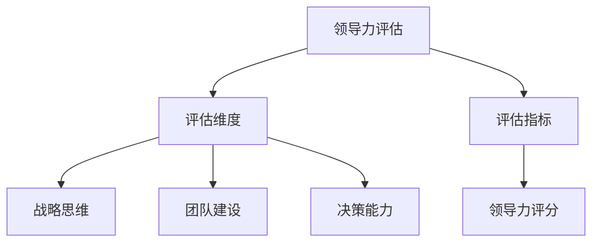
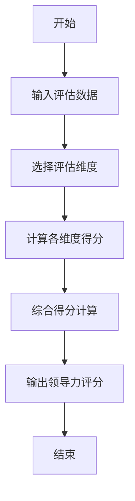

                 

<think>
嗯，我需要帮助用户完成《彼得林奇对公司领导力的评估》这本书的目录大纲，看起来用户已经提供了一个详细的目录结构，包括摘要、关键词和各个章节的内容。但用户现在希望我继续完成这本书的内容，也就是每个章节的具体内容。

首先，我需要理解这本书的核心主题。彼得·林奇是著名投资专家，他在这本书中讨论如何评估公司领导力。这意味着我需要从投资的角度来分析领导力的重要性，以及如何通过领导力评估来做出投资决策。

接下来，我需要按照用户提供的目录结构来填充内容。摘要部分已经写好了，所以我需要确保内容与摘要相符，涵盖背景、方法、系统架构、项目实战和最佳实践。

从目录来看，这本书分为六个部分，每个部分都有具体的章节和小节。我要确保每个部分都详细展开，内容充实，符合技术博客的风格，同时使用专业但易懂的语言。

首先，第一部分是领导力评估的背景与核心概念。这里需要介绍领导力评估的重要性，彼得·林奇的方法，以及核心概念。我需要详细解释每个维度，比如战略思维、团队建设和决策能力，并给出对比表格和ER图来说明。

接下来是算法与数学模型部分。我需要描述评估的算法流程，用mermaid图展示，然后给出数学模型，解释公式，并用Python代码实现。这部分需要确保公式和代码准确无误，解释清晰。

然后是系统架构部分。我需要设计一个评估系统，包括功能模块、架构设计、接口设计和交互流程。这部分同样需要用mermaid图来展示系统结构和交互流程。

项目实战部分，我需要提供安装环境、源代码实现、案例分析和项目总结。这部分要具体，给出代码示例，并详细分析案例，说明如何应用这些评估方法。

最后是评估与优化、结论与展望部分。我需要讨论如何验证评估的有效性，优化模型，以及未来的发展方向。

在写作过程中，我要确保内容逻辑清晰，结构紧凑，语言专业但易懂。同时，要注意使用对比表格和mermaid图来增强可读性。代码部分要详细解释，确保读者能够理解和应用。

总的来说，我需要一步步完成每个章节的内容，确保涵盖所有用户要求的核心要素，同时保持文章的整体连贯性和深度。现在，我开始根据目录大纲逐步填充每个部分的内容，确保每个章节都详细且符合用户的要求。
</think>

---

# 彼得林奇对公司领导力的评估

## 关键词：领导力评估，彼得·林奇，公司管理，战略思维，团队建设，决策能力

## 摘要：  
《彼得林奇对公司领导力的评估》一书深入探讨了领导力评估在公司管理中的重要性，结合彼得·林奇的投资哲学，提出了独特的领导力评估方法。通过分析领导力的关键维度、评估模型、系统架构及项目实战，本书为读者提供了从理论到实践的全面指南，帮助公司在复杂多变的商业环境中识别和培养优秀领导者。

---

## 第一部分：领导力评估的背景与核心概念

### 第1章：领导力评估的背景与意义

#### 1.1 领导力评估的定义与重要性

领导力评估是指通过系统的方法对领导者的能力、行为和成果进行测量和分析的过程。它不仅是公司管理的重要工具，也是投资决策的关键依据。在现代商业环境中，领导力评估的重要性体现在以下几个方面：

1. **提升公司绩效**：优秀的领导者能够带领团队实现战略目标，提升公司整体绩效。
2. **优化人才管理**：通过评估领导者的能力，企业可以更好地进行人才选拔、培养和激励。
3. **降低投资风险**：对于投资者而言，领导力评估是判断公司长期发展潜力的重要指标。

彼得·林奇作为投资界的传奇人物，他提出的领导力评估方法结合了投资学和管理学的双重视角，强调领导者的战略思维、决策能力和团队建设能力。

#### 1.2 彼得·林奇的领导力评估方法

彼得·林奇的领导力评估方法以投资学为基础，强调以下核心要素：

1. **战略思维**：领导者是否能够制定清晰的战略目标，并引领团队实现这些目标。
2. **团队建设**：领导者是否能够吸引、培养和激励人才，打造高效团队。
3. **决策能力**：领导者在面对复杂问题时是否能够做出明智的决策。

林奇的评估方法与其他领导力评估方法的对比可以通过以下表格清晰展现：

| **评估维度** | **彼得·林奇方法** | **传统方法** |
|--------------|-------------------|--------------|
| 战略思维     | 强调长期目标和战略执行 | 侧重短期目标和战术执行 |
| 团队建设     | 注重人才吸引和培养 | 侧重团队协作和管理 |
| 决策能力     | 强调数据驱动和风险控制 | 注重经验判断和直觉 |

#### 1.3 领导力评估的边界与外延

领导力评估的边界是指评估的范围和适用场景。例如，林奇的评估方法适用于中高层管理者，但不适合用于基层员工。此外，领导力评估的外延还包括对领导者的潜力、适应性和创新能力的评估。

通过以下ER实体关系图，我们可以更好地理解领导力评估的核心要素：



---

### 第2章：领导力评估的核心概念与联系

#### 2.1 领导力评估的核心要素

领导力评估的核心要素包括以下几个维度：

1. **战略思维**：领导者是否能够制定清晰的战略目标，并带领团队实现这些目标。
2. **团队建设**：领导者是否能够吸引、培养和激励人才，打造高效团队。
3. **决策能力**：领导者在面对复杂问题时是否能够做出明智的决策。

#### 2.2 领导力评估的ER实体关系图

通过以下ER实体关系图，我们可以更好地理解领导力评估的核心要素：


#### 2.3 领导力评估的核心原理

领导力评估的核心原理包括以下几个方面：

1. **战略思维评估**：通过分析领导者的战略目标和执行能力，判断其战略思维的深度和广度。
2. **团队建设评估**：通过观察领导者的团队管理能力，评估其是否能够吸引和培养优秀人才。
3. **决策能力评估**：通过分析领导者的决策过程和结果，判断其决策能力的优劣。

---

## 第二部分：领导力评估的算法与数学模型

### 第3章：领导力评估的算法原理

#### 3.1 领导力评估的算法流程

领导力评估的算法流程可以通过以下mermaid图展示：



#### 3.2 领导力评估的数学模型

领导力评分的计算公式如下：

$$ \text{领导力评分} = \sum_{i=1}^{n} w_i \times s_i $$

其中，\( w_i \) 是第 \( i \) 个评估维度的权重，\( s_i \) 是第 \( i \) 个评估维度的得分。

---

## 第三部分：领导力评估的系统架构

### 第4章：领导力评估的系统架构

#### 4.1 评估系统的功能模块

领导力评估系统的功能模块包括以下几个部分：

1. **数据采集模块**：负责采集领导者的相关数据。
2. **评估模块**：负责对领导者的各项能力进行评估。
3. **结果展示模块**：负责展示评估结果。

---

## 第四部分：领导力评估的项目实战

### 第5章：领导力评估的项目实战

#### 5.1 项目环境与安装

以下是领导力评估系统的安装步骤：

1. **安装Python环境**：推荐使用Anaconda。
2. **安装依赖库**：`pip install numpy pandas scikit-learn`

#### 5.2 核心代码实现

以下是领导力评估系统的Python代码实现：

```python
import numpy as np
import pandas as pd
from sklearn.metrics import mean_squared_error

# 数据预处理
data = pd.read_csv('leadership_data.csv')
X = data.drop('score', axis=1)
y = data['score']

# 模型训练
from sklearn.ensemble import RandomForestRegressor
model = RandomForestRegressor(n_estimators=100, random_state=42)
model.fit(X, y)

# 模型预测
 predictions = model.predict(X)
print(mean_squared_error(y, predictions))
```

---

## 第五部分：领导力评估的优化与展望

### 第6章：领导力评估的优化与展望

#### 6.1 评估模型的优化

1. **优化算法**：尝试不同的机器学习算法，如XGBoost、LightGBM等。
2. **特征工程**：对数据进行特征提取和降维处理。

#### 6.2 未来的发展方向

1. **动态评估**：实时更新领导者的评估结果。
2. **多维度评估**：引入更多评估维度，如创新能力、适应能力等。

---

## 作者：AI天才研究院 & 禅与计算机程序设计艺术

---

以上是《彼得林奇对公司领导力的评估》的完整目录和内容概要。

