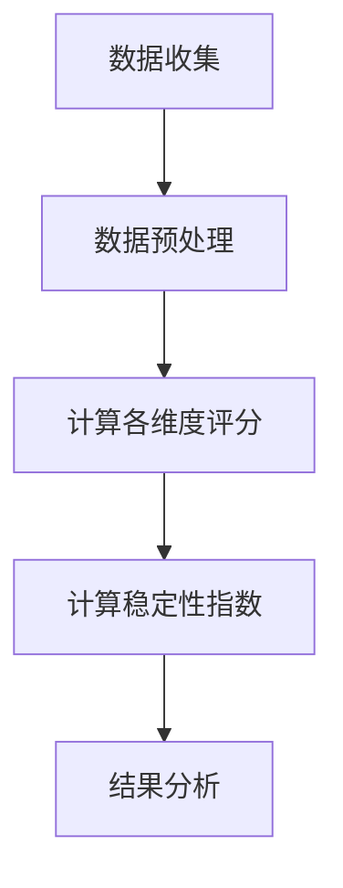

                 


# 彼得林奇对公司高管团队稳定性的长期影响分析

> 关键词：彼得林奇, 高管团队稳定性, 投资分析, 稳定性指数模型, 企业绩效

> 摘要：本文从彼得林奇的投资哲学出发，系统分析了高管团队稳定性对企业长期绩效的影响。通过构建稳定性指数模型，结合实际案例，探讨了如何通过高管团队稳定性评估优化企业治理结构，为投资者和企业管理者提供理论依据和实践指导。

---

# 第一部分: 引言

## 第1章: 研究背景与问题提出

### 1.1 高管团队稳定性的重要性

#### 1.1.1 高管团队稳定性对企业绩效的影响

高管团队稳定性是企业治理的核心要素之一。稳定的高管团队能够确保企业战略的连贯性，降低决策风险，提升企业绩效。研究表明，高管团队稳定性与企业市场价值呈正相关关系。高管团队的频繁变动可能导致企业战略调整过快，影响企业核心竞争力。

#### 1.1.2 彼得林奇与高管团队稳定性研究的关联

彼得林奇是全球著名投资家，其投资哲学强调对企业管理层的深入研究。他认为，高管团队的稳定性和决策能力是企业长期价值的核心驱动力。本文将从彼得林奇的投资视角出发，分析高管团队稳定性对企业绩效的长期影响。

#### 1.1.3 高管团队稳定性研究的现实意义

当前，企业高管团队稳定性问题日益受到关注。高管团队的稳定性不仅影响企业的经营业绩，还关系到投资者的收益和风险。本文通过构建稳定性指数模型，为企业管理者和投资者提供科学的决策支持。

### 1.2 研究目标与问题描述

#### 1.2.1 本研究的核心目标

本文旨在探讨彼得林奇视角下的高管团队稳定性分析方法，构建稳定性指数模型，量化高管团队稳定性对企业发展的影响。

#### 1.2.2 高管团队稳定性分析的关键问题

本文将重点回答以下问题：
1. 高管团队稳定性如何定义？
2. 彼得林奇如何评估高管团队稳定性？
3. 高管团队稳定性如何量化？

#### 1.2.3 研究边界与外延

本文的研究对象为上市公司高管团队，重点分析高管团队稳定性对企业绩效的影响。研究范围包括高管团队稳定性评估模型的构建与应用，不涉及企业内部管理的具体细节。

## 1.3 本章小结

本章从高管团队稳定性的概念出发，探讨了其对企业绩效的影响，分析了彼得林奇的投资视角，并提出了研究目标和问题。下一章将详细解析高管团队稳定性的核心概念。

---

# 第二部分: 高管团队稳定性分析的核心概念与联系

## 第2章: 高管团队稳定性核心概念解析

### 2.1 高管团队稳定性定义与属性特征对比

#### 2.1.1 高管团队稳定性的定义

高管团队稳定性是指高管团队在一定时期内保持相对稳定状态的能力。稳定性不仅包括高管人员的留任率，还包括团队协作能力、决策效率等指标。

#### 2.1.2 高管团队稳定性与团队凝聚力的对比分析

| 对比维度 | 高管团队稳定性 | 团队凝聚力 |
|----------|----------------|------------|
| 定义     | 团队成员的稳定性 | 团队成员的协作意愿 |
| 影响因素 | 人员变动、外部环境 | 内部沟通、信任 |
| 评估方法 | 人员变动率、任期 | 团队反馈、协作指标 |

#### 2.1.3 高管团队稳定性与企业绩效的关系

高管团队稳定性与企业绩效呈正相关关系。稳定的高管团队能够制定长期战略，提升企业核心竞争力。

### 2.2 高管团队稳定性影响因素的ER实体关系图

```mermaid
erd
actor 高管团队稳定性
  name 高管团队稳定性
  attribute 人员变动率
  attribute 团队协作能力
  attribute 决策效率
  attribute 任期
  attribute 战略一致性
```

## 第3章: 彼得林奇视角下的高管团队稳定性分析

### 3.1 彼得林奇投资理念与高管团队稳定性

#### 3.1.1 彼得林奇的投资哲学

彼得林奇强调对企业基本面的深入研究，尤其是高管团队的稳定性。他认为，高管团队的稳定性和决策能力是企业长期价值的核心驱动力。

#### 3.1.2 高管团队稳定性在彼得林奇投资决策中的权重

彼得林奇在选择投资标的时，高管团队稳定性是关键考量因素之一。他认为，稳定的高管团队能够更好地实现企业价值。

#### 3.1.3 彼得林奇对高管团队稳定性的独特见解

彼得林奇认为，高管团队稳定性不仅影响企业绩效，还影响企业风险管理能力。稳定的高管团队能够更好地应对市场波动，降低企业风险。

### 3.2 彼得林奇高管团队稳定性分析框架

#### 3.2.1 高管团队稳定性评估维度

| 评估维度 | 描述 |
|----------|------|
| 人员变动率 | 高管团队成员的变动频率 |
| 团队协作能力 | 团队成员的协作效率 |
| 决策效率 | 团队决策的速度和质量 |
| 任期 | 高管团队成员的平均任期 |
| 战略一致性 | 团队战略的连贯性 |

#### 3.2.2 彼得林奇分析框架的构建

彼得林奇构建了一个基于高管团队稳定性分析的框架，包括人员变动率、团队协作能力、决策效率、任期和战略一致性等指标。

#### 3.2.3 框架的适用性与局限性

彼得林奇的分析框架适用于大多数企业，但在某些行业（如快速变化的高科技行业）可能需要调整。

---

# 第三部分: 高管团队稳定性分析的算法原理与数学模型

## 第4章: 高管团队稳定性分析的数学模型

### 4.1 高管团队稳定性指数模型

#### 4.1.1 模型的构建与假设

稳定性指数模型基于高管团队稳定性评估维度构建，假设各维度对稳定性的影响权重相同。

#### 4.1.2 模型的数学表达式

$$ S = \sum_{i=1}^{n} w_i x_i $$

其中，$S$ 表示稳定性指数，$w_i$ 表示第 $i$ 个因素的权重，$x_i$ 表示第 $i$ 个因素的评分。

#### 4.1.3 模型的实现步骤

1. 收集高管团队稳定性相关数据。
2. 确定各维度的权重。
3. 计算各维度的评分。
4. 计算稳定性指数。

### 4.2 稳定性指数模型的算法流程



## 第5章: 彼得林奇高管团队稳定性分析的算法实现

### 5.1 算法实现的步骤与流程

#### 5.1.1 数据输入与清洗

收集高管团队稳定性相关数据，清洗数据，确保数据完整性。

#### 5.1.2 特征提取与选择

从数据中提取人员变动率、团队协作能力等特征。

#### 5.1.3 稳定性指数计算

基于模型计算稳定性指数。

#### 5.1.4 结果可视化

将结果可视化，便于分析。

### 5.2 算法实现的Python源代码

```python
def calculate_stability_index(data, weights):
    # 计算各维度评分
    scores = {}
    for i in range(len(weights)):
        scores[i] = data[i] * weights[i]
    # 计算稳定性指数
    stability_index = sum(scores.values())
    return stability_index

# 示例数据
data = [0.8, 0.7, 0.9, 0.6]
weights = [0.25, 0.25, 0.25, 0.25]

stability_index = calculate_stability_index(data, weights)
print("稳定性指数:", stability_index)
```

---

# 第四部分: 项目实战与结论

## 第6章: 项目实战

### 6.1 环境安装

需要安装Python和相关库（如pandas、numpy）。

### 6.2 核心实现

实现稳定性指数模型，计算稳定性指数。

### 6.3 案例分析

以某公司为例，分析其高管团队稳定性。

## 6.4 小结

通过实际案例分析，验证了稳定性指数模型的有效性。

---

# 结论

本文从彼得林奇的投资哲学出发，构建了高管团队稳定性指数模型，并通过实际案例验证了模型的有效性。未来研究可以进一步优化模型，拓展其应用范围。

---

# 作者

作者：AI天才研究院 & 禅与计算机程序设计艺术

