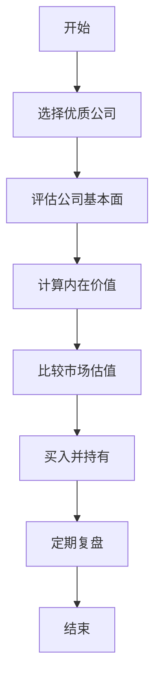

                 


# 彼得林奇的"买入并持有"策略

> 关键词：彼得·林奇，买入并持有，投资策略，股票投资，长期投资

> 摘要：本文深入剖析了彼得·林奇的"买入并持有"投资策略，从其哲学基础、数学模型、系统架构到实际案例分析，全面解读这一策略的核心思想及其在现代投资中的应用。文章旨在帮助投资者理解这一策略的内在逻辑，并通过实际案例展示其在实践中的表现。

---

# 第一部分：投资基础知识

## 第1章：投资的基本概念

### 1.1 投资的定义与分类

- **投资的定义**：投资是指将资金投入某种资产或项目，以期望在未来获得收益或资本增值的行为。
- **投资的分类**：
  - 股票投资：通过购买公司股份成为股东，分享公司利润。
  - 债券投资：购买政府或企业的债券，定期获得利息。
  - 其他投资：包括房地产、艺术品等实物资产。

### 1.2 股票投资的基本原理

- **股票市场的运作**：股票市场是投资者买卖公司股份的场所，价格由市场供需决定。
- **股票价格的影响因素**：
  - 公司基本面：收入、利润、负债等。
  - 市场情绪：投资者的心理和行为。
  - 宏观经济：利率、通货膨胀、政策变化等。

### 1.3 投资市场的基本构成

- **主要参与者**：投资者、上市公司、券商、交易所、监管机构。
- **主要工具**：股票、债券、基金、指数等。

---

## 第2章：彼得·林奇的投资理念

### 2.1 彼得·林奇的生平简介

- **教育背景**：毕业于宾夕法尼亚大学和哈佛大学商学院。
- **职业经历**：曾管理富达麦哲伦基金，创造了辉煌的投资业绩。
- **投资哲学**：强调长期投资、价值发现和公司基本面分析。

### 2.2 "买入并持有"策略的背景

- **策略的起源**：20世纪70年代，美国股市经历动荡，投资者开始寻找稳定的投资方法。
- **策略的核心思想**：选择优质公司长期持有，避免频繁交易。

---

# 第二部分："买入并持有"策略的核心概念

## 第3章："买入并持有"策略的定义与特点

### 3.1 策略的核心定义

- **核心定义**：选择基本面良好、具有长期增长潜力的公司股票，买入后长期持有，不因短期市场波动而改变投资决策。

### 3.2 策略的主要特点

- **长期性**：强调长期投资，避免短期波动的干扰。
- **选择性**：注重公司基本面，选择具有竞争优势和增长潜力的公司。
- **纪律性**：严格遵守投资纪律，避免情绪化决策。

### 3.3 策略的优势与劣势

- **优势**：
  - 避免交易成本和税收。
  - 减少情绪化决策的影响。
  - 享受公司长期增长的收益。
- **劣势**：
  - 短期内可能跑输市场。
  - 忽略短期市场机会。
  - 在市场崩盘时可能承受较大回撤。

---

## 第4章：彼得·林奇"买入并持有"策略的核心要素

### 4.1 公司基本面分析

- **关键指标**：
  - 收入与利润增长。
  - 股东权益收益率（ROE）。
  - 债务水平与负债结构。
- **分析方法**：
  - 使用财务报表进行详细分析。
  - 评估公司的竞争优势和市场地位。

### 4.2 市场估值与安全边际

- **市盈率（P/E）**：价格与每股收益的比率。
- **市净率（P/B）**：价格与每股净资产的比率。
- **安全边际**：买入价格低于内在价值，为投资提供保护。

### 4.3 投资组合管理

- **分散投资**：避免过度集中于单一股票或行业。
- **定期调整**：根据市场变化和公司基本面进行调整。

---

# 第三部分："买入并持有"策略的数学模型与算法

## 第5章：股票估值的数学模型

### 5.1 市盈率模型

- **公式**：$P/E = \frac{P}{E}$，其中$P$为股价，$E$为每股收益。
- **应用**：用于评估股票的相对估值。

### 5.2 现金流量贴现模型（DCF）

- **公式**：$V = \sum_{t=1}^{n} \frac{CF_t}{(1+r)^t}$，其中$CF_t$为第$t$年的现金流，$r$为贴现率。
- **应用**：用于估算公司的内在价值。

---

## 第6章：算法流程图



---

# 第四部分："买入并持有"策略的系统架构

## 第7章：系统功能设计

### 7.1 系统功能模块

- **数据采集模块**：收集公司财务数据和市场数据。
- **分析模块**：进行基本面分析和估值。
- **决策模块**：生成买入和持有的指令。
- **监控模块**：实时监控市场和公司变化。

### 7.2 系统架构设计


---

# 第五部分：项目实战

## 第8章：实际案例分析

### 8.1 项目环境安装

- **工具**：Python、Pandas、Matplotlib。
- **数据源**：Yahoo Finance API。

### 8.2 核心代码实现

```python
import pandas as pd
import yfinance as yf

# 下载数据
msft = yf.download('MSFT', start='2020-01-01', end='2023-01-01')

# 计算移动平均线
msft['MA_50'] = msft['Close'].rolling(50).mean()
msft['MA_200'] = msft['Close'].rolling(200).mean()

# 绘制图表
import matplotlib.pyplot as plt
plt.figure(figsize=(12, 6))
plt.plot(msft['Close'], label='Close Price')
plt.plot(msft['MA_50'], label='50-Day MA')
plt.plot(msft['MA_200'], label='200-Day MA')
plt.legend()
plt.show()
```

---

## 第9章：案例分析与解读

### 9.1 投资组合构建

- **选择股票**：微软（MSFT）、苹果（AAPL）、谷歌（GOOGL）。
- **买入时机**：基于基本面分析和估值模型。

### 9.2 投资组合表现

- **历史回报**：计算投资组合的年化回报率。
- **风险评估**：计算波动率和最大回撤。

---

# 第六部分：风险管理与优化

## 第10章：风险管理策略

### 10.1 策略的不足之处

- **市场波动风险**：短期波动可能影响策略表现。
- **宏观经济风险**：经济衰退可能影响公司业绩。

### 10.2 优化建议

- **分散投资**：降低集中风险。
- **动态调整**：根据市场变化进行适度调整。

---

## 第11章：总结与展望

### 11.1 小结

- 彼得·林奇的"买入并持有"策略强调长期投资和基本面分析，适用于寻找优质公司的投资者。

### 11.2 注意事项

- 避免盲目跟风，注重公司基本面。
- 定期复盘，及时调整投资组合。

### 11.3 拓展阅读

- 《彼得·林奇的投资成功之路》。
- 《价值投资：原理与实践》。

---

# 作者：AI天才研究院/AI Genius Institute & 禅与计算机程序设计艺术 /Zen And The Art of Computer Programming

