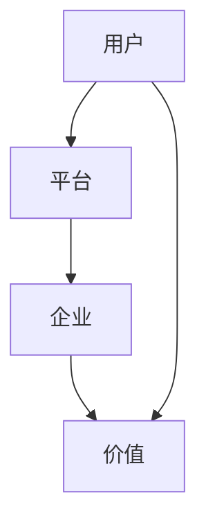
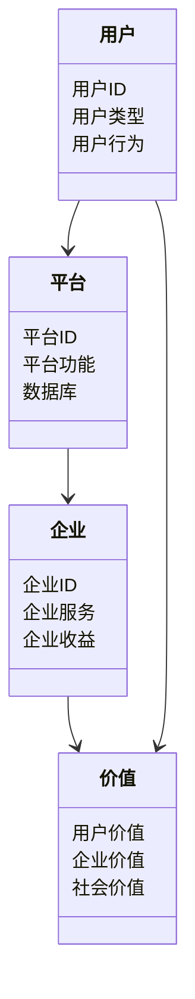
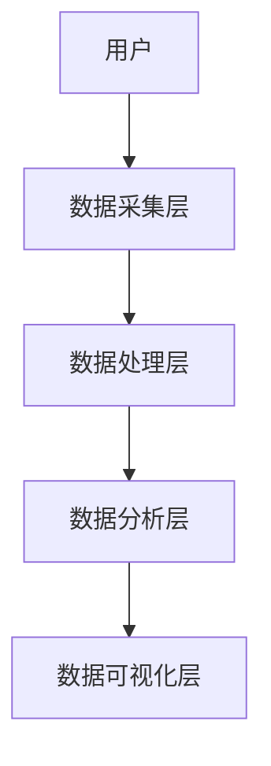
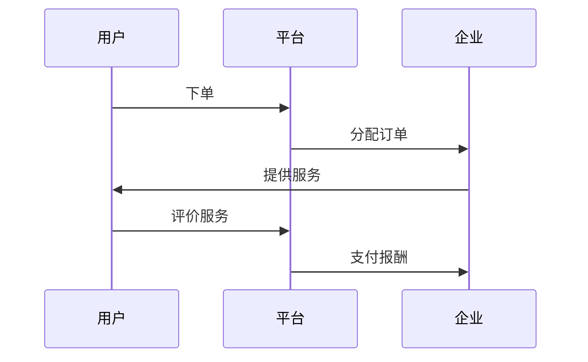

                 


# 彼得林奇的"价值创造"在平台经济中的衡量

## 关键词：平台经济，价值创造，彼得林奇，衡量指标，数学模型

## 摘要：本文探讨了彼得林奇的价值创造理论在平台经济中的应用，分析了平台经济中的价值衡量指标，构建了价值创造的数学模型，并通过案例分析和系统设计展示了如何在平台经济中具体衡量价值创造。

---

## 第一部分: 彼得林奇的"价值创造"在平台经济中的背景介绍

### 第1章: 平台经济的基本概念与特征

#### 1.1 平台经济的定义与核心要素
- **1.1.1 平台经济的定义**  
  平台经济是一种基于数字技术的经济模式，通过平台连接供需双方，提供撮合、交易、支付、物流等服务。其核心是通过技术手段降低交易成本，提高交易效率。

- **1.1.2 平台经济的核心要素**  
  - 数字平台：作为连接供需的核心工具，如滴滴、淘宝、美团等。  
  - 用户群体：平台的双边或多边用户是价值创造的主要来源。  
  - 数据驱动：通过数据采集和分析，优化匹配算法，提升用户体验。  
  - 网络效应：用户越多，平台价值越大，形成正反馈循环。

- **1.1.3 平台经济的分类与特点**  
  - 分类：按服务类型可分为出行平台（滴滴）、购物平台（淘宝）、住宿平台（ Airbnb）等。  
  - 特点：双边市场、零边际成本、数据驱动、网络效应强。

#### 1.2 彼得林奇的价值创造理论
- **1.2.1 彼得林奇的价值创造理论概述**  
  彼得林奇认为，企业的价值创造主要通过三个方面实现：提高产品或服务质量、降低成本、扩大市场份额。在平台经济中，价值创造还体现在提升用户体验、降低交易成本、增强平台粘性等方面。

- **1.2.2 价值创造的核心要素**  
  - 用户价值：通过优化产品和服务，提升用户体验。  
  - 企业价值：通过提高效率、降低成本，增强企业的盈利能力。  
  - 社会价值：通过平台的撮合，创造更多的社会就业、促进资源优化配置。

- **1.2.3 价值创造的衡量标准**  
  - 用户满意度：通过用户反馈、评分、留存率等指标衡量。  
  - 经济效益：通过收入增长、成本降低、利润增加等指标衡量。  
  - 社会效益：通过就业创造、资源利用率提高、环境影响降低等指标衡量。

#### 1.3 平台经济与价值创造的结合
- **1.3.1 平台经济中的价值创造模式**  
  平台通过技术创新、模式创新、服务创新等方式，为用户创造价值。例如，滴滴通过智能匹配司机和乘客，减少等待时间，提升出行效率。

- **1.3.2 平台经济与价值创造的关系**  
  平台经济通过降低交易成本、提高交易效率，实现价值创造。同时，价值创造反过来又推动平台的用户增长和市场份额扩大。

- **1.3.3 平台经济中价值创造的实现路径**  
  - 提供高质量的产品和服务。  
  - 优化用户体验，提高用户粘性。  
  - 利用数据驱动，精准匹配供需。  
  - 建立网络效应，形成正反馈循环。

### 第2章: 平台经济中的价值衡量方法

#### 2.1 价值创造的衡量指标
- **2.1.1 用户价值的衡量**  
  - 用户满意度：通过用户反馈、评分、投诉率等指标衡量。  
  - 用户留存率：衡量用户对平台的忠诚度。  
  - 用户生命周期价值（CLV）：预测用户在生命周期内为平台带来的收入。

- **2.1.2 企业价值的衡量**  
  - 收入增长：平台的收入情况，包括交易佣金、广告收入等。  
  - 成本降低：通过技术手段降低运营成本。  
  - 利润率：衡量平台的盈利能力。

- **2.1.3 社会价值的衡量**  
  - 就业创造：平台为多少人提供了就业机会。  
  - 资源利用率：平台是否提高了资源的利用效率。  
  - 环境影响：平台是否减少了资源浪费，降低了环境负担。

#### 2.2 平台经济中的价值衡量模型
- **2.2.1 模型构建的基本思路**  
  价值创造=用户价值+企业价值+社会价值。通过量化这三个方面，综合衡量平台的价值创造能力。

- **2.2.2 模型的核心组成部分**  
  - 用户价值：用户满意度、留存率、CLV。  
  - 企业价值：收入、利润、成本。  
  - 社会价值：就业、资源利用、环境影响。

- **2.2.3 模型的验证与优化**  
  通过实际数据验证模型的有效性，根据反馈不断优化模型，提高衡量的准确性和全面性。

#### 2.3 价值衡量的案例分析
- **2.3.1 滴滴出行的用户价值衡量**  
  滴滴通过智能匹配算法，大幅缩短用户等待时间，提升用户满意度。同时，通过优惠活动和个性化推荐，提高了用户留存率。

- **2.3.2 淘宝平台的企业价值衡量**  
  淘宝通过降低卖家的入驻门槛，吸引更多的商家，增加平台交易额。同时，通过大数据分析，精准匹配供需，降低交易成本。

- **2.3.3 共享单车的社会价值衡量**  
  共享单车平台通过提供便捷的出行方式，减少交通拥堵和环境污染，提高了资源利用率，创造了社会价值。

---

## 第二部分: 平台经济中的价值创造核心概念与联系

### 第3章: 价值创造的核心概念与联系

#### 3.1 核心概念原理
- **3.1.1 平台经济中的双边市场**  
  平台经济是一种典型的双边市场模式，平台连接供需双方，通过撮合交易实现价值创造。双边市场的特点包括：  
  - 需求方和供给方相互依存，形成正反馈循环。  
  - 网络效应强，用户越多，平台价值越大。

- **3.1.2 价值创造的驱动因素**  
  - 技术创新：通过大数据、人工智能等技术手段，优化匹配算法，提升用户体验。  
  - 模式创新：通过新的商业模式，如订阅制、会员制，增加用户粘性。  
  - 服务创新：提供差异化服务，满足用户个性化需求。

- **3.1.3 平台经济中的网络效应**  
  网络效应是指随着用户数量的增加，平台的价值呈指数级增长。例如，滴滴平台的用户越多，司机和乘客的匹配效率越高，平台的整体价值也越大。

#### 3.2 概念属性特征对比表格
以下是平台经济与传统经济在价值创造方面的对比：

**表3.1 平台经济与传统经济的对比**

| **对比维度**       | **平台经济**                              | **传统经济**                              |
|--------------------|------------------------------------------|------------------------------------------|
| 交易成本           | 低                                       | 高                                       |
| 交易效率           | 高                                       | 低                                       |
| 网络效应           | 强                                       | 弱                                       |
| 用户参与度         | 高                                       | 低                                       |
| 数据驱动           | 是                                       | 否                                       |

#### 3.3 ER实体关系图架构
以下是平台经济中的价值创造实体关系图：



---

## 第三部分: 平台经济中的价值创造算法原理讲解

### 第4章: 价值创造的算法原理

#### 4.1 算法原理概述
- 价值创造的量化方法：通过数学模型和算法，量化用户、企业和社会价值，综合衡量平台的价值创造能力。

#### 4.2 价值创造的数学模型
- 用户生命周期价值（CLV）公式：  
  $$ CLV = \frac{R}{(1 - \delta)} $$  
  其中，R为用户的年收入，δ为贴现率。

- 企业价值公式：  
  $$ 企业价值 = 收入 - 成本 $$

- 社会价值公式：  
  $$ 社会价值 = 就业人数 + 资源利用率 + 环境影响 $$

#### 4.3 算法实现与案例分析
- 使用Python代码实现CLV计算：  
  ```python
  def calculate_clv(revenue, discount_rate):
      return revenue / (1 - discount_rate)
  
  # 示例
  revenue = 100
  discount_rate = 0.05
  clv = calculate_clv(revenue, discount_rate)
  print("用户生命周期价值：", clv)
  ```

- 通过滴滴出行的案例，分析CLV的计算过程：  
  假设滴滴用户的年收入为100元，贴现率为5%，则用户生命周期价值为：  
  $$ CLV = \frac{100}{(1 - 0.05)} = 105.26 \text{元} $$

---

## 第四部分: 平台经济中的价值创造系统分析与架构设计

### 第5章: 价值创造的系统分析与架构设计

#### 5.1 系统功能设计（领域模型）
以下是平台经济的领域模型：



#### 5.2 系统架构设计
以下是平台经济的系统架构图：



#### 5.3 系统接口设计
- 用户接口：  
  - 登录/注册  
  - 下单/预约  
  - 查看订单历史  
  - 提交反馈  
- 企业接口：  
  - 上架服务  
  - 查看订单  
  - 收款  
- 平台接口：  
  - 匹配供需  
  - 收集数据  
  - 提供API

#### 5.4 系统交互流程
以下是系统交互流程图：



---

## 第五部分: 平台经济中的价值创造项目实战

### 第6章: 项目实战

#### 6.1 项目介绍
- 项目名称：滴滴出行价值创造分析  
- 项目目标：量化滴滴出行的用户价值、企业价值和社会价值。

#### 6.2 项目环境安装
- 安装Python和必要的库：  
  ```bash
  pip install numpy pandas matplotlib
  ```

#### 6.3 核心实现源代码
- 计算用户生命周期价值：  
  ```python
  import pandas as pd
  import numpy as np

  # 数据读取
  data = pd.read_csv('user_data.csv')
  data['CLV'] = data['收入'] / (1 - data['贴现率'])

  # 数据分析
  clv_mean = data['CLV'].mean()
  print("用户平均生命周期价值：", clv_mean)

  # 数据可视化
  import matplotlib.pyplot as plt
  plt.hist(data['CLV'], bins=10)
  plt.title('用户生命周期价值分布')
  plt.xlabel('CLV')
  plt.ylabel('用户数量')
  plt.show()
  ```

#### 6.4 代码应用解读与分析
- 数据读取：从CSV文件中读取用户数据，包括收入和贴现率。  
- CLV计算：使用公式计算用户的生命周期价值。  
- 数据分析：计算用户平均生命周期价值。  
- 数据可视化：绘制CLV分布图，分析用户价值的分布情况。

#### 6.5 实际案例分析
- 以滴滴为例，分析用户的CLV分布，优化匹配算法，提升用户体验。  
- 通过数据分析，发现哪些因素对用户价值影响最大，制定针对性的优化策略。

#### 6.6 项目小结
- 项目总结：滴滴通过智能匹配算法，大幅提升了用户的出行效率，创造了较高的用户价值和企业价值。  
- 经验教训：数据驱动是平台经济中价值创造的关键，需要通过持续优化算法和用户体验，不断提升平台的价值创造能力。

---

## 第六部分: 平台经济中的价值创造最佳实践

### 第7章: 最佳实践

#### 7.1 关键点总结
- 数据驱动是核心：通过数据分析，精准匹配供需，提升用户体验。  
- 用户价值是基础：通过优化产品和服务，提高用户满意度和留存率。  
- 企业价值是关键：通过降低成本、提高收入，增强平台的盈利能力。  
- 社会价值是目标：通过创造就业、优化资源配置，实现可持续发展。

#### 7.2 小结
- 平台经济通过技术创新和模式创新，为用户、企业和社会创造了巨大的价值。  
- 通过量化用户、企业和社会价值，可以全面衡量平台的价值创造能力。

#### 7.3 注意事项
- 数据隐私保护：在采集和使用用户数据时，必须遵守相关法律法规，保护用户隐私。  
- 算法公平性：确保算法的公平性，避免歧视和偏见，维护用户权益。  
- 可持续发展：在追求经济效益的同时，注重社会价值和环境影响。

#### 7.4 拓展阅读
- 《平台革命》：探讨平台经济的商业模式和创新路径。  
- 《价值创造与价值传递》：分析价值创造的实现路径和衡量方法。  
- 《数据驱动的决策》：介绍如何通过数据分析优化平台运营。

---

## 作者：AI天才研究院/AI Genius Institute & 禅与计算机程序设计艺术/Zen And The Art of Computer Programming

