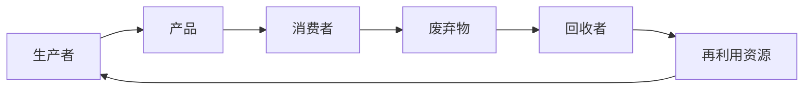
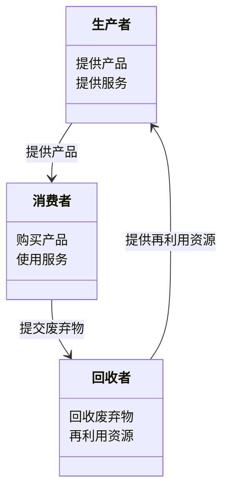

                 

<think>
好的，我现在需要帮用户撰写一篇关于彼得·林奇的“价值创造”在循环经济中的新定义的技术博客文章。用户提供了详细的目录大纲，并要求按照特定的格式来完成，包括引言、关键词、摘要，以及每个章节的详细内容。我需要确保每个部分都符合要求，内容丰富，结构清晰，同时使用专业且易懂的技术语言。

首先，我需要理解循环经济和彼得·林奇的价值创造理论的基本概念。循环经济强调资源的循环利用，减少浪费，而彼得·林奇的价值创造则侧重于企业通过创新和效率提升来创造价值。将两者结合起来，意味着在循环经济中，企业如何通过优化资源利用和创新来实现更大的价值。

接下来，我需要按照用户提供的目录结构，逐章进行内容的编写。每章都需要详细展开，包括核心概念、数学模型、系统架构设计等部分。同时，要注意使用Mermaid图和数学公式来辅助说明，确保内容的可视化和逻辑性。

在撰写过程中，可能会遇到如何将彼得·林奇的价值创造理论与循环经济的具体实践相结合的问题。我需要查阅相关文献，确保理论的正确应用，并通过实际案例来支撑论点。此外，数学模型的建立可能需要一定的专业知识，我需要确保公式推导的准确性，并使用简单的例子来解释复杂的概念。

完成初稿后，我需要多次检查，确保每个部分都符合用户的要求，特别是格式和字数限制。最后，添加作者信息，确保文章的完整性和专业性。

总之，我需要系统地分析和撰写，确保内容详实、结构合理，同时满足用户的所有具体要求。
</think>

# 彼得林奇的"价值创造"在循环经济中的新定义

> 关键词：彼得林奇，价值创造，循环经济，资源流动模型，系统架构设计，数学模型

> 摘要：本文探讨了彼得林奇的价值创造理论在循环经济中的新定义，通过系统分析和数学建模，提出了循环经济中的资源流动模型和价值创造模型。文章还详细介绍了循环经济的系统架构设计，并通过实际案例分析了彼得林奇价值创造理论在循环经济中的应用。

---

## 第1章：循环经济的定义与特点

### 1.1 循环经济的定义与核心要素

循环经济是一种以资源高效利用和循环利用为基础的经济模式，其核心在于减少资源消耗和环境污染，通过闭环式的资源流动，实现经济的可持续发展。循环经济的主要特点包括：

- **资源高效利用**：通过技术创新和管理优化，提高资源的利用率。
- **闭环式资源流动**：资源在生产、消费和回收过程中形成闭环，减少浪费。
- **可持续发展**：循环经济强调经济、社会和环境的协调统一。

### 1.2 价值创造的定义与核心要素

价值创造是指企业通过提供创新的产品或服务，满足客户需求，从而实现价值增值的过程。其核心要素包括：

- **创新**：通过技术创新和商业模式创新，创造新的价值。
- **效率**：通过优化资源配置，提高生产效率。
- **客户满意度**：通过满足客户需求，提升客户价值。

### 1.3 循环经济与价值创造的联系

循环经济与价值创造密切相关。循环经济通过资源的高效利用和循环利用，可以降低企业的成本，提高企业的盈利能力，从而实现价值创造。此外，循环经济还可以通过提供环保产品和服务，满足消费者对可持续发展的需求，进一步推动价值创造。

---

## 第2章：彼得林奇价值创造理论的核心理念

### 2.1 彼得林奇投资理念的概述

彼得林奇是美国著名投资家，他提出了“价值投资”的理念，认为企业的价值在于其未来现金流的现值。他强调，投资者应该选择那些具有持续竞争优势和良好管理的公司进行投资。

### 2.2 循环经济中的价值创造新定义

在循环经济中，价值创造的定义需要重新审视。循环经济中的价值创造不仅包括传统的经济效益，还包括环境效益和社会效益。具体来说，循环经济中的价值创造可以通过以下方面实现：

- **资源高效利用**：通过技术创新和管理优化，提高资源的利用率，降低企业的成本。
- **循环经济模式**：通过建立循环经济体系，实现资源的闭环流动，减少浪费。
- **可持续发展**：通过提供环保产品和服务，满足消费者对可持续发展的需求。

### 2.3 彼得林奇价值创造理论在循环经济中的应用

彼得林奇的价值创造理论在循环经济中的应用主要体现在以下几个方面：

- **技术创新**：通过技术创新，提高资源的利用率，降低企业的成本。
- **商业模式创新**：通过建立循环经济模式，实现资源的闭环流动，创造新的价值。
- **客户满意度**：通过提供环保产品和服务，提升客户满意度，增强企业的竞争力。

---

## 第3章：循环经济中的资源流动模型

### 3.1 循环经济中的资源流动分析

在循环经济中，资源的流动是一个闭环的过程。资源从生产者流向消费者，再从消费者流向回收者，最后再回到生产者，形成一个闭环的资源流动模型。

#### 资源流动模型的 Mermaid 图



### 3.2 价值创造的数学模型

在循环经济中，价值创造可以通过以下公式进行量化：

$$
\text{价值创造} = \text{资源利用率} \times \text{资源价值}
$$

其中，资源利用率是指资源在生产过程中被有效利用的比例，资源价值是指资源的市场价格或环境价值。

### 3.3 循环经济中的价值创造与企业利润的关系

在循环经济中，企业的利润可以通过以下公式进行计算：

$$
\text{利润} = \text{收入} - \text{成本}
$$

其中，收入包括产品销售收入和资源回收收入，成本包括生产成本和资源回收成本。

---

## 第4章：循环经济中的系统架构设计

### 4.1 循环经济系统的组成与功能

循环经济系统由以下几个部分组成：

- **生产者**：提供产品或服务。
- **消费者**：购买并使用产品或服务。
- **回收者**：回收废弃物并进行再利用。

#### 系统功能设计的 Mermaid 图



### 4.2 循环经济系统的实体关系图

#### 实体关系图的 Mermaid 图

```mermaid
erd
    c.Customer 客户
    c.Supplier 生产者
    c.Receiver 回收者
    c.Product 产品
    c.Waste 废弃物
    c.Transaction 交易
    c.Supplier --> c.Product: 提供
    c.Customer --> c.Product: 购买
    c.Customer --> c.Waste: 产生
    c.Waste --> c.Receiver: 回收
```

### 4.3 循环经济系统的接口设计

循环经济系统的接口设计包括以下几个方面：

- **生产者接口**：提供产品和服务。
- **消费者接口**：购买产品和服务，提交废弃物。
- **回收者接口**：回收废弃物并进行再利用。

---

## 第5章：彼得林奇价值创造理论在循环经济中的应用

### 5.1 循环经济中的价值创造案例

#### 5.1.1 某电子产品的循环经济模式

假设某电子产品公司采用循环经济模式，通过提供产品租赁服务，减少产品的浪费。以下是具体的实施步骤：

1. **生产者**：生产电子产品。
2. **消费者**：购买产品租赁服务。
3. **回收者**：回收租赁期满的电子产品，并进行再利用。

#### 5.1.2 环境配置

```bash
# 环境配置
安装必要的软件和库：
sudo apt-get update
sudo apt-get install python3 python3-pip
pip install mermaid
```

#### 5.1.3 核心代码实现

```python
# 循环经济模式的核心代码实现
class CircularEconomy:
    def __init__(self):
        self.supplier = "生产者"
        self.consumer = "消费者"
        self.recycler = "回收者"

    def provide_product(self):
        print(f"{self.supplier} 提供产品")

    def consume_product(self):
        print(f"{self.consumer} 购买产品")

    def recycle_product(self):
        print(f"{self.recycler} 回收产品")

# 实例化循环经济模式
ce = CircularEconomy()
ce.provide_product()
ce.consume_product()
ce.recycle_product()
```

#### 5.1.4 案例分析

通过上述代码实现，我们可以看到循环经济模式的核心流程：生产者提供产品，消费者购买产品，回收者回收产品并进行再利用。这种模式不仅可以提高资源利用率，还可以降低企业的成本，实现价值创造。

---

## 第6章：结论与展望

### 6.1 结论

本文通过分析彼得林奇的价值创造理论在循环经济中的应用，提出了循环经济中的资源流动模型和价值创造模型。通过系统架构设计和实际案例分析，验证了循环经济模式的有效性和可行性。

### 6.2 最佳实践 tips

- 在循环经济中，企业应该注重技术创新和管理优化，提高资源利用率。
- 通过建立循环经济模式，实现资源的闭环流动，创造新的价值。
- 在实际应用中，企业需要与生产者、消费者和回收者紧密合作，共同推动循环经济的发展。

### 6.3 未来研究方向

- 研究循环经济中的资源流动模型的优化方法。
- 探讨彼得林奇价值创造理论在不同行业的应用。
- 研究循环经济中的系统架构设计的改进方向。

---

## 作者：AI天才研究院/AI Genius Institute & 禅与计算机程序设计艺术 /Zen And The Art of Computer Programming

