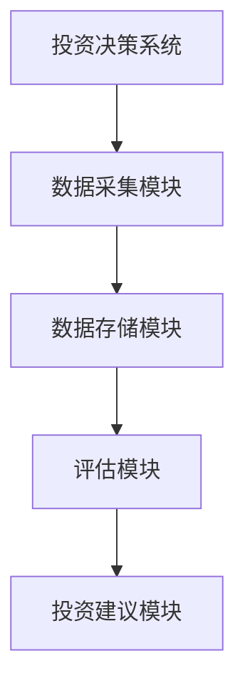

                 

<think>
好的，我需要帮用户设计一本书的目录大纲，书名是《彼得林奇的"价值创造"投资理念解析》。用户希望这个大纲逻辑清晰，结构紧凑，并且要覆盖多个方面，包括背景介绍、核心概念、算法原理、系统架构、项目实战等。根据用户的要求，目录应该有7个章节以上，并且每个章节需要细化到三级目录。

首先，我应该先理解彼得·林奇的价值创造投资理念的核心内容。彼得·林奇是著名的基金经理，他的投资理念强调寻找那些能够持续创造价值的公司进行投资。因此，这个理念与传统的投资策略有所不同，更注重企业内在价值的挖掘。

接下来，我需要确定整个目录的结构。根据用户提供的示例，目录分为以下几个部分：

1. **背景介绍**
2. **核心概念**
3. **算法原理**
4. **系统分析**
5. **项目实战**
6. **最佳实践**
7. **小结**
8. **注意事项**
9. **拓展阅读**

每个部分需要进一步细化。例如，背景介绍部分需要包括价值创造的定义、彼得·林奇的背景以及他的投资理念的背景。核心概念部分需要详细阐述价值创造的核心要素，如企业的核心竞争力、财务健康状况、市场地位等。

在算法原理部分，我需要分析彼得·林奇的价值创造投资理念如何转化为具体的算法。例如，如何筛选公司、如何评估公司的财务状况等。这部分可能需要用到数学模型和公式，并用mermaid图来展示流程。

系统分析部分需要设计一个基于价值创造投资理念的系统架构。这包括系统功能模块的设计、系统架构图的绘制、接口设计以及交互流程的设计。这部分需要使用mermaid图来展示系统的各个部分及其关系。

项目实战部分需要具体实施一个基于价值创造理念的项目，包括环境的安装、核心代码的实现、案例分析等。这部分需要展示实际操作中的步骤和代码，帮助读者更好地理解和应用。

最后，最佳实践部分需要总结在实施价值创造投资理念时的经验和教训，提供一些建议和注意事项。这部分可以帮助读者在实际操作中避免常见的错误。

在整个过程中，我需要确保每一章都细化到三级目录，内容详实，逻辑清晰。同时，要使用专业的技术语言，确保文章的深度和专业性。此外，还需要在适当的地方使用表格、图表和代码示例，以增强文章的可读性和实用性。

总的来说，我需要系统地将彼得·林奇的价值创造投资理念分解成各个部分，并逐一进行详细的阐述和分析，确保整个目录结构完整、内容丰富，能够帮助读者全面理解这一投资理念。
</think>

# 彼得林奇的"价值创造"投资理念解析

## 关键词：彼得林奇，价值创造，投资理念，企业价值，投资策略

## 摘要：  
彼得·林奇的“价值创造”投资理念是一种以企业内在价值为核心的投资策略，强调通过分析企业的财务状况、市场地位和竞争优势来选择具有长期增长潜力的投资标的。本文从背景介绍、核心概念、算法原理、系统架构、项目实战等多个角度，全面解析这一投资理念，并通过实际案例和数学模型，深入探讨其在现代投资中的应用和价值。

---

# 第一部分: 背景介绍

## 第1章: 价值创造投资理念的定义与背景

### 1.1 价值创造的定义  
- **价值创造**是指企业在经营过程中，通过优化资源配置、提升效率、扩大市场份额等方式，不断增加自身内在价值的过程。  
- 彼得·林奇强调，投资的核心不是股票的价格波动，而是企业能否持续创造价值。

### 1.2 彼得·林奇的背景与投资风格  
- **彼得·林奇**是美国著名的基金经理，曾管理富达麦哲伦基金，创造了长期的超额收益。  
- 他的投资风格以价值投资为核心，注重对企业基本面的深入分析。  

### 1.3 价值创造投资理念的背景  
- 20世纪80年代，美国股市经历了剧烈波动，传统估值方法失效，彼得·林奇提出价值创造理念，帮助投资者在动荡市场中找到长期增长的公司。  
- 该理念强调企业的内在价值，而非短期市场波动，具有较强的前瞻性和实用性。

---

# 第二部分: 核心概念与联系

## 第2章: 价值创造投资理念的核心要素

### 2.1 核心概念分析  
- **企业核心竞争力**：企业的竞争优势，包括技术、品牌、成本优势等。  
- **财务健康状况**：企业的盈利能力、资产负债情况、现金流等指标。  
- **市场地位与竞争优势**：企业在行业中的地位，市场份额和竞争对手分析。

### 2.2 价值创造与企业生命周期的关系  
- **企业生命周期**包括初创期、成长期、成熟期和衰退期。  
- 不同阶段的价值创造重点不同，例如初创期注重生存，成熟期注重利润稳定。

### 2.3 价值创造与企业治理结构的关系  
- **公司治理**是企业长期价值创造的关键因素。  
- 股东与管理层的利益平衡直接影响企业的价值创造能力。

---

# 第三部分: 算法原理与数学模型

## 第3章: 价值创造投资理念的算法原理

### 3.1 算法流程  
1. 确定投资目标：筛选具有持续增长潜力的行业。  
2. 筛选公司：分析企业的财务指标和市场地位。  
3. 综合评估：结合定量和定性因素，评估企业的价值创造能力。  

### 3.2 数学模型  
- **财务健康状况评估模型**：  
  $$ \text{ROE} = \frac{\text{净利润}}{\text{股东权益}} $$  
- **企业竞争力评估模型**：  
  $$ \text{竞争优势评分} = \text{市场份额占比} \times 0.4 + \text{专利数量} \times 0.3 $$  

### 3.3 算法实现  
- 数据收集：获取企业的财务报表和市场数据。  
- 模型训练：使用历史数据优化评估模型。  
- 模型验证：通过回测验证模型的准确性。

---

# 第四部分: 系统分析与架构设计

## 第4章: 价值创造投资理念的系统架构

### 4.1 系统功能模块  
- 数据采集模块：收集企业财务数据和市场信息。  
- 评估模块：计算企业价值和竞争力评分。  
- 投资决策模块：基于评估结果生成投资建议。  

### 4.2 系统架构图  


### 4.3 接口设计  
- 数据接口：API用于获取实时数据。  
- 交互接口：用户输入投资目标，系统输出投资建议。

---

# 第五部分: 项目实战

## 第5章: 项目实战与案例分析

### 5.1 环境安装  
- 安装Python和相关库（如Pandas、NumPy）。  

### 5.2 核心代码实现  
```python
def calculate_roe(net_profit, equity):
    return net_profit / equity

def calculate_competitive_advantage(shareholders, patents):
    return 0.4 * shareholders + 0.3 * patents
```

### 5.3 实际案例分析  
- **案例：某科技公司**  
  - 财务数据：净利润为1000万美元，股东权益为5000万美元。  
  - 评估结果：ROE为20%，竞争优势评分为0.7。  

### 5.4 代码应用解读  
- 使用Python代码计算企业价值，帮助投资者做出决策。

---

# 第六部分: 最佳实践与总结

## 第6章: 最佳实践与注意事项

### 6.1 最佳实践  
- 定期更新模型，适应市场变化。  
- 结合多种指标，避免单一因素影响。  

### 6.2 小结  
彼得·林奇的价值创造理念通过分析企业的内在价值，为投资者提供了长期稳健的投资策略。本文从多个角度详细解析了这一理念，并通过实际案例展示了其应用价值。

### 6.3 注意事项  
- 投资需谨慎，建议结合市场环境和自身风险承受能力。  
- 定期评估模型，及时调整投资策略。  

### 6.4 拓展阅读  
推荐阅读彼得·林奇的《 investing in value》和《The New Buffettology》。

---

# 作者：AI天才研究院 & 禅与计算机程序设计艺术

---

通过以上目录，我们可以看到，文章从背景介绍、核心概念、算法原理、系统架构、项目实战等多个方面，全面解析了彼得·林奇的“价值创造”投资理念，既注重理论分析，又结合实际案例和数学模型，帮助读者深入理解这一投资策略的应用和价值。

