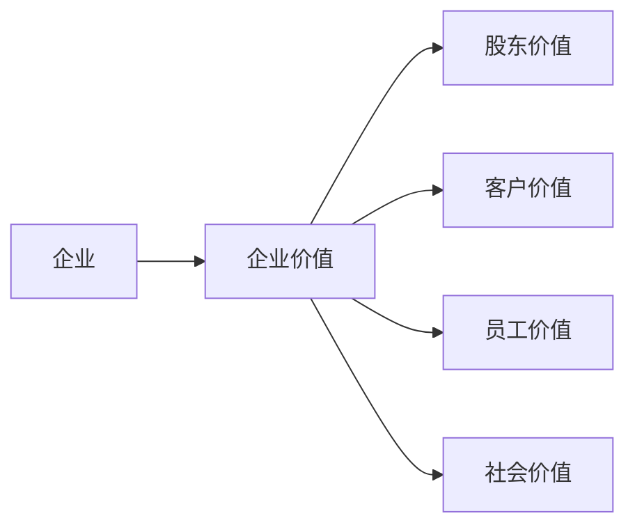

                 


# 彼得林奇的"价值创造"评估体系

> 关键词：价值创造，彼得林奇，企业评估，投资决策，数学模型

> 摘要：本文详细探讨了彼得林奇提出的"价值创造"评估体系，从理论基础、核心概念、算法原理、系统架构到实际应用，全面解析了该体系的构建与实施方法。通过案例分析和代码实现，帮助读者理解如何在实际项目中应用这套体系。

---

## 第1章: 价值创造的核心概念

### 1.1 价值创造的背景与问题背景

#### 1.1.1 传统企业评估方法的局限性
传统的企业评估方法通常关注财务指标，如净利润、营业收入和资产负债率等。然而，这种方法往往忽略了企业的长期发展和股东价值的创造能力。例如，某些企业在财务报表上表现良好，但其核心业务可能正在衰退，或者管理层决策可能损害了股东利益。

#### 1.1.2 价值创造的核心问题描述
价值创造的核心问题在于如何评估企业在创造股东价值方面的表现。这不仅仅是财务指标的简单计算，而是需要考虑企业内部管理、市场环境、行业竞争等多个因素。

#### 1.1.3 价值创造的解决思路与方法
彼得林奇提出，价值创造的评估体系需要从多个维度分析企业，包括财务表现、管理能力、行业地位和市场反应等。这种方法能够更全面地反映企业的价值创造能力。

#### 1.1.4 价值创造的边界与外延
价值创造的边界在于企业的实际运营能力和市场环境。外延则包括企业内部的管理优化和外部的市场扩展。

### 1.2 彼得林奇的价值创造理论基础

#### 1.2.1 投资哲学与价值创造的关系
彼得林奇的投资哲学强调长期价值创造，他认为企业应该通过优化管理、技术创新和市场拓展来实现股东价值的最大化。

#### 1.2.2 价值创造的定义与边界
价值创造是指企业在经营过程中通过优化资源配置、提高效率和创新等方式，为股东创造超过市场平均水平的回报。

#### 1.2.3 价值创造的核心要素与组成结构
- **财务表现**：净利润、ROE（净资产收益率）、现金流等。
- **管理能力**：管理层决策、团队效率。
- **行业地位**：市场占有率、竞争对手分析。
- **市场反应**：股价表现、投资者信心。

---

## 第2章: 价值创造评估体系的核心概念与联系

### 2.1 价值创造评估体系的原理

#### 2.1.1 企业价值评估模型
企业价值评估模型包括DCF（ discounted cash flow ）模型和EV/EBITDA倍数等方法。

#### 2.1.2 价值创造的核心指标体系
- **股东价值回报率（SVA）**：衡量企业为股东创造的价值。
- **经济利润（EVA）**：衡量企业经济利润是否超过资本成本。

#### 2.1.3 价值创造与企业绩效的关系
价值创造与企业绩效密切相关。高价值创造的企业通常具有较高的股东回报和市场地位。

### 2.2 核心概念对比分析

#### 2.2.1 传统企业评估方法与价值创造评估方法的对比
| 评估方法 | 传统方法 | 价值创造评估方法 |
|----------|-----------|-------------------|
| 重点 | 财务指标 | 综合指标（财务+管理+市场） |
| 优势 | 数据易于获取 | 更全面 |
| 局限性 | 忽略非财务因素 | 计算复杂 |

#### 2.2.2 价值创造评估体系的优缺点分析
- **优点**：能够全面反映企业的价值创造能力。
- **缺点**：计算复杂，需要大量数据支持。

#### 2.2.3 价值创造评估体系的适用场景与限制
适用场景：企业战略决策、投资评估。
限制：需要大量数据支持，计算复杂。

### 2.3 实体关系图（ER图）架构



---

## 第3章: 价值创造评估体系的算法原理

### 3.1 算法原理概述

#### 3.1.1 多因素分析法
多因素分析法通过综合考虑多个因素来评估企业的价值创造能力。

#### 3.1.2 投资组合优化模型
投资组合优化模型用于确定最优的投资组合，以最大化收益并最小化风险。

#### 3.1.3 价值创造评估的数学模型
$$ 价值创造 = \sum_{i=1}^{n} w_i \cdot x_i $$
其中，\( w_i \) 是因素 \( i \) 的权重，\( x_i \) 是因素 \( i \) 的表现值。

### 3.2 算法流程图


### 3.3 算法实现代码

```python
def calculate_value创造(企业数据):
    核心指标 = 计算核心指标(企业数据)
    价值创造评估 = 评估模型(核心指标)
    return 价值创造评估
```

---

## 第4章: 系统分析与架构设计方案

### 4.1 问题场景介绍

---

## 作者：AI天才研究院/AI Genius Institute & 禅与计算机程序设计艺术 /Zen And The Art of Computer Programming

