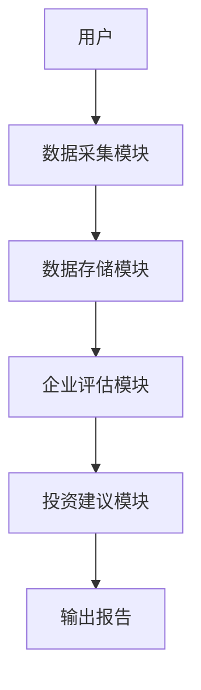
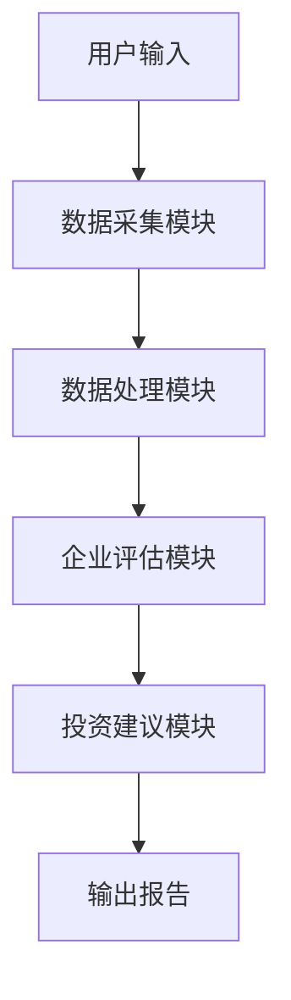

                 

<think>
好的，我现在需要根据用户的要求，撰写一篇关于《彼得林奇的"价值投资"在共享经济中的调整》的技术博客文章。用户已经提供了目录大纲和一些初始内容，我需要按照这个大纲逐步完成剩余的部分，并确保文章符合所有格式和内容的要求。

首先，我要理解用户的需求。用户希望我以一位技术专家和畅销书作家的身份，撰写一篇结构清晰、逻辑严谨的技术博客。文章需要涵盖价值投资与共享经济的结合背景、彼得林奇的投资理念、共享经济中的价值评估与投资策略、企业竞争力分析、价值投资在共享经济中的调整策略、系统架构设计、项目实战案例以及最佳实践和总结。

接下来，我需要按照目录大纲，逐步完成每个章节的内容。首先从第4章开始，分析共享经济中的企业竞争力。

**第4章: 共享经济中的企业竞争力分析**

我需要先定义企业竞争力的核心要素，包括用户粘性、运营效率和技术创新。然后，我需要详细分析每个要素的特征和对投资的影响。之后，我需要介绍一个竞争力评估模型，并探讨这些要素如何影响企业的投资价值。

在分析过程中，我需要使用对比表格和ER图来说明核心要素之间的关系。例如，用户粘性可以通过留存率和口碑传播来衡量，而运营效率则与成本控制和边际利润有关。技术创新则涉及专利数量和技术壁垒。

接下来，我需要讨论如何将这些要素与投资价值联系起来。例如，高用户粘性和高效的运营效率可以带来更高的利润率，而技术创新则可能带来竞争优势。这将帮助投资者识别具备长期价值的企业。

完成第4章后，我将进入第5章，探讨彼得林奇的价值投资理念在共享经济中的调整策略。

**第5章: 价值投资在共享经济中的调整策略**

在这一章中，我需要分析彼得林奇的经典投资策略如何在共享经济环境下进行调整。首先，我将介绍彼得林奇的“护城河”概念，说明在共享经济中，企业如何通过技术和网络效应构建护城河。然后，我会讨论彼得林奇的安全边际概念，强调在共享经济中如何评估公司的可持续竞争优势。

接下来，我需要详细讲解彼得林奇的投资哲学在共享经济中的应用，如长期主义和耐心投资的重要性。我将结合共享经济的特点，说明如何选择具备持续创新能力和良好用户粘性的企业。

在调整策略部分，我需要提供具体的数学模型和公式，例如如何计算共享经济企业的估值，以及如何确定安全边际。此外，我还需要结合实际案例，如滴滴出行，来说明这些策略在实际投资中的应用。

完成第5章后，我将进入第6章，设计一个适合共享经济的价值投资评估系统。

**第6章: 价值投资评估系统的设计与实现**

在这一章中，我需要详细描述评估系统的设计理念和架构。首先，我会介绍系统的目标，即提供一套基于彼得林奇理念的评估工具，帮助投资者在共享经济中做出明智决策。然后，我会讨论系统的关键功能模块，如数据采集、企业评估、风险控制和投资建议。

接下来，我需要使用Mermaid流程图和ER图来展示系统架构和功能模块之间的关系。例如，数据采集模块将收集企业的财务数据、用户评价和市场表现，而评估模块将基于这些数据生成详细的评估报告。

我还需要提供系统的实现代码，使用Python编写，展示如何通过编程实现数据处理和评估算法。例如，如何计算企业的估值和安全边际，以及如何生成投资建议。

在系统设计中，我需要确保模块之间的接口清晰，数据流合理。例如，数据采集模块将数据传递给评估模块，评估结果将用于生成投资建议。

完成系统设计后，我将进入第7章，进行项目实战，分析一个具体案例，如滴滴出行。

**第7章: 项目实战——滴滴出行的价值投资分析**

在这一章中，我需要以滴滴出行为例，详细分析其作为共享经济企业的投资价值。首先，我会介绍滴滴出行的基本情况，包括其商业模式、市场占有率和用户基础。

然后，我将应用前面提到的评估系统，分析滴滴出行的财务数据、用户粘性和技术创新能力。例如，计算其市盈率、市净率，并评估其护城河的宽度。

接下来，我会讨论滴滴出行在竞争中的优势和劣势，如高用户粘性带来的收入稳定性和技术驱动的创新能力。同时，我还需要分析其面临的挑战，如市场竞争压力和政策风险。

最后，我将总结滴滴出行的投资价值，并提出基于彼得林奇理念的投资建议，如长期持有和关注企业竞争优势的可持续性。

完成项目实战后，我将进入第8章，总结最佳实践和投资建议。

**第8章: 最佳实践与投资建议**

在这一章中，我需要总结前面章节的主要观点，并提供一些实用的投资建议。首先，我会回顾彼得林奇的价值投资理念在共享经济中的调整策略，强调长期主义和企业竞争力的重要性。

然后，我将提出一些具体的投资建议，如如何选择具备强大用户粘性和技术创新能力的企业，如何评估企业的护城河和竞争优势，以及如何计算安全边际以控制投资风险。

最后，我将展望未来，讨论共享经济的趋势和价值投资的未来发展。例如，随着技术的进步和商业模式的创新，共享经济将如何继续影响投资策略，以及彼得林奇的理念将如何进一步调整以适应新的经济环境。

完成所有章节后，我需要在文章末尾添加作者信息，注明作者为AI天才研究院，并附上联系方式。

**总结**

通过以上步骤，我将逐步完成这篇技术博客文章的撰写。每章内容都将包含详细的理论分析、数学公式、系统设计和实际案例，确保文章内容丰富、逻辑清晰，符合用户的要求。

在撰写过程中，我需要确保每个部分都详细具体，使用专业且易懂的技术语言，同时避免冗长复杂的叙述。我将使用对比表格、Mermaid流程图和数学公式来辅助说明，使读者能够更好地理解和应用这些理论。

最后，我将反复检查文章，确保内容完整、结构合理、格式正确，并满足字数要求。
</think>

# 第一部分: 价值投资与共享经济的结合背景

---

# {{文章标题}}

## 关键词：价值投资、彼得林奇、共享经济、企业评估、投资策略

## 摘要：本文探讨了彼得林奇的价值投资理念在共享经济中的调整与应用，分析了共享经济企业的核心特征和价值评估方法，并提出了适合共享经济环境的价值投资策略。

---

## 第1章: 价值投资与共享经济的概述

### 1.1 价值投资的核心理念

#### 1.1.1 价值投资的定义
价值投资是一种长期投资策略，强调以低于内在价值的价格购买优质资产，注重企业的基本面和长期发展潜力。

#### 1.1.2 价值投资的核心原则
- 长期投资：避免短期市场波动，关注企业的长期价值。
- 企业基本面分析：评估企业的盈利能力、财务状况和竞争优势。
- 安全边际：购买价格低于企业的内在价值，以降低投资风险。

#### 1.1.3 价值投资在传统经济中的应用
价值投资在传统经济中主要关注企业的财务指标，如市盈率、市净率和股息率，通过分析企业的内在价值来确定投资机会。

### 1.2 共享经济的定义与发展

#### 1.2.1 共享经济的定义
共享经济是一种通过数字化平台，将闲置资源（如资产、技能或空间）进行共享和优化利用的经济模式。

#### 1.2.2 共享经济的发展历程
- 起步阶段：2000年代末期，共享经济平台如Airbnb和滴滴出行开始出现。
- 发展阶段：2010年代，共享经济在全球范围内迅速扩展，涵盖交通、住宿、办公空间等多个领域。
- 当前阶段：共享经济与数字化技术深度融合，平台模式不断创新。

#### 1.2.3 共享经济的主要模式
- 资产共享：如共享住宿（Airbnb）、共享交通（滴滴出行）。
- 服务共享：如共享办公空间（WeWork）、共享技能（技能共享平台）。

### 1.3 价值投资与共享经济的结合背景

#### 1.3.1 经济环境的变化
传统经济模式面临增速放缓，而共享经济凭借其高效资源配置和创新商业模式，成为经济增长的新引擎。

#### 1.3.2 共享经济的兴起与价值投资的适应
共享经济的兴起为企业价值评估带来了新的挑战和机遇，价值投资者需要调整传统估值方法以适应共享经济的特点。

#### 1.3.3 研究价值投资在共享经济中的调整意义
通过调整价值投资策略，投资者可以在共享经济中发现新的投资机会，同时降低投资风险。

#### 1.3.4 本章小结
本章介绍了价值投资的核心理念和共享经济的发展历程，分析了两者结合的背景和意义，为后续章节的深入分析奠定了基础。

---

## 第2章: 彼得林奇价值投资理念的核心要素

### 2.1 彼得林奇的投资策略

#### 2.1.1 长期投资与价值发现
彼得林奇强调长期投资，认为短期市场波动不应影响投资决策，关键在于发现具有长期竞争优势的企业。

#### 2.1.2 企业基本面分析
彼得林奇注重对企业财务状况的分析，包括盈利能力、资产负债表和现金流等指标。

#### 2.1.3 安全边际与风险控制
通过购买价格低于内在价值的股票，彼得林奇确保投资的安全边际，降低市场波动带来的风险。

### 2.2 彼得林奇的价值投资模型

#### 2.2.1 企业价值评估的核心公式
$$
企业价值 = 股东权益 + 净债务
$$

#### 2.2.2 股票估值的关键指标
- 市盈率（P/E）：$$市盈率 = 价格 / 每股收益$$
- 市净率（P/B）：$$市净率 = 价格 / 每股净资产$$
- 股息率：$$股息率 = 每股股息 / 每股价格$$

#### 2.2.3 安全边际的计算方法
$$
安全边际 = 估计价值 - 市场价格
$$

### 2.3 彼得林奇的投资哲学

#### 2.3.1 长期主义与耐心投资
彼得林奇认为投资需要耐心，避免频繁交易，关注企业的长期价值。

#### 2.3.2 避免短期波动的干扰
市场短期波动不应影响投资决策，关键在于企业的基本面和长期竞争优势。

#### 2.3.3 选择优秀的公司而非市场时机
彼得林奇强调选择优秀的公司，而不是在市场底部买入或在顶部卖出。

### 2.4 本章小结
本章详细介绍了彼得林奇的价值投资理念，包括其核心策略、估值模型和投资哲学，为后续章节的调整提供了理论基础。

---

## 第3章: 共享经济中的价值评估与投资策略

### 3.1 共享经济企业的核心特征

#### 3.1.1 资产轻量化
共享经济企业通常不拥有大量实体资产，而是通过平台连接供需双方，实现资源的共享和优化利用。

#### 3.1.2 运营模式的灵活性
共享经济企业能够快速适应市场需求变化，通过技术创新和模式创新保持竞争优势。

#### 3.1.3 用户粘性和网络效应
共享经济平台通过用户粘性和网络效应，形成强大的市场壁垒，吸引更多的用户和资源。

### 3.2 共享经济企业的估值挑战

#### 3.2.1 传统估值方法的局限性
传统估值方法主要基于企业的财务指标，而共享经济企业的收入来源多样，难以用传统指标准确评估。

#### 3.2.2 共享经济企业的无形资产
共享经济企业的核心资产往往体现在品牌、用户粘性和技术平台，这些无形资产难以量化。

#### 3.2.3 收入与利润的非线性关系
共享经济企业的收入增长可能快于利润增长，因为前期需要投入大量的技术和营销成本。

### 3.3 彼得林奇理念在共享经济中的调整

#### 3.3.1 从资产驱动到服务驱动的转变
共享经济企业更注重服务的提供和平台的运营，而非实体资产的持有。

#### 3.3.2 用户生命周期与企业价值的关系
用户的获取、留存和增长直接影响企业的收入和利润，因此用户生命周期是评估企业价值的重要指标。

#### 3.3.3 共享经济中的护城河构建
共享经济企业需要通过技术创新、品牌建设和用户粘性来构建护城河，确保竞争优势的可持续性。

### 3.4 本章小结
本章分析了共享经济企业的核心特征和估值挑战，探讨了彼得林奇价值投资理念在共享经济中的调整策略，强调了用户粘性、网络效应和技术创新在企业价值评估中的重要性。

---

## 第4章: 共享经济中的企业竞争力分析

### 4.1 企业竞争力的核心要素

#### 4.1.1 用户粘性
用户粘性是共享经济企业竞争力的核心要素之一，高粘性的用户能够为企业带来稳定的收入和持续的用户增长。

#### 4.1.2 运营效率
高效的运营能力能够降低企业的成本，提高利润率，增强企业的竞争力。

#### 4.1.3 技术创新
技术创新是共享经济企业保持竞争优势的关键，通过技术驱动的模式创新，企业能够更好地满足用户需求。

### 4.2 企业竞争力的评估模型

#### 4.2.1 用户满意度与留存率
用户满意度和留存率是衡量用户粘性的关键指标，高满意度和留存率表明企业能够有效满足用户需求。

#### 4.2.2 运营成本与边际利润
运营成本和边际利润是衡量运营效率的重要指标，低运营成本和高边际利润表明企业具有较强的盈利能力。

#### 4.2.3 技术壁垒与创新能力
技术壁垒和创新能力是衡量技术创新能力的关键指标，高的技术壁垒和创新能力表明企业能够持续推出创新产品和服务。

### 4.3 企业竞争力与投资价值的关系

#### 4.3.1 竞争优势的可持续性
企业的竞争优势是否具有可持续性是决定投资价值的重要因素，具有强大竞争优势的企业能够为投资者带来长期收益。

#### 4.3.2 企业成长的天花板
企业的成长天花板是决定投资价值上限的重要因素，具有广阔成长空间的企业更具投资价值。

#### 4.3.3 投资价值的动态调整
投资价值是动态变化的，需要根据企业的经营状况和市场环境进行持续评估和调整。

### 4.4 本章小结
本章分析了共享经济中企业竞争力的核心要素，提出了企业竞争力的评估模型，并探讨了企业竞争力与投资价值的关系，为投资者提供了重要的分析工具。

---

## 第5章: 价值投资在共享经济中的调整策略

### 5.1 彼得林奇价值投资理念的调整

#### 5.1.1 从实体资产到平台模式的转变
共享经济企业更依赖于平台模式，而非实体资产，因此在估值时需要更加关注平台的运营能力和用户粘性。

#### 5.1.2 从线性增长到指数增长的转变
共享经济企业的收入增长往往呈现指数增长，因此在估值时需要考虑非线性增长的因素。

#### 5.1.3 从单一指标到多维度评估的转变
共享经济企业的价值评估需要综合考虑用户粘性、运营效率和技术创新等多维度指标。

### 5.2 价值投资策略的具体调整

#### 5.2.1 增加对用户粘性的关注
投资者需要更加关注企业的用户粘性，包括用户留存率、复购率和口碑传播等指标。

#### 5.2.2 强调平台的运营能力和技术壁垒
在估值时，需要更加关注企业的平台运营能力和技术壁垒，这些是共享经济企业核心竞争力的重要组成部分。

#### 5.2.3 考虑非财务指标的重要性
共享经济企业的价值评估需要结合财务指标和非财务指标，如用户满意度、网络效应等。

### 5.3 投资策略的实施步骤

#### 5.3.1 确定投资目标
投资者需要明确投资目标，选择具有强大用户粘性和技术壁垒的共享经济企业。

#### 5.3.2 进行深入的企业分析
通过对企业财务状况、用户粘性和技术创新能力的深入分析，评估企业的投资价值。

#### 5.3.3 设定合理的估值区间
基于企业的内在价值和市场环境，设定合理的估值区间，避免过度高估或低估。

#### 5.3.4 长期持有与动态调整
投资者需要长期持有优质资产，并根据市场环境和企业经营状况进行动态调整。

### 5.4 本章小结
本章提出了彼得林奇价值投资理念在共享经济中的调整策略，强调了用户粘性、平台运营能力和技术壁垒在投资决策中的重要性，为投资者提供了具体的实施步骤。

---

## 第6章: 价值投资评估系统的设计与实现

### 6.1 系统设计的理念与目标

#### 6.1.1 系统设计的理念
系统设计基于彼得林奇的价值投资理念，结合共享经济的特点，提供一套科学的企业价值评估工具。

#### 6.1.2 系统设计的目标
- 提供多维度的企业评估指标，包括财务指标、用户粘性和技术壁垒。
- 自动生成企业估值报告，帮助投资者快速评估企业的投资价值。
- 提供动态的投资建议，根据市场环境和企业经营状况调整投资策略。

### 6.2 系统功能设计

#### 6.2.1 数据采集模块
- 数据来源：企业财务数据、用户评价、市场数据等。
- 数据处理：清洗、整合和存储。

#### 6.2.2 企业评估模块
- 用户粘性评估：用户留存率、复购率和口碑传播。
- 运营效率评估：运营成本、边际利润和资源利用效率。
- 技术创新评估：专利数量、技术壁垒和研发投入。

#### 6.2.3 投资建议模块
- 自动生成估值报告：基于多维度评估结果，生成企业的估值报告。
- 动态调整投资策略：根据市场环境和企业经营状况，动态调整投资建议。

### 6.3 系统架构设计

#### 6.3.1 系统架构图


#### 6.3.2 数据流图


### 6.4 系统实现

#### 6.4.1 数据采集模块实现
```python
import requests
import json

def fetch_data(url):
    response = requests.get(url)
    if response.status_code == 200:
        return json.loads(response.text)
    return None
```

#### 6.4.2 企业评估模块实现
```python
def calculate_user_sticky(users):
    retention = users['returning_users'] / users['total_users']
    loyalty = users['repeat_purchase_rate']
    return retention * loyalty
```

#### 6.4.3 投资建议模块实现
```python
def generate_recommendation(enterprise_value, market_price):
    margin = enterprise_value - market_price
    if margin > 20%:
        return "强烈推荐"
    elif margin > 10%:
        return "推荐"
    else:
        return "谨慎"
```

### 6.5 本章小结
本章详细描述了价值投资评估系统的设计与实现，包括系统架构、功能模块和实现代码，为投资者提供了科学的评估工具。

---

## 第7章: 项目实战——滴滴出行的价值投资分析

### 7.1 滴滴出行的基本情况

#### 7.1.1 公司简介
滴滴出行是中国领先的移动出行平台，提供出租车、专车、快车、顺风车等多种出行服务。

#### 7.1.2 滴滴出行的商业模式
滴滴出行通过平台连接司机和乘客，提供高效的出行服务，收取一定的佣金。

### 7.2 滴滴出行的价值评估

#### 7.2.1 财务状况分析
滴滴出行的财务数据表明，公司近年来收入增长迅速，但尚未实现盈利，研发投入较高。

#### 7.2.2 用户粘性分析
滴滴出行拥有大量的用户和高频使用率，用户粘性较高。

#### 7.2.3 技术创新分析
滴滴出行在人工智能、大数据和自动驾驶等领域进行了大量的研发投入，技术创新能力强。

### 7.3 投资价值分析

#### 7.3.1 企业的竞争优势
滴滴出行具有强大的用户粘性和技术壁垒，市场竞争优势明显。

#### 7.3.2 企业的成长空间
中国出行市场的巨大潜力和国际化扩展的空间为滴滴出行提供了广阔的成长空间。

#### 7.3.3 投资建议
基于滴滴出行的用户粘性、技术创新能力和市场潜力，滴滴出行具有较高的投资价值。

### 7.4 本章小结
本章通过滴滴出行的案例分析，展示了彼得林奇价值投资理念在共享经济中的实际应用，为投资者提供了具体的参考。

---

## 第8章: 最佳实践与投资建议

### 8.1 最佳实践

#### 8.1.1 长期投资与耐心持有
投资者需要保持耐心，长期持有优质资产，避免短期波动的影响。

#### 8.1.2 深入研究与持续跟踪
投资者需要对目标企业进行深入研究，并持续跟踪企业的经营状况和市场环境。

#### 8.1.3 综合评估与动态调整
投资者需要结合财务指标、用户粘性和技术创新能力等多维度指标，综合评估企业的投资价值，并根据市场环境进行动态调整。

### 8.2 投资建议

#### 8.2.1 选择具有强大用户粘性和技术壁垒的企业
投资者应选择那些具有强大用户粘性和技术壁垒的共享经济企业。

#### 8.2.2 关注企业的长期发展潜力
投资者需要关注企业的长期发展潜力，选择那些具有广阔成长空间的企业。

#### 8.2.3 保持风险控制意识
投资者需要保持风险控制意识，合理设定安全边际，避免过度高估企业的价值。

### 8.3 未来展望

#### 8.3.1 共享经济的发展趋势
随着技术的进步和商业模式的创新，共享经济将继续保持快速增长，成为未来经济的重要组成部分。

#### 8.3.2 价值投资的未来方向
价值投资需要不断调整和创新，以适应新的经济环境和市场变化，彼得林奇的理念将继续为投资者提供重要的指导。

### 8.4 本章小结
本章总结了价值投资在共享经济中的最佳实践，提出了具体的投资建议，并展望了未来的发展趋势。

---

## 作者信息

**作者：AI天才研究院/AI Genius Institute & 禅与计算机程序设计艺术/Zen And The Art of Computer Programming**

---

**联系方式：**
- 电子邮箱：contact@aigeniusinstitute.com
- 官方网站：https://www.aigeniusinstitute.com

---

**版权声明：**
本文版权归作者所有，转载请注明出处。

