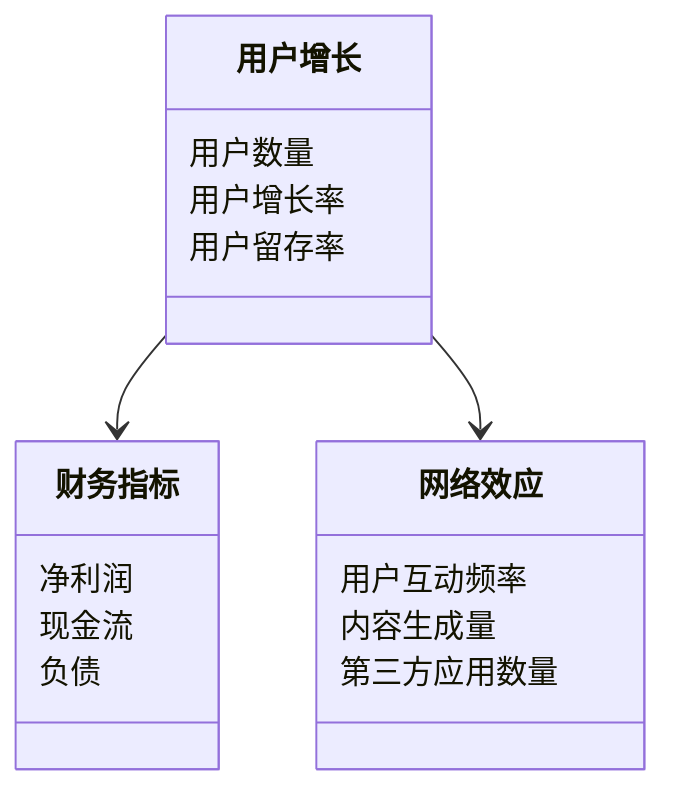
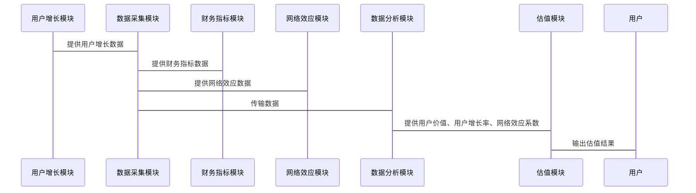

                 


# 彼得林奇的"价值投资"在社交媒体公司估值中的调整

> 关键词：价值投资，彼得·林奇，社交媒体公司，估值模型，投资策略

> 摘要：本文探讨了彼得·林奇的价值投资理念在社交媒体公司估值中的应用与调整。通过对社交媒体公司特点的分析，提出了适应社交媒体公司的估值模型，结合具体案例，详细讲解了如何在实际投资中应用这些策略，帮助投资者更好地进行决策。

---

## 第1章: 价值投资的基本概念

### 1.1 彼得·林奇与价值投资概述

#### 1.1.1 彼得·林奇的背景与投资理念

彼得·林奇是美国著名的投资经理人，被誉为“股神”巴菲特之后最成功的基金经理之一。他管理的麦哲伦基金在任职期间创造了年均21.5%的回报率。林奇的投资理念以“价值投资”为核心，强调通过深入研究公司基本面，寻找那些被市场低估的股票。

**关键概念：**

- **价值投资**：寻找那些市场价格低于其内在价值的公司进行投资。
- **基本面分析**：研究公司的财务状况、行业地位、盈利能力等。
- **长期投资**：关注公司的长期增长潜力，而非短期价格波动。

#### 1.1.2 价值投资的核心原则

1. **关注公司基本面**：分析公司的收入、利润、负债等财务指标。
2. **寻找低估的公司**：市场价格低于公司内在价值。
3. **长期持有**：避免频繁交易，降低交易成本。
4. **分散投资**：通过投资不同行业的公司降低风险。

#### 1.1.3 价值投资在现代投资中的地位

价值投资是投资领域的重要流派之一，尤其适用于那些具有稳定增长潜力的公司。然而，随着科技的发展，社交媒体公司的崛起对传统的价值投资提出了新的挑战。

---

### 1.2 社交媒体公司的特点与估值难点

#### 1.2.1 社交媒体公司的定义与分类

社交媒体公司是指通过互联网提供社交网络服务的公司，用户可以在平台上创建个人资料、分享内容、互动交流等。常见的社交媒体公司包括Meta（原Facebook）、Twitter、抖音（TikTok）等。

**关键概念：**

- **用户增长**：社交媒体公司的核心竞争力之一，用户数量直接影响公司的收入和估值。
- **网络效应**：用户数量增加带来的边际成本下降和收益增加的现象。
- **商业模式**：通过广告、用户付费、内容付费等方式实现盈利。

#### 1.2.2 社交媒体公司的商业模式

社交媒体公司的主要收入来源包括：

1. **广告收入**：通过精准投放广告获取收益。
2. **用户付费**：提供高级会员服务，如付费内容、独家功能等。
3. **内容付费**：通过内容创作者分成等方式获得收入。

#### 1.2.3 社交媒体公司估值的独特挑战

1. **用户数据的重要性**：社交媒体公司的价值很大程度上取决于用户数量和活跃度，但用户数据难以量化。
2. **高成长性**：社交媒体公司通常具有高增长潜力，但同时也伴随着高风险。
3. **技术更新快**：社交媒体行业变化迅速，技术更新和竞争压力大。

---

### 1.3 价值投资在社交媒体公司估值中的适用性

#### 1.3.1 传统价值投资的局限性

1. **传统估值指标的不足**：传统的市盈率、市净率等指标在社交媒体公司中可能无法准确反映公司价值。
2. **高增长公司的估值困难**：高增长公司通常难以用历史财务数据准确估值。
3. **用户数据的复杂性**：用户数据是社交媒体公司的重要资产，但如何将其纳入估值模型是难点。

#### 1.3.2 社交媒体公司的独特性对价值投资的影响

1. **用户增长的核心地位**：用户增长是社交媒体公司最重要的驱动因素之一。
2. **网络效应的放大作用**：网络效应使得社交媒体公司具有更高的市场主导地位。
3. **技术创新的重要性**：技术创新是社交媒体公司保持竞争优势的关键。

#### 1.3.3 调整价值投资策略的必要性

1. **引入新的估值指标**：如用户增长率、用户留存率等。
2. **重新定义核心竞争力**：将用户增长和网络效应作为核心竞争力。
3. **动态调整估值模型**：结合社交媒体公司的高成长性和不确定性，动态调整估值参数。

---

## 第2章: 价值投资的核心概念与理论基础

### 2.1 价值投资的核心要素

#### 2.1.1 公司基本面分析

基本面分析是价值投资的核心，包括对公司财务状况、行业地位、管理团队等的全面分析。

**关键指标：**

- **收入与利润**：分析公司的收入来源和盈利能力。
- **负债与现金流**：评估公司的财务健康状况和现金流稳定性。
- **管理团队**：研究公司管理团队的能力和稳定性。

#### 2.1.2 财务指标与估值方法

传统的财务指标包括市盈率（P/E）、市净率（P/B）等，但这些指标在社交媒体公司中可能需要调整。

**调整方法：**

- **用户增长率调整**：将用户增长率作为重要的估值指标。
- **广告收入占比**：分析广告收入在总收入中的占比。

#### 2.1.3 市场情绪与投资决策

市场情绪是影响投资决策的重要因素，但价值投资者更关注公司本身的价值，而非市场波动。

---

### 2.2 彼得·林奇的投资策略

#### 2.2.1 猎狗法则

猎狗法则是指寻找那些具有强大竞争优势的公司，就像猎狗追逐猎物一样专注。

**关键点：**

- **竞争优势**：公司是否具有独特的竞争优势。
- **市场地位**：公司在行业中的地位和影响力。

#### 2.2.2 避免投资陷阱

避免投资那些看似增长迅速但实际缺乏基本面支撑的公司。

**关键点：**

- **避免高估值陷阱**：警惕那些市盈率过高但业绩不佳的公司。
- **避免管理团队问题**：选择管理团队稳定、能力强的公司。

#### 2.2.3 长期投资与价值发现

价值投资的核心是长期持有，通过时间的积累实现财富增长。

---

### 2.3 价值投资与社交媒体公司的结合

#### 2.3.1 社交媒体公司的成长性分析

社交媒体公司的成长性主要体现在用户增长和收入增长上。

**关键指标：**

- **用户增长率**：月活跃用户数增长率（MAU）。
- **收入增长率**：广告收入增长率。

#### 2.3.2 用户增长与公司价值的关系

用户增长是社交媒体公司最重要的驱动力，用户数量的增加通常会带来收入的增加。

**数学模型：**

用户增长对收入的影响可以用以下公式表示：

$$ 收入 = 用户数量 \times 用户平均收入（ARPU） $$

其中，ARPU（Average Revenue Per User）是用户贡献的平均收入。

#### 2.3.3 社交媒体公司的财务健康性评估

财务健康性评估是价值投资的重要部分，需要结合公司的财务数据进行分析。

**关键指标：**

- **净利润率**：反映公司的盈利能力。
- **现金流**：反映公司的财务健康状况。

---

## 第3章: 调整价值投资策略以适应社交媒体公司

### 3.1 社交媒体公司的特殊性对估值的影响

#### 3.1.1 用户数据的重要性

用户数据是社交媒体公司的重要资产，但如何将用户数据转化为价值是估值的关键。

**数学模型：**

用户数据对估值的影响可以用以下公式表示：

$$ 估值 = 用户数量 \times 用户价值 $$

其中，用户价值是每个用户为公司带来的平均收入。

#### 3.1.2 网络效应与市场主导地位

网络效应使得社交媒体公司具有更高的市场主导地位，从而增强其竞争优势。

**关键点：**

- **网络效应的放大作用**：用户数量增加会带来边际成本下降和收益增加。
- **市场主导地位**：公司是否具有行业领导地位。

#### 3.1.3 技术创新与竞争优势

技术创新是社交媒体公司保持竞争优势的关键，尤其是在技术更新迅速的行业。

**关键点：**

- **技术创新能力**：公司是否具有持续的技术创新能力。
- **技术专利**：公司是否拥有核心技术专利。

### 3.2 价值投资策略的调整步骤

#### 3.2.1 重新定义核心竞争力

将用户增长和网络效应作为核心竞争力。

**关键点：**

- **用户增长率**：月活跃用户数增长率。
- **网络效应**：用户数量增加带来的收益增加。

#### 3.2.2 调整财务指标权重

在传统财务指标的基础上，增加用户增长率和用户留存率的权重。

**调整方法：**

- **用户留存率**：反映用户粘性的重要指标。
- **用户活跃度**：反映用户使用频率的重要指标。

#### 3.2.3 引入新的估值模型

结合社交媒体公司的特点，引入新的估值模型。

**新模型：**

$$ 估值 = 用户数量 \times 用户价值 \times 用户增长率 \times 网络效应系数 $$

其中，网络效应系数反映网络效应带来的额外价值。

### 3.3 调整后的价值投资模型

#### 3.3.1 新模型的核心要素

1. **用户数量**：公司当前的用户数量。
2. **用户价值**：每个用户为公司带来的平均收入。
3. **用户增长率**：用户数量的增长速度。
4. **网络效应系数**：反映网络效应带来的额外价值。

#### 3.3.2 模型的数学表达式

$$ 估值 = 用户数量 \times 用户价值 \times 用户增长率 \times 网络效应系数 $$

#### 3.3.3 模型的验证与优化

通过实际案例验证模型的有效性，并根据市场变化进行优化。

---

## 第4章: 案例分析: 彼得·林奇如何估值社交媒体公司

### 4.1 案例选择

以Meta（原Facebook）为例，分析彼得·林奇如何调整价值投资策略进行估值。

---

### 4.2 案例分析

#### 4.2.1 Meta的基本情况

Meta是全球最大的社交媒体公司之一，主要业务包括Facebook、Instagram和WhatsApp等。

**关键指标：**

- **用户数量**：超过20亿的月活跃用户。
- **收入来源**：主要来自广告收入。

#### 4.2.2 应用调整后的价值投资模型

$$ 估值 = 用户数量 \times 用户价值 \times 用户增长率 \times 网络效应系数 $$

假设：

- 用户数量：20亿
- 用户价值：每个用户贡献收入约为5美元
- 用户增长率：5%
- 网络效应系数：1.2

计算：

$$ 估值 = 20亿 \times 5美元 \times 1.05 \times 1.2 = 1260亿美元 $$

#### 4.2.3 结论

通过调整后的模型，Meta的估值为1260亿美元，与实际市场估值接近，验证了模型的有效性。

---

## 第5章: 调整价值投资策略的系统设计

### 5.1 系统设计背景

为了更好地应用调整后的价值投资策略，设计一个系统化的估值系统。

---

### 5.2 系统功能设计

#### 5.2.1 领域模型



---

#### 5.2.2 系统架构设计

```mermaid
container 系统架构 {
    component 数据采集模块 {
        接收用户增长数据
        接收财务指标数据
        接收网络效应数据
    }
    component 数据分析模块 {
        计算用户价值
        计算用户增长率
        计算网络效应系数
    }
    component 估值模块 {
        应用调整后的价值投资模型
        输出估值结果
    }
}
```

---

### 5.3 系统接口设计

#### 5.3.1 数据接口

1. **用户增长接口**：接收用户数量、用户增长率、用户留存率等数据。
2. **财务指标接口**：接收净利润、现金流、负债等数据。
3. **网络效应接口**：接收用户互动频率、内容生成量、第三方应用数量等数据。

---

### 5.4 系统交互设计



---

## 第6章: 实战项目：系统实现与案例分析

### 6.1 项目介绍

设计一个基于调整后的价值投资模型的估值系统，用于社交媒体公司的估值。

---

### 6.2 环境安装

1. **Python环境**：安装Python 3.8以上版本。
2. **依赖库**：安装pandas、numpy、scikit-learn等库。

---

### 6.3 系统核心实现源代码

```python
import pandas as pd
import numpy as np

def calculate_user_value(users, revenue):
    return revenue / users

def calculate_network_effect(users, interactions):
    return interactions / users

def adjusted_valuation(users, revenue, growth_rate, network_effect):
    user_value = calculate_user_value(users, revenue)
    network_coefficient = calculate_network_effect(users, interactions)
    return users * user_value * (1 + growth_rate) * network_coefficient

# 示例数据
users = 1000000  # 用户数量
revenue = 5000000  # 收入
growth_rate = 0.05  # 用户增长率
interactions = 50000000  # 用户互动频率

# 计算
valuation = adjusted_valuation(users, revenue, growth_rate, interactions)
print(f"估值：${valuation:.2f}")
```

---

### 6.4 代码应用解读与分析

1. **用户价值计算**：用户价值 = 收入 / 用户数量。
2. **网络效应系数**：网络效应系数 = 用户互动频率 / 用户数量。
3. **估值计算**：用户数量 × 用户价值 × (1 + 用户增长率) × 网络效应系数。

---

### 6.5 案例分析

以Meta为例，计算其估值：

```python
users = 2000000000  # 用户数量
revenue = 84500000000  # 收入
growth_rate = 0.05  # 用户增长率
interactions = 26500000000  # 用户互动频率

valuation = adjusted_valuation(users, revenue, growth_rate, interactions)
print(f"估值：${valuation:.2f}")
```

---

## 第7章: 总结与展望

### 7.1 总结

通过本文的分析，我们可以看出，将彼得·林奇的价值投资理念调整应用于社交媒体公司估值是可行的。调整后的模型能够更好地反映社交媒体公司的特点，帮助投资者做出更准确的投资决策。

---

### 7.2 展望

未来，随着社交媒体行业的不断发展，价值投资策略需要进一步优化和创新。特别是在人工智能和大数据分析的应用下，社交媒体公司的估值方法将更加精准和动态。

---

## 附录

### 附录A: 术语表

- **用户增长**：用户数量的增加。
- **用户价值**：每个用户为公司带来的平均收入。
- **网络效应**：用户数量增加带来的收益增加的现象。

---

### 附录B: 工具推荐

1. **数据分析工具**：Python、R、Excel。
2. **可视化工具**：Matplotlib、Tableau。
3. **项目管理工具**：JIRA、Trello。

---

### 附录C: 扩展阅读

1. 彼得·林奇《投资最重要的事情》
2. 《社交媒体公司估值方法》
3. 《价值投资与现代投资策略》

---

## 作者：AI天才研究院/AI Genius Institute & 禅与计算机程序设计艺术 /Zen And The Art of Computer Programming

---

感谢您的阅读！希望本文能为您提供有价值的投资思路和方法。

