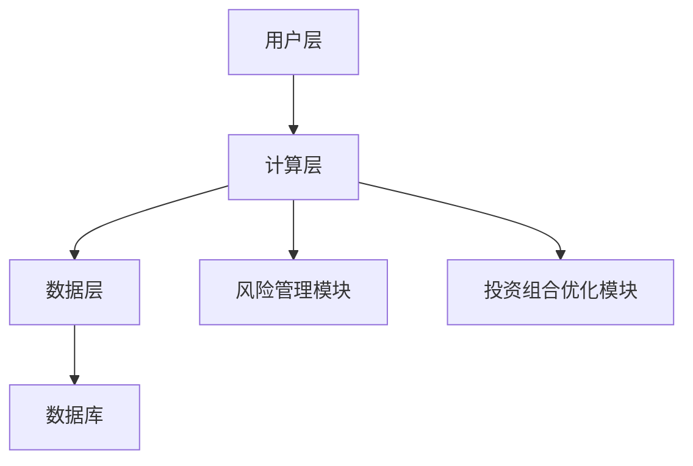

                 


# 彼得林奇的"价值投资"在负利率环境下的调整

> 关键词：价值投资，负利率，彼得林奇，投资策略，资产配置

> 摘要：本文探讨了彼得林奇的价值投资理念在负利率环境下的调整策略，分析了传统价值投资在负利率环境中的挑战，提出了具体的优化方法，并通过数学模型和系统架构设计进行了详细阐述。

---

## 第一部分: 价值投资与负利率环境的背景介绍

### 第1章: 价值投资的核心概念

#### 1.1 价值投资的基本原理

- **1.1.1 价值投资的定义与核心要素**
  - 价值投资是一种基于对公司内在价值的评估的投资方法。
  - 核心要素包括公司基本面分析、安全边际、长期视角等。

- **1.1.2 彼得林奇的价值投资策略**
  - 彼得林奇强调寻找基本面良好、管理优秀的企业。
  - 他注重企业的成长性和估值的合理性。

- **1.1.3 价值投资与市场周期的关系**
  - 价值投资在市场低估时更具优势。
  - 在市场高估时，价值投资者需要耐心等待或调整策略。

#### 1.2 负利率环境的定义与特征

- **1.2.1 负利率的经济学定义**
  - 负利率是指中央银行设定的基准利率为负值，银行向储户支付费用以存储资金。
  - 这种环境通常出现在经济衰退或通缩压力下。

- **1.2.2 负利率对经济和投资的影响**
  - 刺激借贷和投资，降低储蓄意愿。
  - 导致债券收益率下降，推高资产价格。

- **1.2.3 负利率环境下的资产配置挑战**
  - 传统的资产配置策略面临重新评估。
  - 需要寻找新的投资机会以应对低利率甚至负利率环境。

### 第2章: 负利率环境对价值投资的挑战

#### 2.1 传统价值投资在负利率下的失效点

- **2.1.1 负利率对资产估值的影响**
  - 负利率导致债券价格上升，但收益率下降。
  - 股票的估值可能被高估，传统PE、PB指标失效。

- **2.1.2 利率变化对股票估值的重新评估**
  - 负利率降低了债券的吸引力，资金流向股票市场。
  - 高成长性股票可能被过度估值。

- **2.1.3 传统价值指标在负利率下的局限性**
  - PE、PB等指标在高估值环境下失去参考价值。
  - 需要引入新的估值方法。

#### 2.2 负利率环境下的投资机会与风险

- **2.2.1 低利率环境下的资产荒现象**
  - 资金过多，优质资产稀缺。
  - 需要寻找非传统投资机会。

- **2.2.2 负利率对债券、股票等资产的影响**
  - 债券收益率下降，风险上升。
  - 股票价格可能被推高，但盈利增长不足。

- **2.2.3 风险资产与避险资产的重新定价**
  - 风险资产价格上涨，避险资产需求增加。
  - 需要平衡风险与收益。

### 第3章: 价值投资在负利率环境下的调整策略

#### 3.1 调整价值投资策略的核心思路

- **3.1.1 重新定义"价值"的内涵**
  - 将价值定义扩展到考虑利率环境。
  - 引入动态估值模型。

- **3.1.2 调整资产配置的权重分配**
  - 增加对高成长性股票的配置。
  - 适当分散投资于不同资产类别。

- **3.1.3 强化风险控制机制**
  - 设置止损点，避免过度风险暴露。
  - 定期评估投资组合的抗风险能力。

#### 3.2 负利率环境下的具体调整措施

- **3.2.1 股票投资策略的优化**
  - 选择高ROE（净资产收益率）的公司。
  - 重点关注现金流稳定的行业。

- **3.2.2 债券投资策略的调整**
  - 选择期限较短的债券，降低利率风险。
  - 适当配置可转换债券，增加收益弹性。

- **3.2.3 其他资产类别（如房地产、黄金等）的配置策略**
  - 房地产投资需谨慎，避免过度杠杆。
  - 黄金作为避险资产，可以适当配置。

---

## 第二部分: 价值投资在负利率环境下的数学模型分析

### 第4章: 价值投资的核心数学模型

#### 4.1 价值投资的核心数学模型

- **4.1.1 股票内在价值的DCF模型**
  - 使用现金流折现法（DCF）计算企业内在价值。
  - 公式：$$V = \sum_{t=1}^{n} \frac{CF_t}{(1 + r)^t}$$

- **4.1.2 股票估值的PE、PB等指标的数学表达**
  - PE（市盈率）=股价 / 每股收益。
  - PB（市净率）=股价 / 每股净资产。

- **4.1.3 投资组合的收益与风险模型**
  - 收益：$$E(R) = \sum w_i R_i$$
  - 风险：$$\sigma^2 = \sum w_i^2 \sigma_i^2 + 2 \sum_{i < j} w_i w_j \sigma_i \sigma_j \rho_{ij}$$

### 第5章: 负利率环境下的数学调整方法

#### 5.1 负利率环境下的数学调整方法

- **5.1.1 利率对资产估值的影响公式**
  - 债券价格与利率负相关。
  - 公式：$$P = \frac{C}{(1 + r)^n}$$

- **5.1.2 负利率下的资产定价模型**
  - 使用调整后的CAPM模型。
  - 公式：$$R_i = r_f + \beta_i (R_m - r_f)$$

- **5.1.3 投资组合的再平衡算法**
  - 定期调整持仓比例，以适应市场变化。
  - 使用均值-方差优化模型。

---

## 第三部分: 价值投资在负利率环境下的系统架构设计

### 第6章: 价值投资在负利率环境下的系统架构设计

#### 6.1 系统分析与设计思路

- **6.1.1 问题场景分析**
  - 负利率环境下的资产配置问题。
  - 投资组合的动态调整需求。

- **6.1.2 系统功能需求**
  - 资产估值模型。
  - 投资组合优化算法。
  - 风险管理模块。

- **6.1.3 系统架构设计**
  - 分层架构：数据层、计算层、用户层。
  - 使用分布式计算和云存储技术。

#### 6.2 系统架构的Mermaid图



---

## 第四部分: 价值投资在负利率环境下的项目实战

### 第7章: 项目实战

#### 7.1 项目环境安装

- 安装Python和相关库（如numpy、pandas、scipy）。
- 配置数据源（如股票价格、债券收益率等）。

#### 7.2 系统核心实现源代码

```python
import numpy as np
import pandas as pd

def calculate_intrinsic_value(cash_flows, discount_rate):
    return np.sum(cash_flows / (1 + discount_rate) ** np.arange(len(cash_flows)))

def portfolio_optimization(returns, risk_free_rate):
    n = len(returns.columns)
    covariance_matrix = returns.cov()
    mean_returns = returns.mean()
    weights = np.zeros(n)
    weights[0] = 1
    for _ in range(100):
        portfolio_return = np.dot(weights, mean_returns)
        portfolio_risk = np.sqrt(np.dot(weights.T, np.dot(covariance_matrix, weights)))
        if portfolio_risk == 0:
            break
        omega = 0.5 / portfolio_risk
        delta_weights = omega * covariance_matrix.dot(weights - 1 / portfolio_return * mean_returns)
        weights += delta_weights
        weights = weights / np.sum(weights)
    return weights
```

#### 7.3 代码应用解读与分析

- **calculate_intrinsic_value**函数用于计算股票的内在价值。
- **portfolio_optimization**函数使用均值-方差优化模型调整投资组合。

#### 7.4 实际案例分析和详细讲解剖析

- 以某公司为例，计算其内在价值和投资组合权重。
- 分析负利率环境下投资组合的调整效果。

#### 7.5 项目小结

- 通过实战案例验证了调整策略的有效性。
- 强调了动态调整和风险管理的重要性。

---

## 第五部分: 价值投资在负利率环境下的最佳实践

### 第8章: 最佳实践

#### 8.1 小结

- 负利率环境下，传统价值投资需要调整。
- 优化后的策略更具适应性。

#### 8.2 注意事项

- 定期评估投资组合。
- 保持对市场变化的敏感性。

#### 8.3 拓展阅读

- 推荐相关书籍和学术论文，进一步深入学习。

---

## 结语

作者：AI天才研究院/AI Genius Institute & 禅与计算机程序设计艺术 /Zen And The Art of Computer Programming

---

**本文结合了技术分析和投资策略，通过数学模型和系统设计，详细探讨了彼得林奇的价值投资在负利率环境下的调整策略。**

