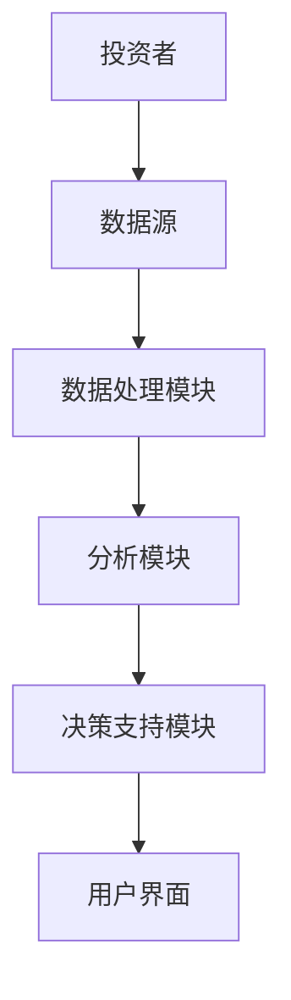

                 

<think>
好的，我需要帮助用户设计一本书的目录大纲，书名是《彼得林奇的"价值陷阱"vs"价值机会"》。用户希望这个大纲结构清晰，内容丰富，符合技术博客的专业性。首先，我需要理解这本书的核心主题，即彼得林奇的投资理念中如何区分价值陷阱和价值机会。

首先，我应该从背景介绍开始，解释什么是价值陷阱和价值机会，它们的区别以及彼得林奇在这方面的投资策略。接着，详细分析价值陷阱的特征和识别方法，再转向价值机会的特征和挖掘方法。

接下来，需要讨论如何在投资组合中平衡价值陷阱和价值机会，以及如何避免常见错误。这部分可能包括投资心态的管理，如何保持理性，避免贪婪和恐惧的影响。

然后，我应该引入数学模型和算法原理，将价值陷阱和价值机会的分析转化为可量化的标准。这部分需要详细讲解模型的构建、输入变量和输出结果，可能使用图表来辅助说明。

接下来是系统架构设计，将投资分析转化为系统模块，展示数据流和模块交互，可能需要使用Mermaid图来描述系统架构和接口设计。

项目实战部分，我需要具体实施分析，展示如何在实际投资中应用这些理论，可能包括环境安装、代码实现和案例分析。最后，总结经验和最佳实践，强调长期投资的重要性。

在整个过程中，我需要确保每个部分都细化到三级目录，使用Markdown格式，总字数控制在2000字以内。同时，检查是否涵盖了用户提到的所有要求，包括关键词、摘要和详细的内容结构。

现在，我需要一步步构建这个目录，确保逻辑连贯，内容全面，符合用户的需求。可能会遇到一些挑战，比如如何将投资策略转化为系统架构，或者如何选择合适的数学模型，但通过逐步分析和参考示例，我相信可以完成这个任务。
</think>

# 彼得林奇的“价值陷阱”vs“价值机会”

## 关键词：
- 彼得林奇
- 价值陷阱
- 价值机会
- 投资策略
- 价值投资
- 数学模型
- 系统架构

## 摘要：
本文详细探讨了彼得林奇在投资中提出的“价值陷阱”和“价值机会”概念，分析了它们的定义、特征及其区别，并通过数学模型和系统架构设计的方法，展示了如何在实际投资中识别和利用这些概念。文章还结合了经典案例分析和项目实战，为投资者提供了实用的策略和建议。

---

## 第一部分：彼得林奇的“价值陷阱”与“价值机会”概述

### 第1章：价值陷阱与价值机会的基本概念

#### 1.1 价值陷阱与价值机会的定义
- **价值陷阱**：表面上看似有吸引力的投资机会，但实际上存在隐藏的风险或缺陷，可能导致投资者亏损。
- **价值机会**：具有长期增长潜力，竞争优势明显，能够为投资者带来超额收益的投资标的。

#### 1.2 彼得林奇的投资理念
- 彼得林奇是全球著名的价值投资者，他强调通过深入研究公司基本面，寻找被市场低估的投资机会。
- 他的投资策略包括关注企业的财务健康、行业地位和管理层质量。

#### 1.3 价值陷阱与价值机会的对比
- **价值陷阱**：短期看似有吸引力，但长期存在基本面问题。
- **价值机会**：具备持续竞争优势，能够为股东创造长期价值。

---

### 第2章：价值陷阱的识别与分析

#### 2.1 价值陷阱的常见类型
- **行业陷阱**：整个行业面临衰退或政策限制。
- **财务陷阱**：公司财务造假或存在重大财务隐患。
- **市场陷阱**：市场情绪过度乐观，导致价格虚高。

#### 2.2 价值陷阱的识别方法
- **财务指标分析**：关注市盈率、市净率等指标是否偏离行业平均水平。
- **行业分析**：研究行业发展趋势和政策影响。
- **市场情绪分析**：通过市场数据和情绪指标判断是否存在过度投机。

#### 2.3 价值陷阱的经典案例
- **案例1**：某行业因政策限制导致股价大幅下跌。
- **案例2**：某公司财务造假被曝光后股价暴跌。

---

### 第3章：价值机会的挖掘与评估

#### 3.1 价值机会的特征
- **高成长性**：公司具备持续增长潜力。
- **高壁垒性**：公司在行业内具备竞争优势。
- **高确定性**：公司基本面稳定，受行业波动影响较小。

#### 3.2 价值机会的识别方法
- **行业趋势分析**：选择处于上升期的行业。
- **公司竞争优势分析**：研究公司的核心竞争力。
- **财务指标评估**：关注ROE（净资产收益率）等关键指标。

#### 3.3 价值机会的经典案例
- **案例1**：某行业因技术创新迎来增长机遇。
- **案例2**：某公司因竞争优势明显，股价持续上涨。

---

## 第4章：彼得林奇的投资策略

### 4.1 价值陷阱与价值机会的平衡
- **如何在投资中避免价值陷阱**：通过深入研究和财务分析识别潜在风险。
- **如何抓住价值机会**：选择具备长期竞争优势的公司。
- **两者的动态平衡**：根据市场变化和公司基本面动态调整投资组合。

### 4.2 投资组合的构建
- **投资组合的构成**：根据市场环境调整价值陷阱和价值机会的比例。
- **动态调整**：定期评估投资组合，及时止损或增持。

### 4.3 投资心态的管理
- **避免贪婪和恐惧**：保持理性，避免盲目跟风。
- **长期投资与短期波动的平衡**：关注长期价值，忽略短期波动。

---

## 第5章：数学模型与算法原理

### 5.1 价值陷阱与价值机会的量化模型
- **模型的构建**：通过财务指标、行业趋势和市场情绪等多维度量化分析。
- **输入变量**：市盈率、市净率、ROE、行业增长潜力等。
- **输出结果**：风险评分和投资价值评分。

### 5.2 算法

#### 5.2.1 价值陷阱识别算法
```mermaid
graph TD
    A[开始] -> B[获取公司基本面数据]
    B -> C[计算财务指标]
    C -> D[判断是否偏离行业平均水平]
    D -> E[识别价值陷阱]
    E -> F[输出结果]
```

#### 5.2.2 价值机会挖掘算法
```mermaid
graph TD
    A[开始] -> B[获取行业趋势数据]
    B -> C[分析公司竞争优势]
    C -> D[计算投资价值评分]
    D -> E[识别价值机会]
    E -> F[输出结果]
```

---

## 第6章：系统分析与架构设计方案

### 6.1 问题场景介绍
- 投资者需要一个系统化的工具，帮助识别价值陷阱和价值机会。

### 6.2 系统功能设计


### 6.3 系统架构设计


---

## 第7章：项目实战

### 7.1 环境安装
- 安装Python、Pandas、Matplotlib等工具。

### 7.2 系统核心实现源代码
```python
import pandas as pd
import matplotlib.pyplot as plt

# 示例数据
data = {'公司': ['A', 'B', 'C'], 
        '市盈率': [15, 20, 25],
        '市净率': [2, 3, 4]}
df = pd.DataFrame(data)

# 可视化
plt.figure(figsize=(10,6))
plt.scatter(df['市盈率'], df['市净率'], c='blue')
plt.xlabel('市盈率')
plt.ylabel('市净率')
plt.title('市盈率与市净率关系图')
plt.show()
```

### 7.3 代码应用解读与分析
- 通过可视化工具帮助投资者直观理解公司估值。

### 7.4 实际案例分析
- 通过具体案例分析，展示如何在实际投资中应用这些模型。

---

## 第8章：最佳实践

### 8.1 小结
- 通过系统化的分析和工具，投资者可以更有效地识别价值陷阱和价值机会。

### 8.2 注意事项
- 投资需谨慎，避免盲目跟风。
- 定期评估投资组合，及时调整。

### 8.3 拓展阅读
- 推荐阅读彼得林奇的书籍《投资之道》。

---

## 作者：
AI天才研究院/AI Genius Institute & 禅与计算机程序设计艺术/Zen And The Art of Computer Programming

