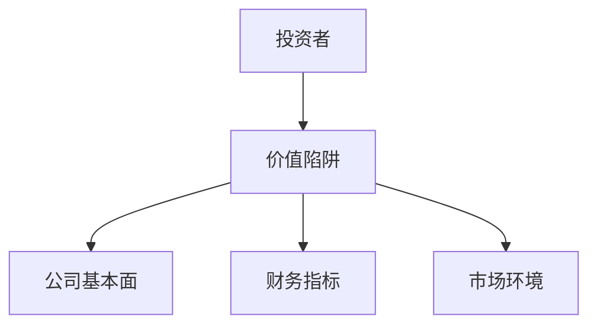
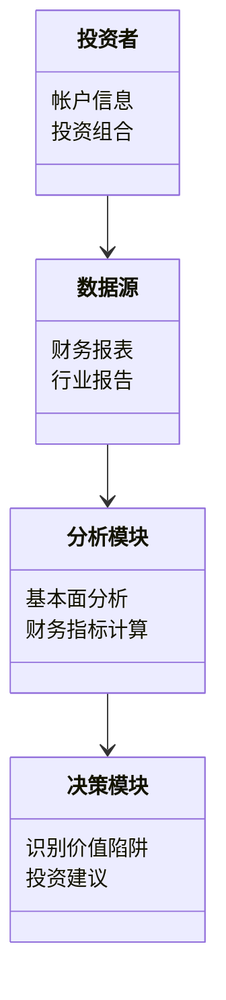

                 


# 彼得林奇的"价值陷阱"修正方法

## 关键词：价值陷阱、彼得林奇、投资策略、财务分析、风险管理

## 摘要：
本文详细探讨了彼得·林奇提出的“价值陷阱”概念，并提出了一套修正方法。通过分析价值陷阱的形成机制，结合数学模型和算法，提供了一种识别和避免价值陷阱的系统化方法。文章内容包括背景介绍、核心概念、修正策略、系统架构设计以及实际案例分析，旨在帮助投资者在复杂市场中做出明智决策。

---

## 第一部分: 价值陷阱的背景与概念

### 第1章: 价值陷阱的定义与背景

#### 1.1 价值陷阱的定义
价值陷阱是指投资者在寻找低价股票时，误选了看似估值低但实际上存在严重问题的公司，导致投资亏损。彼得·林奇在其投资理论中强调，识别价值陷阱的关键在于深入分析公司基本面。

#### 1.1.1 价值陷阱的定义与核心要素
- **定义**：价值陷阱是指那些表面上看估值低，但实际情况糟糕的股票。
- **核心要素**：
  - 公司基本面恶化（如收入下降、利润减少）。
  - 高负债率或财务状况不佳。
  - 行业竞争加剧或市场需求下降。

#### 1.1.2 彼得·林奇对价值陷阱的理论贡献
彼得·林奇在其著作中指出，投资者应避免仅关注市盈率等单一指标，而忽视公司的财务健康状况和行业前景。

#### 1.1.3 价值陷阱在投资中的重要性
识别价值陷阱可以帮助投资者避免重大损失，提升投资决策的准确性。

#### 1.1.4 价值陷阱的案例
通过具体案例分析，展示价值陷阱的表现形式和潜在风险。

#### 1.2 价值陷阱的背景与问题背景
- **投资市场中的常见陷阱**：包括低估值陷阱、高增长陷阱等。
- **价值陷阱的形成机制**：公司内在价值下降，但市场价格仍较高。
- **投资者如何识别与避免价值陷阱**：通过深入分析公司财务报表和行业趋势。

---

### 第2章: 价值陷阱的核心概念与联系

#### 2.1 核心概念原理
- **价值陷阱的核心要素**：公司基本面、财务指标、市场环境。
- **价值陷阱的属性特征对比**：与其他投资陷阱（如高估值陷阱）的对比分析。

#### 2.2 实体关系图
使用Mermaid图展示价值陷阱的实体关系，帮助读者理解其结构。



---

## 第二部分: 价值陷阱的修正方法

### 第3章: 价值陷阱的修正方法

#### 3.1 基于基本面的修正方法
- **基本面分析的核心步骤**：包括收入、利润、现金流、负债等指标的分析。
- **修正方法的数学模型**：通过公式计算公司的真实价值。

#### 3.2 财务指标分析法
- **关键财务指标的选取**：如市盈率、市净率、ROE等。
- **财务指标分析的数学公式**：例如，市盈率计算公式为 $P/E = \text{股价} / \text{每股收益}$。

### 第4章: 价值陷阱修正的数学模型与算法

#### 4.1 数学模型
- **价值陷阱识别的数学公式**：综合考虑市盈率、ROE、负债率等因素。
- **修正方法的数学推导**：通过回归分析等方法优化模型。

#### 4.2 算法原理
- **算法流程图**：展示从数据收集到决策的整个流程。
- **Python代码实现**：例如，读取财务数据、计算指标、判断是否为价值陷阱。

```python
import pandas as pd
import numpy as np

# 假设df是财务数据 DataFrame
def is_value_trap(df):
    # 计算市盈率
    pe = df['股价'] / df['每股收益']
    # 计算ROE
    roe = df['净利润'] / df['净资产']
    # 判断是否为价值陷阱
    if pe > 20 and roe < 5:
        return True
    return False

# 应用函数到数据集
df['价值陷阱'] = df.apply(is_value_trap, axis=1)
```

### 第5章: 价值陷阱修正的系统分析与架构设计

#### 5.1 系统分析
- **系统功能需求分析**：包括数据采集、分析、决策输出。
- **系统功能设计的领域模型**：使用Mermaid类图展示各模块关系。



#### 5.2 系统架构设计
- **系统架构设计图**：展示从数据采集到最终决策的流程。

### 第6章: 价值陷阱修正的项目实战

#### 6.1 项目环境与工具安装
- **开发环境搭建**：建议使用Jupyter Notebook进行数据分析。
- **工具安装与配置**：安装Pandas、NumPy等库。

#### 6.2 核心代码实现
- **价值陷阱识别的Python代码**：实现数据处理和模型应用。

#### 6.3 案例分析与应用
- **典型案例分析**：分析某公司的财务数据，判断是否为价值陷阱。

---

## 第三部分: 总结与最佳实践

### 6.4 总结与小结
- **总结**：价值陷阱修正方法的关键在于基本面分析和财务指标评估。
- **小结**：通过系统化的方法，投资者可以有效识别和避免价值陷阱。

### 6.5 最佳实践 tips
- **风险管理**：分散投资，避免过度集中在单一行业或公司。
- **持续学习**：关注市场动态，提升分析能力。

### 6.6 注意事项
- **数据来源的可靠性**：确保数据准确，避免误判。
- **模型的局限性**：数学模型仅供参考，需结合实际情况调整。

### 6.7 拓展阅读
- 推荐相关书籍和文章，帮助读者深入理解价值投资。

---

## 作者：AI天才研究院 & 禅与计算机程序设计艺术

---

以上是关于《彼得林奇的"价值陷阱"修正方法》的技术博客文章，按照目录结构详细展开了每部分内容，结合了背景分析、数学模型、系统设计和实际案例，旨在为投资者提供实用的修正方法和决策支持。

