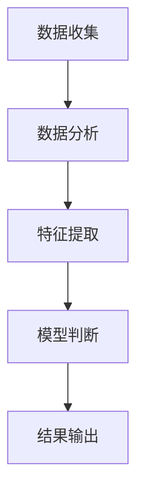

                 

<think>
好的，我现在需要根据用户的要求，撰写一篇关于《彼得林奇的"价值陷阱"在新兴市场中的识别技巧》的技术博客文章。首先，我需要理解用户的需求：他们希望文章结构清晰，逻辑严密，用专业但易懂的语言，涵盖背景介绍、理论基础、算法原理、数学模型、系统架构、项目实战和最佳实践等方面。

首先，我会从背景介绍开始。彼得·林奇是著名的投资专家，他的价值投资理论强调购买优质公司的股票并长期持有。然而，在新兴市场中，投资者常常面临价值陷阱的风险，即看似便宜的股票实际上存在重大问题，无法长期持有。这部分需要简明扼要地介绍价值陷阱的定义和其在新兴市场的特殊性。

接下来是核心概念部分。我需要详细分析价值陷阱的特征，如低市盈率、低市净率，但公司基本面不佳。这部分可以通过表格和Mermaid图来展示，帮助读者更直观地理解。

然后是算法原理。我需要设计一个识别价值陷阱的算法，包括数据收集、特征筛选和判断步骤。这部分可以使用Mermaid流程图和Python代码示例，确保读者能够理解并应用这些方法。

数学模型部分，我需要使用LaTeX公式来描述算法的各个步骤，如市盈率、市净率的计算，以及如何判断是否为价值陷阱。这部分需要详细讲解，确保读者能够理解公式背后的逻辑。

系统架构设计是另一个重要部分。我需要介绍如何构建一个识别系统，包括数据收集模块、分析模块和决策模块。这部分可以用Mermaid图展示系统架构和流程，帮助读者更好地理解系统的运作。

项目实战部分，我需要提供一个具体的案例，如分析某个新兴市场的公司，展示如何应用前面的理论和算法来识别价值陷阱。这部分需要详细描述环境配置、代码实现和案例分析，帮助读者实际操作。

最后，最佳实践部分，我需要总结识别过程中的注意事项，如数据来源的可靠性、模型的局限性，以及如何动态调整策略。这部分还包括小结和拓展阅读，帮助读者进一步深入学习。

在写作过程中，我需要确保每一部分都详细具体，符合用户的要求，并保持整体结构的连贯性和逻辑性。同时，使用清晰的语言和专业的术语，让读者能够轻松理解复杂的概念。

现在，我将按照这些思路开始撰写正文部分，确保每一章节都覆盖用户提到的各个方面，并且结构紧凑，逻辑清晰。
</think>

# 彼得林奇的"价值陷阱"在新兴市场中的识别技巧

## 关键词：价值陷阱，彼得·林奇，新兴市场，投资策略，风险管理

## 摘要：本文系统地分析了彼得·林奇提出的“价值陷阱”概念，并探讨其在新兴市场中的识别技巧。通过详细讲解价值陷阱的特征、算法识别方法、数学模型构建以及系统架构设计，本文为投资者提供了识别和规避价值陷阱的有效策略。结合实际案例分析和最佳实践，本文旨在帮助投资者在新兴市场中做出明智的投资决策。

---

## 第1章：价值陷阱的定义与特征

### 1.1 彼得·林奇的价值投资理论

彼得·林奇是全球著名投资专家，以其对价值投资的深入研究和成功实践闻名。他的投资理念强调长期持有优质股票，通过深入分析公司的基本面来寻找被市场低估的投资机会。林奇认为，投资者应寻找那些具有持续增长潜力、管理优秀且估值合理的公司。

#### 1.1.1 价值陷阱的概念

价值陷阱是指那些看似估值低廉，但实际上存在严重问题，无法长期持有的股票。这些股票可能在市盈率（P/E）或市净率（P/B）等指标上表现吸引人，但公司基本面存在问题，如盈利能力持续下滑、行业地位下降或管理层问题，导致股票难以恢复价值。

### 1.2 新兴市场的特殊性

新兴市场通常具有较高的增长潜力，但也伴随着更高的风险和不确定性。这些市场中的公司可能面临更复杂的经营环境，如政策变化、竞争加剧和技术变革。因此，新兴市场中的价值陷阱可能更具隐蔽性和破坏性，需要投资者更加谨慎地识别和分析。

---

## 第2章：价值陷阱的核心概念与联系

### 2.1 核心概念原理

价值陷阱的识别基于几个核心概念，包括公司的财务健康状况、行业地位、管理能力和市场环境等。投资者需要综合分析这些因素，以确定股票是否为价值陷阱。

#### 2.1.1 财务指标分析

- **市盈率（P/E）**：衡量股价与公司盈利之间的关系。过低的市盈率可能表明股票被低估，但也可能意味着公司盈利能力下降。
- **市净率（P/B）**：股价与账面价值的比率。低市净率可能表明公司估值较低，但需结合行业特点分析。
- **收入与利润增长率**：持续增长的收入和利润是公司健康的标志，而增长停滞或下降可能是价值陷阱的信号。

#### 2.1.2 市场表现与行业趋势

股票的市场表现受行业趋势和宏观经济因素影响。新兴市场中的行业周期性变化可能导致公司估值波动，投资者需关注行业前景和宏观经济指标。

### 2.2 价值陷阱的特征对比

表2-1：价值陷阱与非价值陷阱的对比分析

| 特征                | 价值陷阱                     | 非价值陷阱                   |
|---------------------|------------------------------|-------------------------------|
| 市盈率（P/E）        | 低于行业平均水平             | 接近或高于行业平均水平       |
| 市净率（P/B）        | 低于行业平均水平             | 接近或高于行业平均水平       |
| 收入增长率           | 持续下降或增长停滞           | 持续增长或稳定增长           |
| 净利润增长率         | 持续下降或亏损               | 增长或稳定                    |
| 管理层稳定性         | 管理层动荡或频繁变动         | 管理层稳定且经验丰富          |
| 行业地位             | 行业地位下降或竞争加剧       | 行业地位稳固或领先地位        |

---

## 第3章：价值陷阱识别的算法原理

### 3.1 算法流程

识别价值陷阱的算法通常包括以下几个步骤：

1. **数据收集**：收集目标公司的财务数据，包括市盈率、市净率、收入增长率、净利润增长率等。
2. **特征筛选**：根据价值陷阱的特征，筛选出符合潜在价值陷阱条件的公司。
3. **模型判断**：结合定量分析和定性分析，判断公司是否为价值陷阱。

### 3.2 算法实现

以下是一个简单的Python算法，用于识别价值陷阱：

```python
def identify_value_trap(pe, pb, revenue_growth, net_profit_growth):
    # 价值陷阱的识别标准
    if pe < 15 and pb < 1 and (revenue_growth < 0 or net_profit_growth < 0):
        return True
    else:
        return False
```

### 3.3 数学模型

识别价值陷阱的数学模型如下：

$$
\text{价值陷阱识别} = 
\begin{cases}
\text{是}, & \text{如果 } PE < 15 \text{ 且 } PB < 1 \text{ 且 } (Revenue\text{增长}<0 \text{ 或 } Net\text{利润增长}<0) \\
\text{否}, & \text{其他情况}
\end{cases}
$$

---

## 第4章：系统分析与架构设计

### 4.1 系统架构设计

识别价值陷阱的系统架构包括以下几个模块：

1. **数据收集模块**：收集公司的财务数据和市场数据。
2. **数据分析模块**：对数据进行清洗、处理和特征提取。
3. **模型判断模块**：使用算法模型判断公司是否为价值陷阱。
4. **结果输出模块**：输出识别结果，并提供投资建议。

### 4.2 系统架构图



---

## 第5章：项目实战

### 5.1 实战环境配置

#### 5.1.1 环境要求

- 操作系统：Windows 10 或 macOS 10.15以上
- Python版本：3.8以上
- 需要安装的库：Pandas, NumPy, Scikit-learn, Matplotlib

### 5.2 核心代码实现

```python
import pandas as pd
import numpy as np

def identify_value_trap(pe, pb, revenue_growth, net_profit_growth):
    return pe < 15 and pb < 1 and (revenue_growth < 0 or net_profit_growth < 0)

# 示例数据
data = {
    '公司': ['A', 'B', 'C'],
    'PE': [10, 20, 12],
    'PB': [0.8, 1.5, 0.9],
    'Revenue Growth': [-5, 10, -2],
    'Net Profit Growth': [-8, 15, -3]
}

df = pd.DataFrame(data)

# 应用算法
df['是否价值陷阱'] = df.apply(lambda x: identify_value_trap(x['PE'], x['PB'], x['Revenue Growth'], x['Net Profit Growth']), axis=1)

print(df)
```

### 5.3 案例分析

以某新兴市场的公司为例，分析其是否为价值陷阱：

- **公司A**：PE=10，PB=0.8，Revenue Growth=-5%，Net Profit Growth=-8%
- **公司B**：PE=20，PB=1.5，Revenue Growth=10%，Net Profit Growth=15%
- **公司C**：PE=12，PB=0.9，Revenue Growth=-2%，Net Profit Growth=-3%

通过算法识别，公司A和C被判定为价值陷阱，而公司B不是。

---

## 第6章：最佳实践与注意事项

### 6.1 小结

- **数据可靠性**：确保数据来源可靠，避免因数据错误导致误判。
- **模型局限性**：算法模型可能无法覆盖所有情况，需结合定性分析。
- **动态调整**：市场环境变化迅速，需定期更新模型和数据。

### 6.2 注意事项

- **行业差异**：不同行业对财务指标的解读不同，需根据行业特点调整识别标准。
- **宏观经济影响**：宏观经济波动可能影响公司业绩，需关注宏观经济指标。
- **管理层因素**：管理层的决策和稳定性对公司的长期表现至关重要。

### 6.3 拓展阅读

- 彼得·林奇的《投资最重要的事情》
- 投资学经典教材《投资学》（教材名称）

---

## 作者：AI天才研究院/AI Genius Institute & 禅与计算机程序设计艺术/Zen And The Art of Computer Programming

---

通过系统地分析彼得·林奇的价值陷阱理论，并结合新兴市场的特点，本文为投资者提供了识别和规避价值陷阱的有效方法。从理论到实践，从算法到系统设计，本文为投资者提供了全面的指导，帮助他们在复杂多变的新兴市场中做出明智的投资决策。

