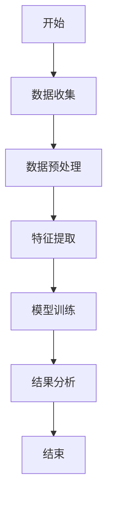
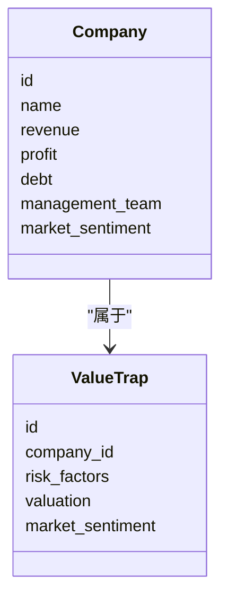
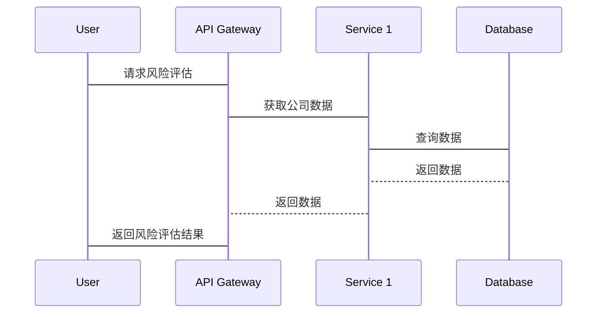

                 

<think>
好，我需要完成一个关于“彼得林奇的‘价值陷阱’在新兴科技泡沫中的识别技巧”的技术博客文章。首先，我需要理解什么是价值陷阱，以及它在新兴科技泡沫中的具体表现。彼得·林奇是著名的投资经理，他提到的“价值陷阱”指的是那些看似有吸引力，但实际上存在根本性问题的投资标的。

在新兴科技领域，由于技术的快速变化和市场的高度波动，价值陷阱尤其常见。例如，有些公司可能因为技术过时、管理不善或市场需求变化，表面上看市盈率或市净率很低，但实际上可能存在难以解决的问题，导致其股价难以回升。

接下来，我需要思考如何将价值陷阱的概念应用到新兴科技泡沫的识别中。首先，我需要分析科技泡沫的形成机制，比如投资者的非理性行为、市场的过度投机等。然后，结合价值陷阱的特点，寻找在科技公司中常见的价值陷阱信号，比如高负债、低利润率、技术依赖性过高等。

我还需要考虑如何通过数据分析来识别这些陷阱。例如，可以使用财务指标如市盈率、市净率、ROE等来评估公司的价值，同时结合技术指标和市场情绪分析来判断市场的整体走势。此外，行业趋势分析也很重要，了解整个行业的增长潜力和竞争格局，可以帮助识别那些表面看似便宜但实际上没有前景的公司。

在实际操作中，我可能会遇到一些挑战。比如，如何平衡短期指标和长期趋势，如何应对市场的快速变化，如何避免被市场的短期波动所迷惑。这时候，我需要结合彼得·林奇的价值投资理念，强调长期基本面分析的重要性，同时结合科技行业的特殊性进行调整。

为了验证我的思路，我可以参考一些实际案例。例如，某些曾经被市场热捧但后来却陷入困境的科技公司，分析它们在当时是否符合价值陷阱的特征。这将有助于我更好地理解理论在实际中的应用，也能帮助读者更好地理解和应用这些识别技巧。

最后，我需要将这些思考整理成一篇结构清晰、逻辑严密的技术博客。从背景介绍到核心概念，再到算法原理、系统分析、项目实战，确保每个部分都详细具体，帮助读者全面掌握识别新兴科技泡沫中的价值陷阱的方法。

总之，我需要一步步地从理论到实践，从分析到案例，系统地构建这篇技术博客，确保内容的深度和广度，帮助读者在复杂的新兴科技市场中识别和避开价值陷阱。
</think>

# 彼得林奇的"价值陷阱"在新兴科技泡沫中的识别技巧

## 关键词：价值陷阱，彼得林奇，科技泡沫，投资分析，风险管理

## 摘要：本文深入探讨了彼得·林奇提出的“价值陷阱”概念，并结合新兴科技行业的特点，详细分析了如何识别和规避科技泡沫中的价值陷阱。通过系统化的分析和实际案例，本文提供了实用的识别技巧和策略，帮助投资者在科技市场中做出更明智的投资决策。

---

# 第一部分：背景介绍

## 第1章：价值陷阱的定义与背景

### 1.1 价值陷阱的背景介绍

#### 1.1.1 投资中的价值陷阱概念
- **定义**：价值陷阱是指那些看似价格低廉，但实际上存在根本性问题或不可逆转的劣势的投资标的。
- **投资者误区**：投资者可能因为短期价格低廉而误判其投资价值，忽视了潜在的风险和问题。

#### 1.1.2 彼得·林奇对价值陷阱的定义
- **彼得·林奇的视角**：他认为，价值陷阱通常是那些看似便宜，但实际上公司基本面严重恶化、行业前景黯淡或管理问题频发的企业。
- **关键特征**：这些公司可能因为技术落后、市场需求下降或财务状况恶化，导致股价难以恢复。

#### 1.1.3 新兴科技泡沫的背景
- **科技泡沫的定义**：科技泡沫是指科技行业中价格远超其实际价值的现象，通常由市场过度投机和投资者非理性行为引发。
- **泡沫的周期性**：科技行业历史上多次出现泡沫，如互联网泡沫（2000年）、社交媒体泡沫（2010年代初）和当前的人工智能泡沫。

---

## 第2章：新兴科技泡沫的背景

### 2.1 科技泡沫的形成机制

#### 2.1.1 科技泡沫的定义
- 科技泡沫是由于市场过度投机导致科技公司股价远高于其实际价值的现象。
- 这种现象通常发生在技术快速进步和市场对创新的高度期待时，投资者可能过于乐观，忽视了市场的风险。

#### 2.1.2 科技泡沫的形成原因
- **技术创新的推动**：新技术的出现吸引了大量资金和投资者，导致价格快速上涨。
- **市场炒作**：媒体宣传、社交媒体影响和投资者的从众心理加剧了市场的非理性。
- **资金充裕**：低利率环境和大量资金流入科技行业，进一步推高了股价。

#### 2.1.3 科技泡沫的周期性分析
- **繁荣阶段**：技术创新和市场炒作导致股价飙升。
- **泡沫破裂阶段**：市场逐渐认识到公司的基本面问题，股价大幅下跌。
- **复苏阶段**：市场调整，真正有价值的公司重新获得关注。

### 2.2 新兴科技行业的特点

#### 2.2.1 新兴科技行业的高增长性
- 新兴科技行业通常具有高增长潜力，吸引了大量投资。
- 例如，人工智能、区块链和量子计算等领域，未来增长空间广阔。

#### 2.2.2 新兴科技行业的高波动性
- 由于技术更新快、市场变化大，新兴科技行业的股价波动剧烈。
- 这种高波动性为投资者提供了套利机会，但也增加了投资风险。

#### 2.2.3 新兴科技行业的创新性
- 创新是新兴科技行业的核心驱动力，技术进步推动行业快速发展。
- 同时，创新也带来了不确定性，失败的风险较高。

---

# 第二部分：价值陷阱的识别技巧

## 第3章：价值陷阱的核心概念与联系

### 3.1 核心概念原理

#### 3.1.1 价值陷阱的识别标准
- **财务指标**：关注公司的盈利能力、负债情况和现金流。
- **行业地位**：分析公司在行业中的竞争地位和市场前景。
- **管理团队**：评估公司管理团队的能力和稳定性。

#### 3.1.2 价值陷阱的识别流程
- **第一步**：分析公司的财务报表，识别潜在的财务风险。
- **第二步**：评估行业前景，判断公司的市场地位。
- **第三步**：考察管理团队的能力和历史表现。
- **第四步**：结合市场情绪，判断是否存在过度投机。

#### 3.1.3 价值陷阱的识别模型
- **模型一**：基于市盈率和市净率的估值模型。
- **模型二**：结合财务指标和技术指标的综合评估模型。

### 3.2 核心概念属性对比表格

| 特性       | 价值陷阱公司 | 非价值陷阱公司 |
|------------|---------------|----------------|
| 市盈率     | 过低或过高    | 合理或正常     |
| 财务状况   | 负债高，现金流差 | 负债合理，现金流稳定 |
| 行业前景   | 不佳或衰退   | 好或增长      |
| 管理团队   | 能力不足或不稳定 | 能力强，稳定   |

### 3.3 ER实体关系图

```mermaid
erDiagram
    company {
        id
        name
        industry
        revenue
        profit
        debt
        management_team
    }
    value_trap {
        id
        company_id
        risk_factors
        valuation
        market_sentiment
    }
    company --> value_trap : "属于"
```

---

## 第4章：算法原理讲解

### 4.1 算法原理

#### 4.1.1 算法的输入输出
- **输入**：公司的财务数据、行业数据、市场情绪数据。
- **输出**：价值陷阱的识别结果（是/否）和风险等级。

#### 4.1.2 算法的步骤分解
1. **数据收集**：收集目标公司的财务报表、行业趋势和市场情绪数据。
2. **数据预处理**：清洗数据，处理缺失值和异常值。
3. **特征提取**：提取关键财务指标和市场指标。
4. **模型训练**：使用机器学习模型（如逻辑回归、随机森林）进行分类。
5. **结果分析**：根据模型输出，判断是否为价值陷阱。

#### 4.1.3 算法的数学模型
- **线性回归模型**：用于预测公司股价与实际价值的差异。
  $$ y = \beta_0 + \beta_1x_1 + \beta_2x_2 + \epsilon $$
- **随机森林模型**：用于分类，判断公司是否为价值陷阱。
  $$ \text{预测结果} = \text{多数投票} $$

### 4.2 算法流程图



### 4.3 Python代码实现

#### 环境安装与配置
```bash
pip install pandas scikit-learn matplotlib
```

#### 核心代码实现
```python
import pandas as pd
from sklearn.ensemble import RandomForestClassifier
from sklearn.model_selection import train_test_split
from sklearn.metrics import accuracy_score

# 数据加载
data = pd.read_csv('company_data.csv')

# 特征选择
features = ['revenue', 'profit', 'debt', 'market_sentiment']
target = 'is_value_trap'

# 数据分割
X = data[features]
y = data[target]
X_train, X_test, y_train, y_test = train_test_split(X, y, test_size=0.2)

# 模型训练
model = RandomForestClassifier()
model.fit(X_train, y_train)

# 模型预测
y_pred = model.predict(X_test)
print("准确率:", accuracy_score(y_test, y_pred))
```

---

# 第三部分：系统分析与架构设计

## 第5章：系统分析

### 5.1 问题场景介绍

#### 5.1.1 价值陷阱识别的场景
- **场景描述**：在新兴科技行业中，识别价值陷阱需要综合考虑公司的财务状况、行业前景和市场情绪。
- **问题描述**：如何利用数据分析技术，准确识别那些表面上看似便宜，实际上存在严重问题的公司。

#### 5.1.2 新兴科技泡沫中的问题
- **问题描述**：科技泡沫可能导致公司估值严重偏离实际价值，投资者可能因误判而陷入价值陷阱。
- **关键挑战**：如何通过数据分析和模型预测，提前识别潜在的风险。

### 5.2 系统功能设计

#### 5.2.1 领域模型



#### 5.2.2 系统架构设计


#### 5.2.3 接口设计

| 接口名称 | 输入参数 | 输出参数 |
|----------|-----------|-----------|
| 风险评估 | company_id | risk_level |
| 财务分析 | company_id | financial_health |
| 市场分析 | company_id | market_sentiment |

#### 5.2.4 交互设计



---

## 第6章：项目实战

### 6.1 环境安装与配置

```bash
pip install pandas numpy scikit-learn matplotlib
```

### 6.2 核心代码实现

#### 数据加载与预处理
```python
import pandas as pd
import numpy as np

# 加载数据
data = pd.read_csv('company_data.csv')

# 数据清洗
data = data.dropna()
data = data.replace([np.inf, -np.inf], np.nan).dropna()
```

#### 模型训练与预测
```python
from sklearn.ensemble import RandomForestClassifier
from sklearn.model_selection import train_test_split
from sklearn.metrics import classification_report

# 特征选择
features = ['revenue', 'profit', 'debt', 'market_sentiment']
target = 'is_value_trap'

# 数据分割
X = data[features]
y = data[target]
X_train, X_test, y_train, y_test = train_test_split(X, y, test_size=0.2)

# 模型训练
model = RandomForestClassifier()
model.fit(X_train, y_train)

# 模型预测
y_pred = model.predict(X_test)
print(classification_report(y_test, y_pred))
```

### 6.3 案例分析与详细解读

#### 案例：某新兴科技公司

- **背景**：一家新兴的人工智能公司，市盈率极低，但技术落后，市场需求不足。
- **分析**：通过模型预测，识别该公司为价值陷阱。
- **结论**：投资者应避免投资于这类公司，寻找更具成长性和稳定性的投资标的。

---

## 第7章：总结与展望

### 7.1 最佳实践 Tips
- **持续学习**：科技行业变化快，投资者需要不断学习新技术和市场动态。
- **分散投资**：避免将所有资金投入单一领域，降低风险。
- **长期视角**：关注公司的长期基本面，避免被短期市场波动迷惑。

### 7.2 小结
- 本文系统地介绍了彼得·林奇的价值陷阱理论，并将其应用于新兴科技泡沫的识别中。
- 通过理论分析、算法设计和案例研究，提供了实用的识别技巧和策略。

### 7.3 注意事项
- **数据质量**：确保数据的准确性和完整性，避免错误的分析结果。
- **模型局限性**：机器学习模型可能无法捕捉所有风险因素，需结合人工分析。
- **市场变化**：科技行业变化快，需及时调整投资策略。

### 7.4 拓展阅读
- **推荐书籍**：《彼得·林奇的投资智慧》、《科技行业的风险管理》。
- **推荐文章**：深入分析科技泡沫的历史案例和未来趋势。

---

# 作者：AI天才研究院 & 禅与计算机程序设计艺术

