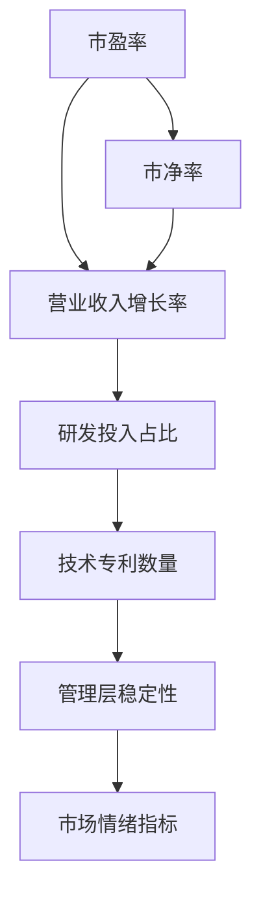
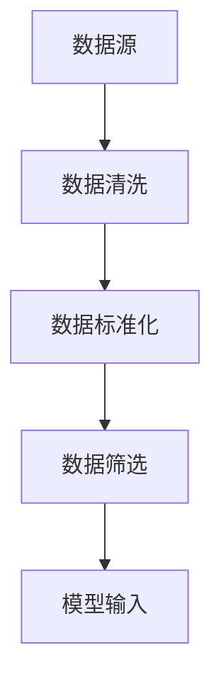
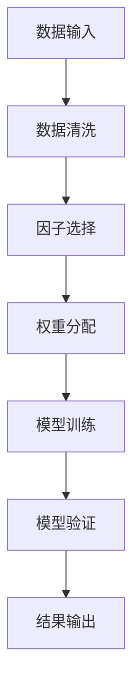
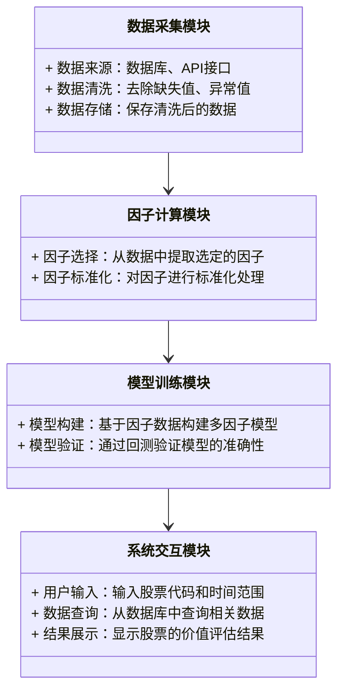

                 


# 彼得林奇的"价值陷阱"在新兴科技股中的多因子识别模型

> 关键词：彼得林奇，价值陷阱，新兴科技股，多因子模型，股票估值，投资策略

> 摘要：本文从彼得林奇的“价值陷阱”理论出发，结合新兴科技股的特点，提出了一种基于多因子模型的识别方法。通过分析科技股的特殊性，构建了多因子模型，并通过实际案例展示了该模型在识别价值陷阱中的应用效果。本文还详细探讨了多因子模型的算法原理、系统架构和项目实现，为投资者提供了科学的决策支持。

---

## 第1章：价值陷阱的定义与特征

### 1.1 价值陷阱的定义

价值陷阱是彼得·林奇在其投资理论中提出的一个重要概念，指的是那些表面上看似具有投资价值但实际上存在严重问题的股票。这些股票通常会误导投资者，使其误以为其价格低廉、估值合理，但实际上它们可能隐藏着巨大的风险，如财务困境、管理问题或行业衰退等。

### 1.2 价值陷阱在新兴科技股中的表现

新兴科技股由于其高增长性和高波动性，更容易成为价值陷阱的重灾区。科技行业的快速变化和技术迭代使得许多公司可能因为技术落后、管理不善或市场需求变化而迅速衰落。这些公司的股票价格可能在短期内被市场情绪推高，但其基本面却存在问题，导致投资者陷入价值陷阱。

### 1.3 传统价值评估方法的局限性

传统的价值评估方法，如市盈率（P/E）和市净率（P/B）等，虽然在一定程度上可以帮助投资者判断股票的估值合理性，但在新兴科技股中存在明显的局限性。科技股的高成长性和轻资产特性使得这些传统指标无法准确反映其内在价值。此外，科技行业的研发投入和无形资产难以在财务报表中充分体现，进一步增加了估值的难度。

### 1.4 多因子模型的必要性

为了克服传统估值方法的局限性，多因子模型应运而生。多因子模型通过综合考虑多个影响股票价值的因素，能够更全面地评估股票的内在价值。在新兴科技股中，多因子模型可以通过整合财务指标、市场情绪、行业趋势和技术特征等多个维度的信息，帮助投资者识别价值陷阱，避免投资损失。

---

## 第2章：多因子模型的核心概念与联系

### 2.1 多因子模型的原理

多因子模型是一种基于多个影响股票价值的因子构建的估值模型。这些因子可以包括基本面指标（如市盈率、ROE）、技术指标（如MACD、RSI）、市场情绪指标（如换手率、资金流入流出）以及行业特有指标（如研发投入占比、技术专利数量等）。通过将这些因子进行加权组合，多因子模型能够更准确地反映股票的内在价值。

### 2.2 多因子模型的核心因子

在新兴科技股的多因子模型中，以下是一些关键的因子及其属性：

| 因子名称       | 因子属性               | 因子描述                                                                 |
|----------------|------------------------|--------------------------------------------------------------------------|
| 市盈率（P/E）   | 财务指标               | 衡量股票价格与每股收益之间的关系，P/E过低可能意味着估值过低或存在财务问题。 |
| 市净率（P/B）   | 财务指标               | 衡量股票价格与每股净资产之间的关系，P/B过低可能意味着资产被低估。          |
| 营业收入增长率  | 增长指标               | 反映公司收入增长速度，高增长率可能意味着公司处于高速发展阶段。              |
| 研发投入占比    | 行业特有指标           | 反映公司在技术研发上的投入力度，高投入可能意味着公司具备持续创新能力。    |
| 技术专利数量    | 无形资产指标           | 反映公司技术储备的丰富程度，专利数量多可能意味着技术优势。                |
| 市场情绪指标    | 市场行为指标           | 通过分析市场交易数据（如换手率、资金流向）来衡量投资者情绪。              |
| 管理层稳定性    | 公司治理指标           | 管理层频繁变动可能意味着公司管理存在问题。                                |

### 2.3 因子之间的关系与ER实体关系图

在多因子模型中，各个因子之间存在复杂的关联性。例如，高研发投入占比可能与高技术专利数量相关，但也可能受到公司财务状况的限制。此外，市场情绪指标会受到公司基本面和行业趋势的影响。

以下是因子之间的关系示意图：



---

## 第3章：多因子模型的算法原理

### 3.1 数据预处理与因子筛选

在构建多因子模型之前，需要对原始数据进行预处理，包括数据清洗（去除缺失值和异常值）和标准化（将不同量纲的因子转化为可比较的范围）。以下是数据预处理的流程图：



### 3.2 多因子模型的构建与实现

多因子模型的构建过程如下：

1. **因子选择**：根据理论分析和实际数据特征，选择对科技股价值评估最重要的因子。
2. **因子权重分配**：通过回归分析或主成分分析等方法确定各因子的权重。
3. **模型训练**：使用历史数据训练模型，评估模型的拟合优度和预测能力。
4. **模型验证**：通过回测和交叉验证评估模型的稳定性和可靠性。

以下是多因子模型的实现流程图：



### 3.3 算法的数学模型与公式

多因子模型的数学表达式如下：

$$
\text{股票价值} = \sum_{i=1}^{n} w_i \times F_i
$$

其中，\( w_i \) 是因子 \( F_i \) 的权重，\( n \) 是因子的数量。

例如，假设我们选择了市盈率（P/E）、市净率（P/B）和营业收入增长率（Revenue Growth）作为因子，并赋予它们相等的权重：

$$
\text{股票价值} = \frac{1}{3} \times \text{P/E} + \frac{1}{3} \times \text{P/B} + \frac{1}{3} \times \text{Revenue Growth}
$$

---

## 第4章：系统分析与架构设计

### 4.1 系统功能设计

以下是系统功能设计的类图：



### 4.2 系统架构设计

以下是系统架构设计的架构图：

```mermaid
graph LR
    Client --> API Gateway
    API Gateway --> Database
    API Gateway --> Model Training
    Database --> Model Training
    Model Training --> Result Storage
    Result Storage --> API Gateway
    Client --> Result Storage
```

---

## 第5章：项目实战与案例分析

### 5.1 环境安装与配置

为了实现多因子模型，我们需要安装以下工具和库：

- **Python**：用于数据处理和模型训练。
- **Pandas**：用于数据分析和数据处理。
- **NumPy**：用于数值计算。
- **Scikit-learn**：用于机器学习算法。
- **Plotly**：用于数据可视化。

### 5.2 核心代码实现

以下是多因子模型的实现代码：

```python
import pandas as pd
import numpy as np
from sklearn.linear_model import LinearRegression
from sklearn.metrics import mean_squared_error

# 数据加载与预处理
data = pd.read_csv('stock_data.csv')
data = data.dropna()  # 去除缺失值
data = data[['PE', 'PB', 'Revenue_Growth']]  # 选择因子

# 标准化处理
from sklearn.preprocessing import StandardScaler
scaler = StandardScaler()
data_scaled = scaler.fit_transform(data)

# 模型训练
model = LinearRegression()
model.fit(data_scaled, target)

# 模型验证
predicted = model.predict(data_scaled)
mse = mean_squared_error(target, predicted)
print('均方误差:', mse)
```

### 5.3 实际案例分析

假设我们有以下三只科技股的因子数据：

| 股票代码 | PE  | PB  | Revenue Growth |
|----------|------|------|----------------|
| A        | 15   | 2    | 20%            |
| B        | 30   | 1    | 10%            |
| C        | 20   | 1.5  | 15%            |

根据上述代码，我们可以计算出每只股票的价值评估得分，并识别其中是否存在价值陷阱。

---

## 第6章：总结与展望

### 6.1 总结

本文通过结合彼得·林奇的“价值陷阱”理论和新兴科技股的特点，提出了一种基于多因子模型的识别方法。通过分析科技股的特殊性，构建了多因子模型，并通过实际案例展示了该模型在识别价值陷阱中的应用效果。

### 6.2 展望

未来的研究可以进一步优化多因子模型，例如引入更多的因子（如行业政策、宏观经济指标等），或者尝试使用机器学习算法（如随机森林、神经网络）来提高模型的预测精度。此外，还可以研究多因子模型在不同市场环境下的表现，为投资者提供更全面的决策支持。

---

## 作者：AI天才研究院/AI Genius Institute & 禅与计算机程序设计艺术/Zen And The Art of Computer Programming

