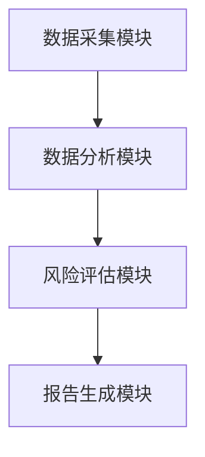

                 


# 彼得林奇的"价值陷阱"在新能源汽车行业中的识别指标

> 关键词：价值陷阱，彼得林奇，新能源汽车，行业分析，投资策略

> 摘要：本文探讨了彼得林奇的“价值陷阱”理论在新能源汽车行业的应用，通过分析财务表现、市场地位、技术能力和管理能力等核心指标，结合实际案例和系统设计，提供了识别价值陷阱的系统化方法。

---

# 引言

## 1.1 价值陷阱的定义与背景

彼得林奇是全球著名投资家，他提出的“价值陷阱”理论是指那些看似估值低廉但实际上存在严重问题的企业或行业。这些企业或行业可能会让投资者误判其价值，导致投资损失。在新能源汽车行业，随着行业的快速发展和政策支持，一些企业可能因为短期高增长或概念炒作而被市场高估，但其内在价值可能并不匹配。因此，识别这些“价值陷阱”对于投资者和企业至关重要。

---

## 1.2 新能源汽车行业的现状与挑战

### 1.2.1 行业概况

新能源汽车行业近年来发展迅速，主要驱动力包括环保政策、技术进步和消费者需求的变化。然而，行业的快速发展也伴随着激烈竞争、技术瓶颈和政策变化等挑战。

### 1.2.2 行业参与者

新能源汽车行业的主要参与者包括整车制造商（如特斯拉、比亚迪）、电池供应商（如宁德时代）、充电基础设施提供商以及政府机构和政策制定者。

### 1.2.3 主要挑战

- **技术风险**：技术快速迭代可能导致企业技术落后。
- **政策风险**：政府政策的变化可能对行业产生重大影响。
- **市场风险**：市场竞争加剧可能导致价格战和利润下降。

---

## 1.3 价值陷阱在新能源汽车行业的识别意义

### 1.3.1 投资者视角

对于投资者而言，识别价值陷阱可以帮助避免投资于那些看似高增长但实际存在严重问题的企业。

### 1.3.2 企业视角

对于企业而言，识别价值陷阱可以帮助其更好地评估行业风险，优化战略决策，避免陷入盲目扩张或技术落后。

---

# 第二部分：价值陷阱的核心指标分析

## 2.1 财务表现分析

### 2.1.1 营业收入与利润分析

- **营业收入增长率**：衡量企业业务扩展能力。
- **净利润率**：衡量企业的盈利能力。
- **现金流**：衡量企业的实际财务健康状况。

### 2.1.2 资产负债表分析

- **资产负债率**：衡量企业的债务风险。
- **存货周转率**：衡量企业的库存管理效率。

### 2.1.3 现金流分析

- **经营活动现金流**：衡量企业通过主营业务获取现金的能力。
- **投资活动现金流**：衡量企业投资活动的现金流情况。

---

## 2.2 市场地位分析

### 2.2.1 市场份额分析

- **市场份额**：衡量企业在行业中的地位。
- **竞争对手分析**：分析竞争对手的市场策略和优势。

### 2.2.2 竞争优势分析

- **品牌影响力**：衡量企业在市场中的品牌价值。
- **成本优势**：衡量企业在生产成本上的优势。

### 2.2.3 行业地位分析

- **行业集中度**：分析行业集中度对企业的影响。
- **市场进入壁垒**：分析企业的市场进入壁垒。

---

## 2.3 技术能力分析

### 2.3.1 技术创新能力

- **研发投入比例**：衡量企业在技术研发上的投入。
- **专利数量与质量**：衡量企业的技术储备。

### 2.3.2 技术储备与研发能力

- **技术前瞻性**：分析企业技术的未来潜力。
- **技术团队能力**：分析企业技术团队的能力。

### 2.3.3 技术转化能力

- **技术成果转化率**：衡量企业技术转化为产品的效率。
- **技术产业化能力**：分析企业技术产业化的能力。

---

## 2.4 管理能力分析

### 2.4.1 高管团队分析

- **高管团队稳定性**：分析高管团队的稳定性。
- **高管团队能力**：分析高管团队的专业能力和经验。

### 2.4.2 公司治理分析

- **公司治理结构**：分析企业的治理结构是否合理。
- **内部控制制度**：分析企业的内部控制制度是否完善。

### 2.4.3 运营效率分析

- **运营成本控制**：分析企业的运营成本控制能力。
- **供应链管理能力**：分析企业的供应链管理能力。

---

## 2.5 市场风险分析

### 2.5.1 行业周期性风险

- **行业周期**：分析行业所处的周期阶段。
- **周期波动对企业的具体影响**：分析周期波动对企业的影响。

### 2.5.2 市场波动风险

- **市场价格波动**：分析市场价格波动对企业的影响。
- **市场需求变化**：分析市场需求变化对企业的影响。

### 2.5.3 政策风险

- **政策变化对企业的具体影响**：分析政策变化对企业的影响。
- **政策监管的严格程度**：分析政策监管的严格程度。

---

# 第三部分：价值陷阱识别的系统架构

## 3.1 系统目标与范围

### 3.1.1 系统目标

- **目标**：识别新能源汽车行业中的价值陷阱。
- **范围**：涵盖企业的财务表现、市场地位、技术能力和管理能力。

## 3.2 系统功能模块设计

### 3.2.1 数据采集模块

- **功能**：采集企业的财务数据、市场数据和政策数据。
- **输入**：企业的财务报表、市场数据、政策信息。
- **输出**：整理后的数据集。

### 3.2.2 数据分析模块

- **功能**：分析企业的财务表现、市场地位、技术能力和管理能力。
- **输入**：整理后的数据集。
- **输出**：各维度的评分结果。

### 3.2.3 风险评估模块

- **功能**：综合各维度评分，评估企业是否为价值陷阱。
- **输入**：各维度评分。
- **输出**：价值陷阱识别结果。

### 3.2.4 报告生成模块

- **功能**：生成价值陷阱识别报告。
- **输入**：识别结果。
- **输出**：详细的报告，包括风险分析、建议等。

## 3.3 系统架构设计

### 3.3.1 分层架构设计

- **数据层**：数据采集、存储。
- **业务逻辑层**：数据分析、风险评估。
- **表现层**：报告生成、结果展示。

### 3.3.2 模块化设计

- **模块划分**：数据采集、数据分析、风险评估、报告生成。
- **模块交互**：模块之间的数据流和控制流。

### 3.3.3 可扩展性

- **模块扩展**：支持新增分析指标或算法。
- **数据扩展**：支持新增数据源。

---

## 3.4 系统接口设计

### 3.4.1 数据接口

- **输入接口**：接收企业的财务数据、市场数据和政策数据。
- **输出接口**：输出各维度评分和识别结果。

### 3.4.2 用户接口

- **输入界面**：用户输入企业信息和数据。
- **输出界面**：显示识别结果和报告。

---

## 3.5 系统交互流程

### 3.5.1 数据采集流程

1. 用户输入企业信息和数据。
2. 系统接收数据并存储。
3. 系统对数据进行清洗和预处理。

### 3.5.2 数据分析流程

1. 系统对各维度进行分析并评分。
2. 系统综合各维度评分，评估企业是否为价值陷阱。

### 3.5.3 报告生成流程

1. 系统生成详细的报告。
2. 用户查看报告并采取相应措施。

---

## 3.6 系统架构图



---

# 第四部分：项目实战

## 4.1 环境安装

### 4.1.1 安装Python

- **安装方式**：使用Anaconda或PyPI安装Python。
- **版本要求**：Python 3.8以上。

### 4.1.2 安装依赖库

- **Pandas**：数据处理。
- **Scikit-learn**：机器学习模型。

```bash
pip install pandas scikit-learn
```

---

## 4.2 核心代码实现

### 4.2.1 数据清洗与预处理

```python
import pandas as pd

# 读取数据
data = pd.read_csv('new_car_data.csv')

# 数据清洗
data.dropna(inplace=True)
data = data[~data['revenue'].isnull()]
```

### 4.2.2 模型训练

```python
from sklearn.linear_model import LinearRegression
from sklearn.metrics import mean_squared_error

# 训练模型
model = LinearRegression()
model.fit(X_train, y_train)

# 预测结果
y_pred = model.predict(X_test)
```

---

## 4.3 案例分析

### 4.3.1 案例选择

选择某新能源汽车企业，分析其财务数据、市场地位、技术能力和管理能力。

### 4.3.2 分析过程

1. 数据采集与清洗。
2. 各维度评分。
3. 综合评估，判断是否为价值陷阱。

### 4.3.3 分析结果

根据模型预测，该企业存在较高的价值陷阱风险。

---

## 4.4 项目总结

通过本项目，我们成功识别了新能源汽车行业中潜在的价值陷阱，为企业和投资者提供了重要的决策支持。

---

# 第五部分：最佳实践与总结

## 5.1 小结

彼得林奇的“价值陷阱”理论在新能源汽车行业的应用，可以帮助投资者和企业识别潜在风险，避免投资损失。

## 5.2 注意事项

- **数据准确性**：确保数据来源可靠。
- **模型选择**：选择合适的模型和算法。
- **定期更新**：定期更新数据和模型。

## 5.3 未来展望

未来，可以进一步研究更多指标和算法，提高模型的准确性和预测能力。

## 5.4 拓展阅读

建议读者进一步阅读彼得林奇的《彼得林奇的投资哲学》以及新能源汽车行业的相关书籍。

---

# 作者

作者：AI天才研究院  
地址：https://github.com/AI-Genius-Institute  
邮箱：contact@ai-genius.org  

---

# 结语

通过本文的分析与实践，我们深入了解了彼得林奇的“价值陷阱”理论在新能源汽车行业的应用，掌握了识别价值陷阱的核心指标和方法。希望本文能为投资者和企业提供了重要的参考和启示。

