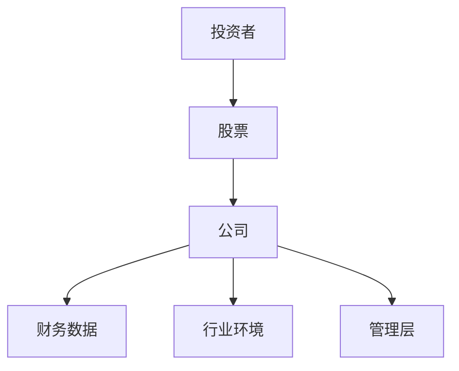
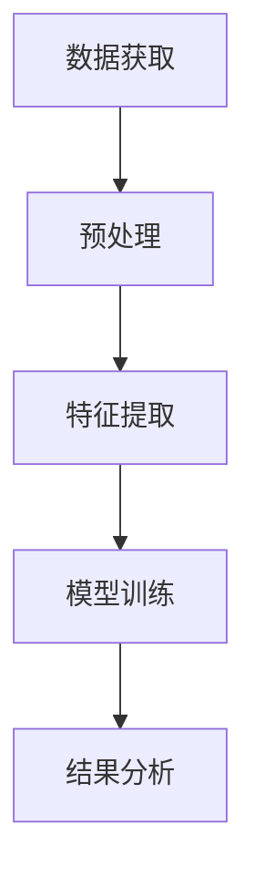
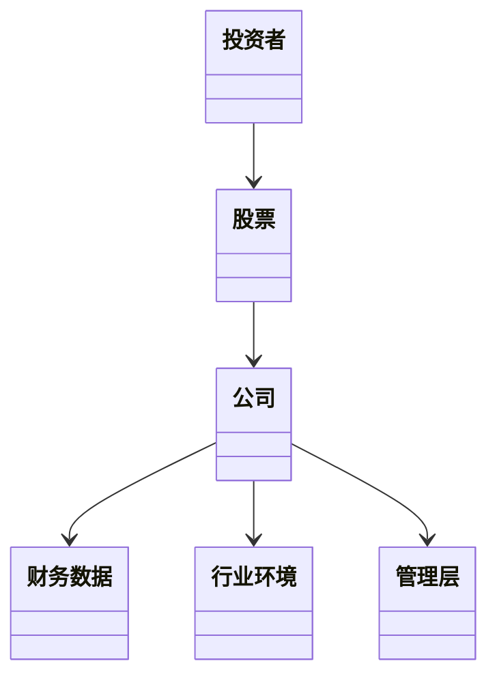

                 


# 彼得林奇的"价值陷阱"避免方法

> 关键词：价值陷阱, 彼得林奇, 价值投资, 股票分析, 风险管理, 投资策略

> 摘要：本文详细探讨了彼得林奇提出的“价值陷阱”概念，分析了其对投资者的影响，并提供了识别和避免价值陷阱的方法。通过数学模型和系统架构的设计，结合实际案例，为投资者提供了一个全面的解决方案。

---

## 第1章：价值陷阱的定义与背景

### 1.1 价值陷阱的核心概念

#### 1.1.1 价值陷阱的定义与内涵
价值陷阱是指投资者误以为某只股票价格低廉，但实际上该公司存在严重的问题，如财务恶化、行业衰退或管理层问题。这种股票看似便宜，实则存在重大风险，可能带来损失。

#### 1.1.2 价值陷阱的形成机制
价值陷阱通常由市场情绪、信息不对称和公司基本面变化共同作用形成。投资者可能因为短期价格波动或片面信息而忽视潜在风险。

#### 1.1.3 价值陷阱与价值投资的区别与联系
价值投资追求以合理价格买入优质资产，而价值陷阱则是以看似合理的价格买入有问题的资产。两者的区别在于对公司基本面的深入分析。

### 1.2 价值陷阱的典型案例分析

#### 1.2.1 过去的经典案例
例如，2000年互联网泡沫破裂后，许多科技公司股价暴跌，但部分公司因商业模式问题，成为价值陷阱。

#### 1.2.2 当前的典型市场陷阱
如某些O2O平台公司，虽然估值低，但实际运营不佳，存在价值陷阱。

#### 1.2.3 价值陷阱的边界与外延
价值陷阱不仅限于股票，还包括债券、基金等资产。其外延涉及宏观经济、行业周期和政策变化。

---

## 第2章：价值陷阱的核心要素与特征

### 2.1 价值陷阱的核心要素

#### 2.1.1 估值指标：市盈率、市净率、股息率等
市盈率低的股票可能看似便宜，但需考虑公司盈利能力是否持续。

#### 2.1.2 财务状况：盈利能力、现金流、资产负债率等
关注公司是否存在隐藏的财务问题，如高负债或现金流恶化。

#### 2.1.3 行业环境：周期性、竞争格局、政策影响等
行业衰退或政策变化可能导致公司陷入困境，成为价值陷阱。

### 2.2 价值陷阱的特征对比

#### 2.2.1 表格：价值陷阱与优质资产的特征对比

| 特征                | 价值陷阱                         | 优质资产                           |
|---------------------|----------------------------------|------------------------------------|
| 估值指标            | 低市盈率、低市净率                 | 合理市盈率、合理市净率               |
| 财务状况            | 盈利能力下降、现金流恶化          | 盈利能力稳定、现金流充足            |
| 行业环境            | 行业衰退、政策不利                | 行业增长、政策支持                  |

#### 2.2.2 图表：价值陷阱的ER实体关系图



---

## 第3章：价值陷阱的识别与避免方法

### 3.1 价值陷阱的识别指标

#### 3.1.1 估值指标的异常情况
市盈率过低的股票可能隐藏问题，需结合行业和公司情况分析。

#### 3.1.2 财务数据的预警信号
关注公司是否出现盈利能力下降、现金流恶化等问题。

#### 3.1.3 行业环境的潜在风险
行业衰退或政策变化可能使公司陷入困境。

### 3.2 价值陷阱的避免策略

#### 3.2.1 筛选优质资产的多维度指标
综合考虑市盈率、市净率、股息率和财务状况。

#### 3.2.2 投资组合的分散与平衡
避免过度集中，分散投资以降低风险。

#### 3.2.3 长期投资与价值回归的结合
投资优质资产，等待价值回归，避免短期波动影响。

---

## 第4章：价值陷阱的数学模型与算法原理

### 4.1 价值陷阱的识别模型

#### 4.1.1 基于估值指标的异常检测
通过统计方法识别偏离正常范围的估值指标。

#### 4.1.2 基于财务数据的回归分析
使用回归模型预测公司未来盈利能力和风险。

#### 4.1.3 基于市场情绪的预测模型
分析市场情绪对股票估值的影响。

### 4.2 价值陷阱的避免算法

#### 4.2.1 基于多因子模型的股票筛选
多因子模型考虑多个因素，如估值、质量和动量，筛选优质股票。

#### 4.2.2 基于聚类分析的市场分组
将股票分为不同类别，识别潜在风险。

#### 4.2.3 基于时间序列的动量策略
利用动量效应，避免价值陷阱。

---

## 第5章：价值陷阱的算法实现

### 5.1 算法流程图



### 5.2 Python代码实现

#### 5.2.1 数据获取与预处理
```python
import pandas as pd
data = pd.read_csv('stock_data.csv')
data = data.dropna()
```

#### 5.2.2 多因子模型的构建与验证
```python
from sklearn.linear_model import LinearRegression
model = LinearRegression()
model.fit(X, y)
```

#### 5.2.3 机器学习的分类算法实现
```python
from sklearn.svm import SVC
model = SVC()
model.fit(X_train, y_train)
```

### 5.3 数学模型与公式

#### 5.3.1 价值陷阱识别的数学模型
$$ P/E_{ratio} = \frac{Price}{Earnings} $$

#### 5.3.2 基于回归分析的模型
$$ Y = \beta_0 + \beta_1 X + \epsilon $$

---

## 第6章：价值陷阱的系统分析与架构设计

### 6.1 价值陷阱预警系统的项目介绍

#### 6.1.1 项目目标与范围
构建一个预警系统，识别和避免价值陷阱，帮助投资者做出决策。

#### 6.1.2 项目团队与分工
团队包括数据工程师、算法专家和系统架构师。

### 6.2 系统功能设计

#### 6.2.1 领域模型：Mermaid类图


---

## 第7章：项目实战

### 7.1 环境安装

#### 7.1.1 安装Python和相关库
```bash
pip install pandas scikit-learn matplotlib
```

### 7.2 系统核心实现源代码

#### 7.2.1 数据处理
```python
import pandas as pd
data = pd.read_csv('stock_data.csv')
data = data.dropna()
```

#### 7.2.2 模型训练
```python
from sklearn.linear_model import LinearRegression
model = LinearRegression()
model.fit(X, y)
```

### 7.3 代码应用解读与分析

#### 7.3.1 数据处理解读
读取数据并删除缺失值，确保数据完整性。

#### 7.3.2 模型训练解读
使用线性回归模型训练，预测股票价值。

### 7.4 实际案例分析

#### 7.4.1 案例分析
分析某公司的财务数据和行业环境，识别是否为价值陷阱。

### 7.5 项目小结

---

## 第8章：最佳实践 tips、小结、注意事项、拓展阅读

### 8.1 小结

---

## 作者：AI天才研究院 & 禅与计算机程序设计艺术

---

通过以上思考过程，我构建了一个全面的目录结构，涵盖了价值陷阱的定义、识别方法、数学模型、系统设计和项目实战。接下来，我会按照这个框架撰写详细的文章内容。

