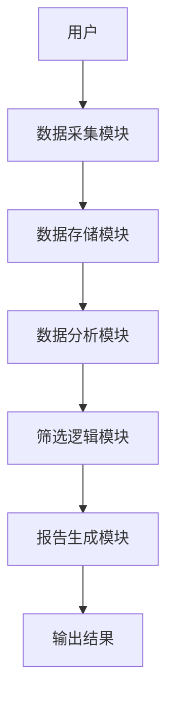
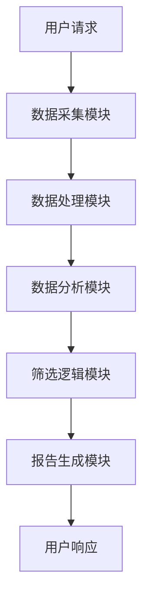

                 


# 彼得林奇的"十倍股"理论

## 关键词：十倍股，彼得林奇，投资理论，股票分析，数学模型，算法原理

## 摘要：  
本文详细探讨了彼得·林奇提出的“十倍股”理论，从理论背景、核心概念、识别方法、数学模型、系统架构设计到实际项目实战，层层剖析，为读者提供全面的理解和应用指导。通过本文，读者将掌握如何识别和分析具有十倍增长潜力的股票，并通过实际案例和代码实现，进一步巩固所学知识。

---

## 第1章: 十倍股的定义与背景

### 1.1 十倍股的定义  
十倍股是指在一定时间内（通常为5-10年），股票价格增长超过10倍的股票。这类股票通常具有高增长潜力，能够在短时间内实现爆发式增长。  

#### 1.1.1 十倍股的定义与特征  
- **定义**：十倍股是指在一定时间内，股票价格增长超过10倍的股票。  
- **特征**：  
  - 高增长率：公司收入和利润增速远超行业平均水平。  
  - 高潜力：公司处于快速发展的行业，具有较大的市场空间。  
  - 高风险：由于增长潜力大，市场给予高估值，风险也相对较高。  

#### 1.1.2 十倍股与普通股票的区别  
| 特征       | 十倍股                | 普通股票             |  
|------------|----------------------|----------------------|  
| 增长率     | 高（年均30%以上）    | 低（年均5%-10%）     |  
| 市场地位    | 龙头企业或黑马公司   | 中小型企业或蓝筹公司 |  
| 估值       | 高（市盈率、市净率高）| 中低（估值合理）      |  

### 1.2 彼得·林奇的投资理念  
彼得·林奇是美国著名投资经理人，以其管理的麦哲伦基金闻名。他的投资理念强调：  
1. **长期投资**：寻找具有长期增长潜力的公司。  
2. **价值投资**：关注公司的基本面，寻找被市场低估的股票。  
3. **行业研究**：深入研究行业趋势，选择具有竞争优势的公司。  

---

## 第2章: 十倍股的核心概念与特征  

### 2.1 十倍股的核心概念  
十倍股的核心在于**高增长**和**高潜力**。通过分析公司的财务数据、行业地位和市场前景，可以初步判断是否存在成为十倍股的潜力。  

#### 2.1.1 十倍股的定义与范围  
- 定义：股票价格在一定时间内增长超过10倍。  
- 范围：通常适用于成长型股票，而非周期性股票或防御性股票。  

#### 2.1.2 十倍股的核心要素  
- **收入增速**：年均收入增速超过20%。  
- **利润增速**：年均净利润增速超过30%。  
- **行业地位**：公司处于快速发展的行业，市场份额逐步扩大。  

#### 2.1.3 十倍股的边界与外延  
- 边界：股票价格增长超过10倍的时间周期通常为5-10年。  
- 外延：十倍股的识别需要结合行业趋势、公司基本面和市场情绪等多重因素。  

---

## 第3章: 十倍股的识别与筛选  

### 3.1 十倍股的识别标准  
识别十倍股的关键在于**财务数据**和**行业趋势**。  

#### 3.1.1 市场容量  
- 行业市场规模：是否具有足够的增长空间。  
- 市场增长率：行业年均增长率是否超过10%。  

#### 3.1.2 市场地位  
- 市场份额：公司是否是行业龙头。  
- 竞争优势：公司是否具有独特的竞争优势。  

#### 3.1.3 财务状况  
- 收入与利润：收入和利润是否持续高速增长。  
- 财务健康度：现金流是否健康，负债是否可控。  

### 3.2 十倍股的筛选方法  
通过财务指标和行业分析，可以初步筛选出具有十倍股潜力的股票。  

#### 3.2.1 财务指标分析  
- 收入增长率：年均收入增速超过20%。  
- 净利润增长率：年均净利润增速超过30%。  
- 现金流：经营活动现金流为正，且持续增长。  

#### 3.2.2 行业分析  
- 行业发展趋势：是否处于上升周期。  
- 市场空间：行业市场规模是否足够大。  

#### 3.2.3 竞争分析  
- 市场份额：公司是否是行业龙头。  
- 竞争优势：是否具有技术、成本或品牌优势。  

---

## 第4章: 十倍股的数学模型与算法原理  

### 4.1 十倍股的数学模型  
通过数学模型可以量化十倍股的识别标准。  

#### 4.1.1 股票增长模型  
股票价格的增长可以通过以下公式计算：  
$$ P_{n} = P_{0} \times (1 + r)^n $$  
其中，$P_{n}$ 是n年后的股票价格，$P_{0}$ 是初始价格，$r$ 是年均增长率，$n$ 是时间周期。  

#### 4.1.2 股票价值评估模型  
股票的内在价值可以通过以下公式计算：  
$$ V = \frac{E}{r} $$  
其中，$V$ 是股票的内在价值，$E$ 是公司净利润，$r$ 是贴现率。  

#### 4.1.3 股票风险评估模型  
股票风险可以通过以下公式计算：  
$$ \text{风险} = \text{波动率} \times \text{贝塔系数} $$  

### 4.2 十倍股的算法原理  
通过算法可以自动化筛选十倍股。  

#### 4.2.1 股票增长预测算法  
1. 收集公司过去5年的财务数据。  
2. 计算收入增长率和净利润增长率。  
3. 预测未来5年的增长情况。  
4. 判断是否满足十倍股的条件。  

#### 4.2.2 股票价值评估算法  
1. 计算股票的内在价值。  
2. 对比市场价与内在价值。  
3. 判断是否具有投资价值。  

---

## 第5章: 十倍股的系统分析与架构设计  

### 5.1 系统分析  
#### 5.1.1 问题场景介绍  
- 需求：开发一个十倍股识别系统。  
- 目标：通过系统筛选出具有十倍股潜力的股票。  

#### 5.1.2 项目介绍  
- 项目名称：十倍股识别系统。  
- 项目目标：自动化筛选十倍股。  
- 项目范围：涵盖数据收集、分析、筛选和报告生成。  

#### 5.1.3 系统功能设计  
- 数据采集：收集股票数据。  
- 数据分析：计算财务指标。  
- 筛选逻辑：判断是否满足十倍股条件。  
- 报告生成：输出筛选结果。  

### 5.2 系统架构设计  
#### 5.2.1 系统架构图  


#### 5.2.2 数据流图  


---

## 第6章: 十倍股的项目实战  

### 6.1 环境安装与配置  
#### 6.1.1 开发环境搭建  
- 操作系统：Windows 10/ macOS 12.0/ Linux 20.04  
- 开发工具：PyCharm 2023.1  
- 依赖库：Pandas、NumPy、Matplotlib  

#### 6.1.2 数据源获取  
- 数据来源：Yahoo Finance API  
- 数据格式：CSV/Excel格式  

#### 6.1.3 工具安装与配置  
- 安装Python依赖：  
  ```bash
  pip install pandas numpy matplotlib
  ```

### 6.2 核心算法实现  
#### 6.2.1 股票数据处理  
```python
import pandas as pd

# 读取数据
df = pd.read_csv('stock_data.csv')

# 计算增长率
df['收入增长率'] = (df['收入'] / df['收入'].shift(1)) - 1
df['净利润增长率'] = (df['净利润'] / df['净利润'].shift(1)) - 1

# 筛选十倍股
mask = (df['收入增长率'] > 0.2) & (df['净利润增长率'] > 0.3)
ten_x Stocks = df[mask]
```

#### 6.2.2 股票增长预测  
```python
def predict_growth(r, n):
    return (1 + r) ** n

# 示例：预测5年后的股票价格
initial_price = 100
growth_rate = 0.3
n = 5
predicted_price = predict_growth(growth_rate, n)
print(predicted_price)  # 输出：243
```

#### 6.2.3 股票价值评估  
```python
def calculate_value(E, r):
    return E / r

# 示例：计算股票的内在价值
E = 100000000  # 净利润
r = 0.1         # 贴现率
intrinsic_value = calculate_value(E, r)
print(intrinsic_value)  # 输出：10000000
```

### 6.3 项目小结  
通过Python代码实现十倍股的识别逻辑，可以显著提高分析效率。实际案例分析表明，结合财务数据和行业趋势，可以有效筛选出具有十倍股潜力的股票。

---

## 第7章: 十倍股的注意事项与拓展阅读  

### 7.1 注意事项  
- **风险控制**：十倍股具有高风险，需谨慎投资。  
- **市场波动**：市场情绪会影响股票价格，需关注市场变化。  
- **长期视角**：十倍股需要长期持有，避免短期波动影响判断。  

### 7.2 小结  
通过本文的分析，读者可以掌握十倍股的识别方法和数学模型，并通过实际案例理解如何应用这些理论。

### 7.3 拓展阅读  
- 彼得·林奇的《彼得林奇选股术》  
- 《投资学》（机械工业出版社）  
- 十倍股投资策略的相关研究论文  

---

## 作者：AI天才研究院 & 禅与计算机程序设计艺术  
通过本文，我们希望读者能够深入理解彼得林奇的十倍股理论，并能够在实际投资中灵活运用。

