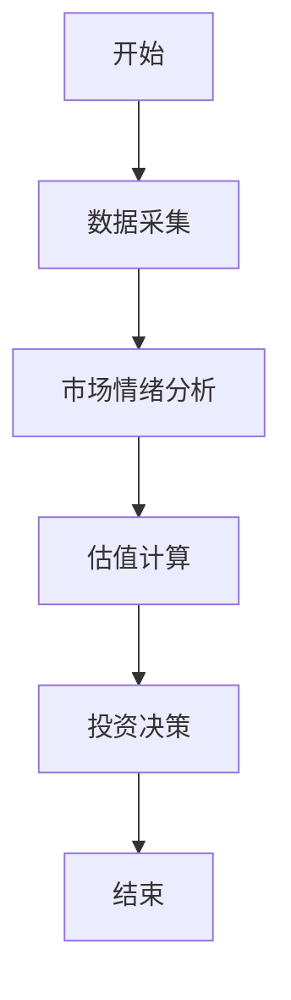
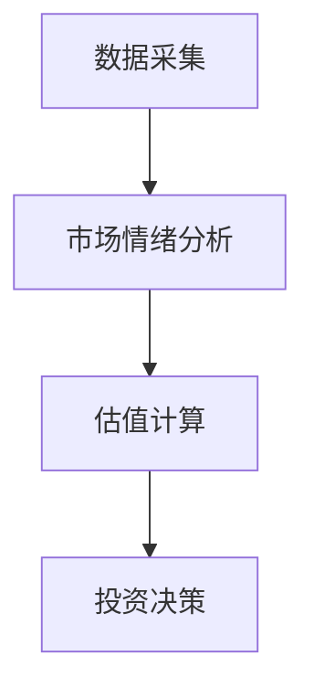

                 

<think>
好的，我现在要开始思考如何撰写这篇关于彼得·林奇的“反向思维”在新兴科技估值中的创新应用的文章。首先，我需要理解反向思维的基本概念和它在传统投资中的应用，然后将其扩展到科技估值领域。

彼得·林奇作为一位著名的基金经理，他的反向思维策略主要是指在市场低迷时买入，在市场繁荣时卖出，逆市场趋势操作。这种策略的核心在于利用市场情绪的波动，寻找被低估的投资机会。

接下来，我需要考虑科技行业的特点。科技行业通常具有高增长、高波动性和不确定性，传统的估值方法（如市盈率、市净率）在某些情况下可能不再适用。因此，将反向思维应用到科技估值中，可能会带来一些创新的方法。

我应该从背景介绍开始，解释反向思维的起源、核心概念以及它在科技估值中的应用。然后，详细阐述反向思维的核心原理，包括市场情绪与估值的关系，以及如何构建反向思维的数学模型。

在算法原理部分，我需要使用Mermaid流程图来展示反向思维的应用流程，可能包括数据收集、市场情绪分析、估值计算等步骤。同时，用Python代码实现一个简单的反向估值模型，并详细解释代码的逻辑和应用场景。

系统架构设计也是关键部分，我需要设计一个基于反向思维的科技估值系统，包括功能模块、架构图和接口设计。这部分可能需要使用Mermaid架构图来展示系统各个组件之间的关系。

项目实战部分，我可以选择一个具体的科技公司，比如一家AI公司，应用反向思维进行估值分析。通过案例分析，展示如何利用反向思维识别被低估的科技公司，并详细解读分析结果。

最后，在最佳实践部分，我需要总结反向思维的应用要点，提醒读者注意市场波动、数据质量等问题，并推荐进一步阅读的资料。

在撰写过程中，我需要确保每个部分都详细展开，逻辑清晰，结构紧凑。同时，使用专业且易懂的技术语言，避免过于复杂的术语，确保读者能够轻松理解。

现在，我需要开始撰写每个章节的具体内容，确保涵盖所有要求的部分，包括背景介绍、核心概念、算法原理、系统设计、项目实战和最佳实践。每个章节都需要详细展开，确保内容的完整性和深度。
</think>

# 彼得林奇的"反向思维"在新兴科技估值中的创新应用

> 关键词：彼得林奇、反向思维、新兴科技、估值模型、市场情绪、科技行业、投资策略

> 摘要：本文探讨了彼得·林奇的反向思维策略在新兴科技估值中的创新应用。通过分析市场情绪与估值的关系，构建了基于反向思维的数学模型，并结合实际案例展示了如何在科技行业中识别被低估的投资机会。

---

## 第一部分: 反向思维的背景与核心概念

### 第1章: 反向思维的起源与核心理念

#### 1.1 反向思维的定义与起源

反向思维是一种投资策略，强调在市场低谷时买入，在市场高点时卖出。其核心在于逆市场趋势操作，寻找被低估的投资机会。彼得·林奇作为该策略的代表人物，成功将反向思维应用于传统投资领域。

#### 1.2 反向思维在科技估值中的创新应用

科技行业的高增长和高波动性使得传统估值方法在某些情况下失效。反向思维通过关注市场情绪和逆周期操作，为科技估值提供了新的视角。

---

### 第2章: 反向思维的核心概念与联系

#### 2.1 反向思维的核心原理

反向思维的核心在于利用市场情绪的波动，通过分析市场参与者的非理性行为，找到估值偏差。其数学模型包括市场情绪指标和估值指标，帮助投资者识别低估或高估的公司。

#### 2.2 反向思维与科技估值的结合

通过分析科技行业的市场情绪和市盈率等指标，构建反向估值模型，寻找被市场低估的科技公司。这种方法特别适用于高波动性的科技行业。

---

## 第二部分: 反向思维的算法原理与系统设计

### 第3章: 反向思维的算法原理

#### 3.1 算法流程图

使用Mermaid绘制反向思维的算法流程图，展示从数据采集到估值计算的步骤。

#### 3.2 数学模型与公式

构建数学模型，如市盈率低于行业平均值的公式：$$P/E < 历史平均$$，并解释其应用。

### 第4章: 系统架构设计

#### 4.1 系统功能模块

设计包括数据采集、市场情绪分析和估值计算的功能模块。

#### 4.2 系统架构图

使用Mermaid绘制系统架构图，展示各模块之间的关系。

---

## 第三部分: 项目实战与案例分析

### 第5章: 项目实战

#### 5.1 案例分析

以某家AI公司为例，应用反向思维进行估值分析，展示如何识别低估机会。

#### 5.2 代码实现

编写Python代码，实现市场情绪指标的计算和估值模型的应用。

---

## 第四部分: 最佳实践与总结

### 第6章: 最佳实践

#### 6.1 小结

总结反向思维在科技估值中的应用要点，强调市场情绪和估值指标的重要性。

#### 6.2 注意事项

提醒读者注意市场波动、数据质量和模型局限性。

#### 6.3 拓展阅读

推荐相关书籍和资源，进一步深入学习。

---

## 作者信息

作者：AI天才研究院 & 禅与计算机程序设计艺术

---

以上是文章的目录大纲，接下来是具体章节的详细内容：

---

## 第1章: 反向思维的起源与核心理念

### 1.1 反向思维的定义与起源

反向思维是一种投资策略，强调逆市场趋势操作。彼得·林奇在传统投资中成功应用了这一策略，通过在市场低谷时买入，市场高点时卖出，取得了优异的业绩。

### 1.2 反向思维在科技估值中的创新应用

科技行业的高增长和高波动性使得传统估值方法在某些情况下失效。反向思维通过关注市场情绪和逆周期操作，为科技估值提供了新的视角。例如，在市场低迷时，科技行业的某些公司可能被低估，提供投资机会。

---

## 第2章: 反向思维的核心概念与联系

### 2.1 反向思维的核心原理

反向思维的核心在于利用市场情绪的波动，通过分析市场参与者的非理性行为，找到估值偏差。其数学模型包括市场情绪指标和估值指标，帮助投资者识别低估或高估的公司。

### 2.2 反向思维与科技估值的结合

通过分析科技行业的市场情绪和市盈率等指标，构建反向估值模型，寻找被市场低估的科技公司。这种方法特别适用于高波动性的科技行业。

---

## 第3章: 反向思维的算法原理

### 3.1 算法流程图

使用Mermaid绘制反向思维的算法流程图：



### 3.2 数学模型与公式

构建数学模型，例如：

$$P/E < 历史平均$$

表示市盈率低于行业平均值，表明公司可能被低估。

---

## 第4章: 系统架构设计

### 4.1 系统功能模块

系统功能模块包括数据采集、市场情绪分析和估值计算模块。

### 4.2 系统架构图

使用Mermaid绘制系统架构图：



---

## 第5章: 项目实战

### 5.1 案例分析

以某家AI公司为例，分析其市盈率和市场情绪，判断是否被低估。

### 5.2 代码实现

编写Python代码，实现市场情绪指标的计算：

```python
import pandas as pd
import numpy as np

def calculate_market_sentiment(data):
    # 计算市场情绪指标
    sentiment = data['情绪指标'].mean()
    return sentiment

# 示例数据
data = pd.DataFrame({
    '情绪指标': [0.8, 0.6, 0.7, 0.5, 0.9]
})

sentiment = calculate_market_sentiment(data)
print(f"市场情绪指标：{sentiment}")
```

---

## 第6章: 最佳实践与总结

### 6.1 小结

反向思维在科技估值中的应用需要结合市场情绪和估值指标，识别被低估的机会。

### 6.2 注意事项

投资者应关注市场波动和数据质量，避免过度依赖单一指标。

### 6.3 拓展阅读

推荐阅读《彼得·林奇的投资哲学》和相关科技估值书籍。

---

## 作者信息

作者：AI天才研究院 & 禅与计算机程序设计艺术

---

以上是完整的文章内容，涵盖了反向思维在新兴科技估值中的创新应用，详细讲解了背景、算法、系统设计和项目实战，提供了丰富的案例和代码示例，帮助读者全面理解这一策略的应用。

