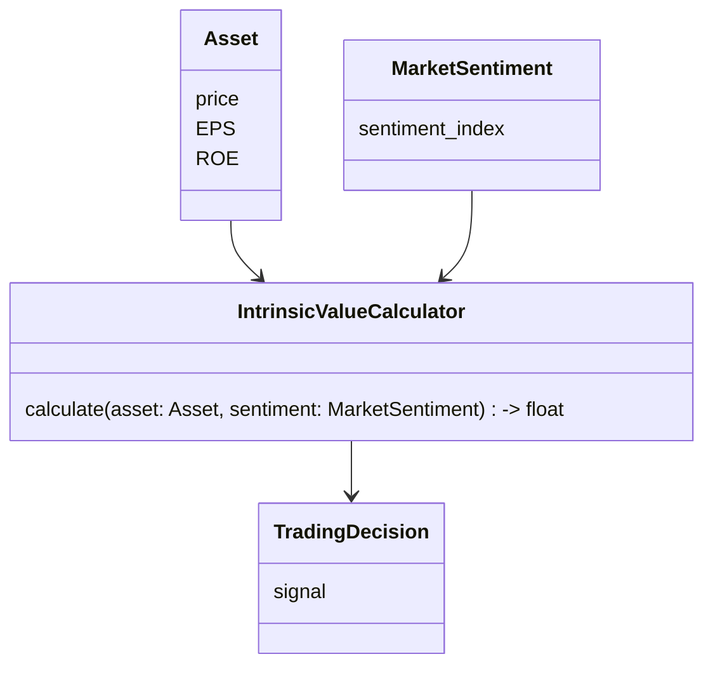
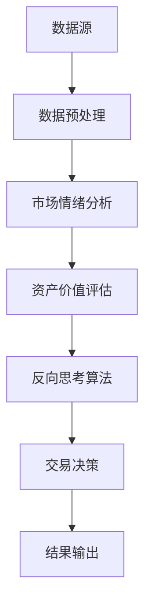
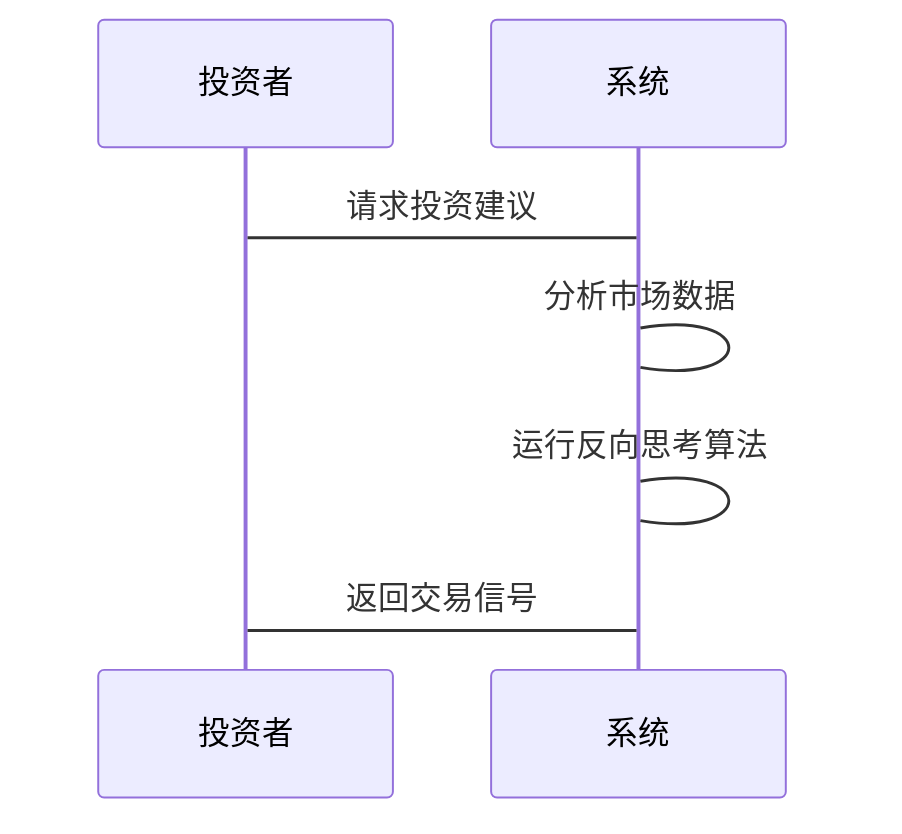

                 

<think>
好的，我现在需要根据用户的要求，设计一个详细的目录结构，涵盖彼得林奇的反向思考投资方法的各个方面。首先，我需要理解反向思考的定义和其在投资中的应用，然后分析其核心概念、算法原理，以及如何在系统中实现。接着，我需要考虑项目实战部分，确保读者能够实际操作，并给出最佳实践和注意事项。

首先，背景介绍部分要涵盖投资的基本概念，彼得林奇的生平，以及反向思考的定义。这部分帮助读者理解为什么反向思考在投资中重要。接下来，核心概念部分需要详细解释市场情绪分析和价值评估模型，可能涉及表格和流程图来展示概念之间的关系。

然后，算法原理部分需要详细讲解反向思考的步骤，包括市场情绪指标和价值评估模型，并用Python代码实现。这里可能需要使用mermaid流程图来展示算法步骤。数学模型部分，如CAPM，需要详细解释，并给出相应的公式。

系统分析与架构设计部分，需要描述投资决策的场景，构建领域模型，并设计系统架构图，包括接口和交互图。项目实战部分需要指导读者如何安装环境，编写代码，并分析实际案例。

最后，最佳实践部分需要总结学习内容，并给出注意事项和拓展阅读建议。整个目录结构需要逻辑清晰，结构紧凑，语言专业，确保读者能够一步步理解和应用反向思考投资方法。
</think>

---

# 彼得林奇的"反向思考"投资方法

> **关键词**：彼得林奇、反向思考、投资方法、市场情绪、价值评估、算法原理

> **摘要**：  
> 本文详细介绍了彼得林奇的“反向思考”投资方法，从其核心概念、算法原理到系统架构，再到实际项目实战，层层剖析。文章首先从投资的基本概念入手，详细讲解了反向思考的定义和背景。接着，分析了市场情绪与价值评估的核心概念，并通过表格和流程图展示了概念之间的联系。随后，详细阐述了反向思考算法的原理和实现，包括Python代码和数学模型。文章还通过系统架构设计、接口设计和交互图展示了如何将反向思考应用于实际投资系统中。最后，通过一个实战案例，指导读者如何在实际操作中运用反向思考方法，并给出了最佳实践和注意事项。

---

## 第一部分：反向思考投资方法概述

### 第1章：投资的基本概念

#### 1.1 投资的基本概念
- **1.1.1 投资的定义与分类**  
  投资是指将资金投入到能够产生收益的资产或项目中。常见的投资方式包括股票、债券、房地产等。  
  - 股票：代表公司所有权，具有高风险高回报的特点。  
  - 债券：代表债权，具有相对稳定的收益。  
  - 其他：如黄金、艺术品等。

- **1.1.2 传统投资与反向投资的区别**  
  - 传统投资：遵循市场趋势，顺势而为。  
  - 反向投资：在市场低迷时买入，在市场高涨时卖出，逆市场趋势而行。

- **1.1.3 投资市场的基本构成**  
  - 买方：投资者，追求收益。  
  - 卖方：融资者，需要资金。  
  - 中介：券商、银行等金融机构。

#### 1.2 彼得林奇的生平
- **1.2.1 彼得林奇的背景介绍**  
  彼得·林奇（Peter Lynch）是美国著名的投资专家，曾任富达麦哲伦基金的经理，以其卓越的投资业绩闻名。  

- **1.2.2 他的投资理念与成就**  
  - 强调基本面分析，注重公司内在价值。  
  - 在任职期间，基金年均回报率超过29%，创造了辉煌的投资业绩。

- **1.2.3 彼得林奇对投资界的影响**  
  彼得林奇的投资理念影响了无数投资者，他的著作《彼得林奇的成功投资》成为投资领域的经典。

#### 1.3 反向思考的定义
- **1.3.1 反向思考的定义**  
  反向思考是一种投资策略，指在市场低迷时买入低估资产，在市场高涨时卖出高估资产。

- **1.3.2 反向思考的背景与意义**  
  市场情绪波动往往导致资产价格偏离其实际价值，反向思考利用这种偏差，寻找投资机会。

- **1.3.3 反向思考与其他投资策略的对比**  
  - 价值投资：注重资产的内在价值，与反向思考有相似之处。  
  - 技术分析：依赖价格和成交量的走势，与反向思考的逆向思维不同。

---

## 第二部分：核心概念与联系

### 第2章：市场情绪与价值评估

#### 2.1 市场情绪分析
- **2.1.1 市场情绪的定义与影响**  
  市场情绪是指投资者整体的心理状态，影响着资产价格的波动。  
  - 过度乐观：可能导致资产高估。  
  - 过度悲观：可能导致资产低估。

- **2.1.2 市场情绪的指标与测量方法**  
  - 投资者情绪指数（ISENTUM）：通过媒体和社交网络分析投资者情绪。  
  - 恐慌指数（VIX）：衡量市场波动性的指标。

- **2.1.3 市场情绪与反向思考的关系**  
  反向思考策略基于市场情绪的过度波动，寻找价格与价值的偏离点。

#### 2.2 价值评估模型
- **2.2.1 基本的估值方法（如市盈率、市净率）**  
  - 市盈率（P/E）：市价与每股收益的比率。  
  - 市净率（P/B）：市价与每股净资产的比率。

- **2.2.2 价值评估模型的构建**  
  使用基本面分析方法，结合资产的盈利能力、成长性等因素，评估其内在价值。

- **2.2.3 价值评估模型在反向思考中的应用**  
  当资产价格低于其内在价值时，反向思考策略认为这是一个买入机会。

#### 2.3 市场与个体投资者行为
- **2.3.1 个体投资者的行为模式**  
  - 羊群效应：投资者跟随市场趋势，容易导致价格泡沫或崩盘。  
  - 过度自信：投资者高估自己的判断能力，可能导致错误决策。

- **2.3.2 市场情绪与个体行为的关系**  
  个体行为影响整体市场情绪，反之，市场情绪又反过来影响个体行为。

- **2.3.3 如何利用个体行为进行反向思考**  
  - 在市场恐慌时，寻找被错杀的资产。  
  - 在市场狂热时，警惕可能的泡沫。

---

## 第三部分：算法原理讲解

### 第3章：反向思考算法

#### 3.1 反向思考算法的原理
- **3.1.1 算法的基本思路**  
  通过分析市场情绪和资产价值，寻找价格与价值的偏离点，进行逆向交易。

- **3.1.2 算法的核心步骤**  
  1. 数据收集：收集市场数据，包括价格、成交量、市场情绪指标等。  
  2. 价值评估：使用价值评估模型，计算资产的内在价值。  
  3. 偏离分析：比较当前价格与内在价值，判断是否存在偏离。  
  4. 交易决策：当价格低于价值时，买入；当价格高于价值时，卖出。

- **3.1.3 算法的数学模型**  
  使用回归分析或其他统计方法，建立市场情绪与资产价格的关系模型。

#### 3.2 反向思考算法的实现
- **3.2.1 算法的流程图**  
  ```mermaid
  graph TD
      A[开始] --> B[数据收集]
      B --> C[价值评估]
      C --> D[偏离分析]
      D --> E[交易决策]
      E --> F[结束]
  ```

- **3.2.2 算法的Python代码实现**  
  ```python
  import pandas as pd
  import numpy as np

  def calculate_value(asset_data):
      # 假设asset_data是包含资产价格和基本面数据的DataFrame
      # 使用简单的市盈率模型计算内在价值
      asset_data['intrinsic_value'] = asset_data['EPS'] * 15  # 假设合理市盈率为15
      return asset_data

  def reverse_think_algorithm(asset_data, market_sentiment):
      data = calculate_value(asset_data)
      # 计算价格与价值的偏离
      data['value_gap'] = data['price'] - data['intrinsic_value']
      # 根据市场情绪调整偏离判断
      if market_sentiment > 0.7:  # 市场情绪高涨
          data['signal'] = '卖出'
      elif market_sentiment < 0.3:  # 市场情绪低迷
          data['signal'] = '买入'
      else:
          data['signal'] = '观望'
      return data

  # 示例数据
  asset_data = pd.DataFrame({
      'price': [100, 90, 80, 70, 60],
      'EPS': [5, 4, 3, 2, 1]
  })
  market_sentiment = 0.5  # 中性

  result = reverse_think_algorithm(asset_data, market_sentiment)
  print(result)
  ```

- **3.2.3 算法的优化与改进**  
  - 引入更多基本面指标，如ROE、杠杆率等。  
  - 结合技术分析，增强算法的判断能力。

#### 3.3 算法的数学模型
- **数学模型**：  
  假设资产的内在价值为V，当前价格为P，市场情绪指数为S。  
  则，反向思考策略的判断逻辑为：  
  $$ \text{若 } P < V \text{ 且 } S < 0.5 \Rightarrow \text{买入} $$  
  $$ \text{若 } P > V \text{ 且 } S > 0.5 \Rightarrow \text{卖出} $$  

---

## 第四部分：系统分析与架构设计

### 第4章：投资决策系统

#### 4.1 投资决策的场景介绍
- **场景描述**：投资者需要根据市场数据和市场情绪，做出买入或卖出的决策。  
- **系统目标**：构建一个能够自动分析市场情绪和资产价值，提供反向思考建议的投资决策系统。

#### 4.2 领域模型


#### 4.3 系统架构设计


#### 4.4 接口设计
- **输入接口**：  
  - 市场数据接口：接收实时资产价格和成交量数据。  
  - 市场情绪接口：接收市场情绪指数数据。  
- **输出接口**：  
  - 交易信号接口：输出买入、卖出或观望的信号。  
  - 报告接口：生成投资建议报告。

#### 4.5 交互设计


---

## 第五部分：项目实战

### 第5章：实战案例

#### 5.1 案例分析
- **案例背景**：假设当前市场情绪指数为0.2（低迷），某资产的市盈率为10，而其EPS为5，合理市盈率为15。  
- **价值评估**：  
  内在价值 = EPS × 合理市盈率 = 5 × 15 = 75  
  当前价格 = 市盈率 × EPS = 10 × 5 = 50  
  价格低于内在价值，存在低估。

- **交易决策**：市场情绪低迷，符合反向思考策略，建议买入。

#### 5.2 代码实现
```python
import pandas as pd
import numpy as np

def calculate_intrinsic_value(asset_data, pe_ratio):
    asset_data['intrinsic_value'] = asset_data['EPS'] * pe_ratio
    return asset_data

def reverse_think_strategy(asset_data, market_sentiment, pe_ratio=15):
    data = calculate_intrinsic_value(asset_data, pe_ratio)
    data['price_gap'] = data['price'] - data['intrinsic_value']
    data['signal'] = '观望'
    data.loc[market_sentiment < 0.3, 'signal'] = '买入'
    data.loc[market_sentiment > 0.7, 'signal'] = '卖出'
    return data

# 示例数据
asset_data = pd.DataFrame({
    'price': [50, 45, 40, 35, 30],
    'EPS': [5, 4, 3, 2, 1]
})
market_sentiment = 0.2  # 低迷

result = reverse_think_strategy(asset_data, market_sentiment)
print(result)
```

#### 5.3 代码应用解读与分析
- **代码功能**：  
  1. 计算资产的内在价值。  
  2. 根据市场情绪判断交易信号。  
  3. 输出交易建议。

- **分析结果**：  
  在市场情绪低迷的情况下，资产价格低于内在价值，系统建议买入。

#### 5.4 实际案例分析
- **案例选择**：2020年新冠疫情爆发期间，市场情绪极度低迷，许多资产被低估。  
- **分析过程**：  
  1. 收集相关资产的市场数据。  
  2. 计算资产的内在价值。  
  3. 判断价格与价值的偏离程度。  
  4. 根据市场情绪发出买入信号。

---

## 第六部分：最佳实践与总结

### 第6章：总结与注意事项

#### 6.1 总结
- 反向思考是一种有效的投资策略，通过市场情绪和价值评估的结合，寻找价格与价值的偏离点，进行逆向交易。

#### 6.2 最佳实践
- **持续学习**：关注市场动态，学习新的投资理念和策略。  
- **风险管理**：合理控制仓位，设置止损点，避免重大损失。  
- **长期视角**：投资不是短期的博弈，而是长期的价值创造。

#### 6.3 注意事项
- **市场波动**：市场情绪可能迅速变化，需及时调整策略。  
- **数据质量**：确保数据的准确性和完整性，避免错误决策。  
- **心理因素**：克服贪婪和恐惧，保持理性的判断。

#### 6.4 拓展阅读
- 彼得·林奇的《彼得林奇的成功投资》。  
- 投资心理学相关书籍，如《怪诞行为学》。

---

**作者：AI天才研究院/AI Genius Institute & 禅与计算机程序设计艺术 /Zen And The Art of Computer Programming**

---

### 文章结束

